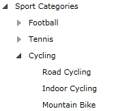

# Expanding and Collapsing Items

This tutorial will walk you through the following common tasks:

* [Expanding and collapsing items](#expanding-and-collapsing-items-declaratively)
* [Expanding and collapsing items recursively](#expanding-and-collapsing-treeview-items-recursively)
* [Expanding only a single branch of the treeview at once](#expanding-only-a-single-branch-of-the-treeview)
* [Expanding an item by path](#expand-an-item-by-path)
* [Expanding an item by using the ItemContainerStyle property](#expand-an-item-by-using-the-itemcontainerstyle)
* [Changing the expand on click mode](#expand-on-single-or-double-click)
* [Events](#events)
* [Styling the expander](#styling-the-expander)
* [Expand all nodes at start](#expand-all-nodes-at-start)
* [Binding the IsExpanded property to a property of a business object](#binding-the-isexpanded-property)

## Expanding and Collapsing Items Declaratively 

To __expand__ a treeview item you need to set the __IsExpanded__ attribute to __True__. Conversely, in order to __collapse__ an item you should set the __IsExpanded__ attribute to __False__. 

>tip The default value of the __IsExpanded__ property is __False__.

#### __XAML__

{{region radtreeview-feautres-treeviewitem-expanding-and-collapsing-items_0}}
	<telerik:RadTreeViewItem x:Name="radTreeViewItem" Header="Sport Categories" IsExpanded="True">
{{endregion}}

In order to __expand__ a treeview item in the code-behind you need to set the __IsExpanded__ property of an instance of the __RadTreeViewItem__ class to __True__. If you want to __collapse__ a treeview item in the code-behind, the same property should be set to __False__. 

#### __C#__

{{region radtreeview-feautres-treeviewitem-expanding-and-collapsing-items_1}}
	private void ExpandTreeViewItem()
	{
	    radTreeViewItem.IsExpanded = true;
	}
	private void CollapseTreeViewItem()
	{
	    radTreeViewItem.IsExpanded = false;
	}
{{endregion}}

#### __VB.NET__

{{region radtreeview-feautres-treeviewitem-expanding-and-collapsing-items_2}}
	Private Sub ExpandTreeViewItem()
	    radTreeViewItem.IsExpanded = True
	End Sub
	Private Sub CollapseTreeViewItem()
	    radTreeViewItem.IsExpanded = False
	End Sub
{{endregion}}
	
## Expanding and Collapsing TreeView Items Recursively

The __RadTreeView__ and __RadTreeViewItem__ classes offer two methods for expanding and collapsing all nodes recursively. In order to __expand__ all nodes use the __ExpandAll()__ method and respectively use  the __CollapseAll()__ method - to collapse all nodes.

If you use the __ExpandAll()__ \ __CollapseAll()__ method of the __RadTreeView__ class then the whole tree will be expanded\collapsed. For example, add the following lines of code to expand or collapse all nodes: 

#### __C#__

{{region radtreeview-feautres-treeviewitem-expanding-and-collapsing-items_3}}
	private void ExpandAllTreeViewItems()
	{
	    radTreeView.ExpandAll();
	}
	private void CollapseAllTreeViewItems()
	{
	    radTreeView.CollapseAll();
	}
{{endregion}}

#### __VB.NET__

{{region radtreeview-feautres-treeviewitem-expanding-and-collapsing-items_4}}
	Private Sub ExpandAllTreeViewItems()
	    radTreeView.ExpandAll()
	End Sub
	Private Sub CollapseAllTreeViewItems()
	    radTreeView.CollapseAll()
	End Sub
{{endregion}}

>The __ExpandAll()__ and __CollapseAll()__ methods work only after the first level items have been loaded. This is visible only when the treeview is bound. Therefore it should be called only in or after the __Loaded__ event.

## Expanding Only a Single Branch of the TreeView

If you want the __RadTreeView__ to automatically close all the nodes __that are not on the path of the expanded node__, then you need to use the __IsSingleExpandPath__ property. If you set this property to __True__ then only a single branch of the tree will be expanded. All of the other already expanded branches will be collapsed automatically if a new one is going to be expanded.

#### __XAML__

{{region radtreeview-feautres-treeviewitem-expanding-and-collapsing-items_5}}
	<telerik:RadTreeView x:Name="radTreeView" IsSingleExpandPath="True">
{{endregion}}

#### __C#__

{{region radtreeview-feautres-treeviewitem-expanding-and-collapsing-items_6}}
	radTreeView.IsSingleExpandPath = true;
{{endregion}}

#### __VB.NET__

{{region radtreeview-feautres-treeviewitem-expanding-and-collapsing-items_7}}
	radTreeView.IsSingleExpandPath = true
{{endregion}}

Now when you try to expand a new branch from the tree, all of the other expanded branches that are not on the path of the expanded node will be collapsed.

## Expand an Item By Path

The __RadTreeView__ offers __ExpandItemByPath__ functionality. It allows you to expand a specific treeview item by creating a path from the string representations of the Headers.

Imagine, you have the following __RadTreeView__ declaration:

#### __XAML__

{{region radtreeview-feautres-treeviewitem-expanding-and-collapsing-items_8}}
	<telerik:RadTreeView Margin="8" x:Name="radTreeView">
		<telerik:RadTreeViewItem Header="Sport Categories">
			<telerik:RadTreeViewItem Header="Football">
				<telerik:RadTreeViewItem Header="Futsal"/>
				<telerik:RadTreeViewItem Header="Soccer"/>
			</telerik:RadTreeViewItem>
			<telerik:RadTreeViewItem Header="Tennis" x:Name="radTreeViewItemTennis">
				<telerik:RadTreeViewItem Header="Table Tennis"/>
			</telerik:RadTreeViewItem>
			<telerik:RadTreeViewItem Header="Cycling">
				<telerik:RadTreeViewItem Header="Road Cycling"/>
				<telerik:RadTreeViewItem Header="Indoor Cycling"/>
				<telerik:RadTreeViewItem Header="Mountain Bike"/>
			</telerik:RadTreeViewItem>
		</telerik:RadTreeViewItem>
	</telerik:RadTreeView>
{{endregion}}

In this example the treeview item with __Header__ "Cycling" will be expanded. First, you need to create a path by the string representations of the Headers using some separator (for this example "|" will be used as a separator). Second, you should invoke the __ExpandItemByPath__ method of an instance of the __RadTreeView__ class.

Here is an example: 

#### __C#__

{{region radtreeview-feautres-treeviewitem-expanding-and-collapsing-items_9}}
	private void ExpandItemByPath()
	{
	    string path = "Sport Categories|Cycling|Indoor Cycling";
	    radTreeView.ExpandItemByPath( path, "|" );
	}
{{endregion}}

#### __VB.NET__

{{region radtreeview-feautres-treeviewitem-expanding-and-collapsing-items_10}}
	Private Sub ExpandItemByPath()
	    Dim path As String = "Sport Categories|Cycling|Indoor Cycling"
	    radTreeView.ExpandItemByPath(path, "|")
	End Sub
{{endregion}}

And here is the result: 

The __RadTreeView__ class supports __PathSeparator__ property, which represents the default separator. The default separator for the __RadTreeView__ is "__\\__", but it can be changed. Here you can see how the previous example will look like if you set the __PathSeparator__ property. 

#### __C#__

{{region radtreeview-feautres-treeviewitem-expanding-and-collapsing-items_11}}
	private void ExpandItemByPath()
	{
	    string path = "Sport Categories|Cycling|Indoor Cycling";
	    radTreeView.PathSeparator = "|";
	    radTreeView.ExpandItemByPath( path );
	}
{{endregion}}
	
#### __VB.NET__

{{region radtreeview-feautres-treeviewitem-expanding-and-collapsing-items_12}}
	Private Sub ExpandItemByPath()
	    Dim path As String = "Sport Categories|Cycling|Indoor Cycling"
	    radTreeView.PathSeparator = "|"
	    radTreeView.ExpandItemByPath( path )
	End Sub
{{endregion}}

## Expand an Item by Using the ItemContainerStyle

A neat way to expand all items regardless of the asynchronous issues is to set an __ItemContainerStyle__ with a single setter - setting the __IsExpanded__ property to __True__. For more information about __ItemContainerStyle__ read the main topic about [ItemContainerStyle]().

## Expand on Single or Double Click

To improve the user experience, the expand behavior of the nodes can be set to expand on a single or double click.

If you want to expand the nodes on a single click, then you need to set the __IsExpandOnSingleClickEnabled__ attribute to __True__. 

#### __XAML__

{{region radtreeview-feautres-treeviewitem-expanding-and-collapsing-items_13}}
	<telerik:RadTreeView x:Name="radTreeView" IsExpandOnSingleClickEnabled="True">
{{endregion}}

If you want to expand the nodes on a double click, then you need to set the __IsExpandOnDblClickEnabled__ attribute to __True__. 

#### __XAML__

{{region radtreeview-feautres-treeviewitem-expanding-and-collapsing-items_14}}
	<telerik:RadTreeView x:Name="radTreeView" IsExpandOnDblClickEnabled="True">
{{endregion}}

The same properties can be used in the code-behind. See the next code lines: 

#### __C#__

{{region radtreeview-feautres-treeviewitem-expanding-and-collapsing-items_15}}
	private void ExpandOnSingleClick()
	{
	    radTreeView.IsExpandOnSingleClickEnabled = true;
	}
	private void ExpandOnDoubleClick()
	{
	    radTreeView.IsExpandOnDblClickEnabled = true;
	}
{{endregion}}

#### __VB.NET__

{{region radtreeview-feautres-treeviewitem-expanding-and-collapsing-items_16}}
	Private Sub ExpandOnSingleClick()
	    radTreeView.IsExpandOnSingleClickEnabled = True
	End Sub Private Sub ExpandOnDoubleClick()
	    radTreeView.IsExpandOnDblClickEnabled = True
	End Sub
{{endregion}}

>The default behavior of the __RadTreeView__ is to expand the items on double click.

## Events

The Telerik __RadTreeView__ and __RadTreeViewItem__ classes offer you four events for managing the expanding and collapsing processes. These events are available both on the __RadTreeView__ and on the __RadTreeViewItem__ classes. 

#### __XAML__

{{region radtreeview-feautres-treeviewitem-expanding-and-collapsing-items_17}}
	<telerik:RadTreeView x:Name="radTreeView"
						PreviewExpanded="radTreeView_PreviewExpanded"
						Expanded="radTreeView_Expanded"
						PreviewCollapsed="radTreeView_PreviewCollapsed"
						Collapsed="radTreeView_Collapsed">
{{endregion}}

The __PreviewExpanded__ event occurs when the treeview item is about to be expanded. The __Expanded__ event is fired when the treeview item is already expanded. The type of the passed event arguments for both of the events is __RadRoutedEventArgs__.

The __PreviewCollapsed__ event is fired just before the item is collapsed. The __Collapsed__ event is fired after the treeview item is collapsed. The type of the passed event arguments for both of the events is __RadRoutedEventArgs__.

For a full list of all exposed by the __RadTreeView__ events, check out the [Events - Overview]() topic.

## Styling the Expander

If you want to see how to style the treeview expander, read the topic about [Styling Expander]().

## Expand All Nodes at Start

There are several ways to expand all nodes automatically at start:

* If your __RadTreeView__ is [data bound to a business object](), then the best solution is to use __ItemContainerStyle__.

	#### __XAML__

	{{region radtreeview-feautres-treeviewitem-expanding-and-collapsing-items_18}}
		
		....
		<telerik:RadTreeView x:Name="radTreeView" ItemContainerStyle="{StaticResource ItemContainerStyle}"/>
	{{endregion}}

* If your __RadTreeView__ is populated declaratively, then the best solution is to use a __Style__. You should create a style by setting the __IsExpanded__ property to __True__ and then setting it to all __RadTreeViewItems__.

	#### __XAML__

	{{region radtreeview-feautres-treeviewitem-expanding-and-collapsing-items_19}}
		
		<telerik:RadTreeView Margin="8" x:Name="radTreeView">
			<telerik:RadTreeViewItem Header="Sport Categories" Style="{StaticResource RadTreeViewItemStyle}">
				<telerik:RadTreeViewItem Header="Football" Style="{StaticResource RadTreeViewItemStyle}">
					<telerik:RadTreeViewItem Header="Futsal" Style="{StaticResource RadTreeViewItemStyle}"/>
					<telerik:RadTreeViewItem Header="Soccer" Style="{StaticResource RadTreeViewItemStyle}"/>
				</telerik:RadTreeViewItem>
			</telerik:RadTreeViewItem>
		</telerik:RadTreeView>
	{{endregion}}

* If you are using Silverlight 4, then you could take advantage of the __Implicit Styles__. For example, notice how the previous example is modified - the __x:Key__ is omitted. You should also not set the __Style__ property of the __RadTreeViewItem__.

	#### __XAML__

	{{region radtreeview-feautres-treeviewitem-expanding-and-collapsing-items_20}}
		
		...
		<telerik:RadTreeView Margin="8" x:Name="radTreeView">
			<telerik:RadTreeViewItem Header="Sport Categories">
				<telerik:RadTreeViewItem Header="Football">
					<telerik:RadTreeViewItem Header="Futsal"/>
					<telerik:RadTreeViewItem Header="Soccer"/>
				</telerik:RadTreeViewItem>
			</telerik:RadTreeViewItem>
		</telerik:RadTreeView>
	{{endregion}}

## Binding the IsExpanded Property

A very common issue is to have the __RadTreeViewItem__'s __IsExpanded__ property bound to a property of a custom business object. The easiest way to achieve this is to use __Style Binding__. For example, imagine that your business object has a boolean property named __IsExpanded__. And you want to bind the __IsExpanded__ property of this business object to the __IsExpanded__ property of the __RadTreeViewItem__. Then check out the code snippet below, it demonstrates how to achieve this.

#### __XAML__

{{region radtreeview-feautres-treeviewitem-expanding-and-collapsing-items_21}}
	
	....
	<telerik:HierarchicalDataTemplate x:Key="MyViewModelTemplate">
		<TextBlock Text="{Binding Name}" Foreground="Red" FontSize="16" FontFamily="Verdana" />
	</telerik:HierarchicalDataTemplate>
	....
	<telerik:RadTreeView ItemsSource="{Binding Source={StaticResource TreeViewDataSource}}" 
						 ItemTemplate="{StaticResource MyViewModelTemplate}"
						 ItemContainerStyle="{StaticResource ItemContainerStyle}"/>
{{endregion}}




#### __XAML__

{{region radtreeview-feautres-treeviewitem-expanding-and-collapsing-items_22}}
	
	
	<HierarchicalDataTemplate x:Key="MyViewModelTemplate">
		<TextBlock Text="{Binding Name}" Foreground="Red" FontSize="16" FontFamily="Verdana" />
	</HierarchicalDataTemplate>
	....
	<telerik:RadTreeView  
						ItemsSource="{Binding Source={StaticResource TreeViewDataSource}}" 
						ItemTemplate="{StaticResource MyViewModelTemplate}"
						ItemContainerStyle="{StaticResource ItemContainerStyle}"/>
{{endregion}}



For a complete demo, please refer to the [How to Bind RadTreeView to Hierarchical Data and Use Style Binding]() topic.

# See Also
 * [Expand and Collapse Items]()
 * [Item Images]()
 * [Enable and Disable Items]()
 * [Working with Selection]()
 * [How to Edit An Item]()
 * [BringIntoView Support]()