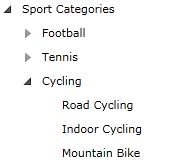

# Expanding and Collapsing Items

This tutorial will walk you through the following common tasks:

* [Expanding and collapsing an item](#expanding-and-collapsing-an-item)
* [Expanding and collapsing items recursively](#expanding-and-collapsing-treeview-items-recursively)
* [Expanding only a single branch of the treeview at once](#expanding-only-a-single-branch-of-the-treeview)
* [Expanding an item by path](#expand-an-item-by-path)
* [Expanding an item by using the ItemContainerStyle property](#expand-an-item-by-using-the-itemcontainerstyle)
* [Binding the IsExpanded property to a property of a business object](#binding-the-isexpanded-property)
* [Changing the expand on click mode](#expand-on-single-or-double-click)
* [Events](#events)
* [Styling the expander](#styling-the-expander)
* [Expand all nodes](#expand-all-nodes)

## Expanding and Collapsing an Item

To expand a treeview item you need to set the __IsExpanded__ attribute to True. Conversely, in order to collapse an item you should set the IsExpanded attribute to False. 

>tip The default value of the __IsExpanded__ property is __False__.

__Example 1: Expanding on item in XAML__
<snippet id='radtreeview-features-treeview-item-feautres-treeviewitem-expanding-and-collapsing-items-block_1-xaml' />

__Example 2: Expanding on item in code__
<snippet id='radtreeview-features-treeview-item-feautres-treeviewitem-expanding-and-collapsing-items-block_2-cs' />
<snippet id='radtreeview-features-treeview-item-feautres-treeviewitem-expanding-and-collapsing-items-block_3-vb' />
	
## Expanding and Collapsing TreeView Items Recursively

The __RadTreeView__ and __RadTreeViewItem__ classes offer two methods for expanding and collapsing all nodes recursively. In order to expand all nodes use the __ExpandAll()__ method and respectively use  the __CollapseAll()__ method - to collapse all nodes.

> If you use the __ExpandAll()__ \ __CollapseAll()__ method of the __RadTreeView__ class then the whole tree will be expanded\collapsed.

__Example 3: Expanding and collapsing the whole tree__
<snippet id='radtreeview-features-treeview-item-feautres-treeviewitem-expanding-and-collapsing-items-block_4-cs' />
<snippet id='radtreeview-features-treeview-item-feautres-treeviewitem-expanding-and-collapsing-items-block_5-vb' />

>The __ExpandAll()__ and __CollapseAll()__ methods work only after the first level items have been loaded. This is visible only when the treeview is bound. Therefore it should be called only in or after the __Loaded__ event.

## Expanding Only a Single Branch of the TreeView

By default the treeview allows you to have multiple nodes expanded at the same time. You can alter this and allow only a single expanded node by setting the __IsSingleExpandPath__ property of RadTreeView to True. In this case when you expand a node, all of the others already expanded branches will be collapsed automatically.

__Example 4: Setting IsSingleExpandPath property__
<snippet id='radtreeview-features-treeview-item-feautres-treeviewitem-expanding-and-collapsing-items-block_6-xaml' />

__Example 5: Setting IsSingleExpandPath property__
<snippet id='radtreeview-features-treeview-item-feautres-treeviewitem-expanding-and-collapsing-items-block_7-cs' />
<snippet id='radtreeview-features-treeview-item-feautres-treeviewitem-expanding-and-collapsing-items-block_8-vb' />

## Expand an Item By Path

RadTreeView offers __ExpandItemByPath__ method that allows you to built a unique path for each item and expand it via the path. It allows you to expand a specific treeview item by creating a path from the string representations of the Headers. You can read more about getting items by path in the [BringIntoView Support]() article.

The following example shows how the feature works. For the sake of the demo we will expand the RadTreeViewItem with its Header set to "Indoor Cycling" (see Example 6). 

__Example 6: Simple TreeView definition__
<snippet id='radtreeview-features-treeview-item-feautres-treeviewitem-expanding-and-collapsing-items-block_9-xaml' />

The ExpandItemByPath method accepts a string representing the path to the item that should be expanded. By default the path is built using the Header of each RadTreeViewItem from the root of the treeview to the searched item. For example, to expand the "Indoor Cycling" note you should use the following path - "Sport Categories\\Cycling\\Indoor Cycling". Here the "\\" string is the default path separator.

The ExpandItemByPath has two overloads - one that accepts the string path and a separator. And another one that accepts only a string path.

__Example 7: Calling ExpandItemByPath with path and a custom separator__
<snippet id='radtreeview-features-treeview-item-feautres-treeviewitem-expanding-and-collapsing-items-block_10-cs' />
<snippet id='radtreeview-features-treeview-item-feautres-treeviewitem-expanding-and-collapsing-items-block_11-vb' />

When using the overload that doesn't accept a path separator you can use the default one ("\\") or set the __PathSeparator__ property of RadTreeView to change it. 

__Example 8: Setting the PathSeparator property__
<snippet id='radtreeview-features-treeview-item-feautres-treeviewitem-expanding-and-collapsing-items-block_12-cs' />
<snippet id='radtreeview-features-treeview-item-feautres-treeviewitem-expanding-and-collapsing-items-block_13-vb' />

## Expand an Item by Using the ItemContainerStyle

This is useful when the treeview is data bound to a collection of business objects and you don't have easy access to the RadTreeViewItems. You can define a Style that targets RadTreeViewItem and set or bound its IsExpanded property. Read more about this in the [ItemContainerStyle]() article.

__Example 9: Setting ItemContainerStyle__
<snippet id='radtreeview-features-treeview-item-feautres-treeviewitem-expanding-and-collapsing-items-block_14-xaml' />

## Binding the IsExpanded Property

A very common scenario is to have the RadTreeViewItem IsExpanded property bound to a property of a custom business object. The easiest way to achieve this is to use style binding. __Example 10__ shows how to bind a boolean property (named IsExpanded) of a business object to the IsExpanded property RadTreeViewItem.

__Example 10: Data bind the IsExpanded property__
<snippet id='radtreeview-features-treeview-item-feautres-treeviewitem-expanding-and-collapsing-items-block_15-xaml' />

> You can find a runnable example showing this in the [How to Bind RadTreeView to Hierarchical Data and Use Style Binding]() topic.

## Expand on Single or Double Click

To improve the user experience, the expand behavior of the nodes can be set to expand on a single or double click. You can alter this behavior via the __IsExpandOnSingleClickEnabled__ and __IsExpandOnDblClickEnabled__ properties of RadTreeView. 

If you want to expand the nodes on a single click, then you need to set the __IsExpandOnSingleClickEnabled__ attribute to __True__. 

__Example 11: Allow expanding items on single click in XAML__
<snippet id='radtreeview-features-treeview-item-feautres-treeviewitem-expanding-and-collapsing-items-block_16-xaml' />

__Example 11: Allow expanding items on double click in XAML__
<snippet id='radtreeview-features-treeview-item-feautres-treeviewitem-expanding-and-collapsing-items-block_17-xaml' />

__Example 12: Allow expanding items on single and double click in code__
<snippet id='radtreeview-features-treeview-item-feautres-treeviewitem-expanding-and-collapsing-items-block_18-cs' />
<snippet id='radtreeview-features-treeview-item-feautres-treeviewitem-expanding-and-collapsing-items-block_19-vb' />

> The default behavior of the __RadTreeView__ is to expand the items on double click.

## Events

__RadTreeView__ and __RadTreeViewItem__ classes has several events for managing the expanding and collapsing processes. The events are available both on the __RadTreeView__ and on the __RadTreeViewItem__ classes. 

__Example 13: Subscribing to expanding/collapsing events__
<snippet id='radtreeview-features-treeview-item-feautres-treeviewitem-expanding-and-collapsing-items-block_20-xaml' />

The __PreviewExpanded__ event occurs when the treeview item is about to be expanded. The __Expanded__ event is fired when the treeview item is already expanded. The type of the passed event arguments for both of the events is __RadRoutedEventArgs__.

The __PreviewCollapsed__ event is fired just before the item is collapsed. The __Collapsed__ event is fired after the treeview item is collapsed. The type of the passed event arguments for both of the events is __RadRoutedEventArgs__.

> Find more information about the RadTreeView events in the [Events - Overview]() topic.

## Styling the Expander

The treeview control has a __ExpanderStyle__ property which can be used to style the expander visual. To see how to style the expander, read the [Styling Expander]() article.

## Expand All Nodes

There are several ways to expand the treeview items. In general to do this you can set the IsExpanded property of all items to True. This can be done using two approaches - with a style or using the [ExpandAll](#expanding-and-collapsing-treeview-items-recursively) method of the treeview control.
	
You can define a Style object that targets RadTreeViewItem and set the IsExpanded property to True. The style could be applied using the ItemContainerStyle property of RadTreeView or by making it an implicit style (no x:Key set).

__Example 14: Expanding all items via style (ItemContainerStyle)__
<snippet id='radtreeview-features-treeview-item-feautres-treeviewitem-expanding-and-collapsing-items-block_21-xaml' />

__Example 15: Expanding all items via style (implicit style)__
<snippet id='radtreeview-features-treeview-item-feautres-treeviewitem-expanding-and-collapsing-items-block_22-xaml' />

## See Also

 * [Expand and Collapse Items]()
 * [Item Images]()
 * [Enable and Disable Items]()
 * [Working with Selection]()
 * [How to Edit An Item]()
 * [BringIntoView Support]()