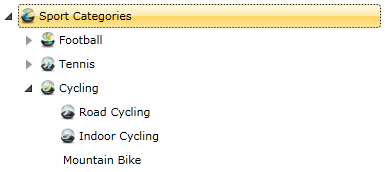
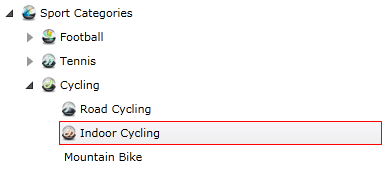
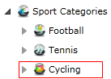

# Item Images

__RadTreeView__ gives you the ability to define images for each item state. This tutorial will walk you through the following common tasks:

* Setting the base images directory.
* Setting the default image for a treeview item.
* Setting image when the item is selected.
* Setting image when the item is expanded.
* Using different images from client bin, relative directory, dll.

For the purpose of this tutorial, the treeview defined in the next XAML snippet will be used: 

#### __XAML__

```XAML
	<telerik:RadTreeView Margin="8" x:Name="radTreeView">
	    <telerik:RadTreeViewItem Header="Sport Categories">
	        <telerik:RadTreeViewItem Header="Football">
	            <telerik:RadTreeViewItem Header="Futsal"/>
	            <telerik:RadTreeViewItem Header="Soccer"/>
	        </telerik:RadTreeViewItem>
	        <telerik:RadTreeViewItem Header="Tennis">
	            <telerik:RadTreeViewItem Header="Table Tennis"/>
	        </telerik:RadTreeViewItem>
	        <telerik:RadTreeViewItem Header="Cycling">
	            <telerik:RadTreeViewItem Header="Road Cycling"/>
	            <telerik:RadTreeViewItem Header="Indoor Cycling"/>
	            <telerik:RadTreeViewItem Header="Mountain Bike"/>
	        </telerik:RadTreeViewItem>
	    </telerik:RadTreeViewItem>
	</telerik:RadTreeView>
	```


## Using the ImagesBaseDir, DefaultImagesSrc, ExpandedImageSrc and SelectedImageSrc Properties

__RadTreeView__ gives you the ability to define images for each item state. The following states are supported:

* __Default (collapsed)__ - use the __DefaultImageSrc__ property of the __RadTreeViewItem__ to set the image that will be displayed for the default/collapsed state. If you don't define images for the rest of the states, this image will be used.

* __Expanded__ - use the __ExpandedImageSrc__ property of the __RadTreeViewItem__ to set the image that will be displayed for the expanded state. 

* __Selected__ - use the __SelectedImageSrc__ property of the __RadTreeViewItem__ to set the image that will be displayed for the selected state. 

When you store all your images for the TreeView into a single folder you can use the __ImagesBaseDir__ property of the __RadTreeView__ to set the location of this folder. Then when settings the __DefaultImagesSrc__, __ExpandedImageSrc__, __SelectedImageSrc__ properties of the __RadTreeViewItem__ you will need to set only the image name, not the entire path to the image. See the example below:

#### __XAML__

```XAML
	<telerik:RadTreeView Margin="8" x:Name="radTreeView"
	    ImagesBaseDir="/Examples/Common/Images/Vista Icons/">
	    <telerik:RadTreeViewItem Header="Sport Categories" DefaultImageSrc="Icon1.png">
	        <telerik:RadTreeViewItem Header="Football" DefaultImageSrc="Icon2.png">
	            <telerik:RadTreeViewItem Header="Futsal" DefaultImageSrc="Icon3.png"/>
	            <telerik:RadTreeViewItem Header="Soccer" DefaultImageSrc="Icon4.png"/>
	        </telerik:RadTreeViewItem>
	        <telerik:RadTreeViewItem Header="Tennis" DefaultImageSrc="Icon5.png">
	            <telerik:RadTreeViewItem Header="Table Tennis" DefaultImageSrc="Icon6.png"/>
	        </telerik:RadTreeViewItem>
	        <telerik:RadTreeViewItem Header="Cycling" DefaultImageSrc="Icon7.png" ExpandedImageSrc="Icon11.png">
	            <telerik:RadTreeViewItem Header="Road Cycling" DefaultImageSrc="Icon8.png"/>
	            <telerik:RadTreeViewItem Header="Indoor Cycling" DefaultImageSrc="Icon9.png" SelectedImageSrc="Icon10.png"/>
	            <telerik:RadTreeViewItem Header="Mountain Bike"/>
	        </telerik:RadTreeViewItem>
	    </telerik:RadTreeViewItem>
	</telerik:RadTreeView>
	```

The result is: 



When you select the treeview item with __Header__ "Indoor Cycling" the default image will be changed: 



When you collapse the treeview item "Cycling", then its default image will also be changed: 



## Setting DefaultImagesSrc, ExpandedImageSrc and SelectedImageSrc Properties from Code Behind


When setting the __DefaultImageSrc__, __ExpandedImageSrc__ and __SelectedImageSrc__ properties from code behind you can either

* set the path to the image as a string 

	#### __C#__

	```C#
		private void radTreeView_ItemPrepared(object sender, RadTreeViewItemPreparedEventArgs e)
		{
		 e.PreparedItem.DefaultImageSrc = "/Examples/Common/Images/Vista Icons/Icon1.png";
		 e.PreparedItem.ExpandedImageSrc = "/Examples/Common/Images/Vista Icons/Icon2.png";
		 e.PreparedItem.SelectedImageSrc = "/Examples/Common/Images/Vista Icons/Icon3.png"; 
		}
		```

	#### __VB.NET__

	```VB.NET
		Private Sub radTreeView_ItemPrepared(sender As Object, e As RadTreeViewItemPreparedEventArgs)
			e.PreparedItem.DefaultImageSrc = "/Examples/Common/Images/Vista Icons/Icon1.png"
			e.PreparedItem.ExpandedImageSrc = "/Examples/Common/Images/Vista Icons/Icon2.png"
			e.PreparedItem.SelectedImageSrc = "/Examples/Common/Images/Vista Icons/Icon3.png"
		End Sub
		```

or

* set the path using an object of type __BitmapImage__

	#### __C#__

	```C#
		private void radTreeView_ItemPrepared(object sender, RadTreeViewItemPreparedEventArgs e)
		{
		 BitmapImage defaultImage = new BitmapImage(new Uri("Icon1.png", UriKind.Relative));
		 e.PreparedItem.DefaultImageSrc = defaultImage;
		 BitmapImage expandedImage = new BitmapImage(new Uri("Icon2.png", UriKind.Relative));
		 e.PreparedItem.ExpandedImageSrc = expandedImage;
		 BitmapImage selectedImage = new BitmapImage(new Uri("Icon3.png", UriKind.Relative));
		 e.PreparedItem.SelectedImageSrc = selectedImage;
		}
		```


	#### __VB.NET__

	```VB.NET
		Private Sub radTreeView_ItemPrepared(sender As Object, e As RadTreeViewItemPreparedEventArgs)
			Dim defaultImage As New BitmapImage(New Uri("Icon1.png", UriKind.Relative))
			e.PreparedItem.DefaultImageSrc = defaultImage
			Dim expandedImage As New BitmapImage(New Uri("Icon2.png", UriKind.Relative))
			e.PreparedItem.ExpandedImageSrc = expandedImage
			Dim selectedImage As New BitmapImage(New Uri("Icon3.png", UriKind.Relative))
			e.PreparedItem.SelectedImageSrc = selectedImage
		End Sub
		```

## Using Images from the Client Bin Directory or a Relative Directory

In the previous section you found how to use images which are located in the same directory as the .XAP file, more accurately in a directory which is relative to the directory where the .XAP file is placed.

For example, see these cases:

* The images are placed in the same directory as the .XAP file. In this case you don't need to specify the __ImagesBaseDir__. You directly specify the file name of the image in the __DefaultImagesSrc__, __ExpandedImageSrc__ and __SelectedImageSrc__ properties of the __RadTreeViewItem__.

* The images are placed in a relative directory. In this case you need to specify a relative path in the __ImagesBaseDir__ property. In the previous example the __ImagesBaseDir__ property was set to: 

#### __XAML__

```XAML
	ImagesBaseDir="/Examples/Common/Images/Vista Icons/"
	```

Which means that the "Examples" directory is located in the same directory where the .XAP file is placed and the images are located in the "Vista Icons" directory. 

## Using Images from the .XAP file

Sometimes your images may be packed in the .XAP file. In this case you have the same options as in the previous section:

* If the images are placed in the root of the directory, then you don't need to specify the __ImagesBaseDir__. You directly specify the file name of the image in the __DefaultImagesSrc__, __ExpandedImageSrc__ and __SelectedImageSrc__ properties of the __RadTreeViewItem__.

* If the images are placed in a directory, then you should set the __ImagesBaseDir__ with a relative path.

## See Also
 * [How to Edit An Item]()
 * [Enable and Disable Items]()
 * [Working with Selection]()
 * [Expanding and Collapsing Items]()
 * [BringIntoView Support]()