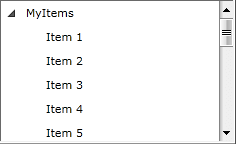
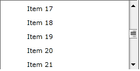
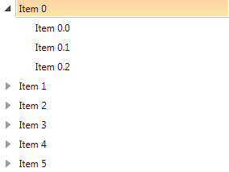
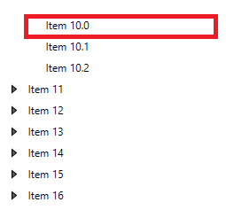
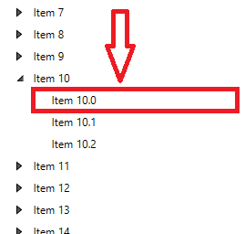

# BringIntoView Support

The __RadTreeView__ API offers __BringIntoView__ support through several methods:	  

When you invoke any of these methods, the __RadTreeView__ will attempt to bring the provided item into view.	  

## BringIndexIntoView()

>important The __BringIndexIntoView()__ method can only work for __immediate items__. However, please note that the method won't be able to bring a __RadTreeViewItem__ into view before the __item containers have been generated__.		  

Consider the following example. A __RadTreeView__ is data bound to a collection of business objects.		

__Example 1: Declaring a RadTreeView control in XAML__
```XAML
	<Grid x:Name="LayoutRoot"
			Background="White">
		<Grid.Resources>
			<DataTemplate x:Key="treeViewTemplate">
				<TextBlock Text="{Binding Title}" />
			</DataTemplate>
		</Grid.Resources>
		<telerik:RadTreeView x:Name="RadTreeView">
			<telerik:RadTreeViewItem x:Name="RadTreeViewItem"
									 Header="MyItems"
									 ItemTemplate="{StaticResource treeViewTemplate}">
			</telerik:RadTreeViewItem>
		</telerik:RadTreeView>
	</Grid>
```

__Example 2: The class holds a collection of a business objects__
```C#
	public class MyViewModel 
	{
		private static int idCounter;
		private string title;
		public MyViewModel()
		{
			this.Id = idCounter++;
		}
		public int Id
		{
			get;
			protected set;
		}
		public String Title
		{
			get
			{
				return this.title;
			}
			set
			{
				if ( this.title != value )
				{
					this.title = value;
				}
			}
		}
	}
	//.....
	RadTreeViewItem.ItemsSource = Enumerable.Range( 1, 40 ).Select( i => new MyViewModel()
	{
		Title = "Item " + i
	} ).ToList();
```
```VB.NET
	Public Class MyViewModel
	 Private Shared idCounter As Integer
	 Private m_title As String
	 Public Sub New()
	  Me.Id = System.Math.Max(System.Threading.Interlocked.Increment(idCounter),idCounter - 1)
	 End Sub
	 Public Property Id() As Integer
	  Get
	   Return m_Id
	  End Get
	  Protected Set
	   m_Id = Value
	  End Set
	 End Property
	 Private m_Id As Integer
	 Public Property Title() As [String]
	  Get
	   Return Me.m_title
	  End Get
	  Set
	   If Me.m_title <> value Then
		Me.m_title = value
	   End If
	  End Set
	 End Property
	End Class
```

#### __Figure 1: The tree view after being populated with business objects__


If you want to programmatically scroll to "Item 20" (thus bringing this item into view), you could try scenario in __Example 3__.

__Example 3: Bring RadTreeViewItem into view by its index__
```C#
	private void BringItemIntoView()
	{
		this.RadTreeViewItem.BringIndexIntoView( 20 );
	}
```
```VB.NET
	Private Sub BringItemIntoView()
		Me.RadTreeViewItem.BringIndexIntoView(20)
	End Sub
```

#### __Figure 2: The result of RadTreeViewItem into view by its index__


## BringItemIntoView()

__RadTreeView__ offers a second method, __BringItemIntoView()__, that works similarly to the __BringIndexIntoView()__ method. 
	
__Example 4: Bring an item into the view by its Title__
```C#
	private void BringItemIntoView()
	{
		MyViewModel viewModel = dataSource.First( v => v.Title == "Item 20" );
		this.RadTreeViewItem.BringItemIntoView( viewModel );
	}
```
```VB.NET
	Private Sub Button_Click(sender As Object, e As RoutedEventArgs)
		Dim viewModel As MyViewModel = dataSource.First(Function(v) v.Title = "Item 20")
		Me.RadTreeViewItem.BringItemIntoView(viewModel)
	End Sub		
```
>important Please keep in mind that the __BringItemIntoView()__ method can only work for __immediate items__ and only as long as all __RadTreeViewItem__ containers __have been generated__.

The __BringItemIntoView()__ method makes an internal call to the __BringIndexIntoView()__ method and this is why it is better to consider using the __BringIndexIntoView()__ method instead whenever possible.

## BringPathIntoView()

>important You can use the __BringPathIntoView()__ method even in scenarios where not all __RadTreeViewItem__ containers are generated. This is possible due to its implementation, which makes sure that the __RadTreeView__ has loaded its containers, before starting a recursive search through its items. This makes it the best choice for bringing virtualized items into view.

Since the main purpose of the __BringPathIntoView()__ method is to allow you to bring virtualized items into view, you need to make sure that your view models can build a path to each __RadTreeViewItem__. This is important because the __BringPathIntoView()__ method recursively traverses the hierarchy of data items displayed inside the __RadTreeView__ to search for an item based on its path.

Another important note about the implementation of the method is that it uses the __TextSearch.TextPath__ attached property to match the path to the __RadTreeViewItem__ containers.

>The __TextSearch.TextPath__ attached property is part of the __Telerik.Windows.Controls__ namespace and this is why you can reach it through the following alias:
xmlns:telerik="http://schemas.telerik.com/2008/xaml/presentation" like this: `<telerik:RadTreeView telerik:TextSearch.TextPath="Name"/>`

Consider the __RadTreeView__ definition in __Example 5.__

__Example 5: Declaring a RadTreeView control in XAML__	
```XAML
	<telerik:RadTreeView x:Name="myTreeView" Width="300" IsVirtualizing="True" telerik:TextSearch.TextPath="Name">
		<telerik:RadTreeView.ItemTemplate>
			<HierarchicalDataTemplate ItemsSource="{Binding Children}">
				<TextBlock Text="{Binding Name}" />
			</HierarchicalDataTemplate>
		</telerik:RadTreeView.ItemTemplate>
	</telerik:RadTreeView>		  
```

The business items displayed in the __RadTreeView__ are described with the classes shown in __Example 6__:

__Example 6: The view model describing treeview and its business objects__	
```C#
	public class MainViewModel : ObservableCollection<DataItem>
	{
		public MainViewModel()
		{
			for (int i = 0; i < 25; i++)
			{
				DataItem item = new DataItem() { Name = String.Format("Item {0}", i) };
				for (int j = 0; j < 3; j++)
				{
					item.Children.Add(new DataItem { Name = String.Format("Item {0}.{1}", i, j) });
				}
				this.Add(item);
			}
		}
	}

	public class DataItem
	{
		public string Name { get; set; }
		public ObservableCollection<DataItem> Children { get; set; }

		public DataItem()
		{
			this.Children = new ObservableCollection<DataItem>();
		}
	}	
```
```VB.NET
	Public Class MainViewModel
		Inherits ObservableCollection(Of DataItem)
		Public Sub New()
			For i As Integer = 0 To 24
				Dim item As New DataItem() With {.Name = [String].Format("Item {0}", i)}
				For j As Integer = 0 To 2
					item.Children.Add(New DataItem() With {.Name = [String].Format("Item {0}.{1}", i, j)})
				Next
				Me.Add(item)
			Next
		End Sub
	End Class

	Public Class DataItem
		Public Property Name() As String
			Get
				Return itemName
			End Get
			Set
				itemName = Value
			End Set
		End Property
		Private itemName As String
		Public Property Children() As ObservableCollection(Of DataItem)
			Get
				Return itemChildren
			End Get
			Set
				itemChildren = Value
			End Set
		End Property
		Private itemChildren As ObservableCollection(Of DataItem)

		Public Sub New()
			Me.Children = New ObservableCollection(Of DataItem)()
		End Sub
	End Class		  
	```
	
#### __Figure 3: Default positioned of the brought item__


## __BringPathIntoView() Overloads__ 

__BringPathIntoView__ method has two overloads that you can use to bring an item.

* __BringPathIntoView(string path)__: The *path* parameter is the path of the __RadTreeViewItem__ that you want to bring into the view. 
	
	__Example 7: Bring the RadTreeViewItem by its path on the top of the viewport__
	```C#
		string path = "Item 10\\Item 10.1";
		myTreeView.BringPathIntoView(path);
	```
```VB.NET		
		Dim path As String = "Item 10\Item 10.1"
		myTreeView.BringPathIntoView(path)
	```

	#### __Figure 4: Default positioned of the brought item__
	
	
* __BringPathIntoView(string path, Point offset)__: The *offset* parameter is of type __Point__ and specifies the offset from the top left corner of the tree where the item will be scrolled to. 

	For example, when you set the second parameter, you can adjust the parent and the last child to fit into the view if there is enough space. 
	
	__Example 8: Bring the RadTreeViewItem by its path and set the offset position of the item__		
	```C#
		string path = "Item 10\\Item 10.1";
		myTreeView.BringPathIntoView(path,new Point(0,100));
	```
```VB.NET	
		Dim path As String = "Item 10\Item 10.1"
		myTreeView.BringPathIntoView(path,New Point(0,100))
	```
	
	#### __Figure 5: The item is positioned with 100 pixels offset from the top of the viewport__
	

	> When the UI virtualization of RadTreeView is enabled, the brought item may not be positioned at the top of the viewport due to specifics of the virtualization mechanism. This means that the offset may not behave as expected. In such cases, you can manually update the scroll position as described in the [following KB article]().
 
>tip You can find a complete solution demonstrating the __BringPathIntoView()__ method implementation in the [How to Use BringPathIntoView Method]() help article in our documentation.		

## See Also
 * [How to Use BringPathIntoView Method]()
 * [How to Edit an Item]()
 * [Item Images]()
 * [Enable and Disable Items]()
 * [Selection]()
 * [Expanding and Collapsing Items]()
