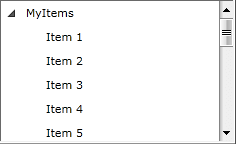
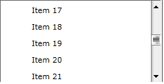
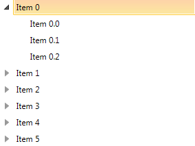
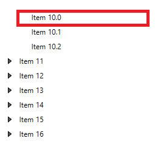
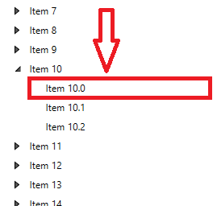

# BringIntoView Support

The __RadTreeView__ API offers __BringIntoView__ support through several methods:	  

When you invoke any of these methods, the __RadTreeView__ will attempt to bring the provided item into view.	  

## BringIndexIntoView()

>important The __BringIndexIntoView()__ method can only work for __immediate items__. However, please note that the method won't be able to bring a __RadTreeViewItem__ into view before the __item containers have been generated__.		  

Consider the following example. A __RadTreeView__ is data bound to a collection of business objects.		

__Example 1: Declaring a RadTreeView control in XAML__
<snippet id='radtreeview-features-treeview-item-treeviewitem-bring-into-view-support-block_1-xaml' />

__Example 2: The class holds a collection of a business objects__
<snippet id='radtreeview-features-treeview-item-treeviewitem-bring-into-view-support-block_2-cs' />
<snippet id='radtreeview-features-treeview-item-treeviewitem-bring-into-view-support-block_3-vb' />

#### __Figure 1: The tree view after being populated with business objects__

If you want to programmatically scroll to "Item 20" (thus bringing this item into view), you could try scenario in __Example 3__.

__Example 3: Bring RadTreeViewItem into view by its index__
<snippet id='radtreeview-features-treeview-item-treeviewitem-bring-into-view-support-block_4-cs' />
<snippet id='radtreeview-features-treeview-item-treeviewitem-bring-into-view-support-block_5-vb' />

#### __Figure 2: The result of RadTreeViewItem into view by its index__

## BringItemIntoView()

__RadTreeView__ offers a second method, __BringItemIntoView()__, that works similarly to the __BringIndexIntoView()__ method. 
	
__Example 4: Bring an item into the view by its Title__
<snippet id='radtreeview-features-treeview-item-treeviewitem-bring-into-view-support-block_6-cs' />
<snippet id='radtreeview-features-treeview-item-treeviewitem-bring-into-view-support-block_7-vb' />
>important Please keep in mind that the __BringItemIntoView()__ method can only work for __immediate items__ and only as long as all __RadTreeViewItem__ containers __have been generated__.

The __BringItemIntoView()__ method makes an internal call to the __BringIndexIntoView()__ method and this is why it is better to consider using the __BringIndexIntoView()__ method instead whenever possible.

## BringPathIntoView()

>important You can use the __BringPathIntoView()__ method even in scenarios where not all __RadTreeViewItem__ containers are generated. This is possible due to its implementation, which makes sure that the __RadTreeView__ has loaded its containers, before starting a recursive search through its items. This makes it the best choice for bringing virtualized items into view.

Since the main purpose of the __BringPathIntoView()__ method is to allow you to bring virtualized items into view, you need to make sure that your view models can build a path to each __RadTreeViewItem__. This is important because the __BringPathIntoView()__ method recursively traverses the hierarchy of data items displayed inside the __RadTreeView__ to search for an item based on its path.

Another important note about the implementation of the method is that it uses the __TextSearch.TextPath__ attached property to match the path to the __RadTreeViewItem__ containers.

>The __TextSearch.TextPath__ attached property is part of the __Telerik.Windows.Controls__ namespace and this is why you can reach it through the following alias:
xmlns:telerik="http://schemas.telerik.com/2008/xaml/presentation" like this: `<telerik:RadTreeView telerik:TextSearch.TextPath="Name"/>`

Consider the __RadTreeView__ definition in __Example 5.__

__Example 5: Declaring a RadTreeView control in XAML__	
<snippet id='radtreeview-features-treeview-item-treeviewitem-bring-into-view-support-block_8-xaml' />

The business items displayed in the __RadTreeView__ are described with the classes shown in __Example 6__:

__Example 6: The view model describing treeview and its business objects__	
<snippet id='radtreeview-features-treeview-item-treeviewitem-bring-into-view-support-block_9-cs' />
<snippet id='radtreeview-features-treeview-item-treeviewitem-bring-into-view-support-block_10-vb' />
	
#### __Figure 3: Default positioned of the brought item__

## __BringPathIntoView() Overloads__ 

__BringPathIntoView__ method has two overloads that you can use to bring an item.

* __BringPathIntoView(string path)__: The *path* parameter is the path of the __RadTreeViewItem__ that you want to bring into the view. 
	
	__Example 7: Bring the RadTreeViewItem by its path on the top of the viewport__
	<snippet id='radtreeview-features-treeview-item-treeviewitem-bring-into-view-support-block_11-cs' />
	<snippet id='radtreeview-features-treeview-item-treeviewitem-bring-into-view-support-block_12-vb' />

	#### __Figure 4: Default positioned of the brought item__
	
	
* __BringPathIntoView(string path, Point offset)__: The *offset* parameter is of type __Point__ and specifies the offset from the top left corner of the tree where the item will be scrolled to. 

	For example, when you set the second parameter, you can adjust the parent and the last child to fit into the view if there is enough space. 
	
	__Example 8: Bring the RadTreeViewItem by its path and set the offset position of the item__		
	<snippet id='radtreeview-features-treeview-item-treeviewitem-bring-into-view-support-block_13-cs' />
	<snippet id='radtreeview-features-treeview-item-treeviewitem-bring-into-view-support-block_14-vb' />
	
	#### __Figure 5: The item is positioned with 100 pixels offset from the top of the viewport__
	

	> When the UI virtualization of RadTreeView is enabled, the brought item may not be positioned at the top of the viewport due to specifics of the virtualization mechanism. This means that the offset may not behave as expected. In such cases, you can manually update the scroll position as described in the [following KB article]().
 
>tip You can find a complete solution demonstrating the __BringPathIntoView()__ method implementation in the [How to Use BringPathIntoView Method]() help article in our documentation.		

## See Also
 * [How to Use BringPathIntoView Method]()
 * [How to Edit an Item]()
 * [Item Images]()
 * [Enable and Disable Items]()
 * [Selection]()
 * [Expanding and Collapsing Items]()