# Getting Started

This tutorial will walk you through the creation of a __RadTreeView.__

__RadTreeView__is an advanced control which provides full Blend support. From within the visual environment of Blend, you can easily perform various tasks such as edit control properties, add/remove treeview items, modify themes, create and modify templates and more.

For the purpose of this tutorial, you will need to create an empty SilverlightWPF Application project and open it in Blend.

>

In order to use __RadTreeView__ in your projects you have to add references to the following two assemblies:

* __Telerik.Windows.Controls__

* ______Telerik.Windows.Controls.Navigation__

You can find more info [here](http://www.telerik.com/help/silverlight/installation-installing-controls-dependencies.html).

>

In order to use __RadTreeView__ in your projects you have to add references to the following two assemblies:

* __Telerik.Windows.Controls__

* ______Telerik.Windows.Controls.Navigation__

* ______Telerik.Windows.Data__

You can find more info [here](http://www.telerik.com/help/wpf/installation-installing-controls-dependencies-wpf.html).

## Create RadTreeView using Expression Blend

* Open the __Assets Library__(*Window->Assets*) in Expression Blend and start writing the name of the __RadTreeView__ control in the search box.

         
      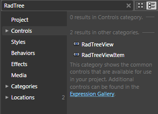

* Drag the __RadTreeView__control on the artboard. The __RadTreeView__appears.

         
      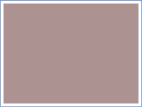

#### __XAML__

{{region radtreeview-getting-started_0}}
	<telerik:RadTreeView Margin="8" Background="#FFAD9292"/>
	{{endregion}}

>tip

You might wonder where this "telerik", in front of the tag __RadTreeView__, came from. Well, this is the name of the namespace you give when you import the appropriate assembly into the XAML file.

	
<UserControl
		xmlns:telerik="http://schemas.telerik.com/2008/xaml/presentation"
		............... 
		x:Class="CSharp.RadTreeView.Getting_Started.GettingStarted">
		...............
</UserControl>

* So far there is an empty __RadTreeView__containing no items.

## Add and remove items (RadTreeViewItem controls) and setting their Header property

Open Expression Blend and [select]() the treeview control to which you wish to add item(s)

* After you've selected the control, navigate to __Common Properties__located in the __Properties__pane and click the ellipses button next to __Items (Collection)__. The __Object Collection Editor__dialog appears.

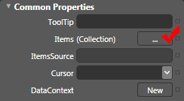

* 

The dialog is divided into two sections: the left one contains the list with the treeview items which already belong to the selected treeview control, while in the right one you can view and edit the properties of the selected treeview item. In order to add a new treeview item click the __Add another item__ button located at the bottom under the items list. The __Select Object__dialog appears. If you want to remove item(s) select the target item and click the __Remove Item__button ().

* Since Blend does not know the exact type of the item you want to add, you have to select it from a list and confirm by clicking the __OK__ button. The type that is needed is __RadTreeViewItem__and it is located in __Telerik.Windows.Controls__ namespace.

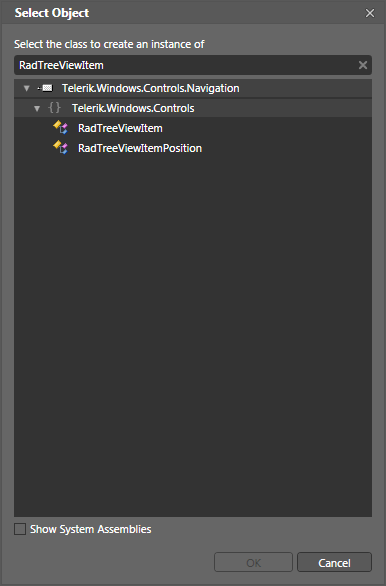

>tip

Sometimes you will have to browse through a huge list of available types. To speed up the process of finding the type you need, just start writing its name (__RadTreeViewItem__) in the search box above. When you start typing, the controls’ list will be filtered automatically, thus making the selection much easier.

* When the Select Object dialog is closed, you will see the newly created item added to the list of treeview items in the __Object Collection Editor__. It will be selected by default, so you just have to edit its __properties__(such as Header, Fonts, Colors etc.) in the properties panes, located on the right.

* If you want to add child items to a specific treeview item, you need to select the item from the __Items__list in the __Object Collection Editor__dialog. After that navigate to the __Common Properties__located in the __Properties__pane and click the ellipses button next to __Items (Collection)__. 

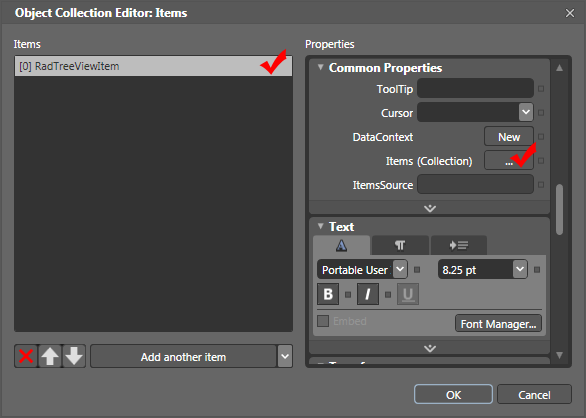

* Again the same __Object Collection Editor__dialog appears.

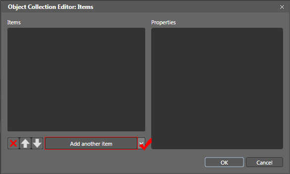

Click __Add another item__three times to add three child items to the root item "__Sports Categories"__. Set their properties as follows:

* 

On the first new item, set the __Header__ property to "__Football__". Select the added node and add two child items. Set their properties as follows: 

* On the first new item, set the __Header__property to "__Futsal__". 

* On the second new item, set the __Header__property to "__Soccer__". 

* Click "__OK__" to confirm the changes and to close the dialog.

* On the second new item, set the __Header__property to "__Tennis__". 

* On the third new item, set the __Header__property to "__Cycling__".

Click "__OK__" to confirm the changes and to close the dialog.

Run the demo and expand the __RadTreeView__. It should look like the following screen shot: 

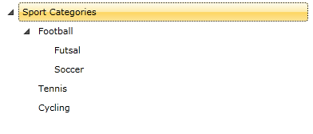

#### __XAML__

{{region radtreeview-getting-started_1}}
	<telerik:RadTreeView Margin="8">
	    <telerik:RadTreeViewItem Header="Sport Categories">
	        <telerik:RadTreeViewItem Header="Football">
	            <telerik:RadTreeViewItem Header="Futsal"/>
	            <telerik:RadTreeViewItem Header="Soccer"/>
	        </telerik:RadTreeViewItem>
	        <telerik:RadTreeViewItem Header="Tennis"/>
	        <telerik:RadTreeViewItem Header="Cycling"/>
	    </telerik:RadTreeViewItem>
	</telerik:RadTreeView>
	{{endregion}}

>tipFind out hot to [populate]() your __RadTreeView__ with data using binding.

## Enable drag and drop

The Telerik __RadTreeView__ supports drag-and-drop functionality. To enable the feature you only need to set the __IsDragDropEnabled__property to __True__.

Select the __RadTreeView__ control, navigate to the __Behavior__section in the __Properties__pane and set the value of the __IsDragDropEnabled__[property]() to __True__.

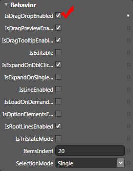

#### __XAML__

{{region radtreeview-getting-started_2}}
	<telerik:RadTreeView Margin="8" IsDragDropEnabled="True">
	    <telerik:RadTreeViewItem Header="Sport Categories">
	        <telerik:RadTreeViewItem Header="Football">
	            <telerik:RadTreeViewItem Header="Futsal"/>
	            <telerik:RadTreeViewItem Header="Soccer"/>
	        </telerik:RadTreeViewItem>
	        <telerik:RadTreeViewItem Header="Tennis"/>
	        <telerik:RadTreeViewItem Header="Cycling"/>
	    </telerik:RadTreeViewItem>
	</telerik:RadTreeView>
	{{endregion}}

Run the application and try the drag-and-drop behavior.

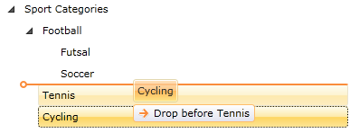

>tipFind out more about the __RadTreeView's__[Drag and Drop]() support.

## Change the selection mode

By default you can select only one item in the treeview. If you want to enable multiple item selection, and to select several nodes by pressing the __Ctrl__or __Shift__keys, you need to change the __SelectionMode__property.

[Find]() the __SelectionMode__property in the __Properties__pane and set its value to __Multiple__.

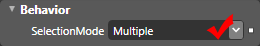

#### __XAML__

{{region radtreeview-getting-started_3}}
	<telerik:RadTreeView Margin="8" IsDragDropEnabled="True" 
	        SelectionMode="Multiple">
	    <telerik:RadTreeViewItem Header="Sport Categories">
	        <telerik:RadTreeViewItem Header="Football">
	            <telerik:RadTreeViewItem Header="Futsal"/>
	            <telerik:RadTreeViewItem Header="Soccer"/>
	        </telerik:RadTreeViewItem>
	        <telerik:RadTreeViewItem Header="Tennis"/>
	        <telerik:RadTreeViewItem Header="Cycling"/>
	    </telerik:RadTreeViewItem>
	</telerik:RadTreeView>
	{{endregion}}

Start the application and try to select more than one item at once.

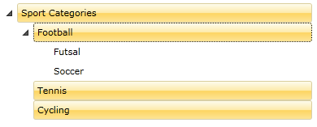

>tipFind out more about the __RadGridView's__[Selection]() support.

## Change the expand path mode

By enabling the __IsSingleExpandPath__property, the __RadTreeView__ will automatically close all the nodes that are not on the path of the expanded node.

[Select]() the treeview and [find]() the __IsSingleExpandPath__property in the __Properties__pane and enable it.

#### __XAML__

{{region radtreeview-getting-started_4}}
	<telerik:RadTreeView Margin="8" IsDragDropEnabled="True" 
	        SelectionMode="Multiple" IsSingleExpandPath="True">
	    <telerik:RadTreeViewItem Header="Sport Categories">
	        <telerik:RadTreeViewItem Header="Football">
	            <telerik:RadTreeViewItem Header="Futsal"/>
	            <telerik:RadTreeViewItem Header="Soccer"/>
	        </telerik:RadTreeViewItem>
	        <telerik:RadTreeViewItem Header="Tennis"/>
	        <telerik:RadTreeViewItem Header="Cycling"/>
	    </telerik:RadTreeViewItem>
	</telerik:RadTreeView>
	{{endregion}}

>tipRead more about [Expanding and Collapsing Items]()

## Apply a theme

Add a reference to __Telerik.Windows.Themes.Vista.dll__.

Switch the document view to__XAML View__ by choosing __View -> Active Document View -> XAML View__(or just press F11).

Find the declaration of the __RadTreeView__and add the following attribute:

#### __XAML__

{{region radtreeview-getting-started_5}}
	telerik:StyleManager.Theme="Vista"
	{{endregion}}

Start the application.

You should see __RadTreeView__with __Vista__theme applied.

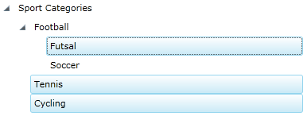

#### __XAML__

{{region radtreeview-getting-started_6}}
	<telerik:RadTreeView Margin="8" IsDragDropEnabled="True" 
	        SelectionMode="Multiple" IsSingleExpandPath="True"
	        telerik:StyleManager.Theme="Vista">
	    <telerik:RadTreeViewItem Header="Sport Categories">
	        <telerik:RadTreeViewItem Header="Football">
	            <telerik:RadTreeViewItem Header="Futsal"/>
	            <telerik:RadTreeViewItem Header="Soccer"/>
	        </telerik:RadTreeViewItem>
	        <telerik:RadTreeViewItem Header="Tennis"/>
	        <telerik:RadTreeViewItem Header="Cycling"/>
	    </telerik:RadTreeViewItem>
	</telerik:RadTreeView>
	{{endregion}}

If you need to further customize the appearance of your __RadTreeView__ controls, check out the following topics:

* [Styles and Templates - Overview]()

* [Templates Structure]()

# See Also

 * [Overview]()

 * [Visual Structure]()

 * [Populating with Data - Overview]()

 * [Styles and Templates - Overview]()

 * [Events - Overview]()
