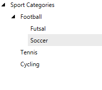

# Getting Started with {{ site.framework_name }} TreeView

This tutorial will walk you through the creation of a sample application that contains __RadTreeView__.

* [Adding Telerik Assemblies Using NuGet](#adding-telerik-assemblies-using-nuget)
* [Adding Assembly References Manually](#adding-assembly-references-manually)
* [Defining a RadTreeView](#defining-a-radtreeview)
* [Adding Items to RadTreeView](#adding-items-to-radtreeview)
* [Data Binding RadTreeView](#data-binding-radtreeview)
* [Enable Drag and Drop](#enable-drag-and-drop)
* [Setting a Theme](#setting-a-theme)

## Adding Telerik Assemblies Using NuGet

To use __RadTreeView__ when working with NuGet packages, install the `Telerik.Windows.Controls.Navigation.for.Wpf.Xaml` package. The [package name may vary]() slightly based on the Telerik dlls set - [Xaml or NoXaml]()

Read more about NuGet installation in the [Installing UI for WPF from NuGet Package]() article.

>tip With the 2025 Q1 release, the Telerik UI for WPF has a new licensing mechanism. You can learn more about it [here]().

## Adding Assembly References Manually

If you are not using NuGet packages, you can add a reference to the following assemblies:

* __Telerik.Licensing.Runtime__
* __Telerik.Windows.Controls__
* __Telerik.Windows.Controls.Navigation__
* __Telerik.Windows.Data__

You can find the required assemblies for each control from the UI for WPF suite in the [Controls Dependencies]()[Controls Dependencies]() help article.

## Defining a RadTreeView

You can add __RadTreeView__ manually in XAML as demonstrated in __Example 1__. 

__Example 1: Adding RadTreeView in XAML__
```XAML
	<telerik:RadTreeView />
```
	
__RadTreeView__ doesn't display any content when it is not populated with items, so at this point there should be nothing displayed on the screen.

## Adding Items to RadTreeView

__RadTreeView__ works with __RadTreeViewItem__ elements, which should be added in the __Items__ collection of the control.

__Example 2: Adding RadTreeViewItems in XAML__
```XAML
	<telerik:RadTreeView>
		<telerik:RadTreeView.Items>
			<telerik:RadTreeViewItem Header="Football" />
			<telerik:RadTreeViewItem Header="Tennis" />
			<telerik:RadTreeViewItem Header="Cycling" />
			<telerik:RadTreeViewItem Header="Basketball" />
		</telerik:RadTreeView.Items>
	</telerik:RadTreeView>
```
	
__Example 3: Adding RadTreeViewItems in code__
```C#
	RadTreeView treeView = new RadTreeView();
	treeView.Items.Add(new RadTreeViewItem() { Header = "Football" });
	treeView.Items.Add(new RadTreeViewItem() { Header = "Tennis" });
	treeView.Items.Add(new RadTreeViewItem() { Header = "Cycling" });
	treeView.Items.Add(new RadTreeViewItem() { Header = "Basketball" });
```
```VB.NET
	Dim treeView As New RadTreeView()
	treeView.Items.Add(New RadTreeViewItem() With { _
		.Header = "Football" _
	})
	treeView.Items.Add(New RadTreeViewItem() With { _
		.Header = "Tennis" _
	})
	treeView.Items.Add(New RadTreeViewItem() With { _
		.Header = "Cycling" _
	})
	treeView.Items.Add(New RadTreeViewItem() With { _
		.Header = "Basketball" _
	})
```

#### __Figure 1: RadTreeView flat data example__

	
> The __Items__ property of the treeview component is also its content property, so adding the children through the Items collection is not necessary in XAML. You can do it without wrapping the items into the RadTreeView.Items tag. The same applies for the __Items__ property of RadTreeViewItem.

__RadTreeViewItem__ is hierarchical items control, which means that it can contain children containers that hold children on their own. In other words, you can nest items into another item. 

> The __RadTreeViewItem__ class expose a __Header__ property that is used to define the content of its header.

__Example 4: Nesting RadTreeViewItems__
```XAML
	<telerik:RadTreeView>
		<telerik:RadTreeViewItem Header="Sport Categories" IsExpanded="True">
			<telerik:RadTreeViewItem Header="Football" IsExpanded="True">
				<telerik:RadTreeViewItem Header="Futsal"/>
				<telerik:RadTreeViewItem Header="Soccer"/>
			</telerik:RadTreeViewItem>
			<telerik:RadTreeViewItem Header="Tennis"/>
			<telerik:RadTreeViewItem Header="Cycling"/>
		</telerik:RadTreeViewItem>
	</telerik:RadTreeView>
```
		
#### __Figure 2: RadTreeView nested items example__
	

## Data Binding RadTreeView

The __RadTreeView__ control allows you to data bind it to a collection of business objects and define their visual appearance. You can read more on how to bind __RadTreeView__ in the [Binding to Object]() help article. You can also take a look at the other articles from the [Populating with Data]() section of the help where you can find information about binding to an XML file and different services. There you can also find information about __HierarchicalDataTemplate__, which is used to define the look and feel of the __RadTreeViewItems__ in a data binding scenario.

## Enable Drag and Drop

__RadTreeView__ supports drag and drop functionality. To enable this feature, you only need to set the __IsDragDropEnabled__ property to __True__.

__Example 5: IsDragDropEnabled setting__
```XAML
	<telerik:RadTreeView IsDragDropEnabled="True">
``` 

__Example 6__ demonstrates a runnable code snippet using __RadTreeView__ with its drag and drop enabled.
  
__Example 6: Drag and drop set up__
```XAML
	<telerik:RadTreeView IsDragDropEnabled="True">
		<telerik:RadTreeViewItem Header="Sport Categories" IsExpanded="True">
			<telerik:RadTreeViewItem Header="Football" IsExpanded="True">
				<telerik:RadTreeViewItem Header="Futsal"/>
				<telerik:RadTreeViewItem Header="Soccer"/>
			</telerik:RadTreeViewItem>
			<telerik:RadTreeViewItem Header="Tennis"/>
			<telerik:RadTreeViewItem Header="Cycling"/>
		</telerik:RadTreeViewItem>
	</telerik:RadTreeView>
```

#### __Figure 3: Drag and drop visual example__
	

>tip You can find out more about the drag and drop support in the [Drag and Drop]() help article.

## Setting a Theme

The controls from our suite support different themes. You can see how to apply a theme different than the default one in the [Setting a Theme (Using Implicit Styles)]() help article.

>important Changing the theme using implicit styles will affect all controls that have styles defined in the merged resource dictionaries. This is applicable only for the controls in the scope in which the resources are merged. 

To change the theme, you can follow the steps below:
* Choose between the themes and add reference to the corresponding theme assembly (ex: Telerik.Windows.Themes.Windows8.dll). You see the different themes applied in the Theming examples from our demos application.

* Merge the ResourceDictionaries with the namespace required for the controls that you are using from the theme assembly. For __RadTreeView__, you will need to merge the following resources:
	* __Telerik.Windows.Controls.xaml__
	* __Telerik.Windows.Controls.Navigation.xaml__

	__Example 8__ demonstrates where you can merge the ResourceDictionaries so they are applied globally for the entire application.
	
	__Example 8: Merge the ResourceDictionaries__  
	```XAML
		<Application x:Class="MyTestApplication.App"
				 xmlns="http://schemas.microsoft.com/winfx/2006/xaml/presentation"
				 xmlns:x="http://schemas.microsoft.com/winfx/2006/xaml"
				 StartupUri="MainWindow.xaml">
			<Application.Resources>
				<ResourceDictionary>
					<ResourceDictionary.MergedDictionaries>
						<ResourceDictionary Source="/Telerik.Windows.Themes.Windows8;component/Themes/Telerik.Windows.Controls.xaml" />
						<ResourceDictionary Source="/Telerik.Windows.Themes.Windows8;component/Themes/Telerik.Windows.Controls.Navigation.xaml" />
					</ResourceDictionary.MergedDictionaries>
				</ResourceDictionary>
			</Application.Resources>
		</Application>
	```

__Figure 4__ shows __RadTreeView__ with Windows8 theme applied.
	
#### __Figure 4: RadTreeView with Windows8 theme__

	

## Telerik UI for WPF Learning Resources

* [Telerik UI for WPF TreeView Component](https://www.telerik.com/products/wpf/treeview.aspx)
* [Getting Started with Telerik UI for WPF Components]()
* [Telerik UI for WPF Installation]()
* [Telerik UI for WPF and WinForms Integration]()
* [Telerik UI for WPF Visual Studio Templates]()
* [Setting a Theme with Telerik UI for WPF]()
* [Telerik UI for WPF Virtual Classroom (Training Courses for Registered Users)](https://learn.telerik.com/learn/course/external/view/elearning/16/telerik-ui-for-wpf) 
* [Telerik UI for WPF License Agreement](https://www.telerik.com/purchase/license-agreement/wpf-dlw-s)


## See Also
 * [Overview]()
 * [Visual Structure]()
 * [Expanding and Collapsing Items]()
 * [Selection]()
 * [Setting a Theme (Using Implicit Styles)]()
 * [Populating with Data - Overview]()
 * [Styles and Templates - Overview]() 
 * [Events - Overview]()
