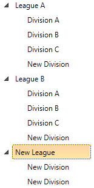

# Add Context Menu

Telerik RadControls provide a very powerful __ContextMenu__ control, that supports right click, modifier keys and that can be easily attached to any visual element. In this article you will see how to attach __RadContextMenu__ to a data-bound __RadTreeView__ and perform actions on the clicked treeview items, depending on the selection in the context menu.
	  

## 

Here you can see how the end result will look like: 

For the purpose of this tutorial we will use the following __TreeView__ declaration:
		

#### __XAML__

{{region radtreeview-how-to-add-context-menu_0}}
			<UserControl.Resources>
	
				<local:RadTreeViewSampleData x:Key="DataSource" />
	
				<DataTemplate x:Key="Division">
					<TextBlock Text="{Binding Name}" />
				</DataTemplate>
	
				<HierarchicalDataTemplate x:Key="League"
				                          ItemsSource="{Binding Divisions}"
				                          ItemTemplate="{StaticResource Division}">
					<TextBlock Text="{Binding Name}" />
				</HierarchicalDataTemplate>
	
			</UserControl.Resources>
	
			<Grid x:Name="LayoutRoot" Background="White">
	
				<telerik:RadTreeView x:Name="radTreeView"
				                     ItemsSource="{Binding Source={StaticResource DataSource},
				                                           Path=LeaguesDataSource}"
				                     ItemTemplate="{StaticResource League}" />
	
			</Grid>
	{{endregion}}

>The __local__ alias is pointing to the namespace where the __RadTreeViewSampleData__ class is defined.
			

For more information about setting the __ItemsSource__property and data binding read the topic about [Binding to Object]().
		

Having the above declaration, you may want to add a context menu only on the items of type "League". Then you will need to update your __League__:
		

#### __XAML__

{{region radtreeview-how-to-add-context-menu_1}}
			<telerik:HierarchicalDataTemplate x:Key="League"
			                                  ItemsSource="{Binding Divisions}"
			                                  ItemTemplate="{StaticResource Division}">
				<TextBlock Text="{Binding Name}">
					<telerik:RadContextMenu.ContextMenu>
						<telerik:RadContextMenu Opened="RadContextMenu_Opened">
							<telerik:RadMenuItem Header="New Child" />
							<telerik:RadMenuItem Header="New Sibling" />
							<telerik:RadMenuItem Header="Delete" />
						</telerik:RadContextMenu>
					</telerik:RadContextMenu.ContextMenu>
				</TextBlock>
			</telerik:HierarchicalDataTemplate>
	{{endregion}}



#### __XAML__

{{region radtreeview-how-to-add-context-menu_8}}
	        <HierarchicalDataTemplate x:Key="League"
			                                  ItemsSource="{Binding Divisions}"
			                                  ItemTemplate="{StaticResource Division}">
	            <TextBlock Text="{Binding Name}">
					<telerik:RadContextMenu.ContextMenu>
						<telerik:RadContextMenu Opened="RadContextMenu_Opened">
							<telerik:RadMenuItem Header="New Child" />
							<telerik:RadMenuItem Header="New Sibling" />
							<telerik:RadMenuItem Header="Delete" />
						</telerik:RadContextMenu>
					</telerik:RadContextMenu.ContextMenu>
	            </TextBlock>
	        </HierarchicalDataTemplate>
	{{endregion}}



Next, we need to add a handler for the __RadContextMenu.Opened__ event, where we will use the GetClickedElement<T> extension method to get the clicked __RadTreeViewItem__:
		

#### __C#__

{{region radtreeview-how-to-add-context-menu_6}}
	RadTreeViewItem clickedElement;
	private void RadContextMenu_Opened(object sender, RoutedEventArgs e)
	{
		// Find the tree item that is associated with the clicked context menu item
		clickedElement = (sender as RadContextMenu).GetClickedElement<RadTreeViewItem>();
	}
	{{endregion}}

#### __VB.NET__

{{region radtreeview-how-to-add-context-menu_7}}
	Private clickedElement As RadTreeViewItem
		Private Sub RadContextMenu_Opened(sender As Object, e As RoutedEventArgs)
			' Find the tree item that is associated with the clicked context menu item
			clickedElement = TryCast(sender, RadContextMenu).GetClickedElement(Of RadTreeViewItem)()
		End Sub
	{{endregion}}

Now, we can handle the click events of the __RadMenuItems__. To  add a handler for these __Click__ events, add the following line in the user control constructor:
		

#### __C#__

{{region radtreeview-how-to-add-context-menu_2}}
	this.radTreeView.AddHandler( RadMenuItem.ClickEvent, new RoutedEventHandler( OnContextMenuClick ) );
	{{endregion}}

#### __VB.NET__

{{region radtreeview-how-to-add-context-menu_3}}
	Me.radTreeView.[AddHandler](RadMenuItem.ClickEvent, New RoutedEventHandler(AddressOf OnContextMenuClick))
	{{endregion}}

>The __AddHandler()__ extension method is defined in the __Telerik.Windows__ namespace. You should add “__using Telerik.Windows;__” on top of your code behind if you don’t already have it.
		  

The __OnContextMenuClick()__ method uses the clicked __RadTreeViewItem__ and performs the selected action:
		

#### __C#__

{{region radtreeview-how-to-add-context-menu_4}}
	private void OnContextMenuClick(object sender, RoutedEventArgs args)
	{
		// Get the clicked context menu item
		RadMenuItem menuItem = ((RadRoutedEventArgs)args).OriginalSource as RadMenuItem;
	
		League league = clickedElement.Item as League;
		ItemsControl parentItemsControl = (ItemsControl)clickedElement.ParentItem ?? clickedElement.ParentTreeView;
		string header = menuItem.Header as string;
		switch (header)
		{
			case "New Child":
				league.Divisions.Add(new Division("New Division"));
				break;
			case "New Sibling":
				(parentItemsControl.ItemsSource as ObservableCollection<League>).Add(new League("New League"));
				break;
			case "Delete":
				(parentItemsControl.ItemsSource as ObservableCollection<League>).Remove(league);
				break;
		}
	}
	{{endregion}}

#### __VB.NET__

{{region radtreeview-how-to-add-context-menu_5}}
	Private Sub OnContextMenuClick(sender As Object, args As RoutedEventArgs)
			' Get the clicked context menu item
			Dim menuItem As RadMenuItem = TryCast(DirectCast(args, RadRoutedEventArgs).OriginalSource, RadMenuItem)
	
			Dim league As League = TryCast(clickedElement.Item, League)
			Dim parentItemsControl As ItemsControl = If(DirectCast(clickedElement.ParentItem, ItemsControl), clickedElement.ParentTreeView)
			Dim header As String = TryCast(menuItem.Header, String)
			Select Case header
				Case "New Child"
					league.Divisions.Add(New Division("New Division"))
					Exit Select
				Case "New Sibling"
					TryCast(parentItemsControl.ItemsSource, ObservableCollection(Of League)).Add(New League("New League"))
					Exit Select
				Case "Delete"
					TryCast(parentItemsControl.ItemsSource, ObservableCollection(Of League)).Remove(league)
					Exit Select
			End Select
		End Sub
	{{endregion}}

Here is the final result: 

# See Also

 * [Get Item by Path]()

 * [Disable Drop at Specific Location]()

 * [Bind RadTreeView to Hierarchical Data and Use ContainerBindingCollection]()
