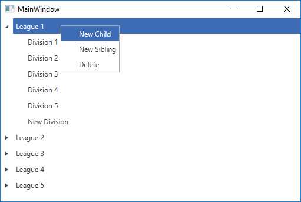

# Add Context Menu

In this article you will see how to attach a [RadContextMenu]() to a data-bound __RadTreeView__ and perform actions on the clicked treeview items, depending on the selection in the context menu.

## Defining the ViewModels

For the purposes of the article, the ItemsSource of the RadTreeView will contain League objects. Each league will contain division objects, thus achiving a hierarchical structure. With the help of the __RadContextMenu__ we will give the option of adding a new child, adding a new sibling or deleting an item. In order to do that we will implement a base class with three commands: DeleteCommand, NewSiblingCommand and NewChildCommand. The first two commands will raise an event with custom command arguments. The parent item will listen for it and perform the necessary update. The class structure is demonstrated in __Example 1__.

__Example 1: Defining the ViewModels__

```C#
	public enum ActionToTake
    {
        CreateSibling,
        Delete
    }

	public class UpdateNeededEventArgs : EventArgs
    {
        public ActionToTake ActionToTake { get; set; }
    }

	public abstract class BaseModel : ViewModelBase
    {
        public BaseModel()
        {
            this.DeleteCommand = new DelegateCommand(OnDeleteCommandExecuted);
            this.NewSiblingCommand = new DelegateCommand(OnNewSiblingCommandExecuted);
            this.NewChildCommand = new DelegateCommand(OnNewChildExecuted);
        }

        public ICommand DeleteCommand { get; private set; }
        public ICommand NewSiblingCommand { get; private set; }

        public ICommand NewChildCommand { get; private set; }

        public event EventHandler<UpdateNeededEventArgs> UpdateNeeded;

        protected abstract void OnNewChildExecuted(object obj);

        protected virtual void OnUpdateNeeded(UpdateNeededEventArgs e)
        {
            EventHandler<UpdateNeededEventArgs> handler = UpdateNeeded;
            handler?.Invoke(this, e);
        }

        private void OnDeleteCommandExecuted(object obj)
        {
            this.OnUpdateNeeded(new UpdateNeededEventArgs() { ActionToTake = ActionToTake.Delete });
        }

        private void OnNewSiblingCommandExecuted(object obj)
        {
            this.OnUpdateNeeded(new UpdateNeededEventArgs() { ActionToTake = ActionToTake.CreateSibling });
        }
    }

	public class Division : BaseModel
    {
        public Division(string name)
        {
            this.Name = name;
        }
        private string name;
        public string Name
        {
            get
            {
                return this.name;
            }
            set
            {
                if (this.name != value)
                {
                    this.name = value;
                    this.OnPropertyChanged("Name");
                }
            }
        }

        protected override void OnNewChildExecuted(object obj)
        {
            // Add children here
        }
    }

	public class League : BaseModel
	{
        private ObservableCollection<Division> divisions = new ObservableCollection<Division>();

        public League(string name, ObservableCollection<Division> divisions)
		{
			this.Name = name;
            this.Divisions = divisions;

            foreach (Division division in this.Divisions)
            {
                division.UpdateNeeded += Division_UpdateNeeded;
            }
		}

        public string Name
        {
            get;
            set;
        }
        public ObservableCollection<Division> Divisions
        {
            get
            {
                return this.divisions;
            }

            set
            {
                if (this.divisions != value)
                {
                    this.divisions = value;
                    this.OnPropertyChanged("Divisions");
                }
            }
        }

        protected override void OnNewChildExecuted(object obj)
        {
            this.Divisions.Add(new Division("New Division"));
        }

        private void Division_UpdateNeeded(object sender, UpdateNeededEventArgs e)
        {
            switch (e.ActionToTake)
            {
                case ActionToTake.CreateSibling:
                    this.Divisions.Add(new Division("New Division"));
                    break;
                case ActionToTake.Delete:
                    var divisionToDelete = sender as Division;
                    this.Divisions.Remove(divisionToDelete);
                    break;
                default:
                    break;
            }
        }
    }

	public class ViewModel : ViewModelBase
	{
        private ObservableCollection<League> leagues = new ObservableCollection<League>();

        public ViewModel(ObservableCollection<League> leagues)
		{
            this.Leagues = leagues;
            foreach (League league in leagues)
            {
                league.UpdateNeeded += League_UpdateNeeded;
            }
        }

        public ICommand DeleteCommand { get; set; }

        public ObservableCollection<League> Leagues
        {
            get
            {
                return this.leagues;
            }

            set
            {
                if (this.leagues != value)
                {
                    this.leagues = value;
                    this.OnPropertyChanged("Leagues");
                }
            }

        }

        private void League_UpdateNeeded(object sender, UpdateNeededEventArgs e)
        {
            switch (e.ActionToTake)
            {
                case ActionToTake.CreateSibling:
                    this.Leagues.Add(new League("New League", new ObservableCollection<Division>()));
                    break;
                case ActionToTake.Delete:
                    var leagueToRemove = sender as League;
                    this.Leagues.Remove(leagueToRemove);
                    break;
                default:
                    break;
            }
        }
	}
```
```VB.NET
	Public Enum ActionToTake
			CreateSibling
			Delete
	End Enum

	Public Class UpdateNeededEventArgs
		Inherits EventArgs

		Public Property ActionToTake() As ActionToTake
	End Class

	Public MustInherit Class BaseModel
		Inherits ViewModelBase

		Public Sub New()
			Me.DeleteCommand = New DelegateCommand(AddressOf OnDeleteCommandExecuted)
			Me.NewSiblingCommand = New DelegateCommand(AddressOf OnNewSiblingCommandExecuted)
			Me.NewChildCommand = New DelegateCommand(AddressOf OnNewChildExecuted)
		End Sub

		Private privateDeleteCommand As ICommand
		Public Property DeleteCommand() As ICommand
			Get
				Return privateDeleteCommand
			End Get
			Private Set(ByVal value As ICommand)
				privateDeleteCommand = value
			End Set
		End Property
		Private privateNewSiblingCommand As ICommand
		Public Property NewSiblingCommand() As ICommand
			Get
				Return privateNewSiblingCommand
			End Get
			Private Set(ByVal value As ICommand)
				privateNewSiblingCommand = value
			End Set
		End Property

		Private privateNewChildCommand As ICommand
		Public Property NewChildCommand() As ICommand
			Get
				Return privateNewChildCommand
			End Get
			Private Set(ByVal value As ICommand)
				privateNewChildCommand = value
			End Set
		End Property

		Public Event UpdateNeeded As EventHandler(Of UpdateNeededEventArgs)

		Protected MustOverride Sub OnNewChildExecuted(ByVal obj As Object)

		Protected Overridable Sub OnUpdateNeeded(ByVal e As UpdateNeededEventArgs)
			Dim handler As EventHandler(Of UpdateNeededEventArgs) = UpdateNeededEvent
			handler?.Invoke(Me, e)
		End Sub

		Private Sub OnDeleteCommandExecuted(ByVal obj As Object)
			Me.OnUpdateNeeded(New UpdateNeededEventArgs() With {.ActionToTake = ActionToTake.Delete})
		End Sub

		Private Sub OnNewSiblingCommandExecuted(ByVal obj As Object)
			Me.OnUpdateNeeded(New UpdateNeededEventArgs() With {.ActionToTake = ActionToTake.CreateSibling})
		End Sub
	End Class

	Public Class Division
		Inherits BaseModel

		Public Sub New(ByVal name As String)
			Me.Name = name
		End Sub

		Private _name As String
		Public Property Name() As String
			Get
				Return Me._name
			End Get
			Set(ByVal value As String)
				If Me._name <> value Then
					Me._name = value
					Me.OnPropertyChanged("Name")
				End If
			End Set
		End Property

		Protected Overrides Sub OnNewChildExecuted(ByVal obj As Object)
			' Add children here
		End Sub
	End Class

	Public Class League
		Inherits BaseModel

		Private _division As New ObservableCollection(Of Division)()

		Public Sub New(ByVal name As String, ByVal divisions As ObservableCollection(Of Division))
			Me.Name = name
			Me.Divisions = divisions

			For Each division As Division In Me.Divisions
				AddHandler division.UpdateNeeded, AddressOf Division_UpdateNeeded
			Next division
		End Sub

		Public Property Name() As String
		Public Property Divisions() As ObservableCollection(Of Division)
			Get
				Return Me._division
			End Get

			Set(ByVal value As ObservableCollection(Of Division))
				If Me._division IsNot value Then
					Me._division = value
					Me.OnPropertyChanged("Divisions")
				End If
			End Set
		End Property

		Protected Overrides Sub OnNewChildExecuted(ByVal obj As Object)
			Me._division.Add(New Division("New Division"))
		End Sub

		Private Sub Division_UpdateNeeded(ByVal sender As Object, ByVal e As UpdateNeededEventArgs)
			Select Case e.ActionToTake
				Case ActionToTake.CreateSibling
					Me.Divisions.Add(New Division("New Division"))
				Case ActionToTake.Delete
					Dim divisionToDelete = TryCast(sender, Division)
					Me.Divisions.Remove(divisionToDelete)
				Case Else
			End Select
		End Sub
	End Class

	Public Class ViewModel
		Inherits ViewModelBase

		Private _leagues As New ObservableCollection(Of League)()

		Public Sub New(ByVal leagues As ObservableCollection(Of League))
			Me.Leagues = leagues
			For Each league As League In leagues
				AddHandler league.UpdateNeeded, AddressOf League_UpdateNeeded
			Next league
		End Sub

		Public Property DeleteCommand() As ICommand

		Public Property Leagues() As ObservableCollection(Of League)
			Get
				Return Me._leagues
			End Get

			Set(ByVal value As ObservableCollection(Of League))
				If Me._leagues IsNot value Then
					Me._leagues = value
					Me.OnPropertyChanged("Leagues")
				End If
			End Set

		End Property

		Private Sub League_UpdateNeeded(ByVal sender As Object, ByVal e As UpdateNeededEventArgs)
			Select Case e.ActionToTake
				Case ActionToTake.CreateSibling
					Me.Leagues.Add(New League("New League", New ObservableCollection(Of Division)()))
				Case ActionToTake.Delete
					Dim leagueToRemove = TryCast(sender, League)
					Me.Leagues.Remove(leagueToRemove)
				Case Else
			End Select
		End Sub
	End Class
```

## Defining the view

Next, we will define the RadTreeView in xaml. We will create the DataTemplates which will display our hierarchical data and a RadContextMenu which will invoke the corresponding commands from the model.

__Example 2: Defining the view__
```XAML
	<Grid>
        <Grid.Resources>
			<Style TargetType="telerik:RadTreeViewItem">
                <Setter Property="HorizontalContentAlignment" Value="Stretch" />
            </Style>

            <telerik:RadContextMenu x:Key="TreeViewContextMenu" >
                <telerik:RadMenuItem Header="New Child" Command="{Binding NewChildCommand}"/>
                <telerik:RadMenuItem Header="New Sibling" Command="{Binding NewSiblingCommand}" />
                <telerik:RadMenuItem Header="Delete" Command="{Binding DeleteCommand}"/>
            </telerik:RadContextMenu>

            <DataTemplate x:Key="DivisionTemplate">
                <TextBlock Text="{Binding Name}"  telerik:RadContextMenu.ContextMenu="{StaticResource TreeViewContextMenu}"/>
            </DataTemplate>

            <HierarchicalDataTemplate x:Key="LeagueTemplate"
                                          ItemTemplate="{StaticResource DivisionTemplate}"
                                          ItemsSource="{Binding Divisions}">
                <TextBlock Text="{Binding Name}" telerik:RadContextMenu.ContextMenu="{StaticResource TreeViewContextMenu}" />
            </HierarchicalDataTemplate>
        </Grid.Resources>

        <telerik:RadTreeView x:Name="radTreeView"
                             ItemTemplate="{StaticResource LeagueTemplate}"
                             ItemsSource="{Binding Path=Leagues}" />

    </Grid>
```

## Creating the ViewModel

Finally all we need to do is create some sample data and set an instance of our ViewModel as the DataContext. 

__Example 3: Creating the ViewModel__
```C#
	public partial class MainWindow : Window
	{
		public MainWindow()
		{
			this.InitializeComponent();
            
            this.DataContext = this.SetUpViewModel();
		}
        private ViewModel SetUpViewModel()
        {
            var leagues = new ObservableCollection<League>();
            for (int i = 1; i <= 5; i++)
            {
                var divisions = new ObservableCollection<Division>();
                for (int j = 1; j <= 5; j++)
                {
                    var division = new Division("Division " + j);
                    divisions.Add(division);
                }

                var league = new League("League " + i , divisions);
                leagues.Add(league);
            }
            
            return new ViewModel(leagues);
        }
	}
```
```VB.NET
	Partial Public Class MainWindow
	Inherits Window

		Public Sub New()
			Me.InitializeComponent()

			Me.DataContext = Me.SetUpViewModel()
		End Sub
		Private Function SetUpViewModel() As ViewModel
			Dim leagues = New ObservableCollection(Of League)()
			For i As Integer = 1 To 5
				Dim divisions = New ObservableCollection(Of Division)()
				For j As Integer = 1 To 5
					Dim division = New Division("Division " & j)
					divisions.Add(division)
				Next j

				Dim league = New League("League " & i, divisions)
				leagues.Add(league)
			Next i

			Return New ViewModel(leagues)
		End Function
	End Class
```

#### __Figure 1: Result from the Example in the Office2016 theme__

				

## See Also
 * [Get Item by Path]()
 * [Disable Drop at Specific Location]()
 * [Bind RadTreeView to Hierarchical Data and Use Style Binding]()