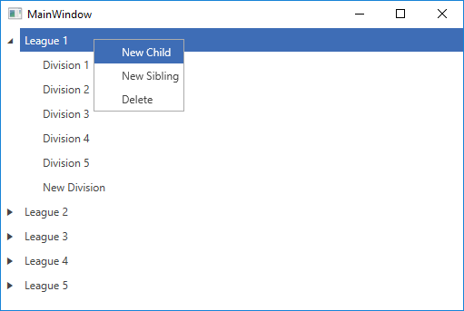

# Add Context Menu

In this article you will see how to attach a [RadContextMenu]() to a data-bound __RadTreeView__ and perform actions on the clicked treeview items, depending on the selection in the context menu.

## Defining the ViewModels

For the purposes of the article, the ItemsSource of the RadTreeView will contain League objects. Each league will contain division objects, thus achiving a hierarchical structure. With the help of the __RadContextMenu__ we will give the option of adding a new child, adding a new sibling or deleting an item. In order to do that we will implement a base class with three commands: DeleteCommand, NewSiblingCommand and NewChildCommand. The first two commands will raise an event with custom command arguments. The parent item will listen for it and perform the necessary update. The class structure is demonstrated in __Example 1__.

__Example 1: Defining the ViewModels__

<snippet id='radtreeview-how-to-add-context-menu-block_1-cs' />
<snippet id='radtreeview-how-to-add-context-menu-block_2-vb' />

## Defining the view

Next, we will define the RadTreeView in xaml. We will create the DataTemplates which will display our hierarchical data and a RadContextMenu which will invoke the corresponding commands from the model.

__Example 2: Defining the view__
<snippet id='radtreeview-how-to-add-context-menu-block_3-xaml' />

## Creating the ViewModel

Finally all we need to do is create some sample data and set an instance of our ViewModel as the DataContext. 

__Example 3: Creating the ViewModel__
<snippet id='radtreeview-how-to-add-context-menu-block_4-cs' />
<snippet id='radtreeview-how-to-add-context-menu-block_5-vb' />

#### __Figure 1: Result from the Example in the Office2016 theme__

				

## See Also
 * [Get Item by Path]()
 * [Disable Drop at Specific Location]()
 * [Bind RadTreeView to Hierarchical Data and Use Style Binding]()