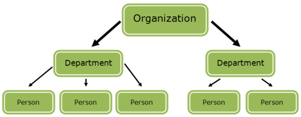
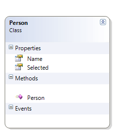
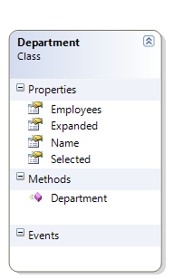
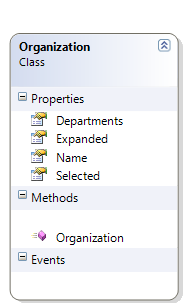
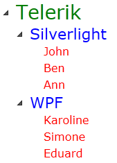

# Bind RadTreeView to Hierarchical Data and Use ContainerBindingCollection

## 

This tutorial demonstrates the usage of __HierarchicalDataTemplate__ and __ContainerBindingCollection__ in __RadTreeView__.

For more information about __HierarchicalDataTemplate__ read the topic [HierarchicalDataTemplates]().

>The __ContainerBindingCollection__is available only in Silverlight.

>The __ContainerBindingCollection__ is in the __Telerik.Windows.Controls__ namespace from the __Telerik.Windows.Controls.dll__ assembly.

Imagine the following scenario. You have an __Organization__ that has several __Departments__, and each __Department__ has several __Employees__.
 

It is not that difficult to create a data source reflecting the above structure. This is how the three classes look like: 

* __Person__ class:

#### __C#__

{{region radtreeview-how-to-bind-hierarchical-data-use-containerbindingcollection_0}}
	public class Person
	{
	    public Person()
	    {
	    }
	    public string Name
	    {
	        get;
	        set;
	    }
	    public bool Selected
	    {
	        get;
	        set;
	    }
	}
	{{endregion}}

#### __VB.NET__

{{region radtreeview-how-to-bind-hierarchical-data-use-containerbindingcollection_1}}
	Public Class Person
	    Public Sub New()
	    End Sub
	
	Private _Name As String
	    Public Property Name() As String
	        Get
	            Return _Name
	        End Get
	        Set(ByVal value As String)
	            _Name = value
	        End Set
	    End Property
	
	Private _Selected As Boolean
	    Public Property Selected() As Boolean
	        Get
	            Return _Selected
	        End Get
	        Set(ByVal value As Boolean)
	            _Selected = value
	        End Set
	    End Property
	End Class
	{{endregion}}

* __Department__ class: 

#### __C#__

{{region radtreeview-how-to-bind-hierarchical-data-use-containerbindingcollection_2}}
	public class Department
	{
	    public Department()
	    {
	        this.Employees = new List<Person>();
	    }
	    public string Name
	    {
	        get;
	        set;
	    }
	    public bool Selected
	    {
	        get;
	        set;
	    }
	    public bool Expanded
	    {
	        get;
	        set;
	    }
	    public List<Person> Employees
	    {
	        get;
	        set;
	    }
	}
	{{endregion}}

#### __VB.NET__

{{region radtreeview-how-to-bind-hierarchical-data-use-containerbindingcollection_3}}
	Public Class Department
	    Public Sub New()
	        Me.Employees = New List(Of Person)()
	    End Sub
	
	Private _Name As String
	    Public Property Name() As String
	        Get
	            Return _Name
	        End Get
	        Set(ByVal value As String)
	            _Name = value
	        End Set
	    End Property
	
	Private _Selected As Boolean
	    Public Property Selected() As Boolean
	        Get
	            Return _Selected
	        End Get
	        Set(ByVal value As Boolean)
	            _Selected = value
	        End Set
	    End Property
	
	Private _Expanded As Boolean
	    Public Property Expanded() As Boolean
	        Get
	            Return _Expanded
	        End Get
	        Set(ByVal value As Boolean)
	            _Expanded = value
	        End Set
	    End Property
	
	Private _Employees As List(Of Person)
	    Public Property Employees() As List(Of Person)
	        Get
	            Return _Employees
	        End Get
	        Set(ByVal value As List(Of Person))
	            _Employees = value
	        End Set
	    End Property
	End Class
	{{endregion}}

* __Organization__ class 

#### __C#__

{{region radtreeview-how-to-bind-hierarchical-data-use-containerbindingcollection_4}}
	public class Organization
	{
	    public Organization()
	    {
	        this.Departments = new List<Department>();
	    }
	    public string Name
	    {
	        get;
	        set;
	    }
	    public bool Selected
	    {
	        get;
	        set;
	    }
	    public bool Expanded
	    {
	        get;
	        set;
	    }
	    public List<Department> Departments
	    {
	        get;
	        set;
	    }
	}
	{{endregion}}

#### __VB.NET__

{{region radtreeview-how-to-bind-hierarchical-data-use-containerbindingcollection_5}}
	Public Class Organization
	    Public Sub New()
	        Me.Departments = New List(Of Department)()
	    End Sub
	
	Private _Name As String
	    Public Property Name() As String
	        Get
	            Return _Name
	        End Get
	        Set(ByVal value As String)
	            _Name = value
	        End Set
	    End Property
	
	Private _Selected As Boolean
	    Public Property Selected() As Boolean
	        Get
	            Return _Selected
	        End Get
	        Set(ByVal value As Boolean)
	            _Selected = value
	        End Set
	    End Property
	
	Private _Expanded As Boolean
	    Public Property Expanded() As Boolean
	        Get
	            Return _Expanded
	        End Get
	        Set(ByVal value As Boolean)
	            _Expanded = value
	        End Set
	    End Property
	
	Private _Departments As List(Of Department)
	    Public Property Departments() As List(Of Department)
	        Get
	            Return _Departments
	        End Get
	        Set(ByVal value As List(Of Department))
	            _Departments = value
	        End Set
	    End Property
	End Class
	{{endregion}}

As you can see, an __Organization__ has a __Name__ and a list of __Departments__. A __Department__ also has a __Name__, as well as a list of people that work in that __Department__. A __Person__ has a __Name__.
There are two more properties - __Selected__ and __Expanded__. They will be explained further in the article, but in short, they will be used to control whether a certain __RadTreeViewItem__ is expanded or selected.

Having the above three classes set up, it is time to create and populate a data source, which will be passed to the __RadTreeView's____ItemsSource__ property. 

#### __C#__

{{region radtreeview-how-to-bind-hierarchical-data-use-containerbindingcollection_6}}
	public class DataSource : List<Organization>
	{
	    public DataSource()
	    {
	        Organization telerik = new Organization()
	        {
	            Name = "Telerik"
	        };
	        Department silverlight = new Department()
	        {
	            Name = "Silverlight"
	        };
	        Department wpf = new Department()
	        {
	            Name = "WPF"
	        };
	        telerik.Departments.Add( silverlight );
	        telerik.Departments.Add( wpf );
	        silverlight.Employees.Add( new Person()
	        {
	            Name = "John"
	        } );
	        silverlight.Employees.Add( new Person()
	        {
	            Name = "Ben"
	        } );
	        silverlight.Employees.Add( new Person()
	        {
	            Name = "Ann"
	        } );
	        wpf.Employees.Add( new Person()
	        {
	            Name = "Karoline"
	        } );
	        wpf.Employees.Add( new Person()
	        {
	            Name = "Simone"
	        } );
	        wpf.Employees.Add( new Person()
	        {
	            Name = "Eduard"
	        } );
	        this.Add( telerik );
	    } 
	}
	{{endregion}}

#### __VB.NET__

{{region radtreeview-how-to-bind-hierarchical-data-use-containerbindingcollection_7}}
	Public Class DataSource
	    Inherits List(Of Organization)
	    Public Sub New()
	        Dim telerik As New Organization("Telerik")
	        Dim silverlight As New Department("Silverlight")
	        Dim wpf As New Department("WPF")
	
	        telerik.Departments.Add(silverlight)
	        telerik.Departments.Add(wpf)
	
	        silverlight.Employees.Add(New Person("John"))
	        silverlight.Employees.Add(New Person("Ben"))
	        silverlight.Employees.Add(New Person("Ann"))
	
	        wpf.Employees.Add(New Person("Karoline"))
	        wpf.Employees.Add(New Person("Simone"))
	        wpf.Employees.Add(New Person("Eduard"))
	
	        Me.Add(telerik)
	    End Sub
	End Class
	{{endregion}}

And setting __RadTreeView's ItemsSource__ property in XAML: 

#### __XAML__

{{region radtreeview-how-to-bind-hierarchical-data-use-containerbindingcollection_8}}
	<UserControl.Resources>
	    <example:DataSource x:Key="TreeViewDataSource"/>
	</UserControl.Resources>
	{{endregion}}

#### __XAML__

{{region radtreeview-how-to-bind-hierarchical-data-use-containerbindingcollection_9}}
	<telerik:RadTreeView  Margin="8"
	    SelectionMode="Multiple"      
	    ItemsSource="{Binding Source={StaticResource TreeViewDataSource}}"/>
	{{endregion}}

Now it is time to define how each level of the __RadTreeView__ will look like. Regular __DataTemplate__ will not do the work, that is why Telerik's __HierarchicalDataTemplate__ has to be used. The reason why this article uses Telerik's implementation of the __HierarchicalDataTemplate__ is because it supports __ContainerBinding__, but that will be explained later.

Below you can see the __HierarchicalDataTemplates__ used for each level of the hierarchy. 

#### __XAML__

{{region radtreeview-how-to-bind-hierarchical-data-use-containerbindingcollection_10}}
	<!--Data template for the Person object-->
	<telerik:HierarchicalDataTemplate x:Key="PersonTemplate">
	    <TextBlock Text="{Binding Name}" Foreground="Red" FontSize="16" FontFamily="Verdana" />
	</telerik:HierarchicalDataTemplate>
	<!--Data template for the Department object-->
	<telerik:HierarchicalDataTemplate  
	    x:Key="DepartmentTemplate"  
	    ItemTemplate="{StaticResource PersonTemplate}" 
	    ItemsSource="{Binding Employees}">
	    <TextBlock Text="{Binding Name}" Foreground="Blue" FontSize="22" FontFamily="Verdana" />
	</telerik:HierarchicalDataTemplate>
	<!--Data template for the Organization object-->
	<telerik:HierarchicalDataTemplate  
	    x:Key="OrganizationTemplate"  
	    ItemTemplate="{StaticResource DepartmentTemplate}" 
	    ItemsSource="{Binding Departments}">
	    <TextBlock Text="{Binding Name}" Foreground="Green" FontSize="28" FontFamily="Verdana" />
	</telerik:HierarchicalDataTemplate>
	{{endregion}}

#### __XAML__

{{region radtreeview-how-to-bind-hierarchical-data-use-containerbindingcollection_11}}
	<telerik:RadTreeView  Margin="8"
	    SelectionMode="Multiple"      
	    ItemsSource="{Binding Source={StaticResource TreeViewDataSource}}" 
	    ItemTemplate="{StaticResource OrganizationTemplate}"/>
	{{endregion}}

If you run the project and expand all the nodes, you will end up with a result like this: 

But what if you want to expand only the "Silverlight" node and select the "John" node, leaving the WPF node collapsed. This is where __ContainerBinding__ comes in hand. The __ContainerBinding__ class is a placeholder for a binding that has to be applied on the specified property. This is automatically done by all Telerik __ItemsControls__ and is a temporary way to workaround the inability of the Silverlight styles to set bindings. In other words, the XAML above will instruct the ItemsControl (__RadTreeView__ in this case) to apply the bindings in the __Binding__ property on the properties with name __PropertyName__ in the __RadTreeViewItem__ containers. 

#### __XAML__

{{region radtreeview-how-to-bind-hierarchical-data-use-containerbindingcollection_12}}
	<telerik:ContainerBindingCollection x:Name="BindingsCollection">
	    <telerik:ContainerBinding PropertyName="IsSelected" Binding="{Binding Selected}" />
	    <telerik:ContainerBinding PropertyName="IsExpanded" Binding="{Binding Expanded}" />
	</telerik:ContainerBindingCollection>
	{{endregion}}

As you can see, the __IsSelected__ property of each __RadTreeViewItem__ is bound to the __Selected__ property in the data source. The same is with the __IsExpanded__ property. That's why now you have to update your data source. 

#### __C#__

{{region radtreeview-how-to-bind-hierarchical-data-use-containerbindingcollection_13}}
	public DataSource()
	{
	    Organization telerik = new Organization()
	    {
	        Name = "Telerik",
	        Expanded = true,
	        Selected = false
	    };
	    Department silverlight = new Department()
	    {
	        Name = "Silverlight",
	        Expanded = true,
	        Selected = false
	    };
	    Department wpf = new Department()
	    {
	        Name = "WPF",
	        Expanded = false,
	        Selected = false
	    };
	    telerik.Departments.Add( silverlight );
	    telerik.Departments.Add( wpf );
	    silverlight.Employees.Add( new Person()
	    {
	        Name = "John",
	        Selected = true
	    } );
	    silverlight.Employees.Add( new Person()
	    {
	        Name = "Ben",
	        Selected = false
	    } );
	    silverlight.Employees.Add( new Person()
	    {
	        Name = "Ann",
	        Selected = false
	    } );
	    wpf.Employees.Add( new Person()
	    {
	        Name = "Karoline",
	        Selected = false
	    } );
	    wpf.Employees.Add( new Person()
	    {
	        Name = "Simone",
	        Selected = false
	    } );
	    wpf.Employees.Add( new Person()
	    {
	        Name = "Eduard",
	        Selected = false
	    } );
	    this.Add( telerik );
	}
	{{endregion}}

#### __VB.NET__

{{region radtreeview-how-to-bind-hierarchical-data-use-containerbindingcollection_14}}
	Public Class DataSource
	    Inherits List(Of Organization)
	    Public Sub New()
	        Dim telerik As New Organization("Telerik", False, True)
	        Dim silverlight As New Department("Silverlight", False, True)
	        Dim wpf As New Department("WPF", False, False)
	
	        telerik.Departments.Add(silverlight)
	        telerik.Departments.Add(wpf)
	
	        silverlight.Employees.Add(New Person("John", True))
	        silverlight.Employees.Add(New Person("Ben", False))
	        silverlight.Employees.Add(New Person("Ann", False))
	
	        wpf.Employees.Add(New Person("Karoline", False))
	        wpf.Employees.Add(New Person("Simone", False))
	        wpf.Employees.Add(New Person("Eduard", False))
	
	        Me.Add(telerik)
	    End Sub
	End Class
	{{endregion}}

Finally, you have to update the __HierarchicalDataTemplates__ by applying the __ContainerBindings__. 

#### __XAML__

{{region radtreeview-how-to-bind-hierarchical-data-use-containerbindingcollection_15}}
	<!--Data template for the Person object-->
	<telerik:HierarchicalDataTemplate  
	    x:Key="PersonTemplate"  
	    telerik:ContainerBinding.ContainerBindings="{StaticResource BindingsCollection}">
	    <TextBlock Text="{Binding Name}" Foreground="Red" FontSize="16" FontFamily="Verdana" />
	</telerik:HierarchicalDataTemplate>
	<!--Data template for the Department object-->
	<telerik:HierarchicalDataTemplate  
	    x:Key="DepartmentTemplate"  
	    ItemTemplate="{StaticResource PersonTemplate}" 
	    ItemsSource="{Binding Employees}"  
	    telerik:ContainerBinding.ContainerBindings="{StaticResource BindingsCollection}">
	    <TextBlock Text="{Binding Name}" Foreground="Blue" FontSize="22" FontFamily="Verdana" />
	</telerik:HierarchicalDataTemplate>
	<!--Data template for the Organization object-->
	<telerik:HierarchicalDataTemplate  
	    x:Key="OrganizationTemplate"  
	    telerik:ContainerBinding.ContainerBindings="{StaticResource BindingsCollection}"  
	    ItemTemplate="{StaticResource DepartmentTemplate}" 
	    ItemsSource="{Binding Departments}">
	    <TextBlock Text="{Binding Name}" Foreground="Green" FontSize="28" FontFamily="Verdana" />
	</telerik:HierarchicalDataTemplate>
	{{endregion}}

So now, if you run the project, you will see the following result: 

>

If you want to implement two way data binding, your business objects should implement the __INotifyPropertyChanged__ interface. Additionally, you should set the __Binding__'s __Mode__ to __TwoWay__in the __ContainerBinding__ declaration.

	
                <telerik:ContainerBindingCollection x:Name="BindingsCollection">
    					<telerik:ContainerBinding PropertyName="IsSelected" Binding="{Binding Selected, Mode=TwoWay}" />
    					<telerik:ContainerBinding PropertyName="IsExpanded" Binding="{Binding Expanded, Mode=TwoWay}" />
				</telerik:ContainerBindingCollection>
                

# See Also

 * [Get Item by Path]()

 * [Work with Selection]()

 * [Create Horizontal TreeView]()
