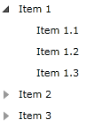

# Bind RadTreeView to Self-Referencing Data

This tutorial will show you how to display a __RadTreeView__ with flat, self-referencing data, loaded from a database, that has properties __ID__ and __ParentID__ (or similar) which define the hierarchy. 

Consider the following very simple data object:

__Example 1: Defining the DataItem class__

```C#
	public class DataItem
    {
        public int Id
        {
            get;
            set;
        }
        public int ParentId
        {
            get;
            set;
        }
        public string Text
        {
            get;
            set;
        }

        public DataItemCollection OwnerCollection
        {
            get;
            protected set;
        }

        internal void SetOwnerCollection(DataItemCollection collection)
        {
            this.OwnerCollection = collection;
        }
    }
```
```VB.NET
	Public Class DataItem
    Inherits ViewModelBase

    Public Property Id As Integer

    Public Property ParentId As Integer

    Public Property Text As String

    Public Property OwnerCollection As DataItemCollection

    Friend Sub SetOwnerCollection(ByVal collection As DataItemCollection)
        Me.OwnerCollection = collection
    End Sub
End Class
```

Those data objects are added into a special __DataItemCollection__ class, that inherits __ObservableCollection<T>__ and implements an AssociatedItem property that holds the root of each node.

__Example 2: Defining DataItemCollection__

```C#
	 public class DataItemCollection : ObservableCollection<DataItem>
    {
        public DataItemCollection()
            : base()
        {
        }

        public DataItemCollection(IEnumerable<DataItem> collection)
            : base(collection)
        {
        }

        public DataItem AssociatedItem
        {
            get;
            protected set;
        }

        public void SetAssociatedItem(DataItem item)
        {
            this.AssociatedItem = item;
        }

        protected override void OnCollectionChanged(NotifyCollectionChangedEventArgs e)
        {
            base.OnCollectionChanged(e);
            if (e.Action == NotifyCollectionChangedAction.Add)
            {
                foreach (DataItem item in e.NewItems)
                {
                    if (this.AssociatedItem != null && item.ParentId != this.AssociatedItem.Id)
                    {
                        item.ParentId = this.AssociatedItem.Id;
                    }                    
                }
            }
        }
    }
```
```VB.NET
		Public Class DataItemCollection
			Inherits ObservableCollection(Of DataItem)

			Public Sub New()
			End Sub

			Public Sub New(ByVal collection As IEnumerable(Of DataItem))
			End Sub

			Public Property AssociatedItem As DataItem

			Public Sub SetAssociatedItem(ByVal item As DataItem)
				Me.AssociatedItem = item
			End Sub

			Protected Overrides Sub OnCollectionChanged(ByVal e As NotifyCollectionChangedEventArgs)
				MyBase.OnCollectionChanged(e)
				If e.Action = NotifyCollectionChangedAction.Add Then
					For Each item As DataItem In e.NewItems
						If Me.AssociatedItem IsNot Nothing AndAlso item.ParentId <> Me.AssociatedItem.Id Then
							item.ParentId = Me.AssociatedItem.Id
						End If
					Next
				End If
		End Sub
End Class
```

Normally when you load your data objects from a service in your application, you will have auto-generated partial classes, that are relatively easy to extend. 

Now we are ready to data-bind our __RadTreeView__:



__Example 3: Defining the resources__

```XAML
	<example:HierarchyConverter x:Key="HierarchyConverter" />
	
	<telerik:HierarchicalDataTemplate x:Key="ItemTemplate"
	  ItemsSource="{Binding Converter={StaticResource HierarchyConverter}}">
	    <TextBlock Text="{Binding Text}" />
	</telerik:HierarchicalDataTemplate>
```




__Example 3: Defining the resources__

```XAML
	<example:HierarchyConverter x:Key="HierarchyConverter" />
	
	<HierarchicalDataTemplate x:Key="ItemTemplate"
	  ItemsSource="{Binding Converter={StaticResource HierarchyConverter}}">
	    <TextBlock Text="{Binding Text}" />
	</HierarchicalDataTemplate>
```



__Example 4: Defining the RadTreeView__

```XAML
	<telerik:RadTreeView x:Name="radTreeView"
	 ItemTemplate="{StaticResource ItemTemplate}"
	 ItemsSource="{Binding Converter={StaticResource HierarchyConverter}}"/>
```

There is one non-standard thing: all __ItemsSource__ bindings are made through a __ValueConverter__. This __ValueConverter__ will create the "real" hierarchy for us: 

__Example 5: Defining the HierarchyConverter__

```C#
	public class HierarchyConverter : IValueConverter
    {
        public object Convert(object value, Type targetType, object parameter, CultureInfo culture)
        {
            // We are binding an item
            DataItem item = value as DataItem;
            if (item != null)
            {   
                var children = item.OwnerCollection.Where(i => i.ParentId == item.Id);
                var collection = new DataItemCollection(children);
                collection.SetAssociatedItem(item);
                return collection;
            }

            // We are binding the treeview
            DataItemCollection items = value as DataItemCollection;
            if (items != null)
            {
                var children = items.Where(i => i.ParentId == 0);
                return new DataItemCollection(children);
            }
            return null;
        }

        public object ConvertBack(object value, Type targetType, object parameter, CultureInfo culture)
        {
            throw new NotImplementedException();
        }
    }
```
```VB.NET
		Public Class HierarchyConverter
			Inherits IValueConverter

			Public Function Convert(ByVal value As Object, ByVal targetType As Type, ByVal parameter As Object, ByVal culture As CultureInfo) As Object
				Dim item As DataItem = TryCast(value, DataItem)
				If item IsNot Nothing Then
					Dim children = item.OwnerCollection.Where(Function(i) i.ParentId = item.Id)
					Dim collection = New DataItemCollection(children)
					collection.SetAssociatedItem(item)
					Return collection
				End If

				Dim items As DataItemCollection = TryCast(value, DataItemCollection)
				If items IsNot Nothing Then
					Dim children = items.Where(Function(i) i.ParentId = 0)
					Return New DataItemCollection(children)
				End If

				Return Nothing
			End Function

			Public Function ConvertBack(ByVal value As Object, ByVal targetType As Type, ByVal parameter As Object, ByVal culture As CultureInfo) As Object
				Throw New NotImplementedException()
		End Function
End Class
```

When a __DataItem__ object is passed as value, we are binding a __TreeViewItem__, so the __Convert()__ method will return all __DataItem__ objects from the __Owner__ collection that have __ParentID__ equal to the __ID__ of the passed __DataItem__. When a __DataItemCollection__ is passed, we are binding the RadTreeView, so the __Convert()__ method will return the root-level __DataItem__ objects, that have __ParentID=0__. Of course, it is up to you to decide whether you want a single, or separate converters for both of the cases. It is done in this way for simplicity, but if you want, you could split the code into two classes.

__Example 6: Populating the RadTreeView__

```C#
	public MainWindow()
	{
		InitializeComponent();
		
		var source =  new DataItemCollection()
		{                
				new DataItem () { Text = "Item 1", Id = 1, ParentId = 0 },
				new DataItem () { Text = "Item 2", Id = 2, ParentId = 0 },
				new DataItem () { Text = "Item 3", Id = 3, ParentId = 0 },
				new DataItem () { Text = "Item 1.1", Id = 5, ParentId = 1 },
				new DataItem () { Text = "Item 1.2", Id = 6, ParentId = 1 },
				new DataItem () { Text = "Item 1.3", Id = 7, ParentId = 1 },
				new DataItem () { Text = "Item 2.1", Id = 8, ParentId = 2 },
				new DataItem () { Text = "Item 2.2", Id = 9, ParentId = 2 },
				new DataItem () { Text = "Item 2.3", Id = 10, ParentId = 2 },
				new DataItem () { Text = "Item 3.1", Id = 11, ParentId = 3 },
				new DataItem () { Text = "Item 3.2", Id = 12, ParentId = 3 },
				new DataItem () { Text = "Item 3.3", Id = 13, ParentId = 3, }                 
		};

		foreach (var item in source)
		{
			item.SetOwnerCollection(source);
		}

		this.DataContext = source;
	}
```
```VB.NET
	Public Sub MainWindow()
		InitializeComponent()
		Dim source = New DataItemCollection() From {
			New DataItem() With {.Text = "Item 1", .Id = 1, .ParentId = 0}, 
			New DataItem() With {.Text = "Item 2", .Id = 2, .ParentId = 0},
			 New DataItem() With {.Text = "Item 3", .Id = 3, .ParentId = 0}, 
			 New DataItem() With {.Text = "Item 1.1", .Id = 5, .ParentId = 1}, 
			 New DataItem() With {.Text = "Item 1.2", .Id = 6, .ParentId = 1}, 
			 New DataItem() With {.Text = "Item 1.3", .Id = 7, .ParentId = 1}, 
			 New DataItem() With {.Text = "Item 2.1", .Id = 8, .ParentId = 2}, 
			 New DataItem() With {.Text = "Item 2.2", .Id = 9, .ParentId = 2}, 
			 New DataItem() With {.Text = "Item 2.3", .Id = 10, .ParentId = 2}, 
			 New DataItem() With {.Text = "Item 3.1", .Id = 11, .ParentId = 3}, 
			 New DataItem() With {.Text = "Item 3.2", .Id = 12, .ParentId = 3}, 
			 New DataItem() With {.Text = "Item 3.3", .Id = 13, .ParentId = 3}}
		
		For Each item In source
			item.SetOwnerCollection(source)
		Next

		Me.DataContext = source
	End Sub
```

#### __Image 1: Self-Referencing RadTreeView__ 


>You can check out this example in the [RadTreeView SDK examples]() or in the [SDK Samples Browser]() that provides a more convenient approach in exploring and executing the examples in the Telerik XAML SDK repository. The SDK Samples Browser application is available for download from [this link](https://demos.telerik.com/xaml-sdkbrowser/).

## See Also
 * [Bind RadTreeView to Hierarchical Data and Use Style Binding]()
 * [Enable the Horizontal and Vertical Scrollbars]()
 * [Disable Drop at Specific Location]()