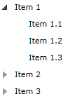

# Bind RadTreeView to Self-Referencing Data

This tutorial will show you how to display a __RadTreeView__ with flat, self-referencing data, loaded from a database, that has properties __ID__ and __ParentID__ (or similar) which define the hierarchy. 

Consider the following very simple data object:

__Example 1: Defining the DataItem class__

<snippet id='radtreeview-how-to-bind-to-self-referencing-data-block_1-cs' />
<snippet id='radtreeview-how-to-bind-to-self-referencing-data-block_2-vb' />

Those data objects are added into a special __DataItemCollection__ class, that inherits __ObservableCollection<T>__ and implements an AssociatedItem property that holds the root of each node.

__Example 2: Defining DataItemCollection__

<snippet id='radtreeview-how-to-bind-to-self-referencing-data-block_3-cs' />
<snippet id='radtreeview-how-to-bind-to-self-referencing-data-block_4-vb' />

Normally when you load your data objects from a service in your application, you will have auto-generated partial classes, that are relatively easy to extend. 

Now we are ready to data-bind our __RadTreeView__:



__Example 3: Defining the resources__

<snippet id='radtreeview-how-to-bind-to-self-referencing-data-block_5-xaml' />




__Example 3: Defining the resources__

<snippet id='radtreeview-how-to-bind-to-self-referencing-data-block_6-xaml' />



__Example 4: Defining the RadTreeView__

<snippet id='radtreeview-how-to-bind-to-self-referencing-data-block_7-xaml' />

There is one non-standard thing: all __ItemsSource__ bindings are made through a __ValueConverter__. This __ValueConverter__ will create the "real" hierarchy for us: 

__Example 5: Defining the HierarchyConverter__

<snippet id='radtreeview-how-to-bind-to-self-referencing-data-block_8-cs' />
<snippet id='radtreeview-how-to-bind-to-self-referencing-data-block_9-vb' />

When a __DataItem__ object is passed as value, we are binding a __TreeViewItem__, so the __Convert()__ method will return all __DataItem__ objects from the __Owner__ collection that have __ParentID__ equal to the __ID__ of the passed __DataItem__. When a __DataItemCollection__ is passed, we are binding the RadTreeView, so the __Convert()__ method will return the root-level __DataItem__ objects, that have __ParentID=0__. Of course, it is up to you to decide whether you want a single, or separate converters for both of the cases. It is done in this way for simplicity, but if you want, you could split the code into two classes.

__Example 6: Populating the RadTreeView__

<snippet id='radtreeview-how-to-bind-to-self-referencing-data-block_10-cs' />
<snippet id='radtreeview-how-to-bind-to-self-referencing-data-block_11-vb' />

#### __Image 1: Self-Referencing RadTreeView__ 

>You can check out this example in the [RadTreeView SDK examples]() or in the [SDK Samples Browser]() that provides a more convenient approach in exploring and executing the examples in the Telerik XAML SDK repository. The SDK Samples Browser application is available for download from [this link](https://demos.telerik.com/xaml-sdkbrowser/).

## See Also
 * [Bind RadTreeView to Hierarchical Data and Use Style Binding]()
 * [Enable the Horizontal and Vertical Scrollbars]()
 * [Disable Drop at Specific Location]()