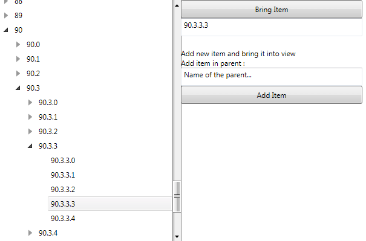

# How to Use BringPathIntoView Method

This tutorial describes how to bring a virtualized item into view using the __RadTreeView.BringPathIntoView()__ method.

It will guids you through the implementation of two common __RadTreeView__ scenarios: 

* Bring a virtualized item, that isn't in the viewport, into view and select it;
* Add a new item in the __RadTreeView.ItemsSource__ collection, bring it into view and select it.

## Set Up the Business Models

Let's start by setting up the business models that will define the hierarchy displayed inside the __RadTreeView__ control. First we'll need a __ViewModel__ describing the items in the tree. Please have in mind that in order to use the __BringPathIntoView()__ method, we need to have the path to each item. This is why we will build a method inside each business item that constructs its full path. However, in order to do so, we'll have to keep a reference to the parent of each item.
	

```C#
	public class BusinessItem 
	{
		public BusinessItem(BusinessItem parent)
		{
			this.Items = new ObservableCollection<BusinessItem>();
			this.Parent = parent;
		}

		public ObservableCollection<BusinessItem> Items { get; set; }
		public BusinessItem Parent { get; private set; }

		public string Name { get; set; }

		public string GetPath()
		{
			string path = this.Name;
			BusinessItem nextParent = this.Parent;

			while (nextParent != null)
			{
				path = nextParent.Name + @"\" + path;
				nextParent = nextParent.Parent;
			}

			return path;
		}
	}
```
```VB.NET
	Public Class BusinessItem
		Public Sub New(ByVal parent As BusinessItem)
			Me.Items = New ObservableCollection(Of BusinessItem)()
			Me.Parent = parent
		End Sub

		Public Property Items() As ObservableCollection(Of BusinessItem)
		Private privateParent As BusinessItem
		Public Property Parent() As BusinessItem
			Get
				Return privateParent
			End Get
			Private Set(ByVal value As BusinessItem)
				privateParent = value
			End Set
		End Property

		Public Property Name() As String

		Public Function GetPath() As String
			Dim path As String = Me.Name
			Dim nextParent As BusinessItem = Me.Parent

			Do While nextParent IsNot Nothing
				path = nextParent.Name & "\" & path
				nextParent = nextParent.Parent
			Loop

			Return path
		End Function
	End Class
```

In order to complete the __BusinessItem__ class implementation, we'll only add an __IsSelected__ property so that we can easily control the selected state of each __RadTreeViewItem__. We'll also have to implement the __INotifyPropertyChanged__ interface in order to notify the view (respectively the __RadTreeView__) for any changes in the value of the __IsSelected__ property.
	
	
```C#
	public class BusinessItem : INotifyPropertyChanged
	{
		...

		private bool selected;
		public bool IsSelected
		{
			get
			{
				return selected;
			}
			set
			{
				if (value != selected)
				{
					selected = value;
					OnPropertyChanged("IsSelected");
				}
			}
		}

		public event PropertyChangedEventHandler PropertyChanged;

		protected virtual void OnPropertyChanged(String propertyName)
		{
			if (PropertyChanged != null)
			{
				PropertyChanged(this, new PropertyChangedEventArgs(propertyName));
			}
		}
	}
```
```VB.NET
	Public Class BusinessItem
		Implements INotifyPropertyChanged
		
		...

		Private selected As Boolean
		Public Property IsSelected() As Boolean
			Get
				Return selected
			End Get
			Set(ByVal value As Boolean)
				If value <> selected Then
					selected = value
					OnPropertyChanged("IsSelected")
				End If
			End Set
		End Property

		Public Event PropertyChanged As PropertyChangedEventHandler Implements INotifyPropertyChanged.PropertyChanged

		Protected Overridable Sub OnPropertyChanged(ByVal propertyName As String)
			RaiseEvent PropertyChanged(Me, New PropertyChangedEventArgs(propertyName))
		End Sub
		
	End Class
```

Next, we need a __ViewModel__ describing the collection of __BusinessItems__. For the purpose of this tutorial, we'll create a __SampleViewModel__ inheriting an __ObservableCollection__ of __BusinessItems__ and we will populate it with items:

	
```C#
	public class SampleViewModel : ObservableCollection<BusinessItem>
	{
		public SampleViewModel()
		{
			for (int i = 0; i < 100; i++)
			{
				BusinessItem bi1 = new BusinessItem(null)
				{
					Name = i.ToString(),
					IsSelected = false
				};

				for (int j = 0; j < 5; j++)
				{
					BusinessItem bi2 = new BusinessItem(bi1)
					{
						Name = bi1.Name + "." + j,
						IsSelected = false
					};

					for (int k = 0; k < 5; k++)
					{
						BusinessItem bi3 = new BusinessItem(bi2)
						{
							Name = bi2.Name + "." + k,
							IsSelected = false
						};
						bi2.Items.Add(bi3);

						for (int l = 0; l < 5; l++)
						{
							BusinessItem bi4 = new BusinessItem(bi3)
							{
								Name = bi3.Name + "." + l,
								IsSelected = false
							};
							bi3.Items.Add(bi4);
						}
					}

					bi1.Items.Add(bi2);
				}

				this.Add(bi1);
			}
		}
	}
```
```VB.NET
	Public Class SampleViewModel
		Inherits ObservableCollection(Of BusinessItem)

		Public Sub New()
			For i As Integer = 0 To 99
				Dim bi1 As New BusinessItem(Nothing) With {.Name = i.ToString(), .IsSelected = False}

				For j As Integer = 0 To 4
					Dim bi2 As New BusinessItem(bi1) With {.Name = bi1.Name & "." & j, .IsSelected = False}

					For k As Integer = 0 To 4
						Dim bi3 As New BusinessItem(bi2) With {.Name = bi2.Name & "." & k, .IsSelected = False}
						bi2.Items.Add(bi3)

						For l As Integer = 0 To 4
							Dim bi4 As New BusinessItem(bi3) With {.Name = bi3.Name & "." & l, .IsSelected = False}
							bi3.Items.Add(bi4)
						Next l
					Next k

					bi1.Items.Add(bi2)
				Next j

				Me.Add(bi1)
			Next i
		End Sub
	End Class
```

Finally, in order to make this example a bit more user-friendly, we will allow our users to bring an item into view, just by entering its header in a TextBox and hitting a *BringIntoView* button. In order to implement this functionality, we'll need a method that finds a __BusinessItem__ based on its __Header__. This is why, we will extend the __SampleViewModel__ definition by implementing a *GetItemByName()* method:
	

```C#
	public class SampleViewModel : ObservableCollection<BusinessItem>
	{
		public BusinessItem GetItemByName(string name)
		{
			BusinessItem item = null;
			string[] parts = name == null ? new string[] { "0" } : name.Split('.');
			foreach (string s in parts)
			{
				try
				{
					int index = Int32.Parse(s);

					if (item == null)
					{
						item = (index >= 0 && index < this.Items.Count) ? this[index] : null;
					}
					else
					{
						item = (index >= 0 && index < item.Items.Count) ? item.Items[index] : null;
					}
				}
				catch
				{
					item = null;
					break;
				}
			}

			return item;
		}   
		
		...
		
		}
	}
```
```VB.NET
	Public Class SampleViewModel
		Inherits ObservableCollection(Of BusinessItem)
		Public Function GetItemByName(ByVal name As String) As BusinessItem
			Dim item As BusinessItem = Nothing
			Dim parts() As String = If(name Is Nothing, New String() { "0" }, name.Split("."c))
			For Each s As String In parts
				Try
					Dim index As Integer = Int32.Parse(s)

					If item Is Nothing Then
						item = If(index >= 0 AndAlso index < Me.Items.Count, Me(index), Nothing)
					Else
						item = If(index >= 0 AndAlso index < item.Items.Count, item.Items(index), Nothing)
					End If
				Catch
					item = Nothing
					Exit For
				End Try
			Next s

			Return item
		End Function

		...
	End Class		  
```

Now that our __ViewModels__ are all in place, we can define our view and the __RadTreeView__ control.

## Set Up the View

We can start by adding a sample __RadTreeView__ definition. As we will be displaying a large collection of items, it's best to virtualize the control:
	
	
```XAML
	<telerik:RadTreeView x:Name="myTreeView" Width="300" IsVirtualizing="True">
		<telerik:RadTreeView.ItemTemplate>
			<HierarchicalDataTemplate ItemsSource="{Binding Items}">
				<TextBlock Text="{Binding Name}" />
			</HierarchicalDataTemplate>
		</telerik:RadTreeView.ItemTemplate>
	</telerik:RadTreeView>
```

>important Please keep in mind that the __BringPathIntoView()__ method will work properly only if you set the __TextSearch.TextPath__ attached property. This is due to the fact that the method internally uses the __TextPath__ value to match the path of each business item to its corresponding container of type __RadTreeViewItem__. Therefore the value of the property has to be the name of the business property that is used to create a path to each node.

As the __BusinessItem__ class defines the __Path__ through the __Name__ property, we need to extend the __RadTreeView__ definition by setting the __TextSearch.TextPath__ property to *Name*. As our scenario requires us to keep track of the selection in the __RadTreeView__ control, we'll also add a __RadTreeViewItem Style__ to bind the __IsSelected__ property to the appropriate data object.

	
```XAML
	<telerik:RadTreeView x:Name="myTreeView" Width="300" IsVirtualizing="True" telerik:TextSearch.TextPath="Name">
		<telerik:RadTreeView.ItemTemplate>
			<HierarchicalDataTemplate ItemsSource="{Binding Items}">
				<TextBlock Text="{Binding Name}" />
			</HierarchicalDataTemplate>
		</telerik:RadTreeView.ItemTemplate>
		<telerik:RadTreeView.ItemContainerStyle>
			<Style TargetType="telerik:RadTreeViewItem">
				<Setter Property="IsSelected" Value="{Binding IsSelected, Mode=TwoWay}" />
			</Style>
		</telerik:RadTreeView.ItemContainerStyle>
	</telerik:RadTreeView>		
```

Next, we'll extend our UI by adding a few __TextBoxes__ and __Buttons__ to allow our users to enter a header of an item and bring it into view. We'll also allow the users to add new items in the __RadTreeView__ by entering the __Header__ of their parent. 
	

```XAML
    <StackPanel Orientation="Horizontal">
        <telerik:RadTreeView x:Name="myTreeView"
                             Width="300"
                             IsVirtualizing="True"
                             telerik:TextSearch.TextPath="Name">
            <telerik:RadTreeView.ItemTemplate>
                <HierarchicalDataTemplate ItemsSource="{Binding Items}">
                    <TextBlock Text="{Binding Name}" />
                </HierarchicalDataTemplate>
            </telerik:RadTreeView.ItemTemplate>
            <telerik:RadTreeView.ItemContainerStyle>
                <Style TargetType="telerik:RadTreeViewItem">
                    <Setter Property="IsSelected" Value="{Binding IsSelected, Mode=TwoWay}" />
                </Style>
            </telerik:RadTreeView.ItemContainerStyle>
        </telerik:RadTreeView>
        <StackPanel>
            <Button Height="30"
                    Click="BringItem"
                    Content="Bring Item" />
            <TextBox x:Name="textBox"
                     Width="300"
                     Height="30" />
            <TextBlock Margin="0,20,0,0" Text="Add new item and bring it into view" />
            <TextBlock Text="Add item in parent : " />
            <TextBox x:Name="parentBox"
                     Width="300"
                     Height="30"
                     Text="Name of the parent..." />
            <Button Height="30"
                    Click="AddItem"
                    Content="Add Item" />
        </StackPanel>
    </StackPanel>  		  
```
	


## Set Up the Code-Behind Logic

Now that we've defined both our viewmodels and our view, all we have left is to implement our code-behind logic for bringing an item into view and for adding a new item in the __RadTreeView.ItemsSource__ collection.

First, we'll set the __ItemsSource__ of the __RadTreeView__ and immediately bring the *90.3.3.3* item into view.
	

```C#
	public partial class Example : UserControl
	{
		private SampleViewModel sampleVM;
		public Example()
		{
			InitializeComponent();

			sampleVM = new SampleViewModel();
			myTreeView.ItemsSource = sampleVM;

			this.textBox.Text = "90.3.3.3";

			BusinessItem item = this.sampleVM.GetItemByName(this.textBox.Text);
			if (item != null)
			{
				item.IsSelected = true;
				string path = item.GetPath();
				myTreeView.BringPathIntoView(path);
			}
		}
	}		  
```
```VB.NET
	Partial Public Class Example
		Inherits UserControl
		Private sampleVM As SampleViewModel
		Public Sub New()
			InitializeComponent()

			sampleVM = New SampleViewModel()
			myTreeView.ItemsSource = sampleVM

			Me.textBox.Text = "90.3.3.3"

			Dim item As BusinessItem = Me.sampleVM.GetItemByName(Me.textBox.Text)
			If item IsNot Nothing Then
				item.IsSelected = True
				Dim path As String = item.GetPath()
				myTreeView.BringPathIntoView(path)
			End If
		End Sub
	End Class
```

The above logic will build the __RadTreeView Items__ collection, and as soon as the __RadTreeView__ is properly loaded, the __BringPathIntoView()__ method will find and bring the item with __Header__ of *90.3.3.3* into view.

Next, we will need to implement the __Click__ event handler of the *Bring Item* button. It has to use the header entered by the user to find the __BusienssItem__ that has to be brought into view and this is why we'll call the __SampleViewModel.GetItemByName()__ method. Then as soon as we find the item, we will set its __IsSelected__ property to __True__ and find its path. Then we can use the __RadTreeView.BringPathIntoView()__ method to bring it into view:
	
	
```C#
    private void BringItem(object sender, RoutedEventArgs e)
    {
        BusinessItem item = this.sampleVM.GetItemByName(this.textBox.Text);
        if (item != null)
        {
            item.IsSelected = true;
            string path = item.GetPath();
            myTreeView.BringPathIntoView(path);
        }
    }
```
```VB.NET
	Private Sub BringItem(ByVal sender As Object, ByVal e As RoutedEventArgs)
		Dim item As BusinessItem = Me.sampleVM.GetItemByName(Me.textBox.Text)
		If item IsNot Nothing Then
			item.IsSelected = True
			Dim path As String = item.GetPath()
			myTreeView.BringPathIntoView(path)
		End If
	End Sub
```

Finally, we have to implement a logic that adds a new item when the *Add Item* button is clicked. As this button should create a new item in the __ItemsSource__ collection of an item defined by the user, we again have to use the __SampleViewModel.GetItemByName()__ method to find the business object that will parent the new item. Then we can add and bring the new item into view:
	

```C#
    private void AddItem(object sender, RoutedEventArgs e)
    {
        BusinessItem parent = this.sampleVM.GetItemByName(this.parentBox.Text);

        if (parent != null)
        {
            BusinessItem newItem = new BusinessItem(parent)
            {
                Name = parent.Name + "." + parent.Items.Count,
                IsSelected = true
            };

            parent.Items.Add(newItem);

            string path = newItem.GetPath();
            this.myTreeView.BringPathIntoView(path);
        }
    }
```
```VB.NET
	Private Sub AddItem(ByVal sender As Object, ByVal e As RoutedEventArgs)
		Dim parent As BusinessItem = Me.sampleVM.GetItemByName(Me.parentBox.Text)

		If parent IsNot Nothing Then
			Dim newItem As New BusinessItem(parent) With {.Name = parent.Name & "." & parent.Items.Count, .IsSelected = True}

			parent.Items.Add(newItem)

			Dim path As String = newItem.GetPath()
			Me.myTreeView.BringPathIntoView(path)
		End If
	End Sub
```

>tip Find a complete solution showing this approach in the [WPF Samples GitHub repository](https://github.com/telerik/xaml-sdk/tree/master/TreeView/BringIntoView)
