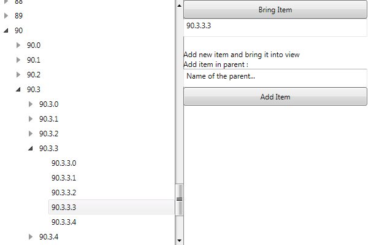

# How to Use BringPathIntoView Method

This tutorial describes how to bring a virtualized item into view using the __RadTreeView.BringPathIntoView()__ method.

It will guids you through the implementation of two common __RadTreeView__ scenarios: 

* Bring a virtualized item, that isn't in the viewport, into view and select it;
* Add a new item in the __RadTreeView.ItemsSource__ collection, bring it into view and select it.

## Set Up the Business Models

Let's start by setting up the business models that will define the hierarchy displayed inside the __RadTreeView__ control. First we'll need a __ViewModel__ describing the items in the tree. Please have in mind that in order to use the __BringPathIntoView()__ method, we need to have the path to each item. This is why we will build a method inside each business item that constructs its full path. However, in order to do so, we'll have to keep a reference to the parent of each item.
	

<snippet id='radtreeview-how-to-bring-path-into-view-block_1-cs' />
<snippet id='radtreeview-how-to-bring-path-into-view-block_2-vb' />

In order to complete the __BusinessItem__ class implementation, we'll only add an __IsSelected__ property so that we can easily control the selected state of each __RadTreeViewItem__. We'll also have to implement the __INotifyPropertyChanged__ interface in order to notify the view (respectively the __RadTreeView__) for any changes in the value of the __IsSelected__ property.
	
	
<snippet id='radtreeview-how-to-bring-path-into-view-block_3-cs' />
<snippet id='radtreeview-how-to-bring-path-into-view-block_4-vb' />

Next, we need a __ViewModel__ describing the collection of __BusinessItems__. For the purpose of this tutorial, we'll create a __SampleViewModel__ inheriting an __ObservableCollection__ of __BusinessItems__ and we will populate it with items:

	
<snippet id='radtreeview-how-to-bring-path-into-view-block_5-cs' />
<snippet id='radtreeview-how-to-bring-path-into-view-block_6-vb' />

Finally, in order to make this example a bit more user-friendly, we will allow our users to bring an item into view, just by entering its header in a TextBox and hitting a *BringIntoView* button. In order to implement this functionality, we'll need a method that finds a __BusinessItem__ based on its __Header__. This is why, we will extend the __SampleViewModel__ definition by implementing a *GetItemByName()* method:
	

<snippet id='radtreeview-how-to-bring-path-into-view-block_7-cs' />
<snippet id='radtreeview-how-to-bring-path-into-view-block_8-vb' />

Now that our __ViewModels__ are all in place, we can define our view and the __RadTreeView__ control.

## Set Up the View

We can start by adding a sample __RadTreeView__ definition. As we will be displaying a large collection of items, it's best to virtualize the control:
	
	
<snippet id='radtreeview-how-to-bring-path-into-view-block_9-xaml' />

>important Please keep in mind that the __BringPathIntoView()__ method will work properly only if you set the __TextSearch.TextPath__ attached property. This is due to the fact that the method internally uses the __TextPath__ value to match the path of each business item to its corresponding container of type __RadTreeViewItem__. Therefore the value of the property has to be the name of the business property that is used to create a path to each node.

As the __BusinessItem__ class defines the __Path__ through the __Name__ property, we need to extend the __RadTreeView__ definition by setting the __TextSearch.TextPath__ property to *Name*. As our scenario requires us to keep track of the selection in the __RadTreeView__ control, we'll also add a __RadTreeViewItem Style__ to bind the __IsSelected__ property to the appropriate data object.

	
<snippet id='radtreeview-how-to-bring-path-into-view-block_10-xaml' />

Next, we'll extend our UI by adding a few __TextBoxes__ and __Buttons__ to allow our users to enter a header of an item and bring it into view. We'll also allow the users to add new items in the __RadTreeView__ by entering the __Header__ of their parent. 
	

<snippet id='radtreeview-how-to-bring-path-into-view-block_11-xaml' />
	

## Set Up the Code-Behind Logic

Now that we've defined both our viewmodels and our view, all we have left is to implement our code-behind logic for bringing an item into view and for adding a new item in the __RadTreeView.ItemsSource__ collection.

First, we'll set the __ItemsSource__ of the __RadTreeView__ and immediately bring the *90.3.3.3* item into view.
	

<snippet id='radtreeview-how-to-bring-path-into-view-block_12-cs' />
<snippet id='radtreeview-how-to-bring-path-into-view-block_13-vb' />

The above logic will build the __RadTreeView Items__ collection, and as soon as the __RadTreeView__ is properly loaded, the __BringPathIntoView()__ method will find and bring the item with __Header__ of *90.3.3.3* into view.

Next, we will need to implement the __Click__ event handler of the *Bring Item* button. It has to use the header entered by the user to find the __BusienssItem__ that has to be brought into view and this is why we'll call the __SampleViewModel.GetItemByName()__ method. Then as soon as we find the item, we will set its __IsSelected__ property to __True__ and find its path. Then we can use the __RadTreeView.BringPathIntoView()__ method to bring it into view:
	
	
<snippet id='radtreeview-how-to-bring-path-into-view-block_14-cs' />
<snippet id='radtreeview-how-to-bring-path-into-view-block_15-vb' />

Finally, we have to implement a logic that adds a new item when the *Add Item* button is clicked. As this button should create a new item in the __ItemsSource__ collection of an item defined by the user, we again have to use the __SampleViewModel.GetItemByName()__ method to find the business object that will parent the new item. Then we can add and bring the new item into view:
	

<snippet id='radtreeview-how-to-bring-path-into-view-block_16-cs' />
<snippet id='radtreeview-how-to-bring-path-into-view-block_17-vb' />

>tip Find a complete solution showing this approach in the [WPF Samples GitHub repository](https://github.com/telerik/xaml-sdk/tree/master/TreeView/BringIntoView)