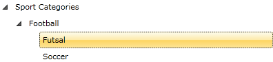
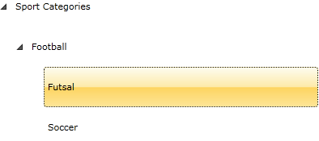

# Change the Default Height of a TreeViewItem

This tutorial will show you how to change the __default height__ of a treeview.

Here is a simple treeview declaration: 

```XAML
	<telerik:RadTreeView>
	    <telerik:RadTreeViewItem Header="Sport Categories">
	        <telerik:RadTreeViewItem Header="Football">
	            <telerik:RadTreeViewItem Header="Futsal"/>
	            <telerik:RadTreeViewItem Header="Soccer"/>
	        </telerik:RadTreeViewItem>
	    </telerik:RadTreeViewItem>
	</telerik:RadTreeView>
```



In order to change the default height of the treeview item, you need to perform the following steps:

1. Add an appropriate style in the resources: 

	```XAML
		<Style TargetType="telerik:RadTreeViewItem" x:Key="TreeViewItemStyle">
			<Setter Property="MinHeight" Value="50"></Setter>
		</Style>
	```

2. Set the __ItemContainerStyle__ of the __RadTreeView__ and the __RadTreeViewItem__. 

	```XAML
		<telerik:RadTreeView ItemContainerStyle="{StaticResource TreeViewItemStyle}">
			<telerik:RadTreeViewItem Header="Sport Categories" ItemContainerStyle="{StaticResource TreeViewItemStyle}">
				<telerik:RadTreeViewItem Header="Football" ItemContainerStyle="{StaticResource TreeViewItemStyle}">
					<telerik:RadTreeViewItem Header="Futsal" ItemContainerStyle="{StaticResource TreeViewItemStyle}"/>
					<telerik:RadTreeViewItem Header="Soccer" ItemContainerStyle="{StaticResource TreeViewItemStyle}"/>
				</telerik:RadTreeViewItem>
			</telerik:RadTreeViewItem>
		</telerik:RadTreeView>
	```

And here is the result: 


## See Also
 * [Get Item by Path]()
 * [Implement Drag and Drop Between TreeView and ListBox]()
 * [Hierarchical Data Templates]()