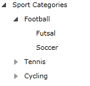
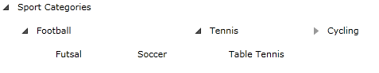

# Create Horizontal TreeView

This tutorial will show you how to create a __RadTreeView__ with horizontal orientation.

Here is an ordinary treeview declaration: 

```XAML
	<telerik:RadTreeView>
	    <telerik:RadTreeViewItem Header="Sport Categories">
	        <telerik:RadTreeViewItem Header="Football">
	            <telerik:RadTreeViewItem Header="Futsal"/>
	            <telerik:RadTreeViewItem Header="Soccer"/>
	        </telerik:RadTreeViewItem>
	        <telerik:RadTreeViewItem Header="Tennis">
	            <telerik:RadTreeViewItem Header="Table Tennis"/>
	        </telerik:RadTreeViewItem>
	        <telerik:RadTreeViewItem Header="Cycling">
	            <telerik:RadTreeViewItem Header="Road Cycling"/>
	            <telerik:RadTreeViewItem Header="Indoor Cycling"/>
	            <telerik:RadTreeViewItem Header="Mountain Bike"/>
	        </telerik:RadTreeViewItem>
	    </telerik:RadTreeViewItem>
	</telerik:RadTreeView>
```



In order to create a horizontal treeview you need to set the __ItemContainerStyle__ property of the __RadTreeView__ and the __RadTreeViewItem__.

Declare the following style in the resources of your application. It will set the __ItemsPanel__ to a __StackPanel__ with __Horizontal__ orientation: 

```XAML
	<Style TargetType="telerik:RadTreeViewItem" x:Key="TreeViewItemStyle">
	    <Setter Property="ItemsPanel">
	        <Setter.Value>
	            <ItemsPanelTemplate>
	                <StackPanel HorizontalAlignment="Center" Margin="4,6" Orientation="Horizontal" />
	            </ItemsPanelTemplate>
	        </Setter.Value>
	    </Setter>
	</Style>
```

Apply this style to the __ItemContainerStyle__ of the treeview and each treeview item. 

```XAML
	<telerik:RadTreeView ItemContainerStyle="{StaticResource TreeViewItemStyle}">
	    <telerik:RadTreeViewItem Header="Sport Categories" ItemContainerStyle="{StaticResource TreeViewItemStyle}">
	        <telerik:RadTreeViewItem Header="Football" ItemContainerStyle="{StaticResource TreeViewItemStyle}">
	            <telerik:RadTreeViewItem Header="Futsal" ItemContainerStyle="{StaticResource TreeViewItemStyle}"/>
	            <telerik:RadTreeViewItem Header="Soccer" ItemContainerStyle="{StaticResource TreeViewItemStyle}"/>
	        </telerik:RadTreeViewItem>
	        <telerik:RadTreeViewItem Header="Tennis" ItemContainerStyle="{StaticResource TreeViewItemStyle}">
	            <telerik:RadTreeViewItem Header="Table Tennis" ItemContainerStyle="{StaticResource TreeViewItemStyle}"/>
	        </telerik:RadTreeViewItem>
	        <telerik:RadTreeViewItem Header="Cycling" ItemContainerStyle="{StaticResource TreeViewItemStyle}">
	            <telerik:RadTreeViewItem Header="Road Cycling" ItemContainerStyle="{StaticResource TreeViewItemStyle}"/>
	            <telerik:RadTreeViewItem Header="Indoor Cycling" ItemContainerStyle="{StaticResource TreeViewItemStyle}"/>
	            <telerik:RadTreeViewItem Header="Mountain Bike" ItemContainerStyle="{StaticResource TreeViewItemStyle}"/>
	        </telerik:RadTreeViewItem>
	    </telerik:RadTreeViewItem>
	</telerik:RadTreeView>
```

Here is the result:


## See Also
 * [Styling the Expander]()
 * [Templated Nodes]()
 * [Implement Drag and Drop Between TreeView and ListBox]()