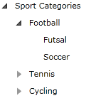
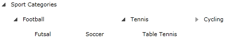

# Create Horizontal TreeView

This tutorial will show you how to create a __RadTreeView__ with horizontal orientation.

Here is an ordinary treeview declaration: 

<snippet id='radtreeview-how-to-create-horizontal-treeview-block_1-xaml' />

In order to create a horizontal treeview you need to set the __ItemContainerStyle__ property of the __RadTreeView__ and the __RadTreeViewItem__.

Declare the following style in the resources of your application. It will set the __ItemsPanel__ to a __StackPanel__ with __Horizontal__ orientation: 

<snippet id='radtreeview-how-to-create-horizontal-treeview-block_2-xaml' />

Apply this style to the __ItemContainerStyle__ of the treeview and each treeview item. 

<snippet id='radtreeview-how-to-create-horizontal-treeview-block_3-xaml' />

Here is the result:

## See Also
 * [Styling the Expander]()
 * [Templated Nodes]()
 * [Implement Drag and Drop Between TreeView and ListBox]()