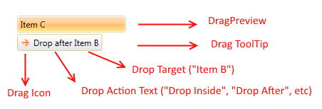
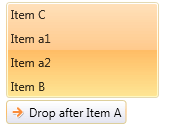
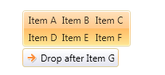

# Customize the TreeViewDragVisual

When you use the __RadTreeView's__ [DragDrop]() feature, the control internally creates and uses a __TreeViewDragVisual__ object. The drag visual has the following visual structure:  



When you drag an item or multiple items, the RadTreeView will internally create a vertical StackPanel containing snapshots of the dragged RadTreeViewItems' Headers. This StackPanel is set as Content of the TreeViewDragVisual object.  



The RadTreeView class allows you to change this default behavior by overriding its __CreateDragVisualContent()__ method. This method receives a list with the dragged items as an argument.

The following code snippet demonstrates how to override the method and replace the default __Content__ of the __DragPreview__ with a single TextBlock element:


```C#
	public class CustomTreeView : RadTreeView
	{
		protected override object CreateDragVisualContent(IList<object> draggedItems)
		{
			string text = string.Format("Dragging {0} items", draggedItems.Count);
			return new TextBlock() { Text = text, Margin = new Thickness(5) };  
		}  
	}
```

Here is a sample visual that demonstrates the end result.  
	


The DragPreview of the drag visual is presented by a ContentControl which gets the result returned by the CreateDragVisualContent() method as its Content. This ContentControl uses the ContentTemplate property of the TreeViewDragVisual which means that you can use it in combination with the method to customize the drag visual element. 

Here is a possible scenario in which we prepare a list of strings and return it as a Content of the drag visual:


```C#
	public class CustomTreeView : RadTreeView
    {
        protected override object CreateDragVisualContent(IList<object> draggedItems)
        {
            List<string> headersList = new List<string>();
            foreach (var item in draggedItems)
            {
                RadTreeViewItem treeItem = item as RadTreeViewItem;
                if (item != null)
                {
                    headersList.Add(treeItem.Header.ToString());
                }
            }
            return headersList;
        }       
    }
```

> The code assumes the __RadTreeView__ is defined in __XAML__ or in code behind but it is not data bound. However, similar approach can be used in data binding scenarios. In such case the "draggedItems" parameter will hold list of view models.
	
>tip The type of the objects in the "draggedItems" collection depends on the scenario in which the treeview control is used. If the RadTreeView's Items property is populated directly with RadTreeViewItems the "draggedItems" collection will contain elements of type RadTreeView. If the control is populated with business objects (through its ItemsSource property), the collection will contain elements of business object's type.

You can set the ContentTemplate of the __TreeViewDragVisual__ with Style like so:


```XAML
	<Application.Resources>
        <Style TargetType="telerik:TreeViewDragVisual">
            <Setter Property="ContentTemplate">
                <Setter.Value>
                    <DataTemplate>
                        <telerik:RadListBox ItemsSource="{Binding}" Background="Transparent" BorderThickness="0">
                            <telerik:RadListBox.ItemsPanel>
                                <ItemsPanelTemplate >
                                    <telerik:RadUniformGrid Columns="3" />
                                </ItemsPanelTemplate>
                            </telerik:RadListBox.ItemsPanel>
                        </telerik:RadListBox>
                    </DataTemplate>
                </Setter.Value>
            </Setter>
        </Style>
    </Application.Resources>
```

>important Since the __TreeViewDragVisual__ element resides in a __Popup__, it is very important to define this style in the application's resources (the  __App.xaml__ file) in order to have the style successfully applied.

>If you are using our implicit styles theming mechanism you will need to base the TreeViewDragVisual custom style (using the BasedOn property) on the default one called "TreeViewDragVisualStyle". Otherwise, the control won't be displayed. If you do not use this mechanism the BasedOn attribute is not required.

Below you can find a possible visual result of a drag drop operation in such custom RadTreeView:  
	


## See Also
* [Overview]()
* [Getting Started]()
* [SDK Examples]()
* [Data Binding Overview]()
* [Declaratively Populating the Tree]()
* [ImplicitStyles]()
