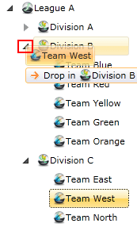

# Auto Expand on Drag Over

__RadTreeView__ offers you the ability to automatically expand a treeview node when dragging items over the node. In order to do that you need to perform the following action:

* When dragging items over your treeview, move the mouse cursor over the treeview expander. The result will be an automatically expanded node. 


The __RadTreeView__ exposes a property __DropExpandDelay__, which sets the delay for the expand behavior. The property is of type __TimeSpan__. Here is a sample code showing you how to set it:		


```C#
	radTreeView.DropExpandDelay = TimeSpan.FromSeconds(5);
```
```VB.NET
	radTreeView.DropExpandDelay = TimeSpan.FromSeconds(5)
```

## Disable Auto Expand on DragOver

The __RadTreeView__ doesn't actually allow you to disable the auto-expand feature, however you can set the value of the __DropExpandDelay__ property to represent a long period of time. This way your users won't trigger the auto-expand at all while dragging over an item. For instance you can set the __DropExpandDelay__ to an hour:		

	
```XAML
	<telerik:RadTreeView IsDragDropEnabled="True" DropExpandDelay="1:0:0"/>
```

You can also set the value from code-behind:
	

```C#
	radTreeView.DropExpandDelay = TimeSpan.FromMinutes(60);		
```
```VB.NET
	radTreeView.DropExpandDelay = TimeSpan.FromMinutes(60)
```

## See Also
 * [Drag and Drop]()
 * [Implement Drag and Drop Between TreeView and ListBox]()
 * [Enable Only Drop Inside]()
 * [Disable Drop at Specific Location]()
 * [Implement Copy Drag]()