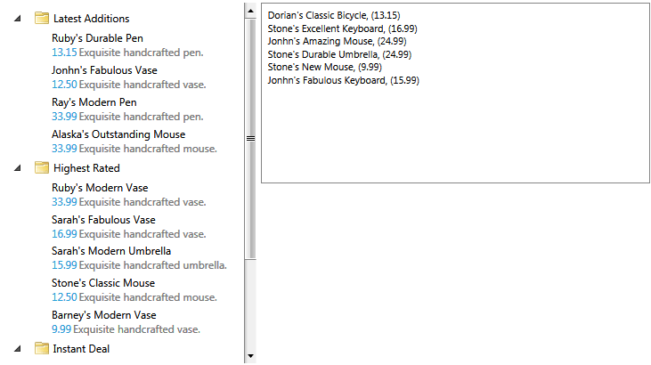
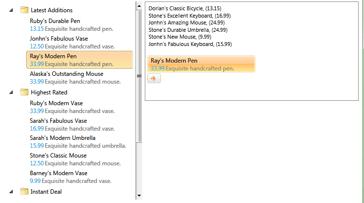

# Implement Drag and Drop Between TreeView and ListBox

The goal of this tutorial is to show you how to implement drag and drop between __RadTreeView__ and __ListBox__.	  

The final result should look like this 

## Implement Drag and Drop Between TreeView and ListBox 

For the purpose of this example, you will need to create an empty application project and open it in Visual Studio.

The first step is to add references to the following assemblies:

* __Telerik.Windows.Controls.Navigation__
* __Telerik.Windows.Controls__
* __Telerik.Windows.Data__

Then you can define the controls in your view. As the purpose of this tutorial is to demonstrate how to implement drag and drop operations, we won't focus on the definitions of the controls in xaml. However, please note to set the __RadTreeView IsDragDropEnabled__ property to __true__.
		



```XAML
    <Grid x:Name="LayoutRoot"
              Margin="8"
              Background="White">
        <Grid.Resources>
            <DataTemplate x:Key="WishlistProduct">
                <StackPanel Orientation="Horizontal">
                    <TextBlock Foreground="#FF000000" Text="{Binding Name}" />
                    <TextBlock Foreground="#FF000000" Text=", (" />
                    <TextBlock Foreground="#FF000000" Text="{Binding UnitPrice}" />
                    <TextBlock Foreground="#FF000000" Text=")" />
                </StackPanel>
            </DataTemplate>
            <DataTemplate x:Key="ProductTemplate">
                <telerik:RadDockPanel MaxWidth="200" Margin="2">
                    <TextBlock Foreground="{telerik:Windows8Resource ResourceKey=MarkerBrush}"
                               Text="{Binding Name}"
                               telerik:RadDockPanel.Dock="Top" />
                    <TextBlock Foreground="{telerik:Windows8Resource ResourceKey=AccentBrush}"
                               Text="{Binding UnitPrice}"
                               telerik:RadDockPanel.Dock="Left" />
                    <TextBlock Margin="2 0 0 0"
                               Foreground="{telerik:Windows8Resource ResourceKey=StrongBrush}"
                               Text="{Binding Description}"
                               TextWrapping="Wrap"
                               telerik:RadDockPanel.Dock="Left" />
                </telerik:RadDockPanel>
            </DataTemplate>
            <telerik:HierarchicalDataTemplate x:Key="CategoryTemplate"
                                      ItemTemplate="{StaticResource ProductTemplate}"
                                      ItemsSource="{Binding Items}">
                <StackPanel Orientation="Horizontal">
                    <Image Width="16"
                           Height="16"
                           Margin="3"
                           VerticalAlignment="Center"
                           Source="Images/folder_icon.png" />
                    <TextBlock Margin="2"
                               VerticalAlignment="Center"
                               Foreground="{telerik:Windows8Resource ResourceKey=MarkerBrush}"
                               Text="{Binding Name}" />
                </StackPanel>
            </telerik:HierarchicalDataTemplate>
            <Style TargetType="telerik:RadTreeViewItem">
                <Setter Property="IsExpanded" Value="True" />
            </Style>
        </Grid.Resources>
        <Grid.RowDefinitions>
            <RowDefinition />
            <RowDefinition />
        </Grid.RowDefinitions>
        <Grid.ColumnDefinitions>
            <ColumnDefinition Width="2*" />
            <ColumnDefinition Width="3*" />
        </Grid.ColumnDefinitions>
        <!--  All Products  -->
        <telerik:RadTreeView x:Name="allProductsView"
                             Grid.Row="0"
                             Grid.RowSpan="2"
                             Grid.Column="0"
                             Margin="0,0,5,0"
                             IsDragDropEnabled="True"
                             ItemTemplate="{StaticResource CategoryTemplate}"
                             Padding="5" />
        <!--  Whishlist  -->
        <ListBox x:Name="wishlistView"
                 Grid.Row="0"
                 Grid.Column="1"
                 FontSize="11"
                 ItemTemplate="{StaticResource WishlistProduct}"
                 Padding="5"
                 SelectionMode="Extended">
            <ListBox.Resources>
                <DataTemplate x:Key="DraggedItemTemplate">
                    <StackPanel>
                        <StackPanel Orientation="Horizontal">
                            <TextBlock Text="Dragging:" />
                            <TextBlock FontWeight="Bold" Text="{Binding CurrentDraggedItem.Name}" />
                        </StackPanel>
                        <StackPanel Orientation="Horizontal">
                            <TextBlock MinWidth="45"
                                       FontWeight="Bold"
                                       Text="{Binding CurrentDropPosition}" />
                            <TextBlock Foreground="Gray" Text=", (" />
                            <TextBlock Text="{Binding CurrentDraggedOverItem.Name}" />
                            <TextBlock Foreground="Gray" Text=")" />
                        </StackPanel>
                    </StackPanel>
                </DataTemplate>
            </ListBox.Resources>
        </ListBox>
    </Grid>
```





```XAML
    <Grid x:Name="LayoutRoot"
          Margin="8"
          Background="White">
        <Grid.Resources>
            <DataTemplate x:Key="WishlistProduct">
                <StackPanel Orientation="Horizontal">
                    <TextBlock Foreground="#FF000000" Text="{Binding Name}" />
                    <TextBlock Foreground="#FF000000" Text=", (" />
                    <TextBlock Foreground="#FF000000" Text="{Binding UnitPrice}" />
                    <TextBlock Foreground="#FF000000" Text=")" />
                </StackPanel>
            </DataTemplate>
            <DataTemplate x:Key="ProductTemplate">
                <telerik:RadDockPanel MaxWidth="200" Margin="2">
                    <TextBlock Foreground="{telerik:Windows8Resource ResourceKey=MarkerBrush}"
                               Text="{Binding Name}"
                               telerik:RadDockPanel.Dock="Top" />
                    <TextBlock Foreground="{telerik:Windows8Resource ResourceKey=AccentBrush}"
                               Text="{Binding UnitPrice}"
                               telerik:RadDockPanel.Dock="Left" />
                    <TextBlock Margin="2 0 0 0"
                               Foreground="{telerik:Windows8Resource ResourceKey=StrongBrush}"
                               Text="{Binding Description}"
                               TextWrapping="Wrap"
                               telerik:RadDockPanel.Dock="Left" />
                </telerik:RadDockPanel>
            </DataTemplate>
            <HierarchicalDataTemplate x:Key="CategoryTemplate"
                                      ItemTemplate="{StaticResource ProductTemplate}"
                                      ItemsSource="{Binding Items}">
                <StackPanel Orientation="Horizontal">
                    <Image Width="16"
                           Height="16"
                           Margin="3"
                           VerticalAlignment="Center"
                           Source="Images/folder_icon.png" />
                    <TextBlock Margin="2"
                               VerticalAlignment="Center"
                               Foreground="{telerik:Windows8Resource ResourceKey=MarkerBrush}"
                               Text="{Binding Name}" />
                </StackPanel>
            </HierarchicalDataTemplate>
            <Style TargetType="telerik:RadTreeViewItem">
                <Setter Property="IsExpanded" Value="True" />
            </Style>
        </Grid.Resources>
        <Grid.RowDefinitions>
            <RowDefinition />
            <RowDefinition />
        </Grid.RowDefinitions>
        <Grid.ColumnDefinitions>
            <ColumnDefinition Width="2*" />
            <ColumnDefinition Width="3*" />
        </Grid.ColumnDefinitions>
        <!--  All Products  -->
        <telerik:RadTreeView x:Name="allProductsView"
                             Grid.Row="0"
                             Grid.RowSpan="2"
                             Grid.Column="0"
                             Margin="0,0,5,0"
                             IsDragDropEnabled="True"
                             ItemTemplate="{StaticResource CategoryTemplate}"
                             Padding="5" />
        <!--  Whishlist  -->
        <ListBox x:Name="wishlistView"
                 Grid.Row="0"
                 Grid.Column="1"
                 FontSize="11"
                 ItemTemplate="{StaticResource WishlistProduct}"
                 Padding="5"
                 SelectionMode="Extended">
            <ListBox.Resources>
                <DataTemplate x:Key="DraggedItemTemplate">
                    <StackPanel>
                        <StackPanel Orientation="Horizontal">
                            <TextBlock Text="Dragging:" />
                            <TextBlock FontWeight="Bold" Text="{Binding CurrentDraggedItem.Name}" />
                        </StackPanel>
                        <StackPanel Orientation="Horizontal">
                            <TextBlock MinWidth="45"
                                       FontWeight="Bold"
                                       Text="{Binding CurrentDropPosition}" />
                            <TextBlock Foreground="Gray" Text=", (" />
                            <TextBlock Text="{Binding CurrentDraggedOverItem.Name}" />
                            <TextBlock Foreground="Gray" Text=")" />
                        </StackPanel>
                    </StackPanel>
                </DataTemplate>
            </ListBox.Resources>
        </ListBox>
    </Grid>
```



The next step is to use the __DragDropManager__ to enable the __drop__ operation on the __ListBox__ control.		

Find the __ListBox__ declaration and set its __AllowDrop__ property to __True__.

Now that the __ListBox__ allows drop operations, we need to make sure that the __ListItems__ are draggable. We can do so by applying an implicit style that sets the __DragDropManager.AllowCapturedDrag__ attached property to __True__ on every __ListItem__:		


```XAML
	<!--  Note: With this style we make the ListBoxItems draggable:  -->
	<Style TargetType="ListBoxItem">
		<Setter Property="telerik:DragDropManager.AllowCapturedDrag" Value="True" />
	</Style>
```

>tip __telerik__ is alias for the following namespace declaration: `xmlns:telerik="http://schemas.telerik.com/2008/xaml/presentation"`

Next we'll need to populate the controls with data but as the __ViewModels__ definitions are outside the scope of this tutorial, we'll omit them for clarity. We'll only assume that the __RadTreeView__ is populated with categories and each category displays a list of products. While, the __ListBox__ displays a collection of products. This means that we'll have to implement a logic that allows you to drag a product from the __ListBox__ and drop it inside a category in the tree.

>Please have in mind that if the __ItemsSource__ of the __RadTreeView__ (__RadTreeViewItem__) is not an __IList__, then the __drop__ operation won't be allowed. Moreover, we recommend using a collection that implements the __INotifyCollectionChanged__ interface, for instance an __ObservableCollection__, as only then the changes implemented in the __RadTreeView__ underlying data collection will be reflected in the UI of the control.

Now we're getting to the actual DragDrop implementation. And we'll start with configuring the __ListBox__ as a participant in drag and drop operations.

>Please note that this article is based on the [TreeToGrid online demo](https://demos.telerik.com/silverlight/#DragAndDrop/TreeToGrid)[TreeToGrid demo](https://demos.telerik.com/wpf/#DragAndDrop/TreeToGrid), which you can find by navigating to the DragAndDrop examples ->Tree To Grid Drag.		  

In this tutorial we'll use a custom behavior to define the __ListBox__ DragDrop behavior. Essentially the behavior will attach handlers for the following events:		

* DragInitialize
* GiveFeedback
* Drop
* DragDropCompleted
* DragOver

>tip You can find more information about the __DragDropManager__ events in [this tutorial](http://www.telerik.com/help/silverlight/dragdropmanager-events.html)[this tutorial](http://www.telerik.com/help/wpf/dragdropmanager-events.html).		  

So we basically need a class that provides:
* a __ListBox__ object that will be associated with the __ListBox__ instance that enables the behavior			

* __IsEnabled__ property to control the enabled state of the behavior			

* a __Dictionary__ that holds all __ListBox__ instances enabling the behavior			

* methods that attach and detach the __DragDropManager__ event handlers.


```C#
	using Telerik.Windows.DragDrop;
	using Telerik.Windows.Controls;
	using Telerik.Windows.DragDrop.Behaviors;
	using Telerik.Windows.Controls.TreeView;

	public class ListBoxDragDropBehavior
	{
		private System.Windows.Controls.ListBox _associatedObject;
		/// <summary>
		/// object that will be associated with the ListBox instance that enables the behavior
		/// </summary>
		public System.Windows.Controls.ListBox AssociatedObject
		{
			get
			{
				return _associatedObject;
			}
			set
			{
				_associatedObject = value;
			}
		}

		private static Dictionary<System.Windows.Controls.ListBox, ListBoxDragDropBehavior> instances;

		static ListBoxDragDropBehavior()
		{
			instances = new Dictionary<System.Windows.Controls.ListBox, ListBoxDragDropBehavior>();
		}

		public static bool GetIsEnabled(DependencyObject obj)
		{
			return (bool)obj.GetValue(IsEnabledProperty);
		}

		public static void SetIsEnabled(DependencyObject obj, bool value)
		{
			ListBoxDragDropBehavior behavior = GetAttachedBehavior(obj as System.Windows.Controls.ListBox);

			behavior.AssociatedObject = obj as System.Windows.Controls.ListBox;

			if (value)
			{
				behavior.Initialize();
			}
			else
			{
				behavior.CleanUp();
			}
			obj.SetValue(IsEnabledProperty, value);
		}

		// Using a DependencyProperty as the backing store for IsEnabled state of the behavior
		public static readonly DependencyProperty IsEnabledProperty =
			DependencyProperty.RegisterAttached("IsEnabled", typeof(bool), typeof(ListBoxDragDropBehavior),
				new PropertyMetadata(new PropertyChangedCallback(OnIsEnabledPropertyChanged)));

		public static void OnIsEnabledPropertyChanged(DependencyObject dependencyObject, DependencyPropertyChangedEventArgs e)
		{
			SetIsEnabled(dependencyObject, (bool)e.NewValue);
		}

		private static ListBoxDragDropBehavior GetAttachedBehavior(System.Windows.Controls.ListBox listBox)
		{
			if (!instances.ContainsKey(listBox))
			{
				instances[listBox] = new ListBoxDragDropBehavior();
				instances[listBox].AssociatedObject = listBox;
			}

			return instances[listBox];
		}

		//initializes the behavior by detaching from any existing DragDropManager event handlers and attaching new DragDropManager event handlers
		protected virtual void Initialize()
		{
			this.UnsubscribeFromDragDropEvents();
			this.SubscribeToDragDropEvents();
		}

		//cleans up after disabling the behavior by detaching from the DragDropManager event handlers
		protected virtual void CleanUp()
		{
			this.UnsubscribeFromDragDropEvents();
		}

		//attaching new DragDropManager event handlers
		private void SubscribeToDragDropEvents()
		{
		   
		}

		//unsubscribing from the DragDropManager event handlers
		private void UnsubscribeFromDragDropEvents()
		{
			
		}
	}
```
```VB.NET
	Imports Telerik.Windows.DragDrop
	Imports Telerik.Windows.Controls
	Imports Telerik.Windows.DragDrop.Behaviors
	Imports Telerik.Windows.Controls.TreeView

	Public Class ListBoxDragDropBehavior
		Private _associatedObject As System.Windows.Controls.ListBox
		''' <summary> '''
		''' object that will be associated with the ListBox instance that enables the behavior '''
		''' </summary> '''
		Public Property AssociatedObject() As System.Windows.Controls.ListBox
			Get
				Return _associatedObject
			End Get
			Set(value As System.Windows.Controls.ListBox)
				_associatedObject = value
			End Set
		End Property

		Private Shared instances As Dictionary(Of System.Windows.Controls.ListBox, ListBoxDragDropBehavior)

		Shared Sub New()
			instances = New Dictionary(Of System.Windows.Controls.ListBox, ListBoxDragDropBehavior)()
		End Sub

		Public Shared Function GetIsEnabled(obj As DependencyObject) As Boolean
			Return CBool(obj.GetValue(IsEnabledProperty))
		End Function

		Public Shared Sub SetIsEnabled(obj As DependencyObject, value As Boolean)
			Dim behavior As ListBoxDragDropBehavior = GetAttachedBehavior(TryCast(obj, System.Windows.Controls.ListBox))

			behavior.AssociatedObject = TryCast(obj, System.Windows.Controls.ListBox)

			If value Then
				behavior.Initialize()
			Else
				behavior.CleanUp()
			End If
			obj.SetValue(IsEnabledProperty, value)
		End Sub

		' Using a DependencyProperty as the backing store for IsEnabled state of the behavior '
		Public Shared ReadOnly IsEnabledProperty As DependencyProperty = DependencyProperty.RegisterAttached("IsEnabled", GetType(Boolean), GetType(ListBoxDragDropBehavior), New PropertyMetadata(New PropertyChangedCallback(AddressOf OnIsEnabledPropertyChanged)))

		Public Shared Sub OnIsEnabledPropertyChanged(dependencyObject As DependencyObject, e As DependencyPropertyChangedEventArgs)
			SetIsEnabled(dependencyObject, CBool(e.NewValue))
		End Sub

		Private Shared Function GetAttachedBehavior(listBox As System.Windows.Controls.ListBox) As ListBoxDragDropBehavior
			If Not instances.ContainsKey(listBox) Then
				instances(listBox) = New ListBoxDragDropBehavior()
				instances(listBox).AssociatedObject = listBox
			End If

			Return instances(listBox)
		End Function

		'initializes the behavior by detaching from any existing DragDropManager event handlers and attaching new DragDropManager event handlers'
		Protected Overridable Sub Initialize()
			Me.UnsubscribeFromDragDropEvents()
			Me.SubscribeToDragDropEvents()
		End Sub

		'cleans up after disabling the behavior by detaching from the DragDropManager event handlers'
		Protected Overridable Sub CleanUp()
			Me.UnsubscribeFromDragDropEvents()
		End Sub

		'attaching new DragDropManager event handlers'
		Private Sub SubscribeToDragDropEvents()

		End Sub

		'unsubscribing from the DragDropManager event handlers'
		Private Sub UnsubscribeFromDragDropEvents()

		End Sub
	End Class
```

Now let's attach handlers for the __DragDropManager__ events listed above. We'll do that in the __SubscribeToDragDropEvents()__ method and we'll detach from these handlers in the implementation of the __UnsubscribeFromDragDropEvents()__ method.


```C#
	//attaching new DragDropManager event handlers
	private void SubscribeToDragDropEvents()
	{
	    DragDropManager.AddDragInitializeHandler(this.AssociatedObject, OnDragInitialize);
	    DragDropManager.AddGiveFeedbackHandler(this.AssociatedObject, OnGiveFeedback);
	    DragDropManager.AddDropHandler(this.AssociatedObject, OnDrop);
	    DragDropManager.AddDragDropCompletedHandler(this.AssociatedObject, OnDragDropCompleted);
	    DragDropManager.AddDragOverHandler(this.AssociatedObject, OnDragOver);
	}
	
	//unsubscribing from the DragDropManager event handlers
	private void UnsubscribeFromDragDropEvents()
	{
	    DragDropManager.RemoveDragInitializeHandler(this.AssociatedObject, OnDragInitialize);
	    DragDropManager.RemoveGiveFeedbackHandler(this.AssociatedObject, OnGiveFeedback);
	    DragDropManager.RemoveDropHandler(this.AssociatedObject, OnDrop);
	    DragDropManager.RemoveDragDropCompletedHandler(this.AssociatedObject, OnDragDropCompleted);
	    DragDropManager.RemoveDragOverHandler(this.AssociatedObject, OnDragOver);
	
	}
	private void OnDragInitialize(object sender, DragInitializeEventArgs e)
	{
	}
	
	private void OnGiveFeedback(object sender, Telerik.Windows.DragDrop.GiveFeedbackEventArgs e)
	{
	}
	
	private void OnDragDropCompleted(object sender, DragDropCompletedEventArgs e)
	{
	}
	
	private void OnDrop(object sender, Telerik.Windows.DragDrop.DragEventArgs e)
	{
	}
	
	private void OnDragOver(object sender, Telerik.Windows.DragDrop.DragEventArgs e)
	{
	}
```
```VB.NET
	'attaching new DragDropManager event handlers'
	Private Sub SubscribeToDragDropEvents()
		DragDropManager.AddDragInitializeHandler(Me.AssociatedObject, AddressOf OnDragInitialize)
		DragDropManager.AddGiveFeedbackHandler(Me.AssociatedObject, AddressOf OnGiveFeedback)
		DragDropManager.AddDropHandler(Me.AssociatedObject, AddressOf OnDrop)
		DragDropManager.AddDragDropCompletedHandler(Me.AssociatedObject, AddressOf OnDragDropCompleted)
		DragDropManager.AddDragOverHandler(Me.AssociatedObject, AddressOf OnDragOver)
	End Sub

	'unsubscribing from the DragDropManager event handlers'
	Private Sub UnsubscribeFromDragDropEvents()
		DragDropManager.RemoveDragInitializeHandler(Me.AssociatedObject, AddressOf OnDragInitialize)
		DragDropManager.RemoveGiveFeedbackHandler(Me.AssociatedObject, AddressOf OnGiveFeedback)
		DragDropManager.RemoveDropHandler(Me.AssociatedObject, AddressOf OnDrop)
		DragDropManager.RemoveDragDropCompletedHandler(Me.AssociatedObject, AddressOf OnDragDropCompleted)
		DragDropManager.RemoveDragOverHandler(Me.AssociatedObject, AddressOf OnDragOver)

	End Sub
	Private Sub OnDragInitialize(sender As Object, e As DragInitializeEventArgs)
	End Sub

	Private Sub OnGiveFeedback(sender As Object, e As Telerik.Windows.DragDrop.GiveFeedbackEventArgs)
	End Sub

	Private Sub OnDragDropCompleted(sender As Object, e As DragDropCompletedEventArgs)
	End Sub

	Private Sub OnDrop(sender As Object, e As Telerik.Windows.DragDrop.DragEventArgs)
	End Sub

	Private Sub OnDragOver(sender As Object, e As Telerik.Windows.DragDrop.DragEventArgs)
	End Sub
```

Once we do so, we can start implementing our drag/drop logic. And we'll always have to keep in mind that we need to drag items from the __RadTreeView__ and drop them in the __ListBox__ and vice versa. This means that when we initialize a drag, we need to access the data displayed in the dragged __ListBoxItem__ and add the data to the __DragInitializeEventArgs Data__ object. This will allow us to pass the dragged information during the drag/drop operation. Also, in order to provide the user with elaborate visual information during the drag operation, we can create a helper class that describes the currently dragged item, the item that the drag is passing over, the drop position and the drop index calculated based on the drop position. For instance, we can use the following class definition:


```C#
	using Telerik.Windows.Controls;
	
	public class DropIndicationDetails : ViewModelBase
	{
	    private object currentDraggedItem;
	    private DropPosition currentDropPosition;
	    private object currentDraggedOverItem;
	
	    public object CurrentDraggedOverItem
	    {
	        get
	        {
	            return currentDraggedOverItem;
	        }
	        set
	        {
	            if (this.currentDraggedOverItem != value)
	            {
	                currentDraggedOverItem = value;
	                OnPropertyChanged("CurrentDraggedOverItem");
	            }
	        }
	    }
	
	    public int DropIndex { get; set; }
	
	    public DropPosition CurrentDropPosition
	    {
	        get
	        {
	            return this.currentDropPosition;
	        }
	        set
	        {
	            if (this.currentDropPosition != value)
	            {
	                this.currentDropPosition = value;
	                OnPropertyChanged("CurrentDropPosition");
	            }
	        }
	    }
	
	    public object CurrentDraggedItem
	    {
	        get
	        {
	            return this.currentDraggedItem;
	        }
	        set
	        {
	            if (this.currentDraggedItem != value)
	            {
	                this.currentDraggedItem = value;
	                OnPropertyChanged("CurrentDraggedItem");
	            }
	        }
	    }
	}
```
```VB.NET
	Imports Telerik.Windows.Controls

	Public Class DropIndicationDetails
		Inherits ViewModelBase
		Private m_currentDraggedItem As Object
		Private m_currentDropPosition As DropPosition
		Private m_currentDraggedOverItem As Object

		Public Property CurrentDraggedOverItem() As Object
			Get
				Return m_currentDraggedOverItem
			End Get
			Set(value As Object)
				If Me.m_currentDraggedOverItem IsNot value Then
					m_currentDraggedOverItem = value
					OnPropertyChanged("CurrentDraggedOverItem")
				End If
			End Set
		End Property

		Public Property DropIndex() As Integer
			Get
				Return m_DropIndex
			End Get
			Set(value As Integer)
				m_DropIndex = Value
			End Set
		End Property
		Private m_DropIndex As Integer

		Public Property CurrentDropPosition() As DropPosition
			Get
				Return Me.m_currentDropPosition
			End Get
			Set(value As DropPosition)
				If Me.m_currentDropPosition <> value Then
					Me.m_currentDropPosition = value
					OnPropertyChanged("CurrentDropPosition")
				End If
			End Set
		End Property

		Public Property CurrentDraggedItem() As Object
			Get
				Return Me.m_currentDraggedItem
			End Get
			Set(value As Object)
				If Me.m_currentDraggedItem IsNot value Then
					Me.m_currentDraggedItem = value
					OnPropertyChanged("CurrentDraggedItem")
				End If
			End Set
		End Property
	End Class
```

We can use this definition to also pass and keep the drag operation details in the __Data__ object provided by the __DragDropManager__. This means that we can implement the following drag initialization:


```C#
	private void OnDragInitialize(object sender, DragInitializeEventArgs e)
	{
	    DropIndicationDetails details = new DropIndicationDetails();
	    var listBoxItem = e.OriginalSource as System.Windows.Controls.ListBoxItem ?? (e.OriginalSource as FrameworkElement).ParentOfType<System.Windows.Controls.ListBoxItem>();
	
	    var item = listBoxItem != null ? listBoxItem.DataContext : (sender as System.Windows.Controls.ListBox).SelectedItem;
	    details.CurrentDraggedItem = item;
	
	    IDragPayload dragPayload = DragDropPayloadManager.GeneratePayload(null);
	
	    dragPayload.SetData("DraggedData", item);
	    dragPayload.SetData("DropDetails", details);
	
	    e.Data = dragPayload;
	
	    e.DragVisual = new DragVisual()
	    {
	        Content = details,
	        ContentTemplate = this.AssociatedObject.Resources["DraggedItemTemplate"] as DataTemplate
	    };
	    e.DragVisualOffset = e.RelativeStartPoint;
	    e.AllowedEffects = DragDropEffects.All;
	    e.Handled = true;
	}
```
```VB.NET
	Private Sub OnDragInitialize(sender As Object, e As DragInitializeEventArgs)
		Dim details As New DropIndicationDetails()
		Dim listBoxItem = If(TryCast(e.OriginalSource, System.Windows.Controls.ListBoxItem), TryCast(e.OriginalSource, FrameworkElement).ParentOfType(Of System.Windows.Controls.ListBoxItem)())

		Dim item = If(listBoxItem IsNot Nothing, listBoxItem.DataContext, TryCast(sender, System.Windows.Controls.ListBox).SelectedItem)
		details.CurrentDraggedItem = item

		Dim dragPayload As IDragPayload = DragDropPayloadManager.GeneratePayload(Nothing)

		dragPayload.SetData("DraggedData", item)
		dragPayload.SetData("DropDetails", details)

		e.Data = dragPayload

		e.DragVisual = New DragVisual() With {
			.Content = details,
			.ContentTemplate = TryCast(Me.AssociatedObject.Resources("DraggedItemTemplate"), DataTemplate)
		}
		e.DragVisualOffset = e.RelativeStartPoint
		e.AllowedEffects = DragDropEffects.All
	End Sub
```

Then we can implement the __GiveFeedback__ event handler, which is quite straight-forward. As this event enables the drop source to give feedback information to the user, we'll use it to change the appearance of the mouse pointer to indicate the effects allowed by the drop target.		


```C#
	private void OnGiveFeedback(object sender, Telerik.Windows.DragDrop.GiveFeedbackEventArgs e)
	{
	    e.SetCursor(Cursors.Arrow);
	    e.Handled = true;
	}
```
```VB.NET
	Private Sub OnGiveFeedback(sender As Object, e As Telerik.Windows.DragDrop.GiveFeedbackEventArgs)
		e.SetCursor(Cursors.Arrow)
		e.Handled = True
	End Sub
```

Next, we have to handle the DragOver event and implement a logic that decides if the current drag operation is supported over the current drop destination. In this example, we won't allow a drag operation within the __ListBox__, which means that we have to make sure that the drag operation is allowed only if it originates from the __RadTreeView__ control.

>tip __RadTreeView__ drag operation creates an object of type __TreeViewDragDropOptions__ that holds all information related to the drag. You can read more about the properties exposed by the type in the [Drag and Drop](#using-the-treeviewdragdropoptions-object) article.

As the data object passed by a drag operation started in __RadTreeView__ should be of type __TreeViewDragDropOptions__, this means that you can try to extract this object and if the operation is unsuccessful, then the drag doesn't originate from a __RadTreeView__. Furthermore, we'll have to make sure that the dragged data type matches the data type displayed in the __ListBox__ - in our example this means that we'll make sure we're dragging products. So finally, we can create the following __OnDragOver()__ implementation:


```C#
	private void OnDragOver(object sender, Telerik.Windows.DragDrop.DragEventArgs e)
	{
	    TreeViewDragDropOptions options = DragDropPayloadManager.GetDataFromObject(e.Data, TreeViewDragDropOptions.Key) as TreeViewDragDropOptions;
	    if (options == null)
	    {
	        e.Effects = DragDropEffects.None;
	        e.Handled = true;
	        return;
	    }
	    var draggedItem = options.DraggedItems.FirstOrDefault();
	    var itemsType = (this.AssociatedObject.ItemsSource as IList).AsQueryable().ElementType;
	
	
	    if (draggedItem.GetType() != itemsType)
	    {
	        e.Effects = DragDropEffects.None;
	    }
	    else
	    {
	        (options.DragVisual as TreeViewDragVisual).IsDropPossible = true;
	        options.DropAction = DropAction.Move;
	        options.UpdateDragVisual();
	    }
	    e.Handled = true;
	}
```
```VB.NET
	Private Sub OnDragOver(sender As Object, e As Telerik.Windows.DragDrop.DragEventArgs)
		Dim options As TreeViewDragDropOptions = TryCast(DragDropPayloadManager.GetDataFromObject(e.Data, TreeViewDragDropOptions.Key), TreeViewDragDropOptions)
		If options Is Nothing Then
			e.Effects = DragDropEffects.None
			e.Handled = True
			Return
		End If
		Dim draggedItem = options.DraggedItems.FirstOrDefault()
		Dim itemsType = TryCast(Me.AssociatedObject.ItemsSource, IList).AsQueryable().ElementType	

		If draggedItem.[GetType]() <> itemsType Then
			e.Effects = DragDropEffects.None
		Else
			TryCast(options.DragVisual, TreeViewDragVisual).IsDropPossible = True
			options.DropAction = DropAction.Move
			options.UpdateDragVisual()
		End If
		e.Handled = True
	End Sub
```

Finally we'll have to implement the actual drop logic and we'll also have to update the collection displayed in the source of the drag operation accordingly. We'll do that in the handlers of the __Drop__ and __DragDropCompleted__ events.


```C#
	private void OnDrop(object sender, Telerik.Windows.DragDrop.DragEventArgs e)
	{
	    TreeViewDragDropOptions options = DragDropPayloadManager.GetDataFromObject(e.Data, TreeViewDragDropOptions.Key) as TreeViewDragDropOptions;
	    if (options == null) return;
	    var draggedItem = options.DraggedItems.FirstOrDefault();
	
	    if (draggedItem == null)
	    {
	        return;
	    }
	
	    if (e.Effects != DragDropEffects.None)
	    {
	        var collection = (sender as System.Windows.Controls.ListBox).ItemsSource as IList;
	        collection.Add(draggedItem);
	    }
	
	    e.Handled = true;
	}
	
	private void OnDragDropCompleted(object sender, DragDropCompletedEventArgs e)
	{
	    var draggedItem = DragDropPayloadManager.GetDataFromObject(e.Data, "DraggedData");
	
	    if (e.Effects != DragDropEffects.None)
	    {
	        var collection = (sender as System.Windows.Controls.ListBox).ItemsSource as IList;
	        collection.Remove(draggedItem);
	    }
	}
```
```VB.NET
	Private Sub OnDrop(sender As Object, e As Telerik.Windows.DragDrop.DragEventArgs)
		Dim options As TreeViewDragDropOptions = TryCast(DragDropPayloadManager.GetDataFromObject(e.Data, TreeViewDragDropOptions.Key), TreeViewDragDropOptions)
		If options Is Nothing Then
			Return
		End If
		Dim draggedItem = options.DraggedItems.FirstOrDefault()

		If draggedItem Is Nothing Then
			Return
		End If

		If e.Effects <> DragDropEffects.None Then
			Dim collection = TryCast(TryCast(sender, System.Windows.Controls.ListBox).ItemsSource, IList)
			collection.Add(draggedItem)
		End If

		e.Handled = True
	End Sub

	Private Sub OnDragDropCompleted(sender As Object, e As DragDropCompletedEventArgs)
		Dim draggedItem = DragDropPayloadManager.GetDataFromObject(e.Data, "DraggedData")

		If e.Effects <> DragDropEffects.None Then
			Dim collection = TryCast(TryCast(sender, System.Windows.Controls.ListBox).ItemsSource, IList)
			collection.Remove(draggedItem)
		End If
	End Sub
```

With this the __ListBox__ drag/drop logic is complete. All we have finalize now, is the definition of the control to enable the __ListBoxDragDropBehavior__. So please find the declaration of the __ListBox__ and add the following line:
'example:ListBoxDragDropBehavior.IsEnabled="True"', where __example__ is an alias pointing to the namespace in which we've defined the __ListBoxDragDropBehavior__ class.		

If you run the solution now, you should be able to drag items from the __RadTreeView__ and drop them in the __ListBox__.


And if you start dragging an item from the __ListBox__, you'll be able to get the item's data and even display an informative tooltip describing the dragged item. However, this tooltip won't be updated while dragging over the __RadTreeView__ and you won't be able to drop the item among the tree items. This is due to the fact that the __RadTreeView__ built-in drag/drop logic is implemented to handle only drag originating from a __RadTreeView__. Therefore, you will also have to set up the tree to process a drag coming from a __ListBox__.		

In order to configure the __RadTreeView__ to process the drop of an item coming from another control, you need to attach a handler for the __DragDropManager Drop__ event.


```C#
	DragDropManager.AddDropHandler(allProductsView, OnDrop);
```
```VB.NET
	DragDropManager.AddDropHandler(allProductsView, OnDrop)
```

In the handler you need to get the dragged data, find the position where the item should be dropped at - before, after or inside a particular __RadTreeViewItem__ and implement the drop by adding the dragged data in the __RadTreeView__ ItemsSource collection:


```C#
	IList destinationItems = null;
	private void OnDrop(object sender, Telerik.Windows.DragDrop.DragEventArgs e)
	{
	    var data = DragDropPayloadManager.GetDataFromObject(e.Data, "DraggedData");
	    if (data == null) return;
	    if (e.Effects != DragDropEffects.None)
	    {
	        var destinationItem = (e.OriginalSource as FrameworkElement).ParentOfType<RadTreeViewItem>();
	        var dropDetails = DragDropPayloadManager.GetDataFromObject(e.Data, "DropDetails") as DropIndicationDetails;
	
	        if (destinationItems != null)
	        {
	            int dropIndex = dropDetails.DropIndex >= destinationItems.Count ? destinationItems.Count : dropDetails.DropIndex < 0 ? 0 : dropDetails.DropIndex;
	            this.destinationItems.Insert(dropIndex, data);
	        }
	    }
	}
```
```VB.NET
	Dim destinationItems As IList = Nothing
	Private Sub OnDrop(sender As Object, e As Telerik.Windows.DragDrop.DragEventArgs)
		Dim data = DragDropPayloadManager.GetDataFromObject(e.Data, "DraggedData")
		If data Is Nothing Then
			Return
		End If
		If e.Effects <> DragDropEffects.None Then
			Dim destinationItem = TryCast(e.OriginalSource, FrameworkElement).ParentOfType(Of RadTreeViewItem)()
			Dim dropDetails = TryCast(DragDropPayloadManager.GetDataFromObject(e.Data, "DropDetails"), DropIndicationDetails)

			If destinationItems IsNot Nothing Then
				Dim dropIndex As Integer = If(dropDetails.DropIndex >= destinationItems.Count, destinationItems.Count, If(dropDetails.DropIndex < 0, 0, dropDetails.DropIndex))
				Me.destinationItems.Insert(dropIndex, data)
			End If
		End If
	End Sub
```

And to make the dragging operation more informative, we can also subscribe to the __DragDropManager DragOver__ event to update the drag operation information tooltip while dragging over the __RadTreeView__.


```C#
	private void OnItemDragOver(object sender, Telerik.Windows.DragDrop.DragEventArgs e)
	{
	    var item = (e.OriginalSource as FrameworkElement).ParentOfType<RadTreeViewItem>();
	    if (item == null)
	    {
	        e.Effects = DragDropEffects.None;
	        e.Handled = true;
	        return;
	    }
	    var position = GetPosition(item, e.GetPosition(item));
	    if (item.Level == 0 && position != DropPosition.Inside)
	    {
	        e.Effects = DragDropEffects.None;
	        e.Handled = true;
	        return;
	    }
	    RadTreeView tree = sender as RadTreeView;
	    var draggedData = DragDropPayloadManager.GetDataFromObject(e.Data, "DraggedData");
	    var dropDetails = DragDropPayloadManager.GetDataFromObject(e.Data, "DropDetails") as DropIndicationDetails;
	
	    if ((draggedData == null && dropDetails == null))
	    {
	        return;
	    }
	    if (position != DropPosition.Inside)
	    {
	        e.Effects = DragDropEffects.All;
	
	        destinationItems = item.Level > 0 ? (IList)item.ParentItem.ItemsSource : (IList)tree.ItemsSource;
	        int index = destinationItems.IndexOf(item.Item);
	        dropDetails.DropIndex = position == DropPosition.Before ? index : index + 1;
	    }
	    else
	    {
	        destinationItems = (IList)item.ItemsSource;
	        int index = 0;
	
	        if (destinationItems == null)
	        {
	            e.Effects = DragDropEffects.None;
	        }
	        else
	        {
	            e.Effects = DragDropEffects.All;
	            dropDetails.DropIndex = index;
	        }
	    }
	
	    dropDetails.CurrentDraggedOverItem = item.Item;
	    dropDetails.CurrentDropPosition = position;
	
	    e.Handled = true;
	}
	
	private DropPosition GetPosition(RadTreeViewItem item, Point point)
	{
	    double treeViewItemHeight = 24;
	    if (point.Y < treeViewItemHeight / 4)
	    {
	        return DropPosition.Before;
	    }
	    else if (point.Y > treeViewItemHeight * 3 / 4)
	    {
	        return DropPosition.After;
	    }
	
	    return DropPosition.Inside;
	}
```
```VB.NET
	Private Sub OnItemDragOver(sender As Object, e As Telerik.Windows.DragDrop.DragEventArgs)
		Dim item = TryCast(e.OriginalSource, FrameworkElement).ParentOfType(Of RadTreeViewItem)()
		If item Is Nothing Then
			e.Effects = DragDropEffects.None
			e.Handled = True
			Return
		End If
		Dim position = GetPosition(item, e.GetPosition(item))
		If item.Level = 0 AndAlso position <> DropPosition.Inside Then
			e.Effects = DragDropEffects.None
			e.Handled = True
			Return
		End If
		Dim tree As RadTreeView = TryCast(sender, RadTreeView)
		Dim draggedData = DragDropPayloadManager.GetDataFromObject(e.Data, "DraggedData")
		Dim dropDetails = TryCast(DragDropPayloadManager.GetDataFromObject(e.Data, "DropDetails"), DropIndicationDetails)

		If (draggedData Is Nothing AndAlso dropDetails Is Nothing) Then
			Return
		End If
		If position <> DropPosition.Inside Then
			e.Effects = DragDropEffects.All

			destinationItems = If(item.Level > 0, DirectCast(item.ParentItem.ItemsSource, IList), DirectCast(tree.ItemsSource, IList))
			Dim index As Integer = destinationItems.IndexOf(item.Item)
			dropDetails.DropIndex = If(position = DropPosition.Before, index, index + 1)
		Else
			destinationItems = DirectCast(item.ItemsSource, IList)
			Dim index As Integer = 0

			If destinationItems Is Nothing Then
				e.Effects = DragDropEffects.None
			Else
				e.Effects = DragDropEffects.All
				dropDetails.DropIndex = index
			End If
		End If

		dropDetails.CurrentDraggedOverItem = item.Item
		dropDetails.CurrentDropPosition = position

		e.Handled = True
	End Sub

	Private Function GetPosition(item As RadTreeViewItem, point As Point) As DropPosition
		Dim treeViewItemHeight As Double = 24
		If point.Y < treeViewItemHeight / 4 Then
			Return DropPosition.Before
		ElseIf point.Y > treeViewItemHeight * 3 / 4 Then
			Return DropPosition.After
		End If

		Return DropPosition.Inside
	End Function
```

If you take a closer look at the above code snippet, you'll notice that it basically tracks the current drop destination and position. Then based on its type and value, the code decides if the drag operation is allowed, updating the visual representation of the operation at the same time.

With that last piece of code, our application is ready. It can now provide a fluent drag-drop operation between a __RadTreeView__ and a __ListBox__ control.


>tip Find a runnable project of the previous example in the [WPF Samples GitHub repository](https://github.com/telerik/xaml-sdk/tree/master/TreeView/DragDropTreeViewToControls).
		  

## See Also
 * [Drag and Drop]()
 * [Implement Drag and Drop Between TreeView and ListBox]()
 * [Enable Only Drop Inside]()
 * [Disable Drop at Specific Location]()
 * [Auto Expand on Drag Over]()
