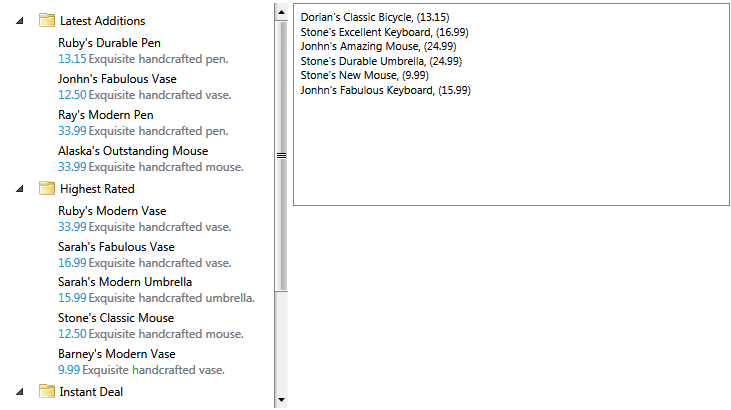
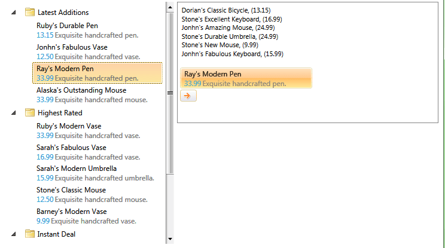
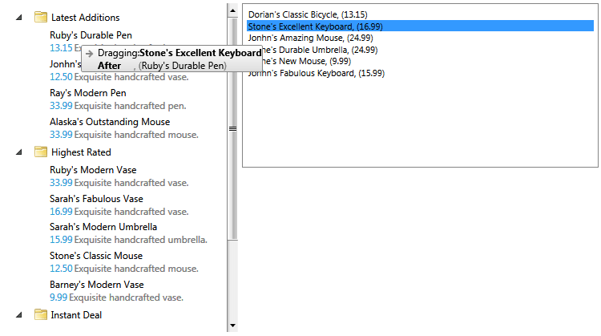

# Implement Drag and Drop Between TreeView and ListBox

The goal of this tutorial is to show you how to implement drag and drop between __RadTreeView__ and __ListBox__.	  

The final result should look like this 

## Implement Drag and Drop Between TreeView and ListBox 

For the purpose of this example, you will need to create an empty application project and open it in Visual Studio.

The first step is to add references to the following assemblies:

* __Telerik.Windows.Controls.Navigation__
* __Telerik.Windows.Controls__
* __Telerik.Windows.Data__

Then you can define the controls in your view. As the purpose of this tutorial is to demonstrate how to implement drag and drop operations, we won't focus on the definitions of the controls in xaml. However, please note to set the __RadTreeView IsDragDropEnabled__ property to __true__.

<snippet id='radtreeview-how-to-drag-and-drop-implement-between-treeview-and-listbox-block_1-xaml' />

The next step is to use the __DragDropManager__ to enable the __drop__ operation on the __ListBox__ control.		

Find the __ListBox__ declaration and set its __AllowDrop__ property to __True__.

Now that the __ListBox__ allows drop operations, we need to make sure that the __ListItems__ are draggable. We can do so by applying an implicit style that sets the __DragDropManager.AllowCapturedDrag__ attached property to __True__ on every __ListItem__:		

<snippet id='radtreeview-how-to-drag-and-drop-implement-between-treeview-and-listbox-block_2-xaml' />

>tip __telerik__ is alias for the following namespace declaration: `xmlns:telerik="http://schemas.telerik.com/2008/xaml/presentation"`

Next we'll need to populate the controls with data but as the __ViewModels__ definitions are outside the scope of this tutorial, we'll omit them for clarity. We'll only assume that the __RadTreeView__ is populated with categories and each category displays a list of products. While, the __ListBox__ displays a collection of products. This means that we'll have to implement a logic that allows you to drag a product from the __ListBox__ and drop it inside a category in the tree.

>Please have in mind that if the __ItemsSource__ of the __RadTreeView__ (__RadTreeViewItem__) is not an __IList__, then the __drop__ operation won't be allowed. Moreover, we recommend using a collection that implements the __INotifyCollectionChanged__ interface, for instance an __ObservableCollection__, as only then the changes implemented in the __RadTreeView__ underlying data collection will be reflected in the UI of the control.

Now we're getting to the actual DragDrop implementation. And we'll start with configuring the __ListBox__ as a participant in drag and drop operations.

>Please note that this article is based on the [TreeToGrid online demo](https://demos.telerik.com/silverlight/#DragAndDrop/TreeToGrid)[TreeToGrid demo](https://demos.telerik.com/wpf/#DragAndDrop/TreeToGrid), which you can find by navigating to the DragAndDrop examples ->Tree To Grid Drag.		  

In this tutorial we'll use a custom behavior to define the __ListBox__ DragDrop behavior. Essentially the behavior will attach handlers for the following events:		

* DragInitialize
* GiveFeedback
* Drop
* DragDropCompleted
* DragOver

>tip You can find more information about the __DragDropManager__ events in [this tutorial](http://www.telerik.com/help/silverlight/dragdropmanager-events.html)[this tutorial](http://www.telerik.com/help/wpf/dragdropmanager-events.html).		  

So we basically need a class that provides:
* a __ListBox__ object that will be associated with the __ListBox__ instance that enables the behavior			

* __IsEnabled__ property to control the enabled state of the behavior			

* a __Dictionary__ that holds all __ListBox__ instances enabling the behavior			

* methods that attach and detach the __DragDropManager__ event handlers.

<snippet id='radtreeview-how-to-drag-and-drop-implement-between-treeview-and-listbox-block_3-cs' />
<snippet id='radtreeview-how-to-drag-and-drop-implement-between-treeview-and-listbox-block_4-vb' />

Now let's attach handlers for the __DragDropManager__ events listed above. We'll do that in the __SubscribeToDragDropEvents()__ method and we'll detach from these handlers in the implementation of the __UnsubscribeFromDragDropEvents()__ method.

<snippet id='radtreeview-how-to-drag-and-drop-implement-between-treeview-and-listbox-block_5-cs' />
<snippet id='radtreeview-how-to-drag-and-drop-implement-between-treeview-and-listbox-block_6-vb' />

Once we do so, we can start implementing our drag/drop logic. And we'll always have to keep in mind that we need to drag items from the __RadTreeView__ and drop them in the __ListBox__ and vice versa. This means that when we initialize a drag, we need to access the data displayed in the dragged __ListBoxItem__ and add the data to the __DragInitializeEventArgs Data__ object. This will allow us to pass the dragged information during the drag/drop operation. Also, in order to provide the user with elaborate visual information during the drag operation, we can create a helper class that describes the currently dragged item, the item that the drag is passing over, the drop position and the drop index calculated based on the drop position. For instance, we can use the following class definition:

<snippet id='radtreeview-how-to-drag-and-drop-implement-between-treeview-and-listbox-block_7-cs' />
<snippet id='radtreeview-how-to-drag-and-drop-implement-between-treeview-and-listbox-block_8-vb' />

We can use this definition to also pass and keep the drag operation details in the __Data__ object provided by the __DragDropManager__. This means that we can implement the following drag initialization:

<snippet id='radtreeview-how-to-drag-and-drop-implement-between-treeview-and-listbox-block_9-cs' />
<snippet id='radtreeview-how-to-drag-and-drop-implement-between-treeview-and-listbox-block_10-vb' />

Then we can implement the __GiveFeedback__ event handler, which is quite straight-forward. As this event enables the drop source to give feedback information to the user, we'll use it to change the appearance of the mouse pointer to indicate the effects allowed by the drop target.		

<snippet id='radtreeview-how-to-drag-and-drop-implement-between-treeview-and-listbox-block_11-cs' />
<snippet id='radtreeview-how-to-drag-and-drop-implement-between-treeview-and-listbox-block_12-vb' />

Next, we have to handle the DragOver event and implement a logic that decides if the current drag operation is supported over the current drop destination. In this example, we won't allow a drag operation within the __ListBox__, which means that we have to make sure that the drag operation is allowed only if it originates from the __RadTreeView__ control.

>tip __RadTreeView__ drag operation creates an object of type __TreeViewDragDropOptions__ that holds all information related to the drag. You can read more about the properties exposed by the type in the [Drag and Drop]() article.

As the data object passed by a drag operation started in __RadTreeView__ should be of type __TreeViewDragDropOptions__, this means that you can try to extract this object and if the operation is unsuccessful, then the drag doesn't originate from a __RadTreeView__. Furthermore, we'll have to make sure that the dragged data type matches the data type displayed in the __ListBox__ - in our example this means that we'll make sure we're dragging products. So finally, we can create the following __OnDragOver()__ implementation:

<snippet id='radtreeview-how-to-drag-and-drop-implement-between-treeview-and-listbox-block_13-cs' />
<snippet id='radtreeview-how-to-drag-and-drop-implement-between-treeview-and-listbox-block_14-vb' />

Finally we'll have to implement the actual drop logic and we'll also have to update the collection displayed in the source of the drag operation accordingly. We'll do that in the handlers of the __Drop__ and __DragDropCompleted__ events.

<snippet id='radtreeview-how-to-drag-and-drop-implement-between-treeview-and-listbox-block_15-cs' />
<snippet id='radtreeview-how-to-drag-and-drop-implement-between-treeview-and-listbox-block_16-vb' />

With this the __ListBox__ drag/drop logic is complete. All we have finalize now, is the definition of the control to enable the __ListBoxDragDropBehavior__. So please find the declaration of the __ListBox__ and add the following line:
'example:ListBoxDragDropBehavior.IsEnabled="True"', where __example__ is an alias pointing to the namespace in which we've defined the __ListBoxDragDropBehavior__ class.		

If you run the solution now, you should be able to drag items from the __RadTreeView__ and drop them in the __ListBox__.

And if you start dragging an item from the __ListBox__, you'll be able to get the item's data and even display an informative tooltip describing the dragged item. However, this tooltip won't be updated while dragging over the __RadTreeView__ and you won't be able to drop the item among the tree items. This is due to the fact that the __RadTreeView__ built-in drag/drop logic is implemented to handle only drag originating from a __RadTreeView__. Therefore, you will also have to set up the tree to process a drag coming from a __ListBox__.		

In order to configure the __RadTreeView__ to process the drop of an item coming from another control, you need to attach a handler for the __DragDropManager Drop__ event.

<snippet id='radtreeview-how-to-drag-and-drop-implement-between-treeview-and-listbox-block_17-cs' />
<snippet id='radtreeview-how-to-drag-and-drop-implement-between-treeview-and-listbox-block_18-vb' />

In the handler you need to get the dragged data, find the position where the item should be dropped at - before, after or inside a particular __RadTreeViewItem__ and implement the drop by adding the dragged data in the __RadTreeView__ ItemsSource collection:

<snippet id='radtreeview-how-to-drag-and-drop-implement-between-treeview-and-listbox-block_19-cs' />
<snippet id='radtreeview-how-to-drag-and-drop-implement-between-treeview-and-listbox-block_20-vb' />

And to make the dragging operation more informative, we can also subscribe to the __DragDropManager DragOver__ event to update the drag operation information tooltip while dragging over the __RadTreeView__.

<snippet id='radtreeview-how-to-drag-and-drop-implement-between-treeview-and-listbox-block_21-cs' />
<snippet id='radtreeview-how-to-drag-and-drop-implement-between-treeview-and-listbox-block_22-vb' />

If you take a closer look at the above code snippet, you'll notice that it basically tracks the current drop destination and position. Then based on its type and value, the code decides if the drag operation is allowed, updating the visual representation of the operation at the same time.

With that last piece of code, our application is ready. It can now provide a fluent drag-drop operation between a __RadTreeView__ and a __ListBox__ control.

>tip Find a runnable project of the previous example in the [WPF Samples GitHub repository](https://github.com/telerik/xaml-sdk/tree/master/TreeView/DragDropTreeViewToControls).
		  

## See Also
 * [Drag and Drop]()
 * [Implement Drag and Drop Between TreeView and ListBox]()
 * [Enable Only Drop Inside]()
 * [Disable Drop at Specific Location]()
 * [Auto Expand on Drag Over]()