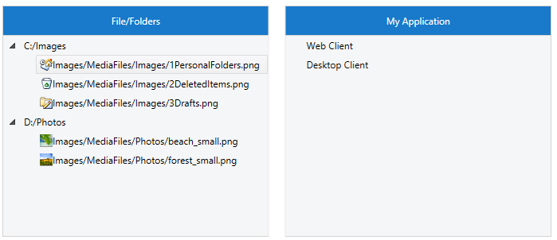

# Implement Drag and Drop Between TreeViews

The goal of this tutorial is to show how to implement drag and drop between two different __RadTreeViews__ bound to heterogeneous data. The first __RadTreeView__ represents a local machine files tree and it displays a hierarchy of business objects containing images and their URIs. The second one represents an application files tree and displays hierarchy of another type of business objects that also containing images and in addition a title. The drop will be allowed only from the local machine tree to the application tree.

The picture below demonstrates the final result:


## Setting the RadTreeViews in XAML

First you can define the controls in your view. As the purpose of this tutorial is to demonstrate how to implement drag and drop operations, we won't focus on the definitions of the controls in xaml. However, please note to set the __RadTreeView IsDragDropEnabled__ property to __true__.        

```XAML
		<Grid>
			<Grid.Resources>
				<DataTemplate x:Key="mediaFilesTemplate">
					<StackPanel Orientation="Horizontal">
						<Image Width="16"
						       Height="16"
						       Source="Images/DefaultIcons/photos.png"
						       Stretch="Fill" />
						<TextBlock Text="{Binding ImageFilePath}" />
					</StackPanel>
				</DataTemplate>
				<HierarchicalDataTemplate x:Key="localMachineTemplate"
				                          ItemTemplate="{StaticResource mediaFilesTemplate}"
				                          ItemsSource="{Binding MediaFiles}">
					<TextBlock Text="{Binding Name}" />
				</HierarchicalDataTemplate>
	
				<DataTemplate x:Key="resourceTemplate">
					<StackPanel Orientation="Horizontal">
						<Image Width="16"
						       Height="16"
						       Source="{Binding ImageFilePath}"
						       Stretch="Fill" />
						<TextBlock Text="{Binding Title}" />
					</StackPanel>
				</DataTemplate>
	
				<HierarchicalDataTemplate x:Key="applicationTemplate"
				                          ItemTemplate="{StaticResource resourceTemplate}"
				                          ItemsSource="{Binding Resources}">
					<TextBlock Text="{Binding Name}" />
				</HierarchicalDataTemplate>
			</Grid.Resources>
	
			<Grid.ColumnDefinitions>
				<ColumnDefinition Width="*" />
				<ColumnDefinition Width="*" />
			</Grid.ColumnDefinitions>
			<Grid.RowDefinitions>
				<RowDefinition Height="30" />
				<RowDefinition />
			</Grid.RowDefinitions>
	
			<TextBlock Grid.Row="0"
			           Grid.Column="0"
			           HorizontalAlignment="Center"
			           VerticalAlignment="Center"
			           Text="File/Folders" />
			<telerik:RadTreeView x:Name="xLocalMachineTree"
			                     Grid.Row="1"
			                     Grid.Column="0"
			                     IsDragDropEnabled="True"
			                     ItemTemplate="{StaticResource localMachineTemplate}" />
	
			<TextBlock Grid.Row="0"
			           Grid.Column="1"
			           HorizontalAlignment="Center"
			           VerticalAlignment="Center"
			           Text="MyApplication" />
	
			<telerik:RadTreeView x:Name="xApplicationTree"
			                     Grid.Row="1"
			                     Grid.Column="1"
			                     IsDragDropEnabled="True"
			                     ItemTemplate="{StaticResource applicationTemplate}" />
		</Grid>
```

## Create the View Models

For the first __RadTreeView__ we can create a business class called __MediaFile__ that will hold information about images.

```C#
	public class MediaFile
	{
		public string ImageTitle { get; set; }
		public string ImageFilePath { get; set; }
	}
```
```VB.NET
	Public Class MediaFile
	    Public Property ImageTitle() As String
	    Public Property ImageFilePath() As String
	End Class
```

Then we can define a business class called __PartitionViewModel__ which will hold a collection of __MediaFiles__ and the name of a partition in the RadTreeView that represents the local machine tree.

```C#
	public class PartitionViewModel
	{
	    public PartitionViewModel()
	    {
	        this.MediaFiles = new ObservableCollection<MediaFile>();
	    }
	
	    public string Name { get; set; }
	    public ObservableCollection<MediaFile> MediaFiles { get; set; }
	}
```
```VB.NET
	Public Class PartitionViewModel
	    Public Sub New()
	        Me.MediaFiles = New ObservableCollection(Of MediaFile)()
	    End Sub
	
	    Public Property Name() As String
	        Get
	            Return m_Name
	        End Get
	        Set(value As String)
	            m_Name = Value
	        End Set
	    End Property
	    Private m_Name As String
	    Public Property MediaFiles() As ObservableCollection(Of MediaFile)
	        Get
	            Return m_MediaFiles
	        End Get
	        Set(value As ObservableCollection(Of MediaFile))
	            m_MediaFiles = Value
	        End Set
	    End Property
	    Private m_MediaFiles As ObservableCollection(Of MediaFile)
	End Class
```

For our second RadTreeView we can create a class called __Resource__ that will hold the information about the images in it.

```C#
	public class Resource
	{
		public BitmapImage ImageFilePath { get; set; }
		public string Title { get; set; }
	}
```
```VB.NET
	Public Class Resource
	    Public Property ImageFilePath() As BitmapImage
	    Public Property Title() As String
	End Class
```

Then we can define a class called __ApplicationViewModel__ which will hold a collection of __Resources__ and the name of an application.

```C#
	public class ApplicationViewModel
	{
		public ApplicationViewModel()
		{
			this.Resources = new ObservableCollection<Resource>();
		}
	
		public string Name { get; set; }
	
		public ObservableCollection<Resource> Resources { get; set; }
	}
```
```VB.NET
	Public Class ApplicationViewModel
	    Public Sub New()
	        Me.Resources = New ObservableCollection(Of Resource)()
	    End Sub
	
	    Public Property Name() As String
	
	    Public Property Resources() As ObservableCollection(Of Resource)
	End Class
```

Next we can define a __MainViewModel__ class that contains the collections which we will use to populate the __ItemsSource__ property of both __RadTreeViews__ For the first __RadTreeView__ will be populated with collection of __PartitionViewModel__ objects, whereas the second __RadTreeView__ will use a collection of __ApplicationViewModel__ objects.

```C#
	public class MainViewModel
	{
		public MainViewModel()
		{
			this.LocalMachinePartitions = new ObservableCollection<PartitionViewModel>();
			this.Applications = new ObservableCollection<ApplicationViewModel>();
			this.GenetareSampleData();
		}
	
		public ObservableCollection<PartitionViewModel> LocalMachinePartitions
		{
			get;
			set;
		}
	
		public ObservableCollection<ApplicationViewModel> Applications
		{
			get;
			set;
		}
	
		private void GenetareSampleData()
		{
			string defaultImagePath = "Images/MediaFiles/{0}";
			ObservableCollection<MediaFile> firstPartishionFiles = new ObservableCollection<MediaFile>();
			firstPartishionFiles.Add(new MediaFile() { ImageTitle = "1PersonalFolders.png", ImageFilePath = string.Format(defaultImagePath, "Images/1PersonalFolders.png") });
			firstPartishionFiles.Add(new MediaFile() { ImageTitle = "2DeletedItems.png", ImageFilePath = string.Format(defaultImagePath, "Images/2DeletedItems.png") });
			firstPartishionFiles.Add(new MediaFile() { ImageTitle = "3Drafts.png", ImageFilePath = string.Format(defaultImagePath, "Images/3Drafts.png") });
	
			this.LocalMachinePartitions.Add(new PartitionViewModel()
			{
				Name = @"C:/Images",
				MediaFiles = firstPartishionFiles
			});
	
			ObservableCollection<MediaFile> secondPartishionFiles = new ObservableCollection<MediaFile>();
			secondPartishionFiles.Add(new MediaFile() { ImageTitle = "beach_small.png", ImageFilePath = string.Format(defaultImagePath, "Photos/beach_small.png") });
			secondPartishionFiles.Add(new MediaFile() { ImageTitle = "forest_small.png", ImageFilePath = string.Format(defaultImagePath, "Photos/forest_small.png") });
				
			this.LocalMachinePartitions.Add(new PartitionViewModel() 
			{
				Name = @"D:/Photos",
				MediaFiles = secondPartishionFiles
			});
	
			this.Applications.Add(new ApplicationViewModel() { Name = "Web Client" });
			this.Applications.Add(new ApplicationViewModel() { Name = "Desktop Client" });
		}
	}
```
```VB.NET
	Public Class MainViewModel
	    Public Sub New()
	        Me.LocalMachinePartitions = New ObservableCollection(Of PartitionViewModel)()
	        Me.Applications = New ObservableCollection(Of ApplicationViewModel)()
	        Me.GenetareSampleData()
	    End Sub
	
	    Public Property LocalMachinePartitions() As ObservableCollection(Of PartitionViewModel)
	        Get
	            Return m_LocalMachinePartitions
	        End Get
	        Set(value As ObservableCollection(Of PartitionViewModel))
	            m_LocalMachinePartitions = Value
	        End Set
	    End Property
	    Private m_LocalMachinePartitions As ObservableCollection(Of PartitionViewModel)
	
	    Public Property Applications() As ObservableCollection(Of ApplicationViewModel)
	        Get
	            Return m_Applications
	        End Get
	        Set(value As ObservableCollection(Of ApplicationViewModel))
	            m_Applications = Value
	        End Set
	    End Property
	    Private m_Applications As ObservableCollection(Of ApplicationViewModel)
	
	    Private Sub GenetareSampleData()
	        Dim defaultImagePath As String = "Images/MediaFiles/{0}"
	        Dim firstPartishionFiles As New ObservableCollection(Of MediaFile)()
	        firstPartishionFiles.Add(New MediaFile() With { _
	            .ImageTitle = "1PersonalFolders.png", _
	            .ImageFilePath = String.Format(defaultImagePath, "Images/1PersonalFolders.png") _
	        })
	        firstPartishionFiles.Add(New MediaFile() With { _
	            .ImageTitle = "2DeletedItems.png", _
	            .ImageFilePath = String.Format(defaultImagePath, "Images/2DeletedItems.png") _
	        })
	        firstPartishionFiles.Add(New MediaFile() With { _
	            .ImageTitle = "3Drafts.png", _
	            .ImageFilePath = String.Format(defaultImagePath, "Images/3Drafts.png") _
	        })
	
	        Me.LocalMachinePartitions.Add(New PartitionViewModel() With { _
	            .Name = "C:/Images", _
	            .MediaFiles = firstPartishionFiles _
	        })
	
	        Dim secondPartishionFiles As New ObservableCollection(Of MediaFile)()
	        secondPartishionFiles.Add(New MediaFile() With { _
	            .ImageTitle = "beach_small.png", _
	            .ImageFilePath = String.Format(defaultImagePath, "Photos/beach_small.png") _
	        })
	        secondPartishionFiles.Add(New MediaFile() With { _
	            .ImageTitle = "forest_small.png", _
	            .ImageFilePath = String.Format(defaultImagePath, "Photos/forest_small.png") _
	        })
	
	        Me.LocalMachinePartitions.Add(New PartitionViewModel() With { _
	            .Name = "D:/Photos", _
	            .MediaFiles = secondPartishionFiles _
	        })
	
	        Me.Applications.Add(New ApplicationViewModel() With { _
	            .Name = "Web Client" _
	        })
	        Me.Applications.Add(New ApplicationViewModel() With { _
	            .Name = "Desktop Client" _
	        })
	    End Sub
	End Class
```

## Implement the drag and drop logic

As was mentioned in the beginning of this article, the drop will be forbidden in the local machine tree (the first one). In order to do so we can subscribe for the __DragOver__ and the __Drop__ events of the __DragDropManager__ and implement the custom logic there. We will start with configuring the __RadTreeViews__ as a participants in drag and drop operations.        

Now let’s add the handlers for the __DragDropManager__ events listed above. We’ll do that in the code-behind.        

```C#
	public MainPage()
	{
		InitializeComponent();
	
		 MainViewModel viewModelData = new MainViewModel();
	
	    this.xLocalMachineTree.ItemsSource = viewModelData.LocalMachinePartitions;
	    this.xApplicationTree.ItemsSource = viewModelData.Applications;
	
	    DragDropManager.AddDragOverHandler(this.xLocalMachineTree, OnLocalMachineTreeDragOver, true);
	    DragDropManager.AddDragOverHandler(this.xApplicationTree, OnApplicationTreeDragOver, true);
	    DragDropManager.AddDropHandler(this.xApplicationTree, OnApplicationTreeDrop, true);
	}
```
```VB.NET
	Public Sub New()
	    InitializeComponent()
	
	    Dim viewModelData As New MainViewModel()
	
	    Me.xLocalMachineTree.ItemsSource = viewModelData.LocalMachinePartitions
	    Me.xApplicationTree.ItemsSource = viewModelData.Applications
	
	    DragDropManager.AddDragOverHandler(Me.xLocalMachineTree, OnLocalMachineTreeDragOver, True)
	    DragDropManager.AddDragOverHandler(Me.xApplicationTree, OnApplicationTreeDragOver, True)
	    DragDropManager.AddDropHandler(Me.xApplicationTree, OnApplicationTreeDrop, True)
	End Sub
```

Once we do so, we can start implementing the drag/drop handlers. For the purpose of this example we can only drop items to the __RadTreeView__ with __x:Name__ property set to *xApplicationTree*.        

>tip __RadTreeView__ drag operation creates an object of type __TreeViewDragDropOptions__ that holds all information related to the drag.

Next, we have to handle the __Drop__ event for the *xApplicationTree*. When we drop an item in the second __RadTreeView__ we create a new item of *Resource* type.

```C#
	private void OnApplicationTreeDrop(object sender, Telerik.Windows.DragDrop.DragEventArgs e)
	{
	    var options = DragDropPayloadManager.GetDataFromObject(e.Data, TreeViewDragDropOptions.Key) as TreeViewDragDropOptions;
	
	    if (options == null)
	        return;
	
	    MediaFile draggedItem = options.DraggedItems.FirstOrDefault() as MediaFile;
	    if (draggedItem == null)
	        return;
	
	    RadTreeViewItem dropTargetItem = options.DropTargetItem;
	    if (dropTargetItem == null)
	        return;
	
	    var dropItemModel = dropTargetItem.DataContext;
	    if (dropItemModel == null)
	        return;
	
	    var dropTree = sender as RadTreeView;
	    if (dropTree != null)
	    {
	        if (dropItemModel is Resource && options.DropAction == DropAction.None)
	        {
	            e.Handled = true;
	            return;
	        }
	
	        if (dropItemModel is ApplicationViewModel || dropItemModel is Resource)
	        {
	            options.DropAction = DropAction.Copy;
	            options.UpdateDragVisual();
	
	            ApplicationViewModel destinationFolder = null;
	            if (dropItemModel is ApplicationViewModel)
	            {
	                destinationFolder = dropItemModel as ApplicationViewModel;
	            }
	            else
	            {
	                destinationFolder = options.DropTargetItem.ParentItem.DataContext as ApplicationViewModel;
	            }
	
	            if (destinationFolder == null)
	                return;
	
	            Resource file = new Resource()
	            {
	                ImageFilePath = new System.Windows.Media.Imaging.BitmapImage(new Uri(draggedItem.ImageFilePath, UriKind.RelativeOrAbsolute)),
	                Title = draggedItem.ImageTitle
	            };
	                                        
	            destinationFolder.Resources.Add(file);
	        }
	    }
	}
```
```VB.NET
	Private Sub OnApplicationTreeDrop(sender As Object, e As Telerik.Windows.DragDrop.DragEventArgs)
	    Dim options = TryCast(DragDropPayloadManager.GetDataFromObject(e.Data, TreeViewDragDropOptions.Key), TreeViewDragDropOptions)
	
	    If options Is Nothing Then
	        Return
	    End If
	
	    Dim draggedItem As MediaFile = TryCast(options.DraggedItems.FirstOrDefault(), MediaFile)
	    If draggedItem Is Nothing Then
	        Return
	    End If
	
	    Dim dropTargetItem As RadTreeViewItem = options.DropTargetItem
	    If dropTargetItem Is Nothing Then
	        Return
	    End If
	
	    Dim dropItemModel = dropTargetItem.DataContext
	    If dropItemModel Is Nothing Then
	        Return
	    End If
	
	    Dim dropTree = TryCast(sender, RadTreeView)
	    If dropTree IsNot Nothing Then
	        If TypeOf dropItemModel Is Resource AndAlso options.DropAction = DropAction.None Then
	            e.Handled = True
	            Return
	        End If
	
	        If TypeOf dropItemModel Is ApplicationViewModel OrElse TypeOf dropItemModel Is Resource Then
	            options.DropAction = DropAction.Copy
	            options.UpdateDragVisual()
	
	            Dim destinationFolder As ApplicationViewModel = Nothing
	            If TypeOf dropItemModel Is ApplicationViewModel Then
	                destinationFolder = TryCast(dropItemModel, ApplicationViewModel)
	            Else
	                destinationFolder = TryCast(options.DropTargetItem.ParentItem.DataContext, ApplicationViewModel)
	            End If
	
	            If destinationFolder Is Nothing Then
	                Return
	            End If
	
	            Dim file As New Resource() With { _
	                .ImageFilePath = New System.Windows.Media.Imaging.BitmapImage(New Uri(draggedItem.ImageFilePath, UriKind.RelativeOrAbsolute)), _
	                .Title = draggedItem.ImageTitle _
	            }
	
	            destinationFolder.Resources.Add(file)
	        End If
	    End If
	End Sub
```

In order to deny the nesting of __Resource__ files and update the visual representation of the __DropAction__ in the application tree, we can subscribe for the __DragOver__ event of the __DragDropManager__.


```C#
	private void OnApplicationTreeDragOver(object sender, Telerik.Windows.DragDrop.DragEventArgs e)
	{
	    var options = DragDropPayloadManager.GetDataFromObject(e.Data, TreeViewDragDropOptions.Key) as TreeViewDragDropOptions;
	    if (options == null)
	        return;
	   
	    RadTreeViewItem dropTargetItem = options.DropTargetItem;
	
	    var draggedItem = options.DraggedItems.First();         
	    if (dropTargetItem == null ||
	        (dropTargetItem != null &&
	            options.DropTargetItem.DataContext is Resource &&
	            options.DropPosition == DropPosition.Inside) ||
	        draggedItem is PartitionViewModel)
	    {
	        options.DropAction = DropAction.None;
	    }
	
	    options.UpdateDragVisual();
	}
```
```VB.NET
	Private Sub OnApplicationTreeDragOver(sender As Object, e As Telerik.Windows.DragDrop.DragEventArgs)
	    Dim options = TryCast(DragDropPayloadManager.GetDataFromObject(e.Data, TreeViewDragDropOptions.Key), TreeViewDragDropOptions)
	    If options Is Nothing Then
	        Return
	    End If
	
	    Dim dropTargetItem As RadTreeViewItem = options.DropTargetItem
	
	    Dim draggedItem = options.DraggedItems.First()
	    If dropTargetItem Is Nothing OrElse (dropTargetItem IsNot Nothing AndAlso TypeOf options.DropTargetItem.DataContext Is Resource AndAlso options.DropPosition = DropPosition.Inside) OrElse TypeOf draggedItem Is PartitionViewModel Then
	        options.DropAction = DropAction.None
	    End If
	
	    options.UpdateDragVisual()
	End Sub
```

To ensure that we cannot drop in the local machine tree, we can subscribe for the __DragOver__ event.


```C#
	private void OnLocalMachineTreeDragOver(object sender, Telerik.Windows.DragDrop.DragEventArgs e)
	{
	    var options = DragDropPayloadManager.GetDataFromObject(e.Data, TreeViewDragDropOptions.Key) as TreeViewDragDropOptions;
	    if (options != null)
	    {
	        options.DropAction = DropAction.None;
	        options.UpdateDragVisual();
	
	        e.Handled = true;
	    }
	}
```
```VB.NET
	Private Sub OnLocalMachineTreeDragOver(sender As Object, e As Telerik.Windows.DragDrop.DragEventArgs)
	    Dim options = TryCast(DragDropPayloadManager.GetDataFromObject(e.Data, TreeViewDragDropOptions.Key), TreeViewDragDropOptions)
	    If options IsNot Nothing Then
	        options.DropAction = DropAction.None
	        options.UpdateDragVisual()
	
	        e.Handled = True
	    End If
	End Sub
```

>tip Find a runnable project of the previous example in the [WPF Samples GitHub repository](https://github.com/telerik/xaml-sdk/tree/master/TreeView/DragDropBetweenTreeViews).

## See Also
 * [Drag and Drop]()
 * [Implement Drag and Drop Between TreeView and ListBox]()
 * [Enable Only Drop Inside]()
 * [Disable Drop at Specific Location]()
 * [Auto Expand on Drag Over]()