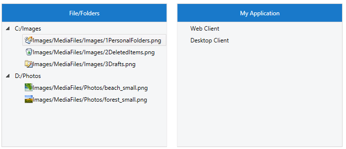

# Implement Drag and Drop Between TreeViews

The goal of this tutorial is to show how to implement drag and drop between two different __RadTreeViews__ bound to heterogeneous data. The first __RadTreeView__ represents a local machine files tree and it displays a hierarchy of business objects containing images and their URIs. The second one represents an application files tree and displays hierarchy of another type of business objects that also containing images and in addition a title. The drop will be allowed only from the local machine tree to the application tree.

The picture below demonstrates the final result:

## Setting the RadTreeViews in XAML

First you can define the controls in your view. As the purpose of this tutorial is to demonstrate how to implement drag and drop operations, we won't focus on the definitions of the controls in xaml. However, please note to set the __RadTreeView IsDragDropEnabled__ property to __true__.        

<snippet id='radtreeview-how-to-drag-and-drop-implement-between-two-treeviews-block_1-xaml' />

## Create the View Models

For the first __RadTreeView__ we can create a business class called __MediaFile__ that will hold information about images.

<snippet id='radtreeview-how-to-drag-and-drop-implement-between-two-treeviews-block_2-cs' />
<snippet id='radtreeview-how-to-drag-and-drop-implement-between-two-treeviews-block_3-vb' />

Then we can define a business class called __PartitionViewModel__ which will hold a collection of __MediaFiles__ and the name of a partition in the RadTreeView that represents the local machine tree.

<snippet id='radtreeview-how-to-drag-and-drop-implement-between-two-treeviews-block_4-cs' />
<snippet id='radtreeview-how-to-drag-and-drop-implement-between-two-treeviews-block_5-vb' />

For our second RadTreeView we can create a class called __Resource__ that will hold the information about the images in it.

<snippet id='radtreeview-how-to-drag-and-drop-implement-between-two-treeviews-block_6-cs' />
<snippet id='radtreeview-how-to-drag-and-drop-implement-between-two-treeviews-block_7-vb' />

Then we can define a class called __ApplicationViewModel__ which will hold a collection of __Resources__ and the name of an application.

<snippet id='radtreeview-how-to-drag-and-drop-implement-between-two-treeviews-block_8-cs' />
<snippet id='radtreeview-how-to-drag-and-drop-implement-between-two-treeviews-block_9-vb' />

Next we can define a __MainViewModel__ class that contains the collections which we will use to populate the __ItemsSource__ property of both __RadTreeViews__ For the first __RadTreeView__ will be populated with collection of __PartitionViewModel__ objects, whereas the second __RadTreeView__ will use a collection of __ApplicationViewModel__ objects.

<snippet id='radtreeview-how-to-drag-and-drop-implement-between-two-treeviews-block_10-cs' />
<snippet id='radtreeview-how-to-drag-and-drop-implement-between-two-treeviews-block_11-vb' />

## Implement the drag and drop logic

As was mentioned in the beginning of this article, the drop will be forbidden in the local machine tree (the first one). In order to do so we can subscribe for the __DragOver__ and the __Drop__ events of the __DragDropManager__ and implement the custom logic there. We will start with configuring the __RadTreeViews__ as a participants in drag and drop operations.        

Now let’s add the handlers for the __DragDropManager__ events listed above. We’ll do that in the code-behind.        

<snippet id='radtreeview-how-to-drag-and-drop-implement-between-two-treeviews-block_12-cs' />
<snippet id='radtreeview-how-to-drag-and-drop-implement-between-two-treeviews-block_13-vb' />

Once we do so, we can start implementing the drag/drop handlers. For the purpose of this example we can only drop items to the __RadTreeView__ with __x:Name__ property set to *xApplicationTree*.        

>tip __RadTreeView__ drag operation creates an object of type __TreeViewDragDropOptions__ that holds all information related to the drag.

Next, we have to handle the __Drop__ event for the *xApplicationTree*. When we drop an item in the second __RadTreeView__ we create a new item of *Resource* type.

<snippet id='radtreeview-how-to-drag-and-drop-implement-between-two-treeviews-block_14-cs' />
<snippet id='radtreeview-how-to-drag-and-drop-implement-between-two-treeviews-block_15-vb' />

In order to deny the nesting of __Resource__ files and update the visual representation of the __DropAction__ in the application tree, we can subscribe for the __DragOver__ event of the __DragDropManager__.

<snippet id='radtreeview-how-to-drag-and-drop-implement-between-two-treeviews-block_16-cs' />
<snippet id='radtreeview-how-to-drag-and-drop-implement-between-two-treeviews-block_17-vb' />

To ensure that we cannot drop in the local machine tree, we can subscribe for the __DragOver__ event.

<snippet id='radtreeview-how-to-drag-and-drop-implement-between-two-treeviews-block_18-cs' />
<snippet id='radtreeview-how-to-drag-and-drop-implement-between-two-treeviews-block_19-vb' />

>tip Find a runnable project of the previous example in the [WPF Samples GitHub repository](https://github.com/telerik/xaml-sdk/tree/master/TreeView/DragDropBetweenTreeViews).

## See Also
 * [Drag and Drop]()
 * [Implement Drag and Drop Between TreeView and ListBox]()
 * [Enable Only Drop Inside]()
 * [Disable Drop at Specific Location]()
 * [Auto Expand on Drag Over]()