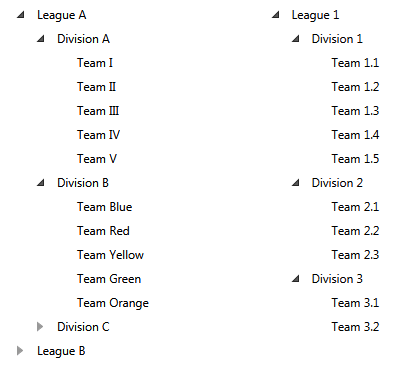
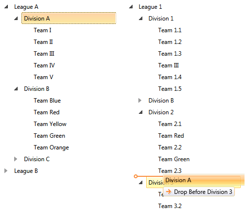
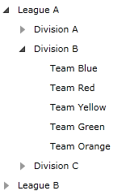
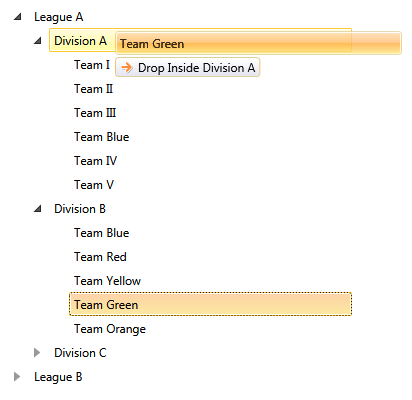
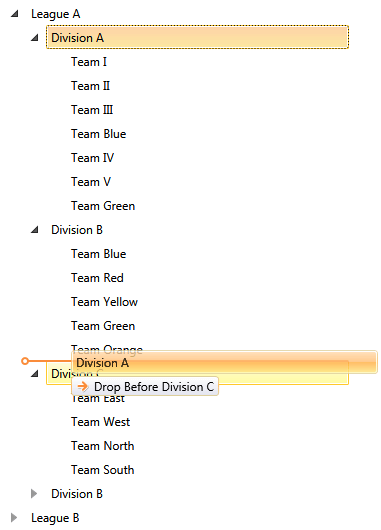
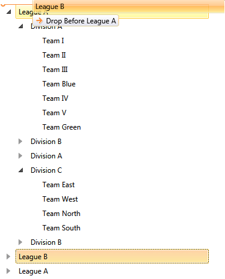

# Implement Copy Drag

The purpose of this tutorial is to show you how to implement "Copy Drag".

## Copy Item When Dragging from One TreeView to Another 

Using the new __DragDrop__ mode, you can control the __DropAction__ of a drop operation. You can do so through the __TreeViewDragDropOptions__ object as described in the [DragDrop]() tutorial.		

In this section you will see how to implement copy drag, when dragging items from one data-bound treeview to another. On the next figure you can see the initial staging. 

There are two treeviews populated with some hierarchical data. On the left side is the source treeview (the one from which the items will be copied). On the right side is the target treeview (the one in which the items will be dropped).

>tip Both __RadTreeViews__ are data bound to a collection of business objects. For more information, read the [Binding to Object]() topic.		  

<snippet id='radtreeview-how-to-drag-and-drop-implement-copy-drag-block_1-xaml' />

In the current situation if you try to drag and drop from the left treeview to the right, the items will be moved (not copied). The same is valid if you try to drag and drop from the right treeview to the left. And in order to change that logic and implement a copy drag operation from the left to the right __RadTreeView__ you need to:

* Attach a __DragDropManager DragOver__ event handler for the right __RadTreeView__:

	<snippet id='radtreeview-how-to-drag-and-drop-implement-copy-drag-block_2-cs' />
	<snippet id='radtreeview-how-to-drag-and-drop-implement-copy-drag-block_3-vb' />

	>tip __RadTreeView__ handles internally the __DragDropManager__ events and in order to invoke a custom handler, you need to explicitly specify that you're adding a handler that should be invoked even for already handled events. This is done through the last - __bool__ argument of the __DragDropManager.AddDragOverHandler__ extension method.			  

* In the event handler you should use the following code:

	<snippet id='radtreeview-how-to-drag-and-drop-implement-copy-drag-block_4-cs' />
	<snippet id='radtreeview-how-to-drag-and-drop-implement-copy-drag-block_5-vb' />

Here is the final result: 

Now if you try to drag an item from the right __RadTreeView__ and drop it in the left tree, the item will be moved. This is due to the fact that we changed the __DropAction__ only while dragging over items of the right __RadTreeView__. If you need to implement a copy operation when dropping into the left __RadTreeView__, you'll have to attach an event handler for its __DragDropManager DragOver__ event as well:

<snippet id='radtreeview-how-to-drag-and-drop-implement-copy-drag-block_6-cs' />
<snippet id='radtreeview-how-to-drag-and-drop-implement-copy-drag-block_7-vb' />

>tip If you try to implement the above approach on two declaratively defined __RadTreeView__ controls, you'll encounter an exception. This is due to the fact that the copy operation will try to add one object instance in two different __RadTreeView__ controls. And if you're working with visual objects, then this would raise an exception as you can't use the same visual object multiple times in the VisualTree of the application. Therefore in this case, you'll have to implement a custom copy operation that creates a new object copying the settings of the dragged __RadTreeViewItem__.		  

## Copy Item When Dragging Within the Same TreeView 

In this section you will see how to implement copy drag, when dragging items within the same __RadTreeView__. On the next figure you can see the initial staging.

Here is a treeview populated with some hierarchical data. This is the initial XAML declaration: 

<snippet id='radtreeview-how-to-drag-and-drop-implement-copy-drag-block_8-xaml' />

>tip The __RadTreeView__ is data bound to a collection of business objects. For more information, read the [Binding to Object]() topic.

Before setting a copy __DropAction__ within one __RadTreeView__, you need to consider the fact that in the __RadTreeView__ once you add the same instance of an object, all item manipulation operations will be applied on every instance of the object found within the __RadTreeView__ control. This basically means that if you follow the approach described in the previous section of the article, you will get multiple __RadTreeViewItems__ wrapping the same object instance. Once you do so, you'll have to work with all items as one as the __RadTreeView__ can't differentiate them. If this is something you;d like to avoid, then you'll have to reconfigure the default __RadTreeView__ drag/drop operation to make a __real copy__ of the dragged item and drop the copy.

In order to implement a __real copy__ drag operation, you need to perform the following steps:

* Attach __DragDropManager Drop and DragDropCompleted__ handlers on the __RadTreeView__:

	<snippet id='radtreeview-how-to-drag-and-drop-implement-copy-drag-block_9-cs' />
	<snippet id='radtreeview-how-to-drag-and-drop-implement-copy-drag-block_10-vb' />

	>tip __RadTreeView__ handles internally the __DragDropManager__ events and in order to invoke a custom handler, you need to explicitly specify that you're adding a handler that should be invoked even for already handled events. This is done through the last - __bool__ argument of the __DragDropManager.AddDragOverHandler__ extension method.
			  

* In the __OnDrop__ event handler you should stop the drop operation. You can do so by setting the __DropAction__ to __None__:			

	<snippet id='radtreeview-how-to-drag-and-drop-implement-copy-drag-block_11-cs' />
	<snippet id='radtreeview-how-to-drag-and-drop-implement-copy-drag-block_12-vb' />

* In the __OnDragDropCompleted__ event handler you should implement a custom drop operation. However, as this drop operation will have to create a __real copy__ of the dragged item, you will need to create methods to copy your objects. For example, here are sample methods which copy respectively the __Team__, the __Division__ and the __League__ objects:

	<snippet id='radtreeview-how-to-drag-and-drop-implement-copy-drag-block_13-cs' />
	<snippet id='radtreeview-how-to-drag-and-drop-implement-copy-drag-block_14-vb' />

* Next, you need to implement a custom drop operation in the __OnDragDropCompleted__ event handler. This means that you need to define a logic that tracks the type of the dragged item as well as the type of the drop destination to make sure that the drop is actually allowed. This logic will also have to track the __DropPosition__ to decide where to insert the __real copy__ of the dragged item.

	<snippet id='radtreeview-how-to-drag-and-drop-implement-copy-drag-block_15-cs' />
	<snippet id='radtreeview-how-to-drag-and-drop-implement-copy-drag-block_16-vb' />

With this the __real copy DragDrop__ implementation is ready. The final result can be seen on the next snapshots.		

Copy Team: 

Copy Division: 

Copy League: 

You can further customize this solution by applying a logic that determines the __DropAction__ based on the type of the item the drag operation is currently over:		

<snippet id='radtreeview-how-to-drag-and-drop-implement-copy-drag-block_17-cs' />
<snippet id='radtreeview-how-to-drag-and-drop-implement-copy-drag-block_18-vb' />

## See Also
 * [Drag and Drop]()
 * [Implement Drag and Drop Between TreeView and ListBox]()
 * [Enable Only Drop Inside]()
 * [Disable Drop at Specific Location]()
 * [Auto Expand on Drag Over]()