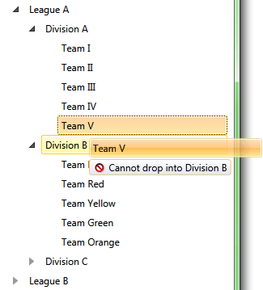

# Set DragCue Feedback for Denying a Drop

This topic demonstrates how to deny a drop operation over a specific item and specify a visual feedback indicating the operation is not allowed.

1. Let's start with the __RadTreeView__ definition. For the purpose of this tutorial we will use a __RadTreeView__ that is data bound to a collection of business objects as demonstrated in the [Binding to Object]() topic:
			
	```XAML
		<Grid>
			<Grid.Resources>
				<sampleData:RadTreeViewSampleData x:Key="DataSource" />
		
				<DataTemplate x:Key="Team">
					<TextBlock Text="{Binding Name}" />
				</DataTemplate>
				<HierarchicalDataTemplate x:Key="Division"
											ItemTemplate="{StaticResource Team}"
											ItemsSource="{Binding Teams}">
					<TextBlock Text="{Binding Name}" />
				</HierarchicalDataTemplate>
				<HierarchicalDataTemplate x:Key="League"
											ItemTemplate="{StaticResource Division}"
											ItemsSource="{Binding Divisions}">
					<TextBlock Text="{Binding Name}" />
				</HierarchicalDataTemplate>
			</Grid.Resources>
			<telerik:RadTreeView x:Name="xTreeView"
									Margin="8"
									IsDragDropEnabled="True"
									ItemTemplate="{StaticResource League}"
									ItemsSource="{Binding Source={StaticResource DataSource},
														Path=LeaguesDataSource}" />
		</Grid>       
	```

2. Next, switch to the code-behind and attach to the __DragDropManager's DragOver__ routed event in the following manner:			

	```C#
		DragDropManager.AddDragOverHandler(xTreeView, OnDragOver, true);
	```
	```VB.NET
		DragDropManager.AddDragOverHandler(xTreeView, OnDragOver, True)
	```

	>tip __RadTreeView__ handles internally the __DragDropManager__ events and in order to invoke a custom handler, you need to explicitly specify that you're adding a handler that should be invoked even for already handled events. This is done through the last - __bool__ argument of the __DragDropManager.AddDragOverHandler__ extension method.			  

3. In the handler, you need to get the dragged data and as we're working in the context of a single __RadTreeView__, we can safely assume that the dragged data type is __TreeViewDragDropOptions__. Once we have the options of the drag operation, we can configure them accordingly to the requirements of the application. In this example, we will implement a drag/drop operation that denies the drop inside any __Division__ object. In order to do so, we need to deny the drop operation when the __DropOperation__ is __Inside__ and the __DropTargetItem__ business item is of type __Division__:			

	```C#
		private void OnDragOverTree(object sender, Telerik.Windows.DragDrop.DragEventArgs e)
		{
			var options = DragDropPayloadManager.GetDataFromObject(e.Data, TreeViewDragDropOptions.Key) as TreeViewDragDropOptions;
			if (options != null && options.DropPosition == Telerik.Windows.Controls.DropPosition.Inside && options.DropTargetItem != null && options.DropTargetItem.Item is Division)
			{
				options.DropAction = DropAction.None;
			}
		}
	```
	```VB.NET
		Private Sub OnDragOverTree(sender As Object, e As Telerik.Windows.DragDrop.DragEventArgs)
			Dim options = TryCast(DragDropPayloadManager.GetDataFromObject(e.Data, TreeViewDragDropOptions.Key), TreeViewDragDropOptions)
			If options IsNot Nothing AndAlso options.DropPosition = Telerik.Windows.Controls.DropPosition.Inside AndAlso options.DropTargetItem IsNot Nothing AndAlso TypeOf options.DropTargetItem.Item Is Division Then
				options.DropAction = DropAction.None
			End If
		End Sub
	```

	>tip Please note that in order to disable the drop operation, we've set the __DropAction__ propety to __None__. This way if we drop an item over a __Division__ element, the __RadTreeView__ will know not to process the operation and will disregard the drop.			  

4. Finally, we have to update the __DragVisual__. In this example we will update the state of the visual indicator to know that it should represent an impossible drop and we will also change the drop action description:

	* In order to display a DropImpossible indicator in the __DragVisual__, you need to set the __IsDropPossible__ property to __False__.
	* In order to change the string describing the drop action, you need to set the __DropActionText__.

	```C#
		private void OnDragOverTree(object sender, Telerik.Windows.DragDrop.DragEventArgs e)
		{
			var options = DragDropPayloadManager.GetDataFromObject(e.Data, TreeViewDragDropOptions.Key) as TreeViewDragDropOptions;
			if (options != null && options.DropPosition == Telerik.Windows.Controls.DropPosition.Inside && options.DropTargetItem != null && options.DropTargetItem.Item is Division)
			{
				options.DropAction = DropAction.None;
				var dragVisual = options.DragVisual as TreeViewDragVisual;
				if (dragVisual != null)
				{
					dragVisual.IsDropPossible = false;
					dragVisual.DropActionText = "Cannot drop into ";
				} 
		
			}
		}
	```
	```VB.NET
		Private Sub OnDragOverTree(sender As Object, e As Telerik.Windows.DragDrop.DragEventArgs)
			Dim options = TryCast(DragDropPayloadManager.GetDataFromObject(e.Data, TreeViewDragDropOptions.Key), TreeViewDragDropOptions)
			If options IsNot Nothing AndAlso options.DropPosition = Telerik.Windows.Controls.DropPosition.Inside AndAlso options.DropTargetItem IsNot Nothing AndAlso TypeOf options.DropTargetItem.Item Is Division Then
				options.DropAction = DropAction.None
				Dim dragVisual = TryCast(options.DragVisual, TreeViewDragVisual)
				If dragVisual IsNot Nothing Then
					dragVisual.IsDropPossible = False
					dragVisual.DropActionText = "Cannot drop into "
				End If
			End If
		End Sub
	```

5. The end result should be similar to the snapshot below: 

	

>tip Find a runnable project of the previous example in the [WPF Samples GitHub repository](https://github.com/telerik/xaml-sdk/tree/master/TreeView/DenyDropVisualFeedback).

## See Also
 * [Enable Only Drop Inside]()
 * [Disable Drop at Specific Location]()
 * [Implement Copy Drag]()