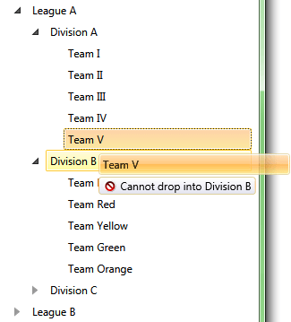

# Set DragCue Feedback for Denying a Drop

This topic demonstrates how to deny a drop operation over a specific item and specify a visual feedback indicating the operation is not allowed.

1. Let's start with the __RadTreeView__ definition. For the purpose of this tutorial we will use a __RadTreeView__ that is data bound to a collection of business objects as demonstrated in the [Binding to Object]() topic:
			
	<snippet id='radtreeview-how-to-drag-and-drop-set-drag-cue-feedback-deny-drop-block_1-xaml' />

2. Next, switch to the code-behind and attach to the __DragDropManager's DragOver__ routed event in the following manner:			

	<snippet id='radtreeview-how-to-drag-and-drop-set-drag-cue-feedback-deny-drop-block_2-cs' />
	<snippet id='radtreeview-how-to-drag-and-drop-set-drag-cue-feedback-deny-drop-block_3-vb' />

	>tip __RadTreeView__ handles internally the __DragDropManager__ events and in order to invoke a custom handler, you need to explicitly specify that you're adding a handler that should be invoked even for already handled events. This is done through the last - __bool__ argument of the __DragDropManager.AddDragOverHandler__ extension method.			  

3. In the handler, you need to get the dragged data and as we're working in the context of a single __RadTreeView__, we can safely assume that the dragged data type is __TreeViewDragDropOptions__. Once we have the options of the drag operation, we can configure them accordingly to the requirements of the application. In this example, we will implement a drag/drop operation that denies the drop inside any __Division__ object. In order to do so, we need to deny the drop operation when the __DropOperation__ is __Inside__ and the __DropTargetItem__ business item is of type __Division__:			

	<snippet id='radtreeview-how-to-drag-and-drop-set-drag-cue-feedback-deny-drop-block_4-cs' />
	<snippet id='radtreeview-how-to-drag-and-drop-set-drag-cue-feedback-deny-drop-block_5-vb' />

	>tip Please note that in order to disable the drop operation, we've set the __DropAction__ propety to __None__. This way if we drop an item over a __Division__ element, the __RadTreeView__ will know not to process the operation and will disregard the drop.			  

4. Finally, we have to update the __DragVisual__. In this example we will update the state of the visual indicator to know that it should represent an impossible drop and we will also change the drop action description:

	* In order to display a DropImpossible indicator in the __DragVisual__, you need to set the __IsDropPossible__ property to __False__.
	* In order to change the string describing the drop action, you need to set the __DropActionText__.

	<snippet id='radtreeview-how-to-drag-and-drop-set-drag-cue-feedback-deny-drop-block_6-cs' />
	<snippet id='radtreeview-how-to-drag-and-drop-set-drag-cue-feedback-deny-drop-block_7-vb' />

5. The end result should be similar to the snapshot below: 

	

>tip Find a runnable project of the previous example in the [WPF Samples GitHub repository](https://github.com/telerik/xaml-sdk/tree/master/TreeView/DenyDropVisualFeedback).

## See Also
 * [Enable Only Drop Inside]()
 * [Disable Drop at Specific Location]()
 * [Implement Copy Drag]()