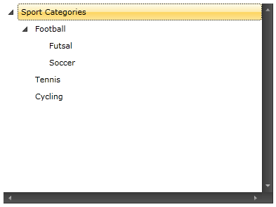

# Enable the Horizontal and Vertical Scrollbars

For example, you may have the following treeview: 

<snippet id='radtreeview-how-to-enable-horizontal-vertical-scrollbar-block_1-xaml' />
	

In order to enable horizontal and/or vertical scrollbar you need to add the following attribute(s) to the __RadTreeView__ declaration: 

<snippet id='radtreeview-how-to-enable-horizontal-vertical-scrollbar-block_2-xaml' />

And here is the result: 

The same operation can be done in the code-behind: 

<snippet id='radtreeview-how-to-enable-horizontal-vertical-scrollbar-block_3-cs' />
<snippet id='radtreeview-how-to-enable-horizontal-vertical-scrollbar-block_4-vb' />

If you want to enable the scrollbars __on demand__, you need to set the scrollbars visibility to __Auto__:
	

<snippet id='radtreeview-how-to-enable-horizontal-vertical-scrollbar-block_5-xaml' />
	

<snippet id='radtreeview-how-to-enable-horizontal-vertical-scrollbar-block_6-cs' />
<snippet id='radtreeview-how-to-enable-horizontal-vertical-scrollbar-block_7-vb' />
	
## See Also
 * [Disable Default Animation in RadTreeView]()
 * [Implement Drag and Drop Between TreeView and ListBox]()