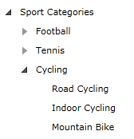

# Get Previous, Next, Parent and Sibling Node of a Specific TreeView Item

The __RadTreeViewItem__ class exposes properties which allow you to access:

* Previous node
* Previous sibling node
* Next node
* Next sibling node
* Parent node
* Root node

Here is a simple treeview declaration: 

#### __XAML__

```XAML
	<telerik:RadTreeView Margin="8" x:Name="radTreeView">
	    <telerik:RadTreeViewItem Header="Sport Categories">
	        <telerik:RadTreeViewItem Header="Football">
	            <telerik:RadTreeViewItem Header="Futsal"/>
	            <telerik:RadTreeViewItem Header="Soccer"/>
	        </telerik:RadTreeViewItem>
	        <telerik:RadTreeViewItem Header="Tennis">
	            <telerik:RadTreeViewItem Header="Table Tennis"/>
	        </telerik:RadTreeViewItem>
	        <telerik:RadTreeViewItem Header="Cycling">
	            <telerik:RadTreeViewItem Header="Road Cycling"/>
	            <telerik:RadTreeViewItem Header="Indoor Cycling"/>
	            <telerik:RadTreeViewItem Header="Mountain Bike"/>
	        </telerik:RadTreeViewItem>
	    </telerik:RadTreeViewItem>
	</telerik:RadTreeView>
```



For example, you should attach to the __SelectionChanged__ event and in the event handler get the selected items. Find the treeview declaration and add the following attribute: 

#### __XAML__

```XAML
	<telerik:RadTreeView Margin="8" x:Name="radTreeView" SelectionChanged="radTreeView_SelectionChanged">
```

#### __C#__

```C#
	private void radTreeView_SelectionChanged( object sender, Telerik.Windows.Controls.SelectionChangedEventArgs e )
	{
	    // Get a reference to the treeview
	    Telerik.Windows.Controls.RadTreeView treeView = sender as Telerik.Windows.Controls.RadTreeView;
	    // Get the currently selected items
	    ObservableCollection<Object> selectedItems = treeView.SelectedItems;
	    RadTreeViewItem item = selectedItems[ 0 ] as RadTreeViewItem;
	}
```

#### __VB.NET__

```VB.NET
	Private Sub radTreeView_SelectionChanged(ByVal sender As Object, ByVal e As Telerik.Windows.Controls.SelectionChangedEventArgs)
	    ' Get a reference to the treeview '
	    Dim treeView As Telerik.Windows.Controls.RadTreeView = TryCast(sender, Telerik.Windows.Controls.RadTreeView)
	
	    ' Get the currently selected items '
	    Dim selectedItems As ObservableCollection(Of [Object]) = treeView.SelectedItems
	
	    Dim item As RadTreeViewItem = TryCast(selectedItems(0), RadTreeViewItem)
	End Sub
```

## Accessing the PreviousItem and PreviousSiblingItem 

When you want to get the previous item in the hierarchy (no matter the level) you need to use the __PreviousItem__ property, while the __PreviousSiblingItem__ property will return you the previous item on the same level. For example:

* If you select the treeview item with header "Road Cycling", then the __PreviousItem__ property will return you the treeview item with header "Cycling", while the __PreviousSiblingItem__ property will return you null.

* If you select the treeview item with header "Indoor Cycling", then both of the properties will return you the treeview item with header "Road Cycling". 

#### __C#__

```C#
	private void radTreeView_SelectionChanged( object sender, Telerik.Windows.Controls.SelectionChangedEventArgs e )
	{
	    // Get a reference to the treeview
	    Telerik.Windows.Controls.RadTreeView treeView = sender as Telerik.Windows.Controls.RadTreeView;
	    // Get the currently selected items
	    ObservableCollection<Object> selectedItems = treeView.SelectedItems;
	    RadTreeViewItem item = selectedItems[ 0 ] as RadTreeViewItem;
	
	    // Get the previous item and the previous sibling item
	    RadTreeViewItem previousItem = item.PreviousItem;
	    RadTreeViewItem previousSiblingItem = item.PreviousSiblingItem;
	}
```

#### __VB.NET__

```VB.NET
	Private Sub radTreeView_SelectionChanged(ByVal sender As Object, ByVal e As Telerik.Windows.Controls.SelectionChangedEventArgs)
	    ' Get a reference to the treeview '
	    Dim treeView As Telerik.Windows.Controls.RadTreeView = TryCast(sender, Telerik.Windows.Controls.RadTreeView)
	
	    ' Get the currently selected items '
	    Dim selectedItems As ObservableCollection(Of [Object]) = treeView.SelectedItems
	
	    Dim item As RadTreeViewItem = TryCast(selectedItems(0), RadTreeViewItem)
	
	    ' Get the previous item and the previous sibling item '
	    Dim previousItem As RadTreeViewItem = item.PreviousItem
	    Dim previousSiblingItem As RadTreeViewItem = item.PreviousSiblingItem
	End Sub
```

## Accessing the NextItem and NextSiblingItem 

When you want to get the next item in the hierarchy (no matter the level) you need to use the __NextItem__ property, while the __NextSiblingItem__ property will return you the next item on the same level. For example:

* If you select the treeview item with header "Soccer", then the __NextItem__ property will return you the treeview item with header "Tennis", while the __NextSiblingItem__ property will return you null.

* If you select the treeview item with header "Futsal", then both of the properties will return you the treeview item with header "Soccer". 

#### __C#__

```C#
	private void radTreeView_SelectionChanged( object sender, Telerik.Windows.Controls.SelectionChangedEventArgs e )
	{
	    // Get a reference to the treeview
	    Telerik.Windows.Controls.RadTreeView treeView = sender as Telerik.Windows.Controls.RadTreeView;
	    // Get the currently selected items
	    ObservableCollection<Object> selectedItems = treeView.SelectedItems;
	    RadTreeViewItem item = selectedItems[ 0 ] as RadTreeViewItem;
	    // Get the previous item and the previous sibling item
	    RadTreeViewItem previousItem = item.PreviousItem;
	    RadTreeViewItem previousSiblingItem = item.PreviousSiblingItem;
	
	    // Get the next item and the next sibling item
	    RadTreeViewItem nextItem = item.NextItem;
	    RadTreeViewItem nextSiblingItem = item.NextSiblingItem;
	}
```

#### __XAML__

```XAML
	Private Sub radTreeView_SelectionChanged(ByVal sender As Object, ByVal e As Telerik.Windows.Controls.SelectionChangedEventArgs)
	    ' Get a reference to the treeview '
	    Dim treeView As Telerik.Windows.Controls.RadTreeView = TryCast(sender, Telerik.Windows.Controls.RadTreeView)
	
	    ' Get the currently selected items '
	    Dim selectedItems As ObservableCollection(Of [Object]) = treeView.SelectedItems
	
	    Dim item As RadTreeViewItem = TryCast(selectedItems(0), RadTreeViewItem)
	
	    ' Get the previous item and the previous sibling item '
	    Dim previousItem As RadTreeViewItem = item.PreviousItem
	    Dim previousSiblingItem As RadTreeViewItem = item.PreviousSiblingItem
	
	    ' Get the next item and the next sibling item '
	    Dim nextItem As RadTreeViewItem = item.NextItem
	    Dim nextSiblingItem As RadTreeViewItem = item.NextSiblingItem
	End Sub
```

## Accessing the ParentItem and RootItem 

If you want to get the parent item of the currently selected item, you should use the __ParentItem__ property. If you want to get the root item of the treeview, you should use the __RootItem__ property. For example:

* If you select the treeview item with header "Soccer", then the __ParentItem__ property will return you the treeview item with header "Football", while the __RootItem__ property will return you the treeview item with header "Sport Categories".

* If you select the treeview item with header "Sport Categories", then the __ParentItem__ property will return you null, while the __RootItem__ property will return you the same treeview item (with header "Sport Categories"). 

#### __C#__

```C#
	private void radTreeView_SelectionChanged( object sender, Telerik.Windows.Controls.SelectionChangedEventArgs e )
	{
	    // Get a reference to the treeview
	    Telerik.Windows.Controls.RadTreeView treeView = sender as Telerik.Windows.Controls.RadTreeView;
	    // Get the currently selected items
	    ObservableCollection<Object> selectedItems = treeView.SelectedItems;
	    RadTreeViewItem item = selectedItems[ 0 ] as RadTreeViewItem;
	    // Get the previous item and the previous sibling item
	    RadTreeViewItem previousItem = item.PreviousItem;
	    RadTreeViewItem previousSiblingItem = item.PreviousSiblingItem;
	
	    // Get the next item and the next sibling item
	    RadTreeViewItem nextItem = item.NextItem;
	    RadTreeViewItem nextSiblingItem = item.NextSiblingItem;
	
	    // Get the parent item and the root item
	    RadTreeViewItem parentItem = item.ParentItem;
	    RadTreeViewItem rootItem = item.RootItem;
	}
```

#### __VB.NET__

```VB.NET
	Private Sub radTreeView_SelectionChanged(ByVal sender As Object, ByVal e As Telerik.Windows.Controls.SelectionChangedEventArgs)
	    ' Get a reference to the treeview '
	    Dim treeView As Telerik.Windows.Controls.RadTreeView = TryCast(sender, Telerik.Windows.Controls.RadTreeView)
	
	    ' Get the currently selected items '
	    Dim selectedItems As ObservableCollection(Of [Object]) = treeView.SelectedItems
	
	    Dim item As RadTreeViewItem = TryCast(selectedItems(0), RadTreeViewItem)
	
	    ' Get the previous item and the previous sibling item '
	    Dim previousItem As RadTreeViewItem = item.PreviousItem
	    Dim previousSiblingItem As RadTreeViewItem = item.PreviousSiblingItem
	
	    ' Get the next item and the next sibling item '
	    Dim nextItem As RadTreeViewItem = item.NextItem
	    Dim nextSiblingItem As RadTreeViewItem = item.NextSiblingItem
	
	    ' Get the parent item and the root item '
	    Dim parentItem As RadTreeViewItem = item.ParentItem
	    Dim rootItem As RadTreeViewItem = item.RootItem
	End Sub
```

## See Also
 * [Expand and Collapse Items]()
 * [Implement Drag and Drop Between TreeView and ListBox]()
 * [Add Check Boxes (Radio Buttons) Next to Each Item]()