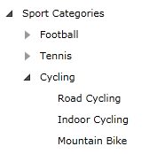

# Get Previous, Next, Parent and Sibling Node of a Specific TreeView Item

The __RadTreeViewItem__ class exposes properties which allow you to access:

* Previous node
* Previous sibling node
* Next node
* Next sibling node
* Parent node
* Root node

Here is a simple treeview declaration: 

<snippet id='radtreeview-how-to-get-previous-next-parent-sibling-node-block_1-xaml' />

For example, you should attach to the __SelectionChanged__ event and in the event handler get the selected items. Find the treeview declaration and add the following attribute: 

<snippet id='radtreeview-how-to-get-previous-next-parent-sibling-node-block_2-xaml' />

<snippet id='radtreeview-how-to-get-previous-next-parent-sibling-node-block_3-cs' />
<snippet id='radtreeview-how-to-get-previous-next-parent-sibling-node-block_4-vb' />

## Accessing the PreviousItem and PreviousSiblingItem 

When you want to get the previous item in the hierarchy (no matter the level) you need to use the __PreviousItem__ property, while the __PreviousSiblingItem__ property will return you the previous item on the same level. For example:

* If you select the treeview item with header "Road Cycling", then the __PreviousItem__ property will return you the treeview item with header "Cycling", while the __PreviousSiblingItem__ property will return you null.

* If you select the treeview item with header "Indoor Cycling", then both of the properties will return you the treeview item with header "Road Cycling". 

<snippet id='radtreeview-how-to-get-previous-next-parent-sibling-node-block_5-cs' />
<snippet id='radtreeview-how-to-get-previous-next-parent-sibling-node-block_6-vb' />

## Accessing the NextItem and NextSiblingItem 

When you want to get the next item in the hierarchy (no matter the level) you need to use the __NextItem__ property, while the __NextSiblingItem__ property will return you the next item on the same level. For example:

* If you select the treeview item with header "Soccer", then the __NextItem__ property will return you the treeview item with header "Tennis", while the __NextSiblingItem__ property will return you null.

* If you select the treeview item with header "Futsal", then both of the properties will return you the treeview item with header "Soccer". 

<snippet id='radtreeview-how-to-get-previous-next-parent-sibling-node-block_7-cs' />

<snippet id='radtreeview-how-to-get-previous-next-parent-sibling-node-block_8-vb' />

## Accessing the ParentItem and RootItem 

If you want to get the parent item of the currently selected item, you should use the __ParentItem__ property. If you want to get the root item of the treeview, you should use the __RootItem__ property. For example:

* If you select the treeview item with header "Soccer", then the __ParentItem__ property will return you the treeview item with header "Football", while the __RootItem__ property will return you the treeview item with header "Sport Categories".

* If you select the treeview item with header "Sport Categories", then the __ParentItem__ property will return you null, while the __RootItem__ property will return you the same treeview item (with header "Sport Categories"). 

<snippet id='radtreeview-how-to-get-previous-next-parent-sibling-node-block_9-cs' />
<snippet id='radtreeview-how-to-get-previous-next-parent-sibling-node-block_10-vb' />

## See Also
 * [Expand and Collapse Items]()
 * [Implement Drag and Drop Between TreeView and ListBox]()
 * [Add Check Boxes (Radio Buttons) Next to Each Item]()