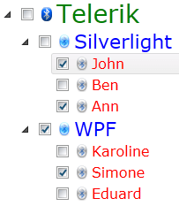

# Bind RadTreeViewItem CheckState Property

Telerik __RadTreeView__ gives you the ability to display check boxes next to each item. Thus the user is allowed to check/uncheck the nodes and to perform various tasks with the collection of checked nodes. For more information, please refer to the [CheckBox Support](763685D2-AB90-47E5-977F-526A5EA137C4) topic. 

This topic will walk you through the common task of binding the __RadTreeViewItem__'s __CheckState__ property to a property of a business object. The easiest way to do this is by using Telerik's ContainerBindingCollectionStyleBinding.

If you are not familiar with the __ContainerBindingCollection__ concept, it is recommended to read the [How to Bind RadTreeView to Hierarchical Data and Use ContainerBindingCollection]() topic before proceeding further with this section. Furthermore, this section will use exactly the same example as the aforemendoned topic.

Suppose that your business object has a boolean property named __IsChecked__. In the code snippet below the __Person__ object has a property __IsChecked__. This property will be bound to the __CheckState__ property of the __RadTreeViewItem__.

#### __C#__

{{region radtreeview-howto-bind-checkstate-property_0}}
	public class Person
	{
	    public bool IsChecked
	    {
	        get;
	        set;
	    }
	    // Other class members...
	}
	{{endregion}}

#### __VB.NET__

{{region radtreeview-howto-bind-checkstate-property_1}}
	Public Class Person
	Private _IsChecked As Boolean
	    Public Property IsChecked() As Boolean
	        Get
	            Return _IsChecked
	        End Get
	        Set(ByVal value As Boolean)
	            _IsChecked = value
	        End Set
	    End Property
	    ' Other class members...
	End Class
	{{endregion}}

Using [ContainerBindingCollection]() to bind the __IsChecked__property to the __CheckState__ property is a pretty simple action. For example, see the code snippet below. The only thing you should do is to define the __ContainerBinding__ and to attach the binding collection to the __HierarchicalDataTemplate__.

#### __XAML__

{{region radtreeview-howto-bind-checkstate-property_2}}
	<telerik:ContainerBindingCollection x:Name="BindingsCollection">
	    <telerik:ContainerBinding PropertyName="CheckState" Binding="{Binding IsChecked, Converter={StaticResource CheckStateConverter}}"/>
	    <!--Other Container Bindings-->
	</telerik:ContainerBindingCollection>
	<!--Data template for the Person object-->
	<telerik:HierarchicalDataTemplate  
	    x:Key="PersonTemplate"  
	    telerik:ContainerBinding.ContainerBindings="{StaticResource BindingsCollection}">
	    <TextBlock Text="{Binding Name}" Foreground="Red" FontSize="16" FontFamily="Verdana" />
	</telerik:HierarchicalDataTemplate>
	{{endregion}}

In this example the __IsChecked__ property is a boolean property. However, the __RadTreeViewItem__'s __CheckState__ property is of type __ToggleState__. That's why you need to additionally create a converter:

#### __C#__

{{region radtreeview-howto-bind-checkstate-property_3}}
	public class CheckStateConverter : IValueConverter
	{
	    public object Convert( object value, Type targetType, object parameter, System.Globalization.CultureInfo culture )
	    {
	        bool result = ( bool )value;
	        return result ? ToggleState.On : ToggleState.Off;
	    }
	    public object ConvertBack( object value, Type targetType, object parameter, System.Globalization.CultureInfo culture )
	    {
	        ToggleState state = ( ToggleState )value;
	        return state == ToggleState.On ? true : false;
	    }
	}
	{{endregion}}

#### __VB.NET__

{{region radtreeview-howto-bind-checkstate-property_4}}
	Public Class CheckStateConverter
	    Implements IValueConverter
	    Public Function Convert(ByVal value As Object, ByVal targetType As Type, ByVal parameter As Object, ByVal culture As System.Globalization.CultureInfo) As Object
	        Dim result As Boolean = CBool(value)
	        Return If(result, ToggleState.[On], ToggleState.Off)
	    End Function
	
	    Public Function ConvertBack(ByVal value As Object, ByVal targetType As Type, ByVal parameter As Object, ByVal culture As System.Globalization.CultureInfo) As Object
	        Dim state As ToggleState = DirectCast(value, ToggleState)
	        Return If(state = ToggleState.[On], True, False)
	    End Function
	End Class
	{{endregion}}

>

For a complete code listing, please take a look at the [How to Bind RadTreeView to Hierarchical Data and Use ContainerBindingCollection]() topic. If you want to bind the __RadTreeViewItem__'s __CheckState__property____you should change two things in the code:

* First, ensure that your __Person__, __Department__and __Organization__business objects have properties representing the check state.  The property could be of type __bool__ or of type __ToggleState__. If your property is of type __bool__, then you have to create a converter. 
			

* Second, add container bindings like in the code snippet above.
            

## See Also

 * [Implement a Tri-State CheckBox logic using MVVM]()

 * [Bind RadTreeView ImageSource Properties]()

 * [Expand and Select Item with Load on Demand Enabled RadTreeView]()
