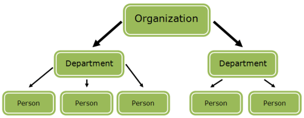
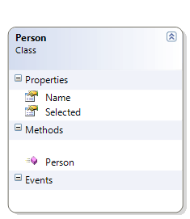
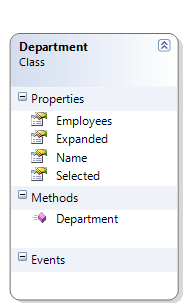
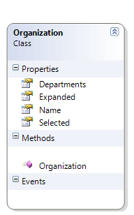
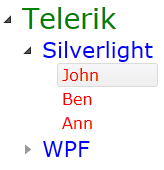

# Bind RadTreeView to Hierarchical Data and Use Style Binding

This tutorial demonstrates the usage of __HierarchicalDataTemplate__ and __Style Bindings__ in __RadTreeView__.

For more information about __HierarchicalDataTemplate__ take a look at the [HierarchicalDataTemplates]() topic.

Imagine the following scenario. You have an Organization that has several Departments, and each Department has several Employees.


It is not that difficult to create a data source reflecting the above structure. This is how the three classes look like: 

* __Person__ class:		  

	

	```C#
		public class Person
		{
			public Person()
			{
			}
			public string Name
			{
				get;
				set;
			}
			public bool Selected
			{
				get;
				set;
			}
		}
	```
	```VB.NET
		Public Class Person
			Public Sub New()
			End Sub
		
		Private _Name As String
			Public Property Name() As String
				Get
					Return _Name
				End Get
				Set(ByVal value As String)
					_Name = value
				End Set
			End Property
		
		Private _Selected As Boolean
			Public Property Selected() As Boolean
				Get
					Return _Selected
				End Get
				Set(ByVal value As Boolean)
					_Selected = value
				End Set
			End Property
		End Class
	```

* __Department__ class:

	

	```C#
		public class Department
		{
			public Department()
			{
				this.Employees = new List<Person>();
			}
			public string Name
			{
				get;
				set;
			}
			public bool Selected
			{
				get;
				set;
			}
			public bool Expanded
			{
				get;
				set;
			}
			public List<Person> Employees
			{
				get;
				set;
			}
		}
	```
	```VB.NET
		Public Class Department
			Public Sub New()
				Me.Employees = New List(Of Person)()
			End Sub
		
		Private _Name As String
			Public Property Name() As String
				Get
					Return _Name
				End Get
				Set(ByVal value As String)
					_Name = value
				End Set
			End Property
		
		Private _Selected As Boolean
			Public Property Selected() As Boolean
				Get
					Return _Selected
				End Get
				Set(ByVal value As Boolean)
					_Selected = value
				End Set
			End Property
		
		Private _Expanded As Boolean
			Public Property Expanded() As Boolean
				Get
					Return _Expanded
				End Get
				Set(ByVal value As Boolean)
					_Expanded = value
				End Set
			End Property
		
		Private _Employees As List(Of Person)
			Public Property Employees() As List(Of Person)
				Get
					Return _Employees
				End Get
				Set(ByVal value As List(Of Person))
					_Employees = value
				End Set
			End Property
		End Class
	```

* __Organization__ class
		  

	

	```C#
		public class Organization
		{
			public Organization()
			{
				this.Departments = new List<Department>();
			}
			public string Name
			{
				get;
				set;
			}
			public bool Selected
			{
				get;
				set;
			}
			public bool Expanded
			{
				get;
				set;
			}
			public List<Department> Departments
			{
				get;
				set;
			}
		}
	```
	```VB.NET
		Public Class Organization
			Public Sub New()
				Me.Departments = New List(Of Department)()
			End Sub
		
		Private _Name As String
			Public Property Name() As String
				Get
					Return _Name
				End Get
				Set(ByVal value As String)
					_Name = value
				End Set
			End Property
		
		Private _Selected As Boolean
			Public Property Selected() As Boolean
				Get
					Return _Selected
				End Get
				Set(ByVal value As Boolean)
					_Selected = value
				End Set
			End Property
		
		Private _Expanded As Boolean
			Public Property Expanded() As Boolean
				Get
					Return _Expanded
				End Get
				Set(ByVal value As Boolean)
					_Expanded = value
				End Set
			End Property
		
		Private _Departments As List(Of Department)
			Public Property Departments() As List(Of Department)
				Get
					Return _Departments
				End Get
				Set(ByVal value As List(Of Department))
					_Departments = value
				End Set
			End Property
		End Class
	```

As you can see, an __Organization__ has a __Name__ and a list of __Departments__. A __Department__ also has a __Name__, as well as a list of people that work in that __Department__. A __Person__ has a __Name__. There are two more properties - __Selected__ and __Expanded__. They will be explained further in the article, but in short, they will be used to control whether a certain __RadTreeViewItem__ is expanded or selected.		

Having the above three classes set up, it is time to create and populate a data source, which will be passed to the __RadTreeView's ItemsSource__ property.		

```C#
	public class DataSource : List<Organization>
	{
	    public DataSource()
	    {
	        Organization telerik = new Organization()
	        {
	            Name = "Telerik"
	        };
	        Department silverlight = new Department()
	        {
	            Name = "Silverlight"
	        };
	        Department wpf = new Department()
	        {
	            Name = "WPF"
	        };
	        telerik.Departments.Add( silverlight );
	        telerik.Departments.Add( wpf );
	        silverlight.Employees.Add( new Person()
	        {
	            Name = "John"
	        } );
	        silverlight.Employees.Add( new Person()
	        {
	            Name = "Ben"
	        } );
	        silverlight.Employees.Add( new Person()
	        {
	            Name = "Ann"
	        } );
	        wpf.Employees.Add( new Person()
	        {
	            Name = "Karoline"
	        } );
	        wpf.Employees.Add( new Person()
	        {
	            Name = "Simone"
	        } );
	        wpf.Employees.Add( new Person()
	        {
	            Name = "Eduard"
	        } );
	        this.Add( telerik );
	    } 
	}
```
```VB.NET
	Public Class DataSource
	    Inherits List(Of Organization)
	    Public Sub New()
	        Dim telerik As New Organization("Telerik")
	        Dim silverlight As New Department("Silverlight")
	        Dim wpf As New Department("WPF")
	
	        telerik.Departments.Add(silverlight)
	        telerik.Departments.Add(wpf)
	
	        silverlight.Employees.Add(New Person("John"))
	        silverlight.Employees.Add(New Person("Ben"))
	        silverlight.Employees.Add(New Person("Ann"))
	
	        wpf.Employees.Add(New Person("Karoline"))
	        wpf.Employees.Add(New Person("Simone"))
	        wpf.Employees.Add(New Person("Eduard"))
	
	        Me.Add(telerik)
	    End Sub
	End Class
```

And setting __RadTreeView's ItemsSource__ property in XAML:

```XAML
	<UserControl.Resources>
	    <example:DataSource x:Key="TreeViewDataSource"/>
	</UserControl.Resources>
```

```XAML
	<telerik:RadTreeView  Margin="8"
	    SelectionMode="Multiple"      
	    ItemsSource="{Binding Source={StaticResource TreeViewDataSource}}"/>
```

Now it is time to define how each level of the __RadTreeView__ will look like. You should use __HierarchicalDataTemplate__.
	
```XAML
	<!--Data template for the Person object-->
	<DataTemplate  DataType="{x:Type sampleData:Person}">  
	    <TextBlock Text="{Binding Name}" Foreground="Red" FontSize="16" FontFamily="Verdana" />
	</DataTemplate>
	
	<!--Data template for the Department object-->
	<HierarchicalDataTemplate DataType="{x:Type sampleData:Department}"
	    ItemsSource="{Binding Employees}">  
	    <TextBlock Text="{Binding Name}" Foreground="Blue" FontSize="22" FontFamily="Verdana" />
	</HierarchicalDataTemplate>
	
	<!--Data template for the Organization object-->
	<HierarchicalDataTemplate  DataType="{x:Type sampleData:Organization}"  
	    ItemsSource="{Binding Departments}">
	    <TextBlock Text="{Binding Name}" Foreground="Green" FontSize="28" FontFamily="Verdana" />
	</HierarchicalDataTemplate>
```

But what if you want to expand only the "Silverlight" node and to select the "John" node, leaving the WPF node collapsed. This is where the Style Binding comes in hand.	

Define a new style with __RadTreeViewItem__ for target type.
		
```XAML
	<Style x:Key="ItemContainerStyle" TargetType="{x:Type telerik:RadTreeViewItem}">
	    <Setter Property="IsSelected" Value="{Binding Path=Selected}"/>
	    <Setter Property="IsExpanded" Value="{Binding Path=Expanded}"/>
	</Style>
```

Find your treeview declaration and set the __ItemContainerStyle__ property.

```XAML
	<telerik:RadTreeView  Margin="8"
	    SelectionMode="Multiple"      
	    ItemsSource="{Binding Source={StaticResource TreeViewDataSource}}"
	    ItemContainerStyle="{StaticResource ItemContainerStyle}"/>
```

As you can see, the __IsSelected__ property of each __RadTreeViewItem__ is bound to the __Selected__ property in the data source. The same is with the __IsExpanded__ property. That's why now you have to update your data source.

```C#
	public DataSource()
	{
	    Organization telerik = new Organization()
	    {
	        Name = "Telerik",
	        Expanded = true,
	        Selected = false
	    };
	    Department silverlight = new Department()
	    {
	        Name = "Silverlight",
	        Expanded = true,
	        Selected = false
	    };
	    Department wpf = new Department()
	    {
	        Name = "WPF",
	        Expanded = false,
	        Selected = false
	    };
	    telerik.Departments.Add( silverlight );
	    telerik.Departments.Add( wpf );
	    silverlight.Employees.Add( new Person()
	    {
	        Name = "John",
	        Selected = true
	    } );
	    silverlight.Employees.Add( new Person()
	    {
	        Name = "Ben",
	        Selected = false
	    } );
	    silverlight.Employees.Add( new Person()
	    {
	        Name = "Ann",
	        Selected = false
	    } );
	    wpf.Employees.Add( new Person()
	    {
	        Name = "Karoline",
	        Selected = false
	    } );
	    wpf.Employees.Add( new Person()
	    {
	        Name = "Simone",
	        Selected = false
	    } );
	    wpf.Employees.Add( new Person()
	    {
	        Name = "Eduard",
	        Selected = false
	    } );
	    this.Add( telerik );
	}
```
```VB.NET
	Public Class DataSource
	    Inherits List(Of Organization)
	    Public Sub New()
	        Dim telerik As New Organization("Telerik", False, True)
	        Dim silverlight As New Department("Silverlight", False, True)
	        Dim wpf As New Department("WPF", False, False)
	
	        telerik.Departments.Add(silverlight)
	        telerik.Departments.Add(wpf)
	
	        silverlight.Employees.Add(New Person("John", True))
	        silverlight.Employees.Add(New Person("Ben", False))
	        silverlight.Employees.Add(New Person("Ann", False))
	
	        wpf.Employees.Add(New Person("Karoline", False))
	        wpf.Employees.Add(New Person("Simone", False))
	        wpf.Employees.Add(New Person("Eduard", False))
	
	        Me.Add(telerik)
	    End Sub
	End Class
```

So now, if you run the project, you will see the following result:


> If you want to implement two way data binding, your business objects should implement the __INotifyPropertyChanged__ interface. Additionally, you should set the __Binding's Mode__ to __TwoWay__ in the __Style__ declaration.
	
>`<Style x:Key="ItemContainerStyle" TargetType="{x:Type telerik:RadTreeViewItem}">`
>`<Setter Property="IsSelected" Value="{Binding Path=Selected, Mode=TwoWay}"/>`
>`<Setter Property="IsExpanded" Value="{Binding Path=Expanded, Mode=TwoWay}"/>`
>`</Style>`