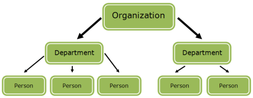
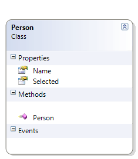
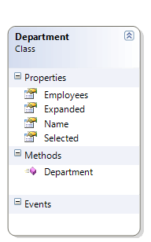
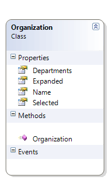
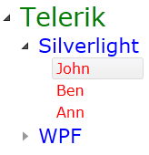

# Bind RadTreeView to Hierarchical Data and Use Style Binding

This tutorial demonstrates the usage of __HierarchicalDataTemplate__ and __Style Bindings__ in __RadTreeView__.

For more information about __HierarchicalDataTemplate__ take a look at the [HierarchicalDataTemplates]() topic.

Imagine the following scenario. You have an Organization that has several Departments, and each Department has several Employees.

It is not that difficult to create a data source reflecting the above structure. This is how the three classes look like: 

* __Person__ class:		  

	

	<snippet id='radtreeview-how-to-howto-bind-hierarchical-data-style-binding-block_1-cs' />
	<snippet id='radtreeview-how-to-howto-bind-hierarchical-data-style-binding-block_2-vb' />

* __Department__ class:

	

	<snippet id='radtreeview-how-to-howto-bind-hierarchical-data-style-binding-block_3-cs' />
	<snippet id='radtreeview-how-to-howto-bind-hierarchical-data-style-binding-block_4-vb' />

* __Organization__ class
		  

	

	<snippet id='radtreeview-how-to-howto-bind-hierarchical-data-style-binding-block_5-cs' />
	<snippet id='radtreeview-how-to-howto-bind-hierarchical-data-style-binding-block_6-vb' />

As you can see, an __Organization__ has a __Name__ and a list of __Departments__. A __Department__ also has a __Name__, as well as a list of people that work in that __Department__. A __Person__ has a __Name__. There are two more properties - __Selected__ and __Expanded__. They will be explained further in the article, but in short, they will be used to control whether a certain __RadTreeViewItem__ is expanded or selected.		

Having the above three classes set up, it is time to create and populate a data source, which will be passed to the __RadTreeView's ItemsSource__ property.		

<snippet id='radtreeview-how-to-howto-bind-hierarchical-data-style-binding-block_7-cs' />
<snippet id='radtreeview-how-to-howto-bind-hierarchical-data-style-binding-block_8-vb' />

And setting __RadTreeView's ItemsSource__ property in XAML:

<snippet id='radtreeview-how-to-howto-bind-hierarchical-data-style-binding-block_9-xaml' />

<snippet id='radtreeview-how-to-howto-bind-hierarchical-data-style-binding-block_10-xaml' />

Now it is time to define how each level of the __RadTreeView__ will look like. You should use __HierarchicalDataTemplate__.
	
<snippet id='radtreeview-how-to-howto-bind-hierarchical-data-style-binding-block_11-xaml' />

But what if you want to expand only the "Silverlight" node and to select the "John" node, leaving the WPF node collapsed. This is where the Style Binding comes in hand.	

Define a new style with __RadTreeViewItem__ for target type.
		
<snippet id='radtreeview-how-to-howto-bind-hierarchical-data-style-binding-block_12-xaml' />

Find your treeview declaration and set the __ItemContainerStyle__ property.

<snippet id='radtreeview-how-to-howto-bind-hierarchical-data-style-binding-block_13-xaml' />

As you can see, the __IsSelected__ property of each __RadTreeViewItem__ is bound to the __Selected__ property in the data source. The same is with the __IsExpanded__ property. That's why now you have to update your data source.

<snippet id='radtreeview-how-to-howto-bind-hierarchical-data-style-binding-block_14-cs' />
<snippet id='radtreeview-how-to-howto-bind-hierarchical-data-style-binding-block_15-vb' />

So now, if you run the project, you will see the following result:

> If you want to implement two way data binding, your business objects should implement the __INotifyPropertyChanged__ interface. Additionally, you should set the __Binding's Mode__ to __TwoWay__ in the __Style__ declaration.
	
>``