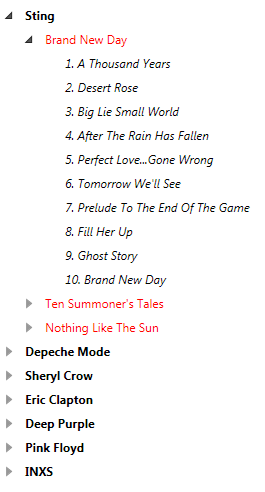
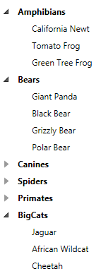

# Bind RadTreeView in WPF

One of the most common scenarios is populating the __RadTreeView__ with data. In WPF data binding is one of the most powerful concepts. Data binding the __RadTreeView__ can be done in several ways.

This tutorial will show you two of them:

* Binding to an XML - using a __XmlDataProvider__.
* Binding using grouping and __CollectionViewSource__.

## XML Data Binding

1. Define a XML source:

	<snippet id='radtreeview-how-to-howto-bind-treeview-wpf-block_1-xaml' />

2. Define __HierarchicalDataTemplates__, which will "tell" the __RadTreeView__ how to display the XML data.

	<snippet id='radtreeview-how-to-howto-bind-treeview-wpf-block_2-xaml' />

	>For more information about __HierarchicalDataTemplates__ read [here]().		  

3. To define the XML data you should use a __XMLDataProvider__. You need to point the __Source__ property to the XML file and set the __XPath__ property to the root element of the XML.

	<snippet id='radtreeview-how-to-howto-bind-treeview-wpf-block_3-xaml' />

4. Set the __ItemsSource__ property of the __RadTreeView__.

	<snippet id='radtreeview-how-to-howto-bind-treeview-wpf-block_4-xaml' />

5. Run your demo. Here is the final result:

	

You can download this demo as project in our [CodeLibrary](http://www.telerik.com/community/code-library/wpf/treeview/radtreeview-using-xmldataprovider.aspx)

## Binding to a CollectionViewSource

This is a bit more advanced example. Say you have a flat collection of objects and you want to group it by some common property. For this example you have a collection of animals. Each __Animal__ class has a __Category__ property that you will use to create a hierarchical view. The grouping of the data can be easily achieved if you use the WPF __ColelctionViewSource__ class.

1. Define your data.

	* Create a class named __Animal__, which have two properties - __Name__ and __Category__.			

		<snippet id='radtreeview-how-to-howto-bind-treeview-wpf-block_5-cs' />
		<snippet id='radtreeview-how-to-howto-bind-treeview-wpf-block_6-vb' />

		The __Category__ property is of type __Category__ which is an enumeration.

		<snippet id='radtreeview-how-to-howto-bind-treeview-wpf-block_7-cs' />
		<snippet id='radtreeview-how-to-howto-bind-treeview-wpf-block_8-vb' />

	* Create some sample data					

		<snippet id='radtreeview-how-to-howto-bind-treeview-wpf-block_9-cs' />
		<snippet id='radtreeview-how-to-howto-bind-treeview-wpf-block_10-vb' />

2. Configure the __CollectionViewSource__.

	* Set the __Source__ property to point to our collection.
	* Set the grouping using the __GroupDescriptions__.			

		<snippet id='radtreeview-how-to-howto-bind-treeview-wpf-block_11-xaml' />

3. Create data templates.  

	<snippet id='radtreeview-how-to-howto-bind-treeview-wpf-block_12-xaml' />

4. Set the __RadTreeView__ to point to the __CollectionViewSource__.  

	<snippet id='radtreeview-how-to-howto-bind-treeview-wpf-block_13-xaml' />

The final result may be seen on the snapshot below:

You can download this demo as project in our [CodeLibrary](http://www.telerik.com/community/code-library/wpf/treeview/radtreeview-using-collectionviewsource.aspx)

## See Also
 * [Bind RadTreeView to Self-Referencing Data]()
 * [Create Horizontal TreeView]()