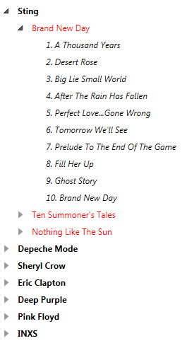
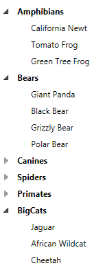

# Bind RadTreeView

One of the most common scenarios is populating the __RadTreeView__ with data. In WPF data binding is one of the most powerful concepts. Data binding the __RadTreeView__ can be done in several ways.
	  

This tutorial will show you two of them:

* Binding to an XML - using a __XmlDataProvider__.
		  

* Binding using grouping and __CollectionViewSource__.
		  

## XML Data Binding

1. Define a XML source:

#### __XAML__

{{region radtreeview-howto-bind-treeview_0}}
	<?xml version="1.0" encoding="UTF-8"?>
	<Artists>
	    <Artist>
	        <ArtistID>1</ArtistID>
	        <ArtistName>Sting</ArtistName>
	        <ImageName>Add.png</ImageName>
	        <Albums>
	            <Album>
	                <AlbumID>1</AlbumID>
	                <ArtistID>1</ArtistID>
	                <AlbumName>Brand New Day</AlbumName>
	                <ImageName>-1</ImageName>
	                <Songs>
	                    <Song>
	                        <SongID>1</SongID>
	                        <AlbumID>1</AlbumID>
	                        <SongName>1. A Thousand Years</SongName>
	                    </Song>
	                    <Song>
	                        <SongID>2</SongID>
	                        <AlbumID>1</AlbumID>
	                        <SongName>2. Desert Rose</SongName>
	                    </Song>
	                    <Song>
	                        <SongID>3</SongID>
	                        <AlbumID>1</AlbumID>
	                        <SongName>3. Big Lie Small World</SongName>
	                    </Song>
	                    <Song>
	                        <SongID>4</SongID>
	                        <AlbumID>1</AlbumID>
	                        <SongName>4. After The Rain Has Fallen</SongName>
	                    </Song>
	                    <Song>
	                        <SongID>5</SongID>
	                        <AlbumID>1</AlbumID>
	                        <SongName>5. Perfect Love...Gone Wrong</SongName>
	                    </Song>
	                    <Song>
	                        <SongID>6</SongID>
	                        <AlbumID>1</AlbumID>
	                        <SongName>6. Tomorrow We&apos;ll See</SongName>
	                    </Song>
	                    <Song>
	                        <SongID>7</SongID>
	                        <AlbumID>1</AlbumID>
	                        <SongName>7. Prelude To The End Of The Game</SongName>
	                    </Song>
	                    <Song>
	                        <SongID>8</SongID>
	                        <AlbumID>1</AlbumID>
	                        <SongName>8. Fill Her Up</SongName>
	                    </Song>
	                    <Song>
	                        <SongID>9</SongID>
	                        <AlbumID>1</AlbumID>
	                        <SongName>9. Ghost Story</SongName>
	                    </Song>
	                    <Song>
	                        <SongID>10</SongID>
	                        <AlbumID>1</AlbumID>
	                        <SongName>10. Brand New Day</SongName>
	                    </Song>
	                </Songs>
	            </Album>
	        </Albums>
	    </Artist>
	    <Artist>
	        <ArtistID>2</ArtistID>
	        <ArtistName>Depeche Mode</ArtistName>
	        <ImageName>Favorites.png</ImageName>
	        <Albums>
	            <Album>
	                <AlbumID>4</AlbumID>
	                <ArtistID>2</ArtistID>
	                <AlbumName>Violator</AlbumName>
	                <ImageName>-1</ImageName>
	                <Songs>
	                    <Song>
	                        <SongID>34</SongID>
	                        <AlbumID>4</AlbumID>
	                        <SongName>1. World In My Eyes</SongName>
	                    </Song>
	                    <Song>
	                        <SongID>35</SongID>
	                        <AlbumID>4</AlbumID>
	                        <SongName>2. Sweetest Perfection</SongName>
	                    </Song>
	                    <Song>
	                        <SongID>36</SongID>
	                        <AlbumID>4</AlbumID>
	                        <SongName>3. Personal Jesus</SongName>
	                    </Song>
	                    <Song>
	                        <SongID>37</SongID>
	                        <AlbumID>4</AlbumID>
	                        <SongName>4. Halo</SongName>
	                    </Song>
	                    <Song>
	                        <SongID>38</SongID>
	                        <AlbumID>4</AlbumID>
	                        <SongName>5. Waiting For The Night</SongName>
	                    </Song>
	                    <Song>
	                        <SongID>39</SongID>
	                        <AlbumID>4</AlbumID>
	                        <SongName>6. Enjoy The Silence</SongName>
	                    </Song>
	                    <Song>
	                        <SongID>40</SongID>
	                        <AlbumID>4</AlbumID>
	                        <SongName>7. Policy Of Truth</SongName>
	                    </Song>
	                    <Song>
	                        <SongID>41</SongID>
	                        <AlbumID>4</AlbumID>
	                        <SongName>8. Blue Dress</SongName>
	                    </Song>
	                    <Song>
	                        <SongID>42</SongID>
	                        <AlbumID>4</AlbumID>
	                        <SongName>9. Clean</SongName>
	                    </Song>
	                </Songs>
	            </Album>
	        </Albums>
	    </Artist>
	</Artists>
	{{endregion}}

2. Define __HierarchicalDataTemplates__, which will "tell" the __RadTreeView__ how to display the XML data.
		

#### __XAML__

{{region radtreeview-howto-bind-treeview_1}}
	<telerik:HierarchicalDataTemplate DataType="Artist"    
	    ItemsSource="{Binding XPath=Albums/Album}">
	    <TextBlock FontWeight="Bold" Text="{Binding XPath=ArtistName}" />
	</telerik:HierarchicalDataTemplate>
	
	<telerik:HierarchicalDataTemplate DataType="Album"    
	    ItemsSource="{Binding XPath=Songs/Song}">
	    <TextBlock Foreground="Red" Text="{Binding XPath=AlbumName}" />
	</telerik:HierarchicalDataTemplate>
	
	<DataTemplate DataType="Song">
	    <TextBlock FontStyle="Italic" Text="{Binding XPath=SongName}" />
	</DataTemplate>
	{{endregion}}

>For more information about __HierarchicalDataTemplates__ read [here]().
		  

3. To define the XML data you should use a __XMLDataProvider__. You need to point the __Source__ property to the XML file and set the __XPath__ property to the root element of the XML.
		

#### __XAML__

{{region radtreeview-howto-bind-treeview_2}}
	<XmlDataProvider x:Key="XmlDataProvider"
	    XPath="/Artists" Source="Artists.xml"/>
	{{endregion}}

4. Set the __ItemsSource__ property of the __RadTreeView__.
		

#### __XAML__

{{region radtreeview-howto-bind-treeview_3}}
	<telerik:RadTreeView x:Name="radTreeView" Margin="8"
	    ItemsSource="{Binding Source={StaticResource XmlDataProvider}, XPath=Artist}"/>
	{{endregion}}

5. Run your demo. Here is the final result:

You can download this demo as project in our
		  [CodeLibrary](http://www.telerik.com/community/code-library/wpf/treeview/radtreeview-using-xmldataprovider.aspx)

## Binding to a CollectionViewSource

This is a bit more advanced example. Say you have a flat collection of objects and you want to group it by some common property. For this example you have a collection of animals. Each __Animal__ class has a __Category__ property that you will use to create a hierarchical view. The grouping of the data can be easily achieved if you use the WPF __ColelctionViewSource__ class.
		

1. Define your data.

* Create a class named __Animal__, which have two properties - __Name__ and __Category__.
			

#### __C#__

{{region radtreeview-howto-bind-treeview_4}}
		public class Animal
		{
			public Animal(string name, Category category)
			{
				this.Name = name;
				this.Category = category;
			}
			public string Name
			{
				get;
				set;
			}
			public Category Category
			{
				get;
				set;
			}
		}
	{{endregion}}

#### __VB.NET__

{{region radtreeview-howto-bind-treeview_5}}
		Public Class Animal
			Public Sub New(ByVal name As String, ByVal category As Category)
				Me.Name = name
				Me.Category = category
			End Sub
	
			Private _Name As String
			Public Property Name() As String
				Get
					Return _Name
				End Get
				Set(ByVal value As String)
					_Name = value
				End Set
			End Property
	
			Private _Category As Category
			Public Property Category() As Category
				Get
					Return _Category
				End Get
				Set(ByVal value As Category)
					_Category = value
				End Set
			End Property
		End Class
	{{endregion}}

The __Category__ property is of type __Category__ which is an enumeration.
		

#### __C#__

{{region radtreeview-howto-bind-treeview_6}}
		public enum Category
		{
			Amphibians,
			Bears,
			Canines,
			Spiders,
			Primates,
			BigCats
		}
	{{endregion}}

#### __VB.NET__

{{region radtreeview-howto-bind-treeview_7}}
		Public Enum Category
			Amphibians
			Bears
			Canines
			Spiders
			Primates
			BigCats
		End Enum
	{{endregion}}

* Create some sample data
			

#### __C#__

{{region radtreeview-howto-bind-treeview_8}}
		public class Animal
		{
			public Animal(string name, Category category)
			{
				this.Name = name;
				this.Category = category;
			}
			public string Name
			{
				get;
				set;
			}
			public Category Category
			{
				get;
				set;
			}
			public IEnumerable<Animal> AnimalList
			{
				get
				{
					List<Animal> animalList = new List<Animal>();
					animalList.Add(new Animal("California Newt", Category.Amphibians));
					animalList.Add(new Animal("Giant Panda", Category.Bears));
					animalList.Add(new Animal("Coyote", Category.Canines));
					animalList.Add(new Animal("Golden Silk Spader", Category.Spiders));
					animalList.Add(new Animal("Mandrill", Category.Primates));
					animalList.Add(new Animal("Black Bear", Category.Bears));
					animalList.Add(new Animal("Jaguar", Category.BigCats));
					animalList.Add(new Animal("Bornean Gibbon", Category.Primates));
					animalList.Add(new Animal("African Wildcat", Category.BigCats));
					animalList.Add(new Animal("Artic Fox", Category.Canines));
					animalList.Add(new Animal("Tomato Frog", Category.Amphibians));
					animalList.Add(new Animal("Grizzly Bear", Category.Bears));
					animalList.Add(new Animal("Dingo", Category.Canines));
					animalList.Add(new Animal("Gorilla", Category.Primates));
					animalList.Add(new Animal("Green Tree Frog", Category.Amphibians));
					animalList.Add(new Animal("Bald Vakari", Category.Primates));
					animalList.Add(new Animal("Polar Bear", Category.Bears));
					animalList.Add(new Animal("Black Widow Spider", Category.Spiders));
					animalList.Add(new Animal("Bat-Eared Fox", Category.Canines));
					animalList.Add(new Animal("Cheetah", Category.BigCats));
					return animalList.AsEnumerable();
				}
			}
		}
	{{endregion}}

#### __VB.NET__

{{region radtreeview-howto-bind-treeview_9}}
		Public Class Animal
			Public Sub New(ByVal name As String, ByVal category As Category)
				Me.Name = name
				Me.Category = category
			End Sub
	
			Private _Name As String
			Public Property Name() As String
				Get
					Return _Name
				End Get
				Set(ByVal value As String)
					_Name = value
				End Set
			End Property
	
			Private _Category As Category
			Public Property Category() As Category
				Get
					Return _Category
				End Get
				Set(ByVal value As Category)
					_Category = value
				End Set
			End Property
	
			Public ReadOnly Property AnimalList() As IEnumerable(Of Animal)
				Get
					Dim animalList As New List(Of Animal)()
					animalList.Add(New Animal("California Newt", Category.Amphibians))
					animalList.Add(New Animal("Giant Panda", Category.Bears))
					animalList.Add(New Animal("Coyote", Category.Canines))
					animalList.Add(New Animal("Golden Silk Spader", Category.Spiders))
					animalList.Add(New Animal("Mandrill", Category.Primates))
					animalList.Add(New Animal("Black Bear", Category.Bears))
					animalList.Add(New Animal("Jaguar", Category.BigCats))
					animalList.Add(New Animal("Bornean Gibbon", Category.Primates))
					animalList.Add(New Animal("African Wildcat", Category.BigCats))
					animalList.Add(New Animal("Artic Fox", Category.Canines))
					animalList.Add(New Animal("Tomato Frog", Category.Amphibians))
					animalList.Add(New Animal("Grizzly Bear", Category.Bears))
					animalList.Add(New Animal("Dingo", Category.Canines))
					animalList.Add(New Animal("Gorilla", Category.Primates))
					animalList.Add(New Animal("Green Tree Frog", Category.Amphibians))
					animalList.Add(New Animal("Bald Vakari", Category.Primates))
					animalList.Add(New Animal("Polar Bear", Category.Bears))
					animalList.Add(New Animal("Black Widow Spider", Category.Spiders))
					animalList.Add(New Animal("Bat-Eared Fox", Category.Canines))
					animalList.Add(New Animal("Cheetah", Category.BigCats))
	
					Return animalList.AsEnumerable()
				End Get
			End Property
		End Class
	{{endregion}}

2. Configure the __CollectionViewSource__.
		

* Set the __Source__ property to point to our collection.
			

* Set the grouping using the __GroupDescriptions__.
			

#### __XAML__

{{region radtreeview-howto-bind-treeview_10}}
	<sampleData:Animal x:Key="AnimalCollection"/>
	
	<CollectionViewSource x:Key="CSV"
	    Source="{Binding Source={StaticResource AnimalCollection}, Path=AnimalList}">
	    <CollectionViewSource.GroupDescriptions>
	        <PropertyGroupDescription PropertyName="Category"/>
	    </CollectionViewSource.GroupDescriptions>
	</CollectionViewSource>
	{{endregion}}

3. Create data templates.

#### __XAML__

{{region radtreeview-howto-bind-treeview_11}}
	<DataTemplate x:Key="AnimalTemplate">
	    <TextBlock Text="{Binding Path=Name}"/>
	</DataTemplate>
	
	<telerik:HierarchicalDataTemplate x:Key="CategoryTemplate"  
	        ItemsSource="{Binding Path=Items}"    
	        ItemTemplate="{StaticResource AnimalTemplate}">
	    <TextBlock Text="{Binding Path=Name}" FontWeight="Bold"/>
	</telerik:HierarchicalDataTemplate>
	{{endregion}}

4. Set the __RadTreeView__ to point to the __CollectionViewSource__.
		

#### __XAML__

{{region radtreeview-howto-bind-treeview_12}}
	<telerik:RadTreeView x:Name="radTreeView" Margin="8"
	    ItemsSource="{Binding Source={StaticResource CSV}, Path=Groups}"
	    ItemTemplate="{StaticResource CategoryTemplate}"/>
	{{endregion}}

The final result may be seen on the snapshot below:

You can download this demo as project in our
		  [CodeLibrary](http://www.telerik.com/community/code-library/wpf/treeview/radtreeview-using-collectionviewsource.aspx)

# See Also

 * [Create Windows Explorer Like WPF TreeView]()

 * [Bind RadTreeView to Self-Referencing Data]()

 * [Create Horizontal TreeView]()
