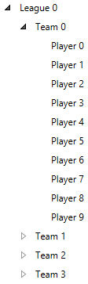
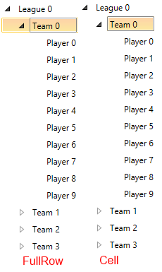
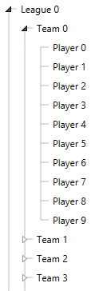

# Customize RadTreeListView to look like a RadTreeView 

This article will go through the customization of the RadTreeListView to look a like RadTreeView control. The article explained the benefit from using our __RadTreeListView__ control for visualizing hierarchical data as ordinary hierarchical control like RadTreeView. The reason why we suggest the approach is the fact that __RadTreeListView__ is a flat control. This means that it uses only one container to visualize all of its items. What this means for your application is that you can boost the performance of the scrolling and bringing into view functionalities, as well as the virtualization.

Those of you who are already familiar with the visual structure of the __RadTreeListView__ control may say that it is much more than a hierarchical control. They would be right, this control derives from our __RadGridView__ and inherits some of its functionalities along with its column generation algorithms. Of course, you may not need all that information and functionality, this is why the __RadTreeListView__ exposes properties that can be used to customize the control. You can practically hide everything that makes it look like __RadGridView__. The following style changes the look of the control and styles it like our __RadTreeView__ control.
	
__Example 1: Setting RadTreeListView properties__	
```XAML
	<Style TargetType="telerik:RadTreeListView" BasedOn="{StaticResource RadTreeListViewStyle}">
		<Setter Property="VerticalGridLinesBrush" Value="{x:Null}"/>
		<Setter Property="FocusVisualStyle" Value="{x:Null}"/>
		<Setter Property="RowIndicatorVisibility" Value="Collapsed"/>
		<Setter Property="IsFilteringAllowed" Value="False"/>
		<Setter Property="CanUserFreezeColumns" Value="False"/>
		<Setter Property="CanUserDeleteRows" Value="False"/>
		<Setter Property="AutoGenerateColumns" Value="False"/>
		<Setter Property="ShowGroupPanel" Value="False"/>
		<Setter Property="ShowColumnHeaders" Value="False"/>
		<Setter Property="AutoExpandGroups" Value="True"/>
		<Setter Property="GridLinesVisibility" Value="None"/>
		<Setter Property="RowHeight" Value="24" />
		<Setter Property="TreeLinesVisibility" Value="Visible"/>
		<Setter Property="BorderThickness" Value="0"/>
		<Setter Property="BorderBrush" Value="{x:Null}"/>
		<Setter Property="IsSynchronizedWithCurrentItem" Value="False" />
	 </Style>
```

> NoXaml binaries in combination with implicit styles are used for the example in this article. More on the topic is available [here](http://www.telerik.com/help/wpf/styling-apperance-implicit-styles-overview.html)[here](http://www.telerik.com/help/silverlight/styling-apperance-implicit-styles-overview.html)

Now, when you have the initial look, you can proceed with visualizing some data. You need to create a hierarchy of business objects to be visualized by the __RadTreeListView__. Let’s say that you need to visualize the following structure:

* League
	* Team
		* Player

The League has a collection of teams. Each Team has a collection of players that is called __Items__ which does not have any further collections. __Example 2__ demonstrates the data structure.

__Example 2: Setting data structure__
```C#
	public class League
	{
		public string Name { get; set; }
		public League()
		{
			Items = new ObservableCollection<Team>();
		}
		public ObservableCollection<Team> Items { get; set; }
	}
	
	public class Team
	{
		public string Name { get; set; }
		public Team()
		{
			Items = new ObservableCollection<Player>();
		}
		public ObservableCollection<Player> Items { get; set; }
	}	
	
	public class Player
	{
		public string Name { get; set; }
	}	
```

Now we can go ahead and create our hierarchical data.

__Example 3: Creating hierarchical data__
```C#
	public partial class MainWindow : Window
	{
		public ObservableCollection<League> Data { get; set; }
		public MainWindow()
		{
			InitializeComponent();
			Data = GetData();
			this.DataContext = this;
		}

		private ObservableCollection<League> GetData()
		{
			var result = new ObservableCollection<League>();
			for (int i = 0; i < 2; i++)
			{
				League league = new League() {  Name= "League "+i };
				for (int j = 0; j < 4; j++)
				{
					Team team = new Team() { Name="Team "+j };
					league.Items.Add(team);
					for (int p = 0; p < 10; p++)
					{
						Player player = new Player() { Name="Player "+p };
						team.Items.Add(player);
					}
				}
				result.Add(league);
			}
			return result;
		}
	}
```

The __RadTreeListView__ control is designed to use __TreeListViewTableDefinition__ to visualize its items. You can use the __TreeListViewTableDefinition.ItemsSource__ property to recreate the requested 
hierarchy.   
    
__Example 2: Setting TreeListViewTableDefinition__
```XAML
	<telerik:RadTreeListView ItemsSource="{Binding Data}" AutoGenerateColumns="False">            
		<telerik:RadTreeListView.ChildTableDefinitions>
			<telerik:TreeListViewTableDefinition ItemsSource="{Binding Items}"/>
		</telerik:RadTreeListView.ChildTableDefinitions>            
		<telerik:RadTreeListView.Columns>
			<telerik:GridViewDataColumn DataMemberBinding="{Binding Name}" Header="Name" />
		</telerik:RadTreeListView.Columns>
	</telerik:RadTreeListView>
```

>You should keep in mind that the __RadTreeListView__ expects that the collection holding the children of each level is always named the same way.

__Figure 1__ shows how the control looks once you create some sample data and populate it

#### __Figure 1: RadTreeListView__


When the data is populated you can take a look at the section on [selection of the control](http://www.telerik.com/help/wpf/radtreelistview-features-selection.html)[selection of the control](http://www.telerik.com/help/silverlight/radtreelistview-features-selection.html). The  __RadTreeListView__ exposes the a the  __SelectionUnit__ property. It is of type __GridViewSelectionUnit__ and controls the visual appearance type of the selection in the control. Setting it to __Cell__ mode forces the control to select only  the header of the separate items. If you set it to __FullRow__, the control selects the full row hosting the corresponding item. The following picture  Figure 2 shows both selection modes          

#### __Figure 2: SelectionUnit__


To enhance the hierarchical visualization you can allow the __RadTreeListView__ to visualize lines connecting the items of the same level of hierarchy. This can be done by setting the __RadTreeListView.TreeLinesVisibility__ property. Figure 3 shows the effect of the property Wwhen it is set to Visible the result will be like the following picture.

#### __Figure 3: Visible tree lines__


>tip Find a runnable project of the previous example in the [WPF Samples GitHub repository](https://github.com/telerik/xaml-sdk/tree/master/TreeView/TreeListViewBringItemIntoView).
