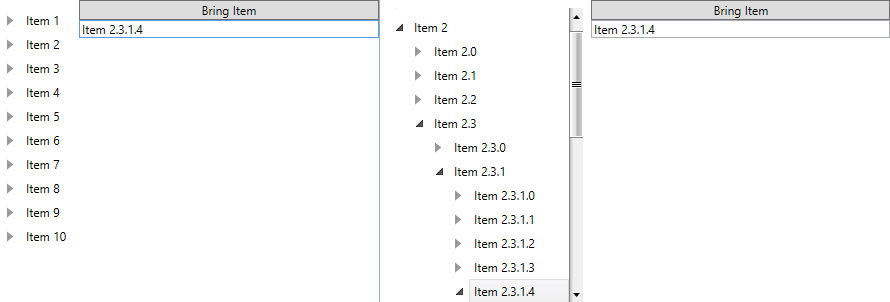

# Expand and Select Item with Load on Demand Enabled RadTreeView

This tutorial will demonstrate you how to __expand__ and __select__ an item when the __RadTreeView__ is in load on demand mode (__IsLoadOnDemandEnabled__ property is set to __True__).

For the purpose of this topic a __RadTreeView__ which is data bound to a business object will be used. The next several code snippets show you the __RadTreeView__ declaration and the business object structure.




```XAML
	        <Grid>
	            <Grid.Resources>
	                <telerik:HierarchicalDataTemplate x:Key="treeViewTemplate" ItemsSource="{Binding Children}">
	                    <TextBlock Text="{Binding Title}" />
	                </telerik:HierarchicalDataTemplate>
	            </Grid.Resources>
	            <Grid.ColumnDefinitions>
	                <ColumnDefinition Width="Auto" />
	                <ColumnDefinition Width="300" />
	            </Grid.ColumnDefinitions>
	
	            <telerik:RadTreeView x:Name="treeView"
	                             Margin="8"
	                             HorizontalAlignment="Stretch"
	                             IsLoadOnDemandEnabled="True"
	                             IsVirtualizing="True"
	                             ItemTemplate="{StaticResource treeViewTemplate}"
	                             telerik:TextSearch.TextPath="Title" />
	
	            <StackPanel Grid.Column="1"
	                    Width="300"
	                    HorizontalAlignment="Right"
	                    VerticalAlignment="Top">
	                <Button Click="Button_Click_1" Content="Bring Item" />
	                <TextBox x:Name="userInput" />
	            </StackPanel>
	        </Grid>
```





```XAML
	        <Grid>
	            <Grid.Resources>
	                <HierarchicalDataTemplate x:Key="treeViewTemplate" ItemsSource="{Binding Children}">
	                    <TextBlock Text="{Binding Title}" />
	                </HierarchicalDataTemplate>
	            </Grid.Resources>
	            <Grid.ColumnDefinitions>
	                <ColumnDefinition Width="Auto" />
	                <ColumnDefinition Width="300" />
	            </Grid.ColumnDefinitions>
	
	            <telerik:RadTreeView x:Name="treeView"
	                             Margin="8"
	                             HorizontalAlignment="Stretch"
	                             IsLoadOnDemandEnabled="True"
	                             IsVirtualizing="True"
	                             ItemTemplate="{StaticResource treeViewTemplate}"
	                             telerik:TextSearch.TextPath="Title" />
	
	            <StackPanel Grid.Column="1"
	                    Width="300"
	                    HorizontalAlignment="Right"
	                    VerticalAlignment="Top">
	                <Button Click="Button_Click_1" Content="Bring Item" />
	                <TextBox x:Name="userInput" />
	            </StackPanel>
	        </Grid>
```



The data source for the radtreeview will be consisted of __DataItems__, only.


```C#
	public class DataItem : ViewModelBase
	    {
	        private string title;
	        private List<DataItem> children;
	
	        public String Title
	        {
	            get
	            {
	                return this.title;
	            }
	            set
	            {
	                if (this.title != value)
	                {
	                    this.title = value;
	                    this.OnPropertyChanged("Title");
	                }
	            }
	        }
	
	        public List<DataItem> Children
	        {
	            get
	            {
	                return this.children;
	            }
	        }
	    }
```


```VB.NET
	Public Class DataItem
	        Inherits ViewModelBase
	        Private m_title As String
	        Private m_children As List(Of DataItem)
	
	        Public Property Title() As [String]
	            Get
	                Return Me.m_title
	            End Get
	            Set(value As [String])
	                If Me.m_title <> value Then
	                    Me.m_title = value
	                    Me.OnPropertyChanged("Title")
	                End If
	            End Set
	        End Property
	
	        Public ReadOnly Property Children() As List(Of DataItem)
	            Get
	                Return Me.m_children
	            End Get
	        End Property
	    End Class
```

Set a __DataItem__ instance to the __ItemsSource__ property of the __RadTreeView__ and create some simple data like in the code snippet below.        


```C#
	this.treeView.ItemsSource = Enumerable.Range(1, 10).Select(i => new DataItem()
	{
	    Title = string.Format("Item {0}", i)
	}).ToList();
```

The actual loading on demand of the business items can be implemented in the getter of the __Children__ property of the __DataItem__ class. The LoadOnDemand feature of the RadTreeView control is used to visualize the expander icon in the front of each RadTreeViewItem. We do not use the built-in LoadOnDemand event to load the business items into the control. Instead, the HierarchicalDataTemplate will trigger the getter of its ItemsSource property on load. For demonstration purposes, we will load a fixed number of business data every time the getter is triggered and the __children__ field is not yet instantiated.


```C#
	public List<DataItem> Children
	{
	    get
	    {
	        if (this.children == null)
	        {
	            this.children = new List<DataItem>();
	            for (int i = 0; i < 5; i++)
	            {
	                DataItem item = new DataItem() { Title = string.Format("{0}.{1}", this.Title, i) };
	                this.children.Add(item);
	            }
	        }
	        return this.children;
	    }
	}
```


```VB.NET
	Public ReadOnly Property Children() As List(Of DataItem)
	        Get
	            If Me.children Is Nothing Then
	                Me.children = New List(Of DataItem)()
	                For i As Integer = 0 To 4
					Dim item As New DataItem() With { _
						Key .Title = String.Format("{0}.{1}", Me.Title, i) _
					}
	                    Me.children.Add(item)
	                Next
	            End If
	            Return Me.children
	        End Get
	    End Property
```

The next step is to implement the custom logic for creating the path in order to use the [BringPathIntoView()]() method.


```C#
	private void Button_Click_1(object sender, RoutedEventArgs e)
	{
	    string[] headerAndIndexes = this.userInput.Text.Split(' ');
	    string[] indexes = headerAndIndexes.LastOrDefault().Split('.');
	    bool areIndexesValid = false;
	    int i;
	
	    if (headerAndIndexes != null && indexes != null)
	    {
	        foreach (string index in indexes)
	        {
	            areIndexesValid = int.TryParse(index, out i);
	        }
	
	        if (headerAndIndexes.FirstOrDefault().Contains("Item") && areIndexesValid)
	        {
	            RadTreeViewItem item = this.treeView.GetItemByPath(this.GenetatePath(this.userInput.Text));
	            if (item != null)
	            {
	                item.IsSelected = true;
	                item.IsExpanded = true;
	            }
	        }
	    }
	}
	  
	private string GenetatePath(string itemToExpand)
	{
	    string path = string.Empty;
	    string buffer;
	    string[] header = itemToExpand.Split(' ');
	    string[] indexes = header.LastOrDefault().Split('.');
	
	    header[0] = string.Format("{0} {1}", header[0], indexes[0]);
	    path = string.Format("{0}\\", header[0]);
	
	    for (int i = 1; i < indexes.Length; i++)
	    {
	        buffer = string.Format("{0}.{1}", header[0], indexes[i]);
	        header[0] = buffer;
	        path += string.Format("{0}\\", buffer);
	    }
	    return path.TrimEnd('\\');
	}
```


```VB.NET
	
	    Private Sub Button_Click_1(sender As Object, e As RoutedEventArgs)
	        Dim headerAndIndexes As String() = Me.userInput.Text.Split(" "c)
	        Dim indexes As String() = headerAndIndexes.LastOrDefault().Split("."c)
	        Dim areIndexesValid As Boolean = False
	        Dim i As Integer
	
	        If headerAndIndexes IsNot Nothing AndAlso indexes IsNot Nothing Then
	            For Each index As String In indexes
	                areIndexesValid = Integer.TryParse(index, i)
	            Next
	
	            If headerAndIndexes.FirstOrDefault().Contains("Item") AndAlso areIndexesValid Then
	                Dim item As RadTreeViewItem = Me.treeView.GetItemByPath(Me.GenetatePath(Me.userInput.Text))
	                If item IsNot Nothing Then
	                    item.IsSelected = True
	                    item.IsExpanded = True
	                End If
	            End If
	        End If
	    End Sub
	
	    Private Function GenetatePath(itemToExpand As String) As String
	        Dim path As String = String.Empty
	        Dim buffer As String
	        Dim header As String() = itemToExpand.Split(" "c)
	        Dim indexes As String() = header.LastOrDefault().Split("."c)
	
	        header(0) = String.Format("{0} {1}", header(0), indexes(0))
	        path = String.Format("{0}\", header(0))
	
	        For i As Integer = 1 To indexes.Length - 1
	            buffer = String.Format("{0}.{1}", header(0), indexes(i))
	            header(0) = buffer
	            path += String.Format("{0}\", buffer)
	        Next
	        Return path.TrimEnd("\"c)
	    End Function
```

The final result after bringing *Item 2.3.1.4* should look like this


## See Also
 * [Get Item by Path]()
 * [Selection]()
 * [Get Previous, Next, Parent and Sibling Node of a Specific TreeView Item]()