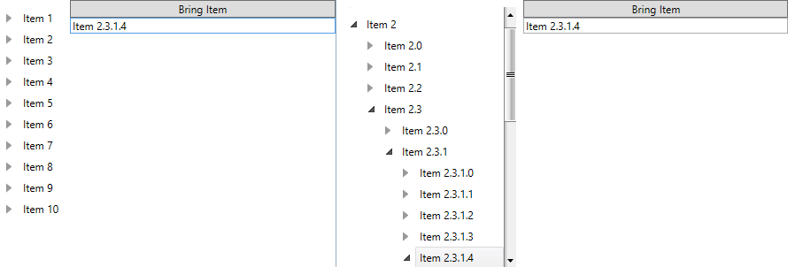

# Expand and Select Item with Load on Demand Enabled RadTreeView

This tutorial will demonstrate you how to __expand__ and __select__ an item when the __RadTreeView__ is in load on demand mode (__IsLoadOnDemandEnabled__ property is set to __True__).

For the purpose of this topic a __RadTreeView__ which is data bound to a business object will be used. The next several code snippets show you the __RadTreeView__ declaration and the business object structure.



<snippet id='radtreeview-how-to-howto-exapand-select-item-with-lod-enabled-treeview-block_1-xaml' />




<snippet id='radtreeview-how-to-howto-exapand-select-item-with-lod-enabled-treeview-block_2-xaml' />



The data source for the radtreeview will be consisted of __DataItems__, only.

<snippet id='radtreeview-how-to-howto-exapand-select-item-with-lod-enabled-treeview-block_3-cs' />
<snippet id='radtreeview-how-to-howto-exapand-select-item-with-lod-enabled-treeview-block_4-vb' />

Set a __DataItem__ instance to the __ItemsSource__ property of the __RadTreeView__ and create some simple data like in the code snippet below.        

<snippet id='radtreeview-how-to-howto-exapand-select-item-with-lod-enabled-treeview-block_5-cs' />

The actual loading on demand of the business items can be implemented in the getter of the __Children__ property of the __DataItem__ class. The LoadOnDemand feature of the RadTreeView control is used to visualize the expander icon in the front of each RadTreeViewItem. We do not use the built-in LoadOnDemand event to load the business items into the control. Instead, the HierarchicalDataTemplate will trigger the getter of its ItemsSource property on load. For demonstration purposes, we will load a fixed number of business data every time the getter is triggered and the __children__ field is not yet instantiated.

<snippet id='radtreeview-how-to-howto-exapand-select-item-with-lod-enabled-treeview-block_6-cs' />
<snippet id='radtreeview-how-to-howto-exapand-select-item-with-lod-enabled-treeview-block_7-vb' />

The next step is to implement the custom logic for creating the path in order to use the [BringPathIntoView()]() method.

<snippet id='radtreeview-how-to-howto-exapand-select-item-with-lod-enabled-treeview-block_8-cs' />
<snippet id='radtreeview-how-to-howto-exapand-select-item-with-lod-enabled-treeview-block_9-vb' />

The final result after bringing *Item 2.3.1.4* should look like this

## See Also
 * [Get Item by Path]()
 * [Selection]()
 * [Get Previous, Next, Parent and Sibling Node of a Specific TreeView Item]()