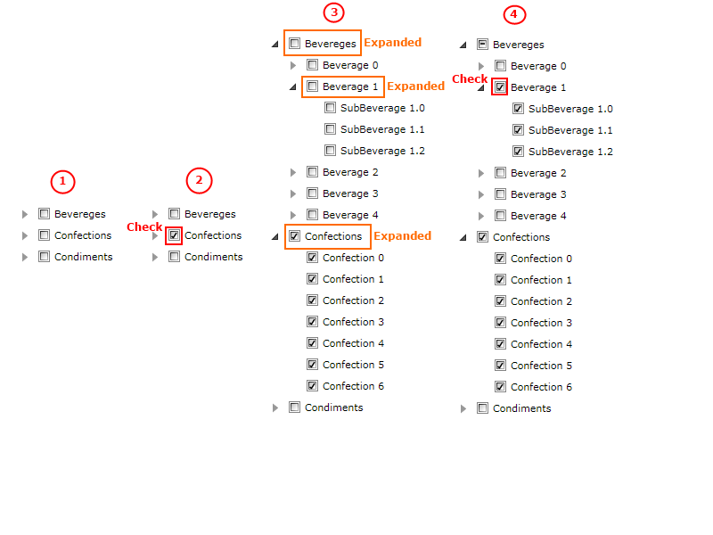

# Implement a Tri-State CheckBox logic using MVVM

This tutorial will guide you through the process of implementing a 'tri-state' __CheckBox__ functionality in the __RadTreeView__ using MVVM.

The __RadTreeView__ control supports check boxes/radio buttons elements next to each item out-of-the-box. However, their 'tri-state' logic implementation is designed to work when the __RadTreeView.Items__ collection is populated with __RadTreeViewItems__. Basically it will work as expected when the __RadTreeView__ is [declaratively populated]() or its __Items__ collection is populated in  [code-behind](). However, the __RadTreeView__ control is mostly used in databinding scenarios following the MVVM pattern. And if your applicaiton requirements include a 'tri-state' check box logic, then it's best to define a __CheckBox__ control inside the __RadTreeViewItem's DataTemplates__ and implement the 'tri-state' logic entirely in the view models.

* Let's start with defining a sample view model for the __RadTreeViewItems__. It only contains a name, collection of children items and a checked property:

	```C#
		using System;
		using System.Collections.ObjectModel;
		using Telerik.Windows.Controls;
		using System.Linq;
		
		namespace TreeViewMVVMCheckBoxSample.ViewModels
		{
			public class CategoryViewModel : ViewModelBase
			{
				private string _name;
				private bool? _isChecked;
		
				private ObservableCollection<CategoryViewModel> _subCategories = null;
		
				public string Name
				{
					get
					{
						return this._name;
					}
					set
					{
						this._name = value;
					}
				}
				public bool? IsChecked
				{
					get
					{
						return this._isChecked;
					}
					set
					{
						if (this._isChecked != value)
						{
							this._isChecked = value;
							OnPropertyChanged("IsChecked");
						}
					}
				}
		
				public ObservableCollection<CategoryViewModel> SubCategories
				{
					get
					{
						if (this._subCategories == null)
						{
							this._subCategories = new ObservableCollection<CategoryViewModel>();
						}
						return this._subCategories;
					}
				}
			}
		}
	```
	```VB.NET
		Imports System.Collections.ObjectModel
		Imports Telerik.Windows.Controls
		
		Namespace TreeViewMVVMCheckBoxSample.ViewModels
			Public Class CategoryViewModel
				Inherits ViewModelBase
				Private _name As String
				Private _isChecked As Boolean?
		
				Private _subCategories As ObservableCollection(Of CategoryViewModel) = Nothing
		
				Public Property Name() As String
					Get
						Return Me._name
					End Get
					Set(ByVal value As String)
						Me._name = value
					End Set
				End Property
				Public Property IsChecked() As Boolean?
					Get
						Return Me._isChecked
					End Get
					Set(ByVal value As Boolean?)
						If Not Me._isChecked.Equals(value) Then
							Me._isChecked = value
							OnPropertyChanged("IsChecked")
						End If
					End Set
				End Property
		
				Public ReadOnly Property SubCategories() As ObservableCollection(Of CategoryViewModel)
					Get
						If Me._subCategories Is Nothing Then
							Me._subCategories = New ObservableCollection(Of CategoryViewModel)()
						End If
						Return Me._subCategories
					End Get
				End Property
			End Class
		End Namespace
	```

	> Please note that the CategoryViewModel class inherits from the [Telerik.Windows.Controls.ViewModelBase](http://www.telerik.com/help/silverlight/t_telerik_windows_controls_viewmodelbase.html)[Telerik.Windows.Controls.ViewModelBase](http://www.telerik.com/help/wpf/t_telerik_windows_controls_viewmodelbase.html) class. It provides support for property change notifications and we need to notify the __RadTreeViewItems__ when the __IsChecked__ property is changed. 			  

* Now let's extend that sample model to include our 'tri-state' logic. Firstly, in order to update the checked state of the parent items, each item will have to keep a reference of its parent item.
	
	```C#
		private CategoryViewModel parentItem;
	```
	```VB.NET
		Private parentItem As CategoryViewModel
	```

* Then we need to implement the logic that determines the checked state of each item. For that purpose we have to traverse the children colleciton of a checked item as well as to find the checked state in which its parent item should be set.

	* Let's create a method traversing the children collection of an item:

		```C#
			private void UpdateChildrenCheckState()
			{
				foreach (var item in this.SubCategories)
				{
					if (this.IsChecked != null)
					{
						item.IsChecked = this.IsChecked;
					}
				}
			}
		```
		```VB.NET
			Private Sub UpdateChildrenCheckState()
				For Each item In Me.SubCategories
					If Me.IsChecked IsNot Nothing Then
						item.IsChecked = Me.IsChecked
					End If
				Next item
			End Sub
		```

	* We can also create a method that updates the checked state of the parent item. In order to simplify the code, we can use a lambda function to count the number of the checked children of the parent item. If this number indicates that all its children are checked, we can set the parent item checked state to checked, if the count of its checked children is 0, then we need to uncheck it. In all other cases, its state should stay indeterminate.
	
		```C#
			private bool? DetermineCheckState()
			{
				bool allChildrenChecked = this.SubCategories.Count(x => x.IsChecked == true) == this.SubCategories.Count;
				if (allChildrenChecked)
				{
					return true;
				}

				bool allChildrenUnchecked = this.SubCategories.Count(x => x.IsChecked == false) == this.SubCategories.Count;
				if (allChildrenUnchecked)
				{
					return false;
				}

				return null;
			}				
		```
		```VB.NET
			Private Function DetermineCheckState() As Boolean?
				Dim allChildrenChecked As Boolean = Me.SubCategories.LongCount(Function(x) x.IsChecked.Equals(True)) = Me.SubCategories.Count
				If allChildrenChecked Then
					Return True
				End If

				Dim allChildrenUnchecked As Boolean = Me.SubCategories.LongCount(Function(x) x.IsChecked.Equals(False)) = Me.SubCategories.Count
				If allChildrenUnchecked Then
					Return False
				End If

				Return Nothing
			End Function
		```

* We need to call both methods when the checked state of each item is changed. That basically means that we need to call them when the __IsChecked__ property value is changed:

	```C#
		public bool? IsChecked
		{
			get
			{
				return this._isChecked;
			}
			set
			{
				if (this._isChecked != value)
				{
					this._isChecked = value;
					this.UpdateCheckState();
					OnPropertyChanged("IsChecked");
				}
			}
		}
		
		private void UpdateCheckState()
		{
			// update all children:
			if (this.SubCategories.Count != 0)
			{
				this.UpdateChildrenCheckState();
			}
			//update parent item
			if (this.parentItem != null)
			{
				bool? parentIsChecked = this.parentItem.DetermineCheckState();
				this.parentItem.IsChecked = parentIsChecked;
			}
		}
	```
	```VB.NET
		Public Property IsChecked() As Boolean?
			Get
				Return Me._isChecked
			End Get
			Set(ByVal value As Boolean?)
				If Not Me._isChecked.Equals(value) Then
					Me._isChecked = value
					Me.UpdateCheckState()
					OnPropertyChanged("IsChecked")
				End If
			End Set
		End Property
		Private Sub UpdateCheckState()
			' update all children: '
			If Me.SubCategories.Count <> 0 Then
				Me.UpdateChildrenCheckState()
			End If
			'update parent item '
			If Me.parentItem IsNot Nothing Then
				Dim parentIsChecked? As Boolean = Me.parentItem.DetermineCheckState()
				Me.parentItem.IsChecked = parentIsChecked
		
			End If
		End Sub
	```

* Now our __CategoryViewModel__ logic is almost complete. However, if you take a closer look at the __IsChecked__ property setter implementation, you will notice that the __UpdateCheckState()__ method will cause the setter to be executed multiple times for the same item. This is why we'll have to implement a reentrancy check:

	```C#
		private bool reentrancyCheck = false;
		public bool? IsChecked
		{
			get
			{
				return this._isChecked;
			}
			set
			{
				if (this._isChecked != value)
				{
					if (reentrancyCheck)
						return;
					this.reentrancyCheck = true;
					this._isChecked = value;
					this.UpdateCheckState();
					OnPropertyChanged("IsChecked");
					this.reentrancyCheck = false;
				}
			}
		}
	```
	```VB.NET
		Private reentrancyCheck As Boolean = False
		Public Property IsChecked() As Boolean?
			Get
				Return Me._isChecked
			End Get
			Set(ByVal value As Boolean?)
				If Not Me._isChecked.Equals(value) Then
					If reentrancyCheck Then
						Return
					End If
					Me.reentrancyCheck = True
					Me._isChecked = value
					Me.UpdateCheckState()
					OnPropertyChanged("IsChecked")
					Me.reentrancyCheck = False
				End If
			End Set
		End Property
	```

* So finally the __CategoryViewModel__ looks like that:

	```C#
		using System;
		using System.Collections.ObjectModel;
		using Telerik.Windows.Controls;
		using System.Linq;
		
		namespace TreeViewMVVMCheckBoxSample.ViewModels
		{
			public class CategoryViewModel : ViewModelBase
			{
				private string _name;
				private bool? _isChecked;
				private bool reentrancyCheck = false;
				private CategoryViewModel parentItem;
		
				private ObservableCollection<CategoryViewModel> _subCategories = null;
		
				public string Name
				{
					get
					{
						return this._name;
					}
					set
					{
						this._name = value;
					}
				}
				public bool? IsChecked
				{
					get
					{
						return this._isChecked;
					}
					set
					{
						if (this._isChecked != value)
						{
							if (reentrancyCheck)
								return;
							this.reentrancyCheck = true;
							this._isChecked = value;
							this.UpdateCheckState();
							OnPropertyChanged("IsChecked");
							this.reentrancyCheck = false;
						}
					}
				}
		
				public ObservableCollection<CategoryViewModel> SubCategories
				{
					get
					{
						if (this._subCategories == null)
						{
							this._subCategories = new ObservableCollection<CategoryViewModel>();
						}
						return this._subCategories;
					}
				}
		
				public CategoryViewModel(CategoryViewModel parent)
				{
					this.parentItem = parent;
				}
		
				private void UpdateCheckState()
				{
					// update all children:
					if (this.SubCategories.Count != 0)
					{
						this.UpdateChildrenCheckState();
					}
					//update parent item
					if (this.parentItem != null)
					{
						bool? parentIsChecked = this.parentItem.DetermineCheckState();
						this.parentItem.IsChecked = parentIsChecked;
		
					}
				}
		
				private void UpdateChildrenCheckState()
				{
					foreach (var item in this.SubCategories)
					{
						if (this.IsChecked != null)
						{
							item.IsChecked = this.IsChecked;
						}
					}
				}
		
				private bool? DetermineCheckState()
				{
					bool allChildrenChecked = this.SubCategories.Count(x => x.IsChecked == true) == this.SubCategories.Count;
					if (allChildrenChecked)
					{
						return true;
					}
		
					bool allChildrenUnchecked = this.SubCategories.Count(x => x.IsChecked == false) == this.SubCategories.Count;
					if (allChildrenUnchecked)
					{
						return false;
					}
		
					return null;
				}
			}
		}
	```
	```VB.NET
		Imports System.Collections.ObjectModel
		Imports Telerik.Windows.Controls
		
		Namespace TreeViewMVVMCheckBoxSample.ViewModels
			Public Class CategoryViewModel
				Inherits ViewModelBase
				Private _name As String
				Private _isChecked As Boolean?
				Private reentrancyCheck As Boolean = False
				Private parentItem As CategoryViewModel
		
				Private _subCategories As ObservableCollection(Of CategoryViewModel) = Nothing
		
				Public Property Name() As String
					Get
						Return Me._name
					End Get
					Set(ByVal value As String)
						Me._name = value
					End Set
				End Property
				Public Property IsChecked() As Boolean?
					Get
						Return Me._isChecked
					End Get
					Set(ByVal value As Boolean?)
						If Not Me._isChecked.Equals(value) Then
							If reentrancyCheck Then
								Return
							End If
							Me.reentrancyCheck = True
							Me._isChecked = value
							Me.UpdateCheckState()
							OnPropertyChanged("IsChecked")
							Me.reentrancyCheck = False
						End If
					End Set
				End Property
		
				Public ReadOnly Property SubCategories() As ObservableCollection(Of CategoryViewModel)
					Get
						If Me._subCategories Is Nothing Then
							Me._subCategories = New ObservableCollection(Of CategoryViewModel)()
						End If
						Return Me._subCategories
					End Get
				End Property
		
				Public Sub New(ByVal parent As CategoryViewModel)
					Me.parentItem = parent
				End Sub
		
				Private Sub UpdateCheckState()
					' update all children: '
					If Me.SubCategories.Count <> 0 Then
						Me.UpdateChildrenCheckState()
					End If
					'update parent item '
					If Me.parentItem IsNot Nothing Then
						Dim parentIsChecked? As Boolean = Me.parentItem.DetermineCheckState()
						Me.parentItem.IsChecked = parentIsChecked
		
					End If
				End Sub
		
				Private Sub UpdateChildrenCheckState()
					For Each item In Me.SubCategories
						If Me.IsChecked IsNot Nothing Then
							item.IsChecked = Me.IsChecked
						End If
					Next item
				End Sub
		
				Private Function DetermineCheckState() As Boolean?
					Dim allChildrenChecked As Boolean = Me.SubCategories.LongCount(Function(x) x.IsChecked.Equals(True)) = Me.SubCategories.Count
					If allChildrenChecked Then
						Return True
					End If
		
					Dim allChildrenUnchecked As Boolean = Me.SubCategories.LongCount(Function(x) x.IsChecked.Equals(False)) = Me.SubCategories.Count
					If allChildrenUnchecked Then
						Return False
					End If
		
					Return Nothing
				End Function
			End Class
		End Namespace
	```

* As the items ViewModel is ready, we can create a __MainViewModel__ to define a collection of __CategoryViewModel__ objects that will be used as the __RadTreeView.ItemsSource__.

	```C#
		using System;
		using System.Collections.ObjectModel;
		
		namespace TreeViewMVVMCheckBoxSample.ViewModels
		{
			public class MainViewModel
			{
				public ObservableCollection<CategoryViewModel> Categories { get; set; }
		
				public MainViewModel()
				{
					Categories = new ObservableCollection<CategoryViewModel>();
		
					CategoryViewModel beverages = new CategoryViewModel(null);
					beverages.Name = "Bevereges";
		
					for (int i = 0; i < 5; i++)
					{
						CategoryViewModel prod = new CategoryViewModel(beverages)
						{
							Name = String.Format("Beverage {0}", i),
							IsChecked = false
						};
		
						for (int j = 0; j < 3; j++)
						{
							prod.SubCategories.Add(new CategoryViewModel(prod)
						{
							Name = String.Format("SubBeverage {0}.{1}", i, j),
							IsChecked = false
						});
						}
						beverages.SubCategories.Add(prod);
					}
					Categories.Add(beverages);
		
		
					CategoryViewModel confections = new CategoryViewModel(null);
					confections.Name = "Confections";
					for (int i = 0; i < 7; i++)
					{
						confections.SubCategories.Add(new CategoryViewModel(confections)
						{
							Name = String.Format("Confection {0}", i),
							IsChecked = false
						});
					}
					Categories.Add(confections);
		
					CategoryViewModel condiments = new CategoryViewModel(null);
					condiments.Name = "Condiments";
					for (int i = 0; i < 3; i++)
					{
						condiments.SubCategories.Add(new CategoryViewModel(condiments)
						{
							Name = String.Format("Condiment {0}", i),
							IsChecked = false
						});
					}
					Categories.Add(condiments);
				}
			}
		}
	```
	```VB.NET
		Imports System.Collections.ObjectModel
		
		Namespace TreeViewMVVMCheckBoxSample.ViewModels
			Public Class MainViewModel
				Public Property Categories() As ObservableCollection(Of CategoryViewModel)
		
				Public Sub New()
					Categories = New ObservableCollection(Of CategoryViewModel)()
		
					Dim beverages As New CategoryViewModel(Nothing)
					beverages.Name = "Bevereges"
		
					For i As Integer = 0 To 4
						Dim prod As New CategoryViewModel(beverages) With {.Name = String.Format("Beverage {0}", i), .IsChecked = False}
		
						For j As Integer = 0 To 2
							prod.SubCategories.Add(New CategoryViewModel(prod) With {.Name = String.Format("SubBeverage {0}.{1}", i, j), .IsChecked = False})
						Next j
						beverages.SubCategories.Add(prod)
					Next i
					Categories.Add(beverages)
		
		
					Dim confections As New CategoryViewModel(Nothing)
					confections.Name = "Confections"
					For i As Integer = 0 To 6
						confections.SubCategories.Add(New CategoryViewModel(confections) With {.Name = String.Format("Confection {0}", i), .IsChecked = False})
					Next i
					Categories.Add(confections)
		
					Dim condiments As New CategoryViewModel(Nothing)
					condiments.Name = "Condiments"
					For i As Integer = 0 To 2
						condiments.SubCategories.Add(New CategoryViewModel(condiments) With {.Name = String.Format("Condiment {0}", i), .IsChecked = False})
					Next i
					Categories.Add(condiments)
		
				End Sub
			End Class
		End Namespace
	```

* Finally we need to set up the __RadTreeView__ control and its __ItemTemplate__. Please note that we won't use the __RadTreeView__ check-box support, but instead we will define a __CheckBox__ in the __ItemTemplate__ of the control. 
			
	```XAML
		<Window.DataContext>
			<vm:MainViewModel />
		</Window.DataContext>
		<Grid>
			<telerik:RadTreeView Margin="5" ItemsSource="{Binding Categories}" Padding="5">
				<telerik:RadTreeView.ItemTemplate>
					<HierarchicalDataTemplate ItemsSource="{Binding SubCategories}">
						<StackPanel Orientation="Horizontal">
							<CheckBox IsChecked="{Binding IsChecked, Mode=TwoWay}" telerik:StyleManager.Theme="Office_Black" />
							<TextBlock VerticalAlignment="Center" Text="{Binding Name}" />
						</StackPanel>
					</HierarchicalDataTemplate>
				</telerik:RadTreeView.ItemTemplate>
			</telerik:RadTreeView>
		</Grid>
	```

	> The __telerik__ alias represents the telerik namespace: `xmlns:telerik="http://schemas.telerik.com/2008/xaml/presentation"`
	> The __vm__ alias represents the viewmodels local namespace. For example: `xmlns:vm="clr-namespace:TreeViewMVVMCheckBoxSample.ViewModels"`

* When you run this project, you should see the following output:


>tip You can find the sample solution in our [CodeLibrary](http://www.telerik.com/community/code-library/silverlight/treeview/treeview-how-to-create-a-tri-state-checkbox-logic-using-mvvm.aspx)[CodeLibrary](http://www.telerik.com/community/code-library/wpf/treeview/tri-state-checkbox-logic-in-a-radtreeview-using-mvvm.aspx).

## See Also
 * [DataBinding - Overview]()
 * [Binding to Object]()