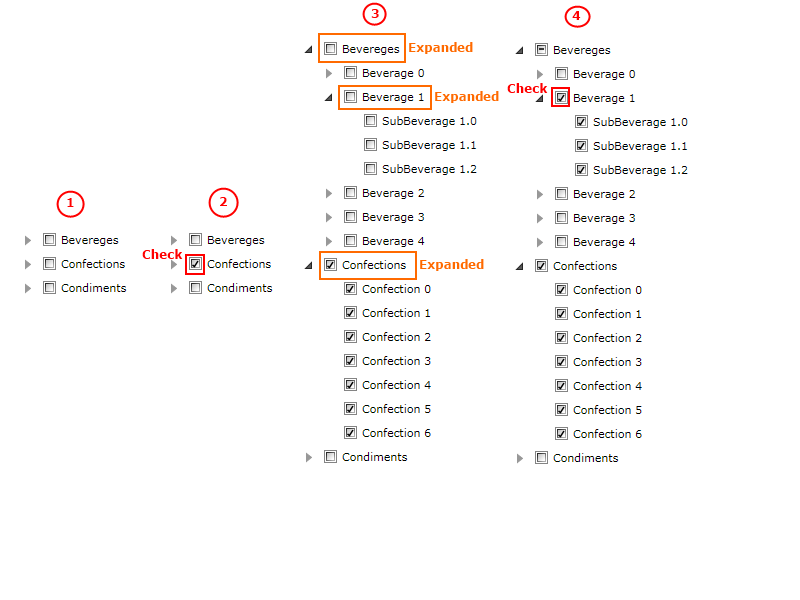

# Implement a Tri-State CheckBox logic using MVVM

This tutorial will guide you through the process of implementing a 'tri-state' __CheckBox__ functionality in the __RadTreeView__ using MVVM.

The __RadTreeView__ control supports check boxes/radio buttons elements next to each item out-of-the-box. However, their 'tri-state' logic implementation is designed to work when the __RadTreeView.Items__ collection is populated with __RadTreeViewItems__. Basically it will work as expected when the __RadTreeView__ is [declaratively populated]() or its __Items__ collection is populated in  [code-behind](). However, the __RadTreeView__ control is mostly used in databinding scenarios following the MVVM pattern. And if your applicaiton requirements include a 'tri-state' check box logic, then it's best to define a __CheckBox__ control inside the __RadTreeViewItem's DataTemplates__ and implement the 'tri-state' logic entirely in the view models.

* Let's start with defining a sample view model for the __RadTreeViewItems__. It only contains a name, collection of children items and a checked property:

	<snippet id='radtreeview-how-to-howto-tri-state-mvvm-block_1-cs' />
	<snippet id='radtreeview-how-to-howto-tri-state-mvvm-block_2-vb' />

	> Please note that the CategoryViewModel class inherits from the [Telerik.Windows.Controls.ViewModelBase](http://www.telerik.com/help/silverlight/t_telerik_windows_controls_viewmodelbase.html)[Telerik.Windows.Controls.ViewModelBase](http://www.telerik.com/help/wpf/t_telerik_windows_controls_viewmodelbase.html) class. It provides support for property change notifications and we need to notify the __RadTreeViewItems__ when the __IsChecked__ property is changed. 			  

* Now let's extend that sample model to include our 'tri-state' logic. Firstly, in order to update the checked state of the parent items, each item will have to keep a reference of its parent item.
	
	<snippet id='radtreeview-how-to-howto-tri-state-mvvm-block_3-cs' />
	<snippet id='radtreeview-how-to-howto-tri-state-mvvm-block_4-vb' />

* Then we need to implement the logic that determines the checked state of each item. For that purpose we have to traverse the children colleciton of a checked item as well as to find the checked state in which its parent item should be set.

	* Let's create a method traversing the children collection of an item:

		<snippet id='radtreeview-how-to-howto-tri-state-mvvm-block_5-cs' />
		<snippet id='radtreeview-how-to-howto-tri-state-mvvm-block_6-vb' />

	* We can also create a method that updates the checked state of the parent item. In order to simplify the code, we can use a lambda function to count the number of the checked children of the parent item. If this number indicates that all its children are checked, we can set the parent item checked state to checked, if the count of its checked children is 0, then we need to uncheck it. In all other cases, its state should stay indeterminate.
	
		<snippet id='radtreeview-how-to-howto-tri-state-mvvm-block_7-cs' />
		<snippet id='radtreeview-how-to-howto-tri-state-mvvm-block_8-vb' />

* We need to call both methods when the checked state of each item is changed. That basically means that we need to call them when the __IsChecked__ property value is changed:

	<snippet id='radtreeview-how-to-howto-tri-state-mvvm-block_9-cs' />
	<snippet id='radtreeview-how-to-howto-tri-state-mvvm-block_10-vb' />

* Now our __CategoryViewModel__ logic is almost complete. However, if you take a closer look at the __IsChecked__ property setter implementation, you will notice that the __UpdateCheckState()__ method will cause the setter to be executed multiple times for the same item. This is why we'll have to implement a reentrancy check:

	<snippet id='radtreeview-how-to-howto-tri-state-mvvm-block_11-cs' />
	<snippet id='radtreeview-how-to-howto-tri-state-mvvm-block_12-vb' />

* So finally the __CategoryViewModel__ looks like that:

	<snippet id='radtreeview-how-to-howto-tri-state-mvvm-block_13-cs' />
	<snippet id='radtreeview-how-to-howto-tri-state-mvvm-block_14-vb' />

* As the items ViewModel is ready, we can create a __MainViewModel__ to define a collection of __CategoryViewModel__ objects that will be used as the __RadTreeView.ItemsSource__.

	<snippet id='radtreeview-how-to-howto-tri-state-mvvm-block_15-cs' />
	<snippet id='radtreeview-how-to-howto-tri-state-mvvm-block_16-vb' />

* Finally we need to set up the __RadTreeView__ control and its __ItemTemplate__. Please note that we won't use the __RadTreeView__ check-box support, but instead we will define a __CheckBox__ in the __ItemTemplate__ of the control. 
			
	<snippet id='radtreeview-how-to-howto-tri-state-mvvm-block_17-xaml' />

	> The __telerik__ alias represents the telerik namespace: `xmlns:telerik="http://schemas.telerik.com/2008/xaml/presentation"`
	> The __vm__ alias represents the viewmodels local namespace. For example: `xmlns:vm="clr-namespace:TreeViewMVVMCheckBoxSample.ViewModels"`

* When you run this project, you should see the following output:

>tip You can find the sample solution in our [CodeLibrary](http://www.telerik.com/community/code-library/silverlight/treeview/treeview-how-to-create-a-tri-state-checkbox-logic-using-mvvm.aspx)[CodeLibrary](http://www.telerik.com/community/code-library/wpf/treeview/tri-state-checkbox-logic-in-a-radtreeview-using-mvvm.aspx).

## See Also
 * [DataBinding - Overview]()
 * [Binding to Object]()