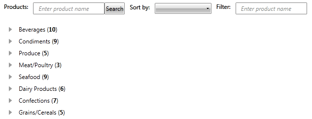

# Implement Search, Filter and Sort

This article will demonstrate how you can implement __searching__, __filtering__ and __sorting__ on __RadTreeView__ data. The final result will look like this:


>The purpose of this article is to demonstrate how you can implement additional logic to the RadTreeView control. This is why we will skip the definition of our models and view-model. For more detailed information you can scroll down to the end of the article and find a link to a downloadable, ready to run project.		

The __RadTreeView__ is a data-driven control, designed to display large amounts of hierarchical data and it does not provide searching, filtering and sorting functionality out of the box. Hence, such operations should be implemented on the data it represents. Below you can find sample implementation of:	  

* [Searching](#searching)
* [Filtering](#filtering)
* [Sorting](#sorting)

## Searching

The searching functionality is triggered when the *Search* button is pressed. Basically, we first get the entered text in the first __TextBox__ and then we search if the __Name__ of each __Category__ contains it. If nothing is found - we search in that Category's __Products__. When an existing item is found it is selected and brought into the view port of the RadTreeView.

For more details examine the following code:

__: Example 1: Implement Searching__

```C#
			//the RadTreeView.ItemsSource collection is traversed to find an item by a provided name 
			string searchText = null;
			private void Search(object sender, RoutedEventArgs e)
			{
				if (!string.IsNullOrEmpty(searchTextBox.Text))
				{
					searchText = searchTextBox.Text.ToLower();
					foreach (Category category in radTreeView.ItemsSource)
					{
						if (category.Name.ToLower().Contains(searchText))
						{
							RadTreeViewItem item = radTreeView.GetItemByPath(category.Path);
							item.BringIntoView();
							item.IsSelected = true;
							return;
						}
						foreach (Product product in category.Products)
						{
							if (product.Name.ToLower().Contains(searchText))
							{
								RadTreeViewItem item = radTreeView.GetItemByPath(category.Path + "\\" + product.Path);
								item.BringIntoView();
								item.IsSelected = true;
								return;
							}
						}
					}
				}
				isFiltered = false;
			}  
```
```VB.NET
		'the RadTreeView.ItemsSource collection is traversed to find an item by a provided name'
		Dim searchText As String = Nothing
		Private Sub Search(sender As Object, e As RoutedEventArgs)
			If Not String.IsNullOrEmpty(searchTextBox.Text) Then
				searchText = searchTextBox.Text.ToLower()
				For Each category As Category In radTreeView.ItemsSource
					If category.Name.ToLower().Contains(searchText) Then
						Dim item As RadTreeViewItem = radTreeView.GetItemByPath(category.Path)
						item.BringIntoView()
						item.IsSelected = True
						Return
					End If
					For Each product As Product In category.Products
						If product.Name.ToLower().Contains(searchText) Then
							Dim item As RadTreeViewItem = radTreeView.GetItemByPath(category.Path + "\" + product.Path)
							item.BringIntoView()
							item.IsSelected = True
							Return
						End If
					Next
				Next
			End If
			isFiltered = False
		End Sub
```

## Filtering

The filtering functionality is triggered immediately when the text of the second __TextBox__ is changed. The first step, again, is to get the text that is entered into the *filterTextBox*. After that, we call a helper method (which will also be used in the sorting functionality) that accepts as arguments a collection to sort and a filter string and returns a new filtered collection. With the help of that method we change the __ItemsSource__ of the RadTreeView control so that it visualizes only the items that contain the filtering criteria.

Below you can examine the implementation of these two methods:

__Example 2: Implement Filtering__

```C#
			//the SampleDataSource collection is dynamically filtered to display only those items matching the filter criteria   
			string filterText = null;
			private void filterTextBox_TextChanged(object sender, TextChangedEventArgs e)
			{
				if (!String.IsNullOrEmpty(filterTextBox.Text))
				{
					filterText = filterTextBox.Text == " Enter product name" ? "" : filterTextBox.Text;
					radTreeView.ItemsSource = FilterCollection(new SampleDataSource(), filterText);
				}
				else
				{
					radTreeView.ItemsSource = new SampleDataSource();
					filterText = null;
				}
				isFiltered = true;
			}
	
			//this method filters a business collection   
			private ObservableCollection<Category> FilterCollection(ObservableCollection<Category> collection, string filterText)
			{
				foreach (Category category in collection)
				{
					category.Products = new ObservableCollection<Product>(category.Products.Where(p => p.Name.ToLower().Contains(filterText)));
				}
				return new ObservableCollection<Category>(collection.Where(cat => (cat.Name.ToLower().Contains(filterText) && cat.Products.Count == 0) || cat.Products.Count > 0));
			}
```
```VB.NET
		'the SampleDataSource collection is dynamically filtered to display only those items matching the filter criteria'
		Dim filterText As String = Nothing
		Private Sub filterTextBox_TextChanged(sender As Object, e As TextChangedEventArgs)
			If Not [String].IsNullOrEmpty(filterTextBox.Text) Then
				filterText = If(filterTextBox.Text = " Enter product name", "", filterTextBox.Text)
				radTreeView.ItemsSource = FilterCollection(New SampleDataSource(), filterText)
			Else
				radTreeView.ItemsSource = New SampleDataSource()
				filterText = Nothing
			End If
			isFiltered = True
		End Sub
	
		'this method filters a business collection'
		Private Function FilterCollection(collection As ObservableCollection(Of Category), filterText As String) As ObservableCollection(Of Category)
			For Each category As Category In collection
				category.Products = New ObservableCollection(Of Product)(category.Products.Where(Function(p) p.Name.ToLower().Contains(filterText)))
			Next
			Return New ObservableCollection(Of Category)(collection.Where(Function(cat) (cat.Name.ToLower().Contains(filterText) AndAlso cat.Products.Count = 0) OrElse cat.Products.Count > 0))
		End Function
```

## Sorting

The sort functionality is triggered when the selection of the __ComboBox__ is changed. When the __SelectionChanged__ event occurs we check the __SelectedItem.__ and based on its __Value__, we sort the __RadTreeView.__ collection.

__Example 3: Implement Sorting__

```C#
			//When the Sorting ComboBox selection is changed, the SampleDataSource collection is sorted accordingly        
			private void sortingComboBox_SelectionChanged(object sender, SelectionChangedEventArgs e)
			{
				if ((sortingComboBox.SelectedItem as RadComboBoxItem).Content.Equals("Category name"))
				{
					if (filterText != null)
					{
						radTreeView.ItemsSource = FilterCollection(new SampleDataSource(), filterText).OrderBy(c => c.Name);
					}
					else
					{
						radTreeView.ItemsSource = new SampleDataSource().OrderBy(c => c.Name);
					}
				}
				else
				{
					if (filterText != null)
					{
						radTreeView.ItemsSource = FilterCollection(new SampleDataSource(), filterText).OrderBy(c => c.Products.Count);
					}
					else
					{
						radTreeView.ItemsSource = new SampleDataSource().OrderBy(c => c.Products.Count);
					}
				}
				isFiltered = false;
			}     
```
```VB.NET
		'When the Sorting ComboBox selection is changed, the SampleDataSource collection is sorted accordingly'     
		Private Sub sortingComboBox_SelectionChanged(sender As Object, e As SelectionChangedEventArgs)
			If TryCast(sortingComboBox.SelectedItem, RadComboBoxItem).Content.Equals("Category name") Then
				If filterText IsNot Nothing Then
					radTreeView.ItemsSource = FilterCollection(New SampleDataSource(), filterText).OrderBy(Function(c) c.Name)
				Else
					radTreeView.ItemsSource = New SampleDataSource().OrderBy(Function(c) c.Name)
				End If
			Else
				If filterText IsNot Nothing Then
					radTreeView.ItemsSource = FilterCollection(New SampleDataSource(), filterText).OrderBy(Function(c) c.Products.Count)
				Else
					radTreeView.ItemsSource = New SampleDataSource().OrderBy(Function(c) c.Products.Count)
				End If
			End If
			isFiltered = False
		End Sub	
```

>tip Find a runnable project of the previous example in the [WPF Samples GitHub repository](https://github.com/telerik/xaml-sdk/tree/master/TreeView/FilterSearchSort).

## See Also
 * [Get Item by Path]()
 * [Drag and Drop]()