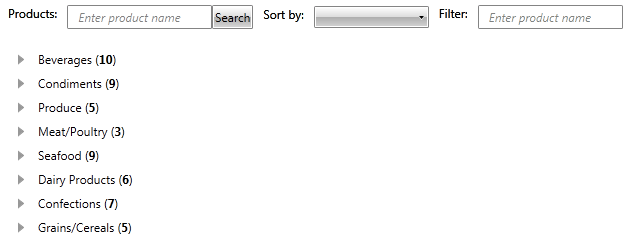

# Implement Search, Filter and Sort

This article will demonstrate how you can implement __searching__, __filtering__ and __sorting__ on __RadTreeView__ data. The final result will look like this:

>The purpose of this article is to demonstrate how you can implement additional logic to the RadTreeView control. This is why we will skip the definition of our models and view-model. For more detailed information you can scroll down to the end of the article and find a link to a downloadable, ready to run project.		

The __RadTreeView__ is a data-driven control, designed to display large amounts of hierarchical data and it does not provide searching, filtering and sorting functionality out of the box. Hence, such operations should be implemented on the data it represents. Below you can find sample implementation of:	  

* [Searching](#searching)
* [Filtering](#filtering)
* [Sorting](#sorting)

## Searching

The searching functionality is triggered when the *Search* button is pressed. Basically, we first get the entered text in the first __TextBox__ and then we search if the __Name__ of each __Category__ contains it. If nothing is found - we search in that Category's __Products__. When an existing item is found it is selected and brought into the view port of the RadTreeView.

For more details examine the following code:

__: Example 1: Implement Searching__

<snippet id='radtreeview-how-to-implement-search-filter-sort-block_1-cs' />
<snippet id='radtreeview-how-to-implement-search-filter-sort-block_2-vb' />

## Filtering

The filtering functionality is triggered immediately when the text of the second __TextBox__ is changed. The first step, again, is to get the text that is entered into the *filterTextBox*. After that, we call a helper method (which will also be used in the sorting functionality) that accepts as arguments a collection to sort and a filter string and returns a new filtered collection. With the help of that method we change the __ItemsSource__ of the RadTreeView control so that it visualizes only the items that contain the filtering criteria.

Below you can examine the implementation of these two methods:

__Example 2: Implement Filtering__

<snippet id='radtreeview-how-to-implement-search-filter-sort-block_3-cs' />
<snippet id='radtreeview-how-to-implement-search-filter-sort-block_4-vb' />

## Sorting

The sort functionality is triggered when the selection of the __ComboBox__ is changed. When the __SelectionChanged__ event occurs we check the __SelectedItem.__ and based on its __Value__, we sort the __RadTreeView.__ collection.

__Example 3: Implement Sorting__

<snippet id='radtreeview-how-to-implement-search-filter-sort-block_5-cs' />
<snippet id='radtreeview-how-to-implement-search-filter-sort-block_6-vb' />

>tip Find a runnable project of the previous example in the [WPF Samples GitHub repository](https://github.com/telerik/xaml-sdk/tree/master/TreeView/FilterSearchSort).

## See Also
 * [Get Item by Path]()
 * [Drag and Drop]()