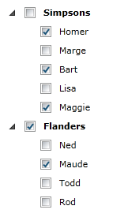

# Retrieve All Checked Items

This tutorial will walk you through the common task of retrieving all checked items in a __RadTreeView__. There are three basic approaches to retrieve all the checked items in a __RadTreeView:__

* [Using RadTreeView's CheckedItems collection](#Using_CheckedItems_Collection)

* [Using RadTreeView's GetItemByPath() method](#Using_GetItemByPath_Method)

* [Using ContainerBindings](#Using_ContainerBinding)[Using StyleBindings](#Using_StyleBinding)

Before proceeding further with this tutorial, you will need a __RadTreeView__ populated with sample data. In this article a hierarchical data that will represent a family tree structure will be used.
	  

#### __C#__

{{region radtreeview-retrieving-checked-items_0}}
	public class Family
	{
	    public Family()
	    {
	        this.Members = new ObservableCollection<Member>();
	    }
	    public string Name
	    {
	        get;
	        set;
	    }
	    public ObservableCollection<Member> Members
	    {
	        get;
	        set;
	    }
	}
	....
	public class Member
	{
	    public Member( string name )
	    {
	        this.Name = name;
	    }
	    public string Name
	    {
	        get;
	        set;
	    }
	}
	{{endregion}}

#### __VB.NET__

{{region radtreeview-retrieving-checked-items_1}}
	Public Class Family
	 Public Sub New()
	  Me.Members = New ObservableCollection(Of Member)()
	 End Sub
	 Public Property Name() As String
	  Get
	  End Get
	  Set
	  End Set
	 End Property
	 Public Property Members() As ObservableCollection(Of Member)
	  Get
	  End Get
	  Set
	  End Set
	 End Property
	End Class
	....
	Public Class Member
	 Public Sub New(name As String)
	  Me.Name = name
	 End Sub
	 Public Property Name() As String
	  Get
	  End Get
	  Set
	  End Set
	 End Property
	End Class
	{{endregion}}

Below is the code populating the treeview, as well as the __RadTreeView__ declaration (along with the necessary templates).
	  

#### __XAML__

{{region radtreeview-retrieving-checked-items_2}}
	<UserControl.Resources>
	    <DataTemplate x:Key="MemberTemplate">
	        <TextBlock Text="{Binding Name}" />
	    </DataTemplate>
	    <telerik:HierarchicalDataTemplate x:Key="FamilyTemplate"
	                                      ItemsSource="{Binding Members}"
	                                      ItemTemplate="{StaticResource MemberTemplate}">
	        <TextBlock Text="{Binding Name}" />
	    </telerik:HierarchicalDataTemplate>
	</UserControl.Resources>
	<Grid x:Name="LayoutRoot"
	      Background="White">
	    <telerik:RadTreeView x:Name="radTreeView"
	                                   IsOptionElementsEnabled="True"
	                                   ItemsOptionListType="CheckList"
	                                   ItemTemplate="{StaticResource FamilyTemplate}">
	    </telerik:RadTreeView>
	</Grid>
	{{endregion}}



#### __XAML__

{{region radtreeview-retrieving-checked-items_25}}
	<UserControl.Resources>
	    <DataTemplate x:Key="MemberTemplate">
	        <TextBlock Text="{Binding Name}" />
	    </DataTemplate>
	    <HierarchicalDataTemplate x:Key="FamilyTemplate"
	                                      ItemsSource="{Binding Members}"
	                                      ItemTemplate="{StaticResource MemberTemplate}">
	        <TextBlock Text="{Binding Name}" />
	    </HierarchicalDataTemplate>
	</UserControl.Resources>
	<Grid x:Name="LayoutRoot"
	      Background="White">
	    <telerik:RadTreeView x:Name="radTreeView"
	                                   IsOptionElementsEnabled="True"
	                                   ItemsOptionListType="CheckList"
	                                   ItemTemplate="{StaticResource FamilyTemplate}">
	    </telerik:RadTreeView>
	</Grid>
	{{endregion}}



#### __C#__

{{region radtreeview-retrieving-checked-items_3}}
	List<Family> dataSource = new List<Family>();
	Family family = new Family();
	family.Name = "Simpson";
	family.Members.Add( new Member( "Homer" ) );
	family.Members.Add( new Member( "Marge" ) );
	family.Members.Add( new Member( "Bart" ) );
	family.Members.Add( new Member( "Lisa" ) );
	family.Members.Add( new Member( "Maggie" ) );
	dataSource.Add( family );
	family = new Family();
	family.Name = "Flanders";
	family.Members.Add( new Member( "Ned" ) );
	family.Members.Add( new Member( "Maude" ) );
	family.Members.Add( new Member( "Todd" ) );
	family.Members.Add( new Member( "Rod" ) );
	dataSource.Add( family );
	this.radTreeView.ItemsSource = dataSource;
	{{endregion}}

#### __VB.NET__

{{region radtreeview-retrieving-checked-items_4}}
	Dim dataSource As New List(Of Family)()
	Dim family As New Family()
	family.Name = "Simpson"
	family.Members.Add(New Member("Homer"))
	family.Members.Add(New Member("Marge"))
	family.Members.Add(New Member("Bart"))
	family.Members.Add(New Member("Lisa"))
	family.Members.Add(New Member("Maggie"))
	dataSource.Add(family)
	family = New Family()
	family.Name = "Flanders"
	family.Members.Add(New Member("Ned"))
	family.Members.Add(New Member("Maude"))
	family.Members.Add(New Member("Todd"))
	family.Members.Add(New Member("Rod"))
	dataSource.Add(family)
	Me.radTreeView.ItemsSource = dataSource
	{{endregion}}

## Using CheckedItems Collection

>This appears to be the first and foremost choice when trying to retrieve all the checked items in a treeview. However, there is one important detail that has to be taken into consideration when using __CheckedItems__collection. If an item has been checked but it has never been visible, the treeview will not know that the item is checked, thus the item will not appear in the __CheckedItems__collection.
		  

Having the note in mind, if you run your treeview with the sample data above and check few items, you should end up with a similar result.

Now, to retrieve all the checked items, all you have to do is go through the __CheckedItems__collection of the treeview:
		

#### __C#__

{{region radtreeview-retrieving-checked-items_5}}
	foreach ( object checkedItem in radTreeView.CheckedItems )
	{
	    // Get the container(RadTreeViewItem) of the checked item
	    RadTreeViewItem container = radTreeView.ContainerFromItemRecursive( checkedItem );
	    // Add your logic for handling the checked item scenario here
	}
	{{endregion}}

#### __VB.NET__

{{region radtreeview-retrieving-checked-items_6}}
	For Each checkedItem As Object In radTreeView.CheckedItems
	 ' Get the container(RadTreeViewItem) of the checked item
	  ' Add your logic for handling the checked item scenario here
	 Dim container As RadTreeViewItem = radTreeView.ContainerFromItemRecursive(checkedItem)
	Next
	{{endregion}}

## Using GetItemByPath Method

Using this approach requires a little bit of additional code in the business model.
		  The __GetItemByPath()__ method requires every item to know its path to the root. Therefore, if the item "Homer"
		  is checked, then the item's full path to the root should be similar to "Simpsons|Homer". There are different ways to construct the
		  full path. This particular example will use an interface that has couple of public members:
		

#### __C#__

{{region radtreeview-retrieving-checked-items_7}}
	public interface IPath
	{
	    IPath Parent
	    {
	        get;
	        set;
	    }
	    string GetFullPath();
	}
	{{endregion}}

__{{region radtreeview-retrieving-checked-items_8}}
	Public Interface IPath
	 Property Parent() As IPath
	 Function GetFullPath() As String
	End Interface
	{{endregion}}____Parent____IPath____Member____Family____Parent____GetFullPath()__

#### __C#__

{{region radtreeview-retrieving-checked-items_9}}
	public class Member : IPath
	{
	    public Member( string name )
	    {
	        this.Name = name;
	    }
	    public string Name
	    {
	        get;
	        set;
	    }
	    public IPath Parent
	    {
	        get;
	        set;
	    }
	    public string GetFullPath()
	    {
	        if ( this.Parent != null )
	            return this.Parent.GetFullPath() + "|" + this.ToString();
	        return this.ToString();
	    }
	    public override string ToString()
	    {
	        return this.Name;
	    }
	}
	{{endregion}}

#### __VB.NET__

{{region radtreeview-retrieving-checked-items_10}}
	Public Class Member
	 Implements IPath
	 Public Sub New(name As String)
	  Me.Name = name
	 End Sub
	 Public Property Name() As String
	  Get
	  End Get
	  Set
	  End Set
	 End Property
	 Public Property Parent() As IPath
	  Get
	  End Get
	  Set
	  End Set
	 End Property
	 Public Function GetFullPath() As String
	  If Me.Parent <> Nothing Then
	   Return Me.Parent.GetFullPath() + "|" + Me.ToString()
	  End If
	  Return Me.ToString()
	 End Function
	 Public Overloads Overrides Function ToString() As String
	  Return Me.Name
	 End Function
	End Class
	{{endregion}}

#### __C#__

{{region radtreeview-retrieving-checked-items_11}}
	public class Family : IPath
	{
	    public Family()
	    {
	        this.Members = new ObservableCollection<Member>();
	        this.Members.CollectionChanged += new System.Collections.Specialized.NotifyCollectionChangedEventHandler( Members_CollectionChanged );
	    }
	    private void Members_CollectionChanged( object sender, NotifyCollectionChangedEventArgs e )
	    {
	        if ( e.Action == NotifyCollectionChangedAction.Add )
	            ( e.NewItems[ 0 ] as IPath ).Parent = this;
	    }
	    public string Name
	    {
	        get;
	        set;
	    }
	    public ObservableCollection<Member> Members
	    {
	        get;
	        set;
	    }
	    public IPath Parent
	    {
	        get;
	        set;
	    }
	    public string GetFullPath()
	    {
	        if ( this.Parent != null )
	            return this.Parent.GetFullPath() + "|" + this.ToString();
	        return this.ToString();
	    }
	    public override string ToString()
	    {
	        return this.Name;
	    }
	}
	{{endregion}}

#### __VB.NET__

{{region radtreeview-retrieving-checked-items_12}}
	Public Class Family
	 Implements IPath
	 Public Sub New()
	  Me.Members = New ObservableCollection(Of Member)()
	  Me.Members.CollectionChanged += New System.Collections.Specialized.NotifyCollectionChangedEventHandler(Members_CollectionChanged)
	 End Sub
	 Private Sub Members_CollectionChanged(sender As Object, e As NotifyCollectionChangedEventArgs)
	  If e.Action = NotifyCollectionChangedAction.Add Then
	   (TryCast(e.NewItems(0), IPath)).Parent = Me
	  End If
	 End Sub
	 Public Property Name() As String
	  Get
	  End Get
	  Set
	  End Set
	 End Property
	 Public Property Members() As ObservableCollection(Of Member)
	  Get
	  End Get
	  Set
	  End Set
	 End Property
	 Public Property Parent() As IPath
	  Get
	  End Get
	  Set
	  End Set
	 End Property
	 Public Function GetFullPath() As String
	  If Me.Parent <> Nothing Then
	   Return Me.Parent.GetFullPath() + "|" + Me.ToString()
	  End If
	  Return Me.ToString()
	 End Function
	 Public Overloads Overrides Function ToString() As String
	  Return Me.Name
	 End Function
	End Class
	{{endregion}}

Now, to find all checked items, you have to go through each item in your data source and get the container for the item. Then you have to check the __CheckState__ of the container and if it is __ToggleState.On__, add your logic for handling the checked item scenario.
		

#### __C#__

{{region radtreeview-retrieving-checked-items_13}}
	ObservableCollection<Family> dataSource = radTreeView.ItemsSource as ObservableCollection<Family>;
	foreach ( Family family in dataSource )
	{
	    RadTreeViewItem familyContainer = radTreeView.GetItemByPath( family.GetFullPath(), "|" );
	    if ( familyContainer != null && familyContainer.CheckState == ToggleState.On )
	    {
	        // add your logic for handling checked item scenario here.
	    }
	    foreach ( Member member in family.Members )
	    {
	        RadTreeViewItem memberContainer = radTreeView.GetItemByPath( member.GetFullPath(), "|" );
	        if ( memberContainer != null && memberContainer.CheckState == ToggleState.On )
	        {
	            // add your logic for handling checked item scenario here.
	        }
	    }
	}
	{{endregion}}

__{{region radtreeview-retrieving-checked-items_14}}
	Dim dataSource As ObservableCollection(Of Family) = TryCast(radTreeView.ItemsSource, ObservableCollection(Of Family))
	For Each family As Family In dataSource
	 Dim familyContainer As RadTreeViewItem = radTreeView.GetItemByPath(family.GetFullPath(), "|")
	   ' add your logic for handling checked item scenario here.
	 If familyContainer <> Nothing AndAlso familyContainer.CheckState = ToggleState.[On] Then
	 End If
	 For Each member As Member In family.Members
	  Dim memberContainer As RadTreeViewItem = radTreeView.GetItemByPath(member.GetFullPath(), "|")
	    ' add your logic for handling checked item scenario here.
	  If memberContainer <> Nothing AndAlso memberContainer.CheckState = ToggleState.[On] Then
	  End If
	 Next
	Next
	{{endregion}}__

>It is highly advisable __not to use this approach__ when dealing with a __virtualized__ tree, since this can have great impact on performance.
		  

# See Also

 * [Bind RadTreeView to Hierarchical Data and Use ContainerBindingCollection]()

 * [Bind RadTreeView to Hierarchical Data and Use Style Binding]()
