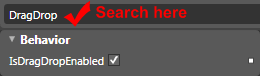

# Search for a Property in Expression Blend

## 

Sometimes it will be difficult to find the desired property in the __Properties__pane. Expression Blend supports searching functionality. On the analogy of the searching controls in the __Assets__library, you can search for properties in the __Property__pane. The search field is located on the top part of the __Property__pane.

# See Also

 * [Select an Item in Expression Blend]()

 * [Work with Selection]()

 * [Implement Drag and Drop Between TreeView and ListBox]()
