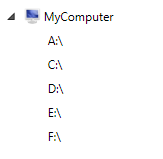
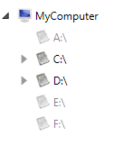
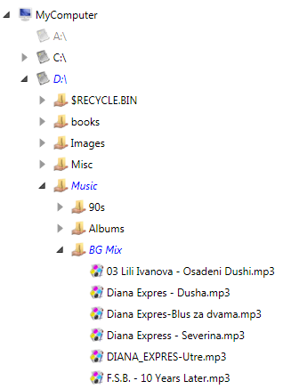

# Create Windows Explorer Like WPF TreeView

Most of the __RadTreeView__ samples you see on the web are somewhat simplistic: while they may provide heterogeneous data, usually all children of a given node are of the same type.	  

The purpose of this tutorial is to show you how to generate a __RadTreeView__ that has N level items of different types (for example Windows Explorer - in one directory you could have more directories and files).	  

The final result should look like the snapshot below:


This tutorial will combine in itself the following:

* Load on demand. For more information, read [here]().		  

* Data binding to a collection of objects. For more information, read [here]().		  

* Hierarchical data templates. For more information, read [here]().		  

* [ItemContainerStyle]() and [ItemContainerStyleSelector]().		  

* Item images. For more information, read [here]().		  

## Creating Windows Explorer Like TreeView

1. Here is a simple __RadTreeView__ declaration:

	__Example 1: Declare RadTreeView__

	```XAML
		<telerik:RadTreeView x:Name="radTreeView" Margin="8"/>
	```

2. Create three business objects: __File__, __Directory__ and __Drive__. Here is their structure:		
	
	__Example 2: File__
	```C#
		public class File
		{
			public File( string fullPath, string name )
			{
				this.FullPath = fullPath;
				this.Name = name;
			}
			public string FullPath
			{
				get;
				set;
			}
			public string Name
			{
				get;
				set;
			}
		}
	```
	```VB.NET
		Public Class File
			Public Sub New(ByVal fullPath As String, ByVal name As String)
				Me.FullPath = fullPath
				Me.Name = name
			End Sub
		
		Private _FullPath As String
			Public Property FullPath() As String
				Get
					Return _FullPath
				End Get
				Set(ByVal value As String)
					_FullPath = value
				End Set
			End Property
		
		Private _Name As String
			Public Property Name() As String
				Get
					Return _Name
				End Get
				Set(ByVal value As String)
					_Name = value
				End Set
			End Property
		End Class
	```

	__Example 3: Directory__
	```C#
		public class Directory
		{
			public Directory( string fullPath, string name )
			{
				this.FullPath = fullPath;
				this.Name = name;
				this.Children = new ObservableCollection<object>();
			}
			public string FullPath
			{
				get;
				set;
			}
			public string Name
			{
				get;
				set;
			}
			 public bool IsReady
			{
				get;
				set;
			}
			public ObservableCollection<object> Children
			{
				get;
				private set;
			}
		}
	```
	```VB.NET
		Public Class Directory
			Public Sub New(ByVal fullPath As String, ByVal name As String)
				Me.FullPath = fullPath
				Me.Name = name
				Me.Childs = New ObservableCollection(Of Object)()
			End Sub
		
		Private _FullPath As String
			Public Property FullPath() As String
				Get
					Return _FullPath
				End Get
				Set(ByVal value As String)
					_FullPath = value
				End Set
			End Property
		
		Private _Name As String
			Public Property Name() As String
				Get
					Return _Name
				End Get
				Set(ByVal value As String)
					_Name = value
				End Set
			End Property
		Private _IsReady As Boolean
			Public Property IsReady() As Boolean
				Get
					Return _IsReady
				End Get
				Set(ByVal value As Boolean)
					_IsReady = value
				End Set
			End Property
		
		Private _Children As ObservableCollection(Of Object)
			Public Property Children() As ObservableCollection(Of Object)
				Get
					Return _Children
				End Get
				Set(ByVal value As ObservableCollection(Of Object))
					_Children = value
				End Set
			End Property
		End Class
	```

	__Example 4: Drive__

	```C#
		public class Drive
		{
			public Drive( string name, bool isReady )
			{
				this.Name = name;
				this.IsReady = isReady;
				this.Children = new ObservableCollection<object>();
			}
			public string Name
			{
				get;
				set;
			}
			public bool IsReady
			{
				get;
				set;
			}
			public ObservableCollection<object> Children
			{
				get;
				private set;
			}
		}
	```
	```VB.NET
		Public Class Drive
			Public Sub New(ByVal name As String, ByVal isReady As Boolean)
				Me.Name = name
				Me.IsReady = isReady
		
					Me.Children = New ObservableCollection(Of Object)()
			End Sub
		
		Private _Name As String
			Public Property Name() As String
				Get
					Return _Name
				End Get
				Set(ByVal value As String)
					_Name = value
				End Set
			End Property
		
		Private _IsReady As Boolean
			Public Property IsReady() As Boolean
				Get
					Return _IsReady
				End Get
				Set(ByVal value As Boolean)
					_IsReady = value
				End Set
			End Property
		
		Private _Children As ObservableCollection(Of Object)
		Public Property Children() As ObservableCollection(Of Object)
			Get
				Return _Children
			End Get
			Set(ByVal value As ObservableCollection(Of Object))
				_Children = value
			End Set
		End Property
		End Class
	```

	The __Drive__ business object has a reference to an __ObservableCollection__ of objects. These are the child elements. In fact this collection will store all directories and files for the drive.

	The next step is to create the model for the application.

3. Create a new class named __ServiceFacade__. Add a reference to an __ObservableCollection__ of __Drives__.

	__Example 5: ServiceFacade__

	```C#
		public sealed class ServiceFacade
		{
			private static ServiceFacade instance;
			public static ServiceFacade Instance
			{
				get
				{
					if ( instance == null )
					{
						instance = new ServiceFacade();
						instance.Initialize();
					}
					return instance;
				}
			}
			public ObservableCollection<Drive> Drives
			{
				get;
				private set;
			}
			private void Initialize()
			{
			}
		}
	```
	```VB.NET
		Public NotInheritable Class ServiceFacade
			Private Shared m_instance As ServiceFacade
		
			Public Shared ReadOnly Property Instance() As ServiceFacade
				Get
					If m_instance Is Nothing Then
						m_instance = New ServiceFacade()
						m_instance.Initialize()
					End If
		
					Return m_instance
				End Get
			End Property
		
		Private _Drives As ObservableCollection(Of Drive)
			Public Property Drives() As ObservableCollection(Of Drive)
				Get
					Return _Drives
				End Get
				Set(ByVal value As ObservableCollection(Of Drive))
					_Drives = value
				End Set
			End Property
		
			Private Sub Initialize()
			End Sub
		End Class
	```

	For better convenience, the __ServiceFacade__ class is an implementation of the [Singleton](http://en.wikipedia.org/wiki/Singleton_pattern) pattern. When only one instance of the class is created, the __Drives__ collection needs to be populated with all drives on your machine. This will happen in the __Initialize()__ method. __Example 6__ demonstrates how this can be achieved.

	__Example 6: Populate all drives in the Initialize() method__

	```C#
		private void Initialize()
        {
            this.Drives = new ObservableCollection<Drive>();
            this.Drives.Add(new Drive("My Computer", true));
            foreach (DriveInfo driveInfo in System.IO.DriveInfo.GetDrives())
            {
                this.Drives[0].Children.Add(new Drive(driveInfo.Name, driveInfo.IsReady));
            }
        }
	```
	```VB.NET
		Private Sub Initialize()
			Me.Drives = New ObservableCollection(Of Drive)()
			Me.Drives.Add(New Drive("My Computer", True))

			For Each driveInfo As DriveInfo In System.IO.DriveInfo.GetDrives()
				Me.Drives(0).Children.Add(New Drive(driveInfo.Name, driveInfo.IsReady))
			Next
		End Sub
	```

4. Go back to your treeview declaration and bind the control to the just created model. __Example 7__ shows how this can be done:

	__Example 7: Bind RadTreeView__

	```XAML
		<telerik:RadTreeView x:Name="radTreeView" Margin="8" ItemsSource="{Binding Source={x:Static example:ServiceFacade.Instance}, Path=Drives}"/>
	```

	> The "example" alias references the namespace containing the __ServiceFacade__ class.

	So far if you run the demo, the treeview does not "know" how to represent the __Drive__ object. You need to create a __HierachicalDataTemplate__. It is quite simple and just displays the name of the drive.

	__Example 8: Create HierachicalDataTemplate and DataTemplate for the different treeview node levels__
	```XAML
		<DataTemplate DataType="{x:Type example:File}">
            <TextBlock Text="{Binding Name}" />
        </DataTemplate>

        <HierarchicalDataTemplate DataType="{x:Type example:Directory}" ItemsSource="{Binding Children}">
            <TextBlock Text="{Binding Name}" />
        </HierarchicalDataTemplate>

        <HierarchicalDataTemplate DataType="{x:Type example:Drive}" ItemsSource="{Binding Children}">
            <Grid>
                <TextBlock Text="{Binding Name}" />
            </Grid>
        </HierarchicalDataTemplate>
	```

	Run your demo. The result so far should look like the snapshot below:
	

	As you can see under the MyComputer node, all available drives are shown. However, not all of the drives are ready for use (for example, someone will not have a floppy - A:\ on his PC) and you would probably want to disable these items. Also that you need to enable the load on demand behavior for the drives. The best way to do all of this is to use __ItemContainerStyle__ and __ItemContainerStyleSelector__.

5. Create a new class named __ItemStyleSelector__, which inherits from __StyleSelector__.

	__Example 9: Create custom StyleSelector__
	```C#
		public class ItemStyleSelector : StyleSelector
		{
			public override System.Windows.Style SelectStyle( object item, System.Windows.DependencyObject container )
			{
				if ( item is Drive )
					return this.DriveStyle;
				else if ( item is Directory )
					return this.DirectoryStyle;
				else if ( item is File )
					return this.FileStyle; 
				return base.SelectStyle( item, container );
			}
		
			public Style DirectoryStyle
			{
				get;
				set;
			}
			public Style FileStyle
			{
				get;
				set;
			}
			public Style DriveStyle
			{
				get;
				set;
			}
		}
	```
	```VB.NET
		Public Class ItemStyleSelector
			Inherits StyleSelector
			Public Overloads Overrides Function SelectStyle(ByVal item As Object, ByVal container As System.Windows.DependencyObject) As System.Windows.Style
				If TypeOf item Is Drive Then
					Return Me.DriveStyle
				ElseIf TypeOf item Is Directory Then
					Return Me.DirectoryStyle
				ElseIf TypeOf item Is File Then
					Return Me.FileStyle
				End If
		
				Return MyBase.SelectStyle(item, container)
			End Function
		
		Private _DirectoryStyle As Style
			Public Property DirectoryStyle() As Style
				Get
					Return _DirectoryStyle
				End Get
				Set(ByVal value As Style)
					_DirectoryStyle = value
				End Set
			End Property
		
		Private _FileStyle As Style
			Public Property FileStyle() As Style
				Get
					Return _FileStyle
				End Get
				Set(ByVal value As Style)
					_FileStyle = value
				End Set
			End Property
		
		Private _DriveStyle As Style
			Public Property DriveStyle() As Style
				Get
					Return _DriveStyle
				End Get
				Set(ByVal value As Style)
					_DriveStyle = value
				End Set
			End Property
		End Class
	```

	Add a new style in your control resources. Here is how the __Style__ for all the drives would look like:

	__Example 10: Add custom styles__
	
	```XAML
		<UserControl.Resources>		
			<Style x:Key="DriveItemStyle" TargetType="{x:Type telerik:RadTreeViewItem}">
				<Setter Property="IsLoadOnDemandEnabled" Value="{Binding IsReady}"/>
				<Setter Property="IsEnabled" Value="{Binding IsReady}"/>
				<Setter Property="DefaultImageSrc" Value="/Images/Drive.png"/>
				<Style.Triggers>
					<Trigger Property="IsExpanded" Value="True">
						<Trigger.Setters>
							<Setter Property="Foreground" Value="Blue"/>
							<Setter Property="FontStyle" Value="Italic"/>
						</Trigger.Setters>
					</Trigger>
				</Style.Triggers>
			</Style>
		
			<example:ItemStyleSelector x:Key="ItemStyleSelector"
				DriveStyle="{StaticResource DriveItemStyle}"/>
		
			<HierarchicalDataTemplate DataType="{x:Type example:Drive}" ItemsSource="{Binding Path=Children}">
				<Grid>
					<TextBlock Text="{Binding Name}"/>
				</Grid>
			</HierarchicalDataTemplate>
		
		</UserControl.Resources>
		<telerik:RadTreeView x:Name="radTreeView"
							 Margin="8"
							 IsLoadOnDemandEnabled="True" 
							 ItemsSource="{Binding Source={x:Static example:ServiceFacade.Instance},
														   Path=Drives}">
			<telerik:EventToCommandBehavior.EventBindings>
                <telerik:EventBinding EventName="LoadOnDemand" Command="{Binding LoadOnDemandCommand}" PassEventArgsToCommand="True"/>
                <telerik:EventBinding EventName="ItemPrepared" Command="{Binding ItemPreparedCommand}" PassEventArgsToCommand="True"/>
            </telerik:EventToCommandBehavior.EventBindings>
		</telerik:RadTreeView>
	```

	This style performs the following:

	* Uses a style binding to bind the __IsLoadOnDemandEnabled__ and __IsEnabled__ properties of the __RadTreeViewItem__ to the __IsReady__ property to the Drive business object.
	* Sets the default image for the __RadTreeViewItem__.
	* Uses a simple trigger to change the Foreground and the __FontStyle__ properties of the __RadTreeViewItem__ when the item is expanded.				

	Also a new instance of the __ItemStyleSelector__ class is declared and the "DriveStyle" is set. The other two styles - "DirectoryStyle" and "FileStyle" will be declared and set later. Furthermore we subscribe to the __LoadOnDemand__ and __ItemsPrepared__ events of the __RadTreeView__ control.

	Next you can go back to the tree view control declaration and set the __ItemContainerStyleSelector__ property.

	__Example 11: Set ItemContainerStyleSelector property__

	```XAML
		<telerik:RadTreeView x:Name="radTreeView"
							 Margin="8"
							 IsLoadOnDemandEnabled="True" 
							 ItemsSource="{Binding Source={x:Static example:ServiceFacade.Instance},
														   Path=Drives}"
							 ItemContainerStyleSelector="{StaticResource ItemStyleSelector}">
			<telerik:EventToCommandBehavior.EventBindings>
                <telerik:EventBinding EventName="LoadOnDemand" Command="{Binding LoadOnDemandCommand}" PassEventArgsToCommand="True"/>
                <telerik:EventBinding EventName="ItemPrepared" Command="{Binding ItemPreparedCommand}" PassEventArgsToCommand="True"/>
            </telerik:EventToCommandBehavior.EventBindings>
		</telerik:RadTreeView>
	```

	Now run your demo. After applying the __Style__ you can see the difference. The drives which are not ready are disabled. Try to expand any of the enabled items - the LoadOnDemand event is fired.
	

	You are one step closer to the final result. Next, you need to handle with load on demand events.  

6. To avoid doing this in code-behind, you can use __EventToCommandBehavior__ to bind the __LoadOnDemand__ event to a command from your view model. To do that we can create an additional class which will hold the commands. Also, we don't need to load children for the __Files__ objects, and this is why we can set their __IsLoadOnDemandEnabled__ property to __False__. The best way to do this is to bind the __ItemPrepared__ event of the __RadTreeView__ control to a command, and set the __IsLoadOnDemandEnabled__ property to false. __Example 12__ demonstrate this implementation.

	__Example 12: Create MainViewModel class__

	```C#
		public class MainViewModel
		{
			public MainViewModel()
			{
				LoadOnDemandCommand = new DelegateCommand(On_LoadOnDemandCommand);
				ItemPreparedCommand = new DelegateCommand(On_ItemPreparedCommand);
			}

			public ICommand LoadOnDemandCommand { get; set; }
			public ICommand ItemPreparedCommand { get; set; }

			private void On_ItemPreparedCommand(object obj)
			{
				var args = obj as RadTreeViewItemPreparedEventArgs;
				if (args.PreparedItem.DataContext is File)
				{
					args.PreparedItem.IsLoadOnDemandEnabled = false;
				}
			}

			private void On_LoadOnDemandCommand(object obj)
			{
				var args = obj as RadRoutedEventArgs;
				RadTreeViewItem expandedItem = args.OriginalSource as RadTreeViewItem;
				if (expandedItem == null)
					return;

				Drive drive = expandedItem.Item as Drive;
				if (drive != null)
				{
					ServiceFacade.Instance.LoadChildren(drive);
					if (drive.Children.Count == 0)
					{
						drive.IsReady = false;
					}
					return;
				}

				Directory directory = expandedItem.Item as Directory;
				if (directory != null)
				{
					ServiceFacade.Instance.LoadChildren(directory);
					if (directory.Children.Count == 0)
					{
						directory.IsReady = false;
					}
				}
			}        
		}
	```

	The code just takes the expanded item and makes a call to the __ServiceFacade__ object to load the children.

	> Be sure that you set the __Handled__ property of the __RoutedEvent__ to __True__. Otherwise, when you expand a directory object, the event will be bubbled up the visual tree and will be handled twice (or more).

	After this you can add the following public methods to the __ServiceFacade__ class.

	__Example 13: Add additional methods__

	```C#
		public void LoadChildren( Drive d )
		{
			foreach ( string directory in System.IO.Directory.GetDirectories( d.Name ) )
			{
				DirectoryInfo directoryInfo = new DirectoryInfo( directory );
				d.Children.Add( new Directory( directory, directoryInfo.Name ) );
			}
			foreach ( string file in System.IO.Directory.GetFiles( d.Name ) )
			{
				FileInfo fileInfo = new FileInfo( file );
				d.Children.Add( new File( file, fileInfo.Name ) );
			}
		}
		
		public void LoadChildren( Directory d )
		{
			foreach ( string directory in System.IO.Directory.GetDirectories( d.FullPath ) )
			{
				DirectoryInfo directoryInfo = new DirectoryInfo( directory );
				d.Children.Add( new Directory( directory, directoryInfo.Name ) );
			}
			foreach ( string file in System.IO.Directory.GetFiles( d.FullPath ) )
			{
				FileInfo fileInfo = new FileInfo( file );
				d.Children.Add( new File( file, fileInfo.Name ) );
			}
		}
	```
	```VB.NET
		Public Sub LoadChildren(ByVal d As Drive)
			For Each directory As String In System.IO.Directory.GetDirectories(d.Name)
				Dim directoryInfo As New DirectoryInfo(directory)
				d.Children.Add(New Directory(directory, directoryInfo.Name))
			Next
			For Each file As String In System.IO.Directory.GetFiles(d.Name)
				Dim fileInfo As New FileInfo(file)
				d.Children.Add(New File(file, fileInfo.Name))
			Next
		End Sub
	
		Public Sub LoadChildren(ByVal d As Directory)
			For Each directory As String In System.IO.Directory.GetDirectories(d.FullPath)
				Dim directoryInfo As New DirectoryInfo(directory)
				d.Children.Add(New Directory(directory, directoryInfo.Name))
			Next
			For Each file As String In System.IO.Directory.GetFiles(d.FullPath)
				Dim fileInfo As New FileInfo(file)
				d.Children.Add(New File(file, fileInfo.Name))
			Next
		End Sub
	```

	The final step is to add __Styles__ for the __Directory__ object and the __File__ object.  	 

7. Add two additional styles - one for the __Directory__ object and one for the __File__ object. Update your __ItemStyleSelector__ declaration - set the __DirectoryStyle__ and __FileStyle__ properties:

	__Example 14: Add custom styles__

	```XAML
		<Style x:Key="DirectoryItemStyle" TargetType="{x:Type telerik:RadTreeViewItem}">
			<Setter Property="Foreground" Value="Black"/>
			<Setter Property="FontStyle" Value="Normal"/>
			<Setter Property="DefaultImageSrc" Value="/Images/Folder.png"/>
			<Style.Triggers>
				<Trigger Property="IsExpanded" Value="True">
					<Trigger.Setters>
						<Setter Property="Foreground" Value="Blue"/>
						<Setter Property="FontStyle" Value="Italic"/>
					</Trigger.Setters>
				</Trigger>
			</Style.Triggers>
		</Style>
		
		<Style x:Key="FileItemStyle" TargetType="{x:Type telerik:RadTreeViewItem}">
			<Setter Property="Foreground" Value="Black"/>
			<Setter Property="FontStyle" Value="Normal"/>
			<Setter Property="DefaultImageSrc" Value="/Images/File.png"/>
		</Style>
		
		<example:ItemStyleSelector x:Key="ItemStyleSelector"
			DriveStyle="{StaticResource DriveItemStyle}"
			DirectoryStyle="{StaticResource DirectoryItemStyle}"
			FileStyle="{StaticResource FileItemStyle}"/>
	```

	The directory style is similar to the drive style. However, the style for the file object is a little different. It sets a different image.		

With the last declarations the WPF Windows Explorer TreeView is ready. Run your demo.


>tip Of course, you could experiment with the application and add additional functionality. Only the sky can be the limit for you!

>The initial load of the drives is a slower operation and can cause your application freezing. Consider adding some loading animation.

## See Also
 * [Bind RadTreeView to Self-Referencing Data]()
 * [Disable Default Animation in RadTreeView]()
