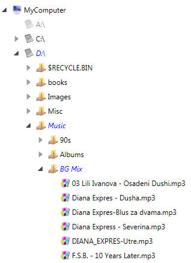
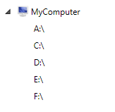
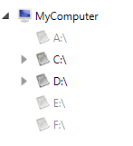

# Create Windows Explorer Like WPF TreeView

Most of the __RadTreeView__ samples you see on the web are somewhat simplistic: while they may provide heterogeneous data, usually all children of a given node are of the same type.	  

The purpose of this tutorial is to show you how to generate a __RadTreeView__ that has N level items of different types (for example Windows Explorer - in one directory you could have more directories and files).	  

The final result should look like the snapshot below:

This tutorial will combine in itself the following:

* Load on demand. For more information, read [here]().		  

* Data binding to a collection of objects. For more information, read [here]().		  

* Hierarchical data templates. For more information, read [here]().		  

* [ItemContainerStyle]() and [ItemContainerStyleSelector]().		  

* Item images. For more information, read [here]().		  

## Creating Windows Explorer Like TreeView

1. Here is a simple __RadTreeView__ declaration:

	__Example 1: Declare RadTreeView__

	<snippet id='radtreeview-how-to-wpf-windowsexplorer-like-treeview-block_1-xaml' />

2. Create three business objects: __File__, __Directory__ and __Drive__. Here is their structure:		
	
	__Example 2: File__
	<snippet id='radtreeview-how-to-wpf-windowsexplorer-like-treeview-block_2-cs' />
	<snippet id='radtreeview-how-to-wpf-windowsexplorer-like-treeview-block_3-vb' />

	__Example 3: Directory__
	<snippet id='radtreeview-how-to-wpf-windowsexplorer-like-treeview-block_4-cs' />
	<snippet id='radtreeview-how-to-wpf-windowsexplorer-like-treeview-block_5-vb' />

	__Example 4: Drive__

	<snippet id='radtreeview-how-to-wpf-windowsexplorer-like-treeview-block_6-cs' />
	<snippet id='radtreeview-how-to-wpf-windowsexplorer-like-treeview-block_7-vb' />

	The __Drive__ business object has a reference to an __ObservableCollection__ of objects. These are the child elements. In fact this collection will store all directories and files for the drive.

	The next step is to create the model for the application.

3. Create a new class named __ServiceFacade__. Add a reference to an __ObservableCollection__ of __Drives__.

	__Example 5: ServiceFacade__

	<snippet id='radtreeview-how-to-wpf-windowsexplorer-like-treeview-block_8-cs' />
	<snippet id='radtreeview-how-to-wpf-windowsexplorer-like-treeview-block_9-vb' />

	For better convenience, the __ServiceFacade__ class is an implementation of the [Singleton](http://en.wikipedia.org/wiki/Singleton_pattern) pattern. When only one instance of the class is created, the __Drives__ collection needs to be populated with all drives on your machine. This will happen in the __Initialize()__ method. __Example 6__ demonstrates how this can be achieved.

	__Example 6: Populate all drives in the Initialize() method__

	<snippet id='radtreeview-how-to-wpf-windowsexplorer-like-treeview-block_10-cs' />
	<snippet id='radtreeview-how-to-wpf-windowsexplorer-like-treeview-block_11-vb' />

4. Go back to your treeview declaration and bind the control to the just created model. __Example 7__ shows how this can be done:

	__Example 7: Bind RadTreeView__

	<snippet id='radtreeview-how-to-wpf-windowsexplorer-like-treeview-block_12-xaml' />

	> The "example" alias references the namespace containing the __ServiceFacade__ class.

	So far if you run the demo, the treeview does not "know" how to represent the __Drive__ object. You need to create a __HierachicalDataTemplate__. It is quite simple and just displays the name of the drive.

	__Example 8: Create HierachicalDataTemplate and DataTemplate for the different treeview node levels__
	<snippet id='radtreeview-how-to-wpf-windowsexplorer-like-treeview-block_13-xaml' />

	Run your demo. The result so far should look like the snapshot below:
	

	As you can see under the MyComputer node, all available drives are shown. However, not all of the drives are ready for use (for example, someone will not have a floppy - A:\ on his PC) and you would probably want to disable these items. Also that you need to enable the load on demand behavior for the drives. The best way to do all of this is to use __ItemContainerStyle__ and __ItemContainerStyleSelector__.

5. Create a new class named __ItemStyleSelector__, which inherits from __StyleSelector__.

	__Example 9: Create custom StyleSelector__
	<snippet id='radtreeview-how-to-wpf-windowsexplorer-like-treeview-block_14-cs' />
	<snippet id='radtreeview-how-to-wpf-windowsexplorer-like-treeview-block_15-vb' />

	Add a new style in your control resources. Here is how the __Style__ for all the drives would look like:

	__Example 10: Add custom styles__
	
	<snippet id='radtreeview-how-to-wpf-windowsexplorer-like-treeview-block_16-xaml' />

	This style performs the following:

	* Uses a style binding to bind the __IsLoadOnDemandEnabled__ and __IsEnabled__ properties of the __RadTreeViewItem__ to the __IsReady__ property to the Drive business object.
	* Sets the default image for the __RadTreeViewItem__.
	* Uses a simple trigger to change the Foreground and the __FontStyle__ properties of the __RadTreeViewItem__ when the item is expanded.				

	Also a new instance of the __ItemStyleSelector__ class is declared and the "DriveStyle" is set. The other two styles - "DirectoryStyle" and "FileStyle" will be declared and set later. Furthermore we subscribe to the __LoadOnDemand__ and __ItemsPrepared__ events of the __RadTreeView__ control.

	Next you can go back to the tree view control declaration and set the __ItemContainerStyleSelector__ property.

	__Example 11: Set ItemContainerStyleSelector property__

	<snippet id='radtreeview-how-to-wpf-windowsexplorer-like-treeview-block_17-xaml' />

	Now run your demo. After applying the __Style__ you can see the difference. The drives which are not ready are disabled. Try to expand any of the enabled items - the LoadOnDemand event is fired.
	

	You are one step closer to the final result. Next, you need to handle with load on demand events.  

6. To avoid doing this in code-behind, you can use __EventToCommandBehavior__ to bind the __LoadOnDemand__ event to a command from your view model. To do that we can create an additional class which will hold the commands. Also, we don't need to load children for the __Files__ objects, and this is why we can set their __IsLoadOnDemandEnabled__ property to __False__. The best way to do this is to bind the __ItemPrepared__ event of the __RadTreeView__ control to a command, and set the __IsLoadOnDemandEnabled__ property to false. __Example 12__ demonstrate this implementation.

	__Example 12: Create MainViewModel class__

	<snippet id='radtreeview-how-to-wpf-windowsexplorer-like-treeview-block_18-cs' />

	The code just takes the expanded item and makes a call to the __ServiceFacade__ object to load the children.

	> Be sure that you set the __Handled__ property of the __RoutedEvent__ to __True__. Otherwise, when you expand a directory object, the event will be bubbled up the visual tree and will be handled twice (or more).

	After this you can add the following public methods to the __ServiceFacade__ class.

	__Example 13: Add additional methods__

	<snippet id='radtreeview-how-to-wpf-windowsexplorer-like-treeview-block_19-cs' />
	<snippet id='radtreeview-how-to-wpf-windowsexplorer-like-treeview-block_20-vb' />

	The final step is to add __Styles__ for the __Directory__ object and the __File__ object.  	 

7. Add two additional styles - one for the __Directory__ object and one for the __File__ object. Update your __ItemStyleSelector__ declaration - set the __DirectoryStyle__ and __FileStyle__ properties:

	__Example 14: Add custom styles__

	<snippet id='radtreeview-how-to-wpf-windowsexplorer-like-treeview-block_21-xaml' />

	The directory style is similar to the drive style. However, the style for the file object is a little different. It sets a different image.		

With the last declarations the WPF Windows Explorer TreeView is ready. Run your demo.

>tip Of course, you could experiment with the application and add additional functionality. Only the sky can be the limit for you!

>The initial load of the drives is a slower operation and can cause your application freezing. Consider adding some loading animation.

## See Also
 * [Bind RadTreeView to Self-Referencing Data]()
 * [Disable Default Animation in RadTreeView]()