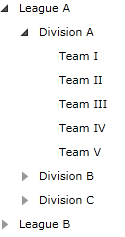
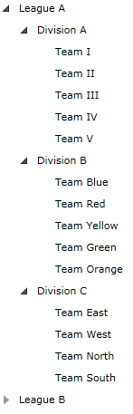

# Binding to Object

To bind the __RadTreeView__ to a collection use its __ItemsSource__ property and define __HierarchicalDataTemplate__ that are needed to display the data from the collection. If you want the changes to the collection to be automatically reflected to the __RadTreeView__ items, the collection should inherit from __ObservableCollection__, or to implement the __INotifyPropertyChanged__ interface.

The following tutorial will guide you how to bind a __RadTreeView__ to a collection of business objects.

The final result should look like the snapshot below: 


* First, you need to include the following assemblies in your XAML declaration:
	* __Telerik.Windows.Controls__
	* __Telerik.Windows.Controls.Navigation__

* Create a new class named __Team__. The class has a single string property.

	#### __C#__

	```C#
		public class Team
		{
			public Team( string name )
			{
				this.Name = name;
			}
			public string Name
			{
				get;
				set;
			}
		}
		```

	#### __VB.NET__

	```VB.NET
		Public Class Team
			Public Sub New(ByVal name As String)
				Me.Name = name
			End Sub
		
		Private _Name As String
			Public Property Name() As String
				Get
					Return _Name
				End Get
				Set(ByVal value As String)
					_Name = value
				End Set
			End Property
		End Class
		```
		
* Create a new class named __Division__. The class has a single string property - __Name__ and a collection with teams.

	#### __C#__

	```C#
		public class Division
		{
			public Division( string name )
			{
				this.Name = name;
				this.Teams = new ObservableCollection<Team>();
			}
			public string Name
			{
				get;
				set;
			}
			public ObservableCollection<Team> Teams
			{
				get;
				set;
			}
		}
		```

	#### __VB.NET__

	```VB.NET
		Public Class Division
			Public Sub New(ByVal name As String)
				Me.Name = name
				Me.Teams = New ObservableCollection(Of Team)()
			End Sub
		
		Private _Name As String
			Public Property Name() As String
				Get
					Return _Name
				End Get
				Set(ByVal value As String)
					_Name = value
				End Set
			End Property
		
		Private _Teams As ObservableCollection(Of Team)
			Public Property Teams() As ObservableCollection(Of Team)
				Get
					Return _Teams
				End Get
				Set(ByVal value As ObservableCollection(Of Team))
					_Teams = value
				End Set
			End Property
		End Class
		```

* Create a new class named __League__. The class has a single string property and a collection with divisions objects. Practically, a collection of __League__ objects will be the data source for the treeview.

	#### __C#__

	```C#
		public class League
		{
			public League( string name )
			{
				this.Name = name;
				this.Divisions = new ObservableCollection<Division>();
			}
			public string Name
			{
				get;
				set;
			}
			public ObservableCollection<Division> Divisions
			{
				get;
				set;
			}
		}
		```

	#### __VB.NET__

	```VB.NET
		Public Class League
			Public Sub New(ByVal name As String)
				Me.Name = name
				Me.Divisions = New ObservableCollection(Of Division)()
			End Sub
		
		Private _Name As String
			Public Property Name() As String
				Get
					Return _Name
				End Get
				Set(ByVal value As String)
					_Name = value
				End Set
			End Property
		
		Private _Divisions As ObservableCollection(Of Division)
			Public Property Divisions() As ObservableCollection(Of Division)
				Get
					Return _Divisions
				End Get
				Set(ByVal value As ObservableCollection(Of Division))
					_Divisions = value
				End Set
			End Property
		End Class
		```

* Create a new class named __RadTreeViewSampleData__. This will be the data source (the model) for the __RadTreeView__. The class has a reference to an __ObservableCollection__ of __League__ objects and a single method which initializes the data.

	#### __C#__

	```C#
		public class RadTreeViewSampleData
		{
			public RadTreeViewSampleData()
			{
				this.InitializeLeaguesDataSource();
			}
			public ObservableCollection<League> LeaguesDataSource
			{
				get;
				set;
			}
			private void InitializeLeaguesDataSource()
			{
				this.LeaguesDataSource = new ObservableCollection<League>();
				League l;
				Division d;
				this.LeaguesDataSource.Add( l = new League( "League A" ) );
				l.Divisions.Add( ( d = new Division( "Division A" ) ) );
				d.Teams.Add( new Team( "Team I" ) );
				d.Teams.Add( new Team( "Team II" ) );
				d.Teams.Add( new Team( "Team III" ) );
				d.Teams.Add( new Team( "Team IV" ) );
				d.Teams.Add( new Team( "Team V" ) );
				l.Divisions.Add( ( d = new Division( "Division B" ) ) );
				d.Teams.Add( new Team( "Team Blue" ) );
				d.Teams.Add( new Team( "Team Red" ) );
				d.Teams.Add( new Team( "Team Yellow" ) );
				d.Teams.Add( new Team( "Team Green" ) );
				d.Teams.Add( new Team( "Team Orange" ) );
				l.Divisions.Add( ( d = new Division( "Division C" ) ) );
				d.Teams.Add( new Team( "Team East" ) );
				d.Teams.Add( new Team( "Team West" ) );
				d.Teams.Add( new Team( "Team North" ) );
				d.Teams.Add( new Team( "Team South" ) );
				this.LeaguesDataSource.Add( l = new League( "League B" ) );
				l.Divisions.Add( ( d = new Division( "Division A" ) ) );
				d.Teams.Add( new Team( "Team 1" ) );
				d.Teams.Add( new Team( "Team 2" ) );
				d.Teams.Add( new Team( "Team 3" ) );
				d.Teams.Add( new Team( "Team 4" ) );
				d.Teams.Add( new Team( "Team 5" ) );
				l.Divisions.Add( ( d = new Division( "Division B" ) ) );
				d.Teams.Add( new Team( "Team Diamond" ) );
				d.Teams.Add( new Team( "Team Heart" ) );
				d.Teams.Add( new Team( "Team Club" ) );
				d.Teams.Add( new Team( "Team Spade" ) );
				l.Divisions.Add( ( d = new Division( "Division C" ) ) );
				d.Teams.Add( new Team( "Team Alpha" ) );
				d.Teams.Add( new Team( "Team Beta" ) );
				d.Teams.Add( new Team( "Team Gamma" ) );
				d.Teams.Add( new Team( "Team Delta" ) );
				d.Teams.Add( new Team( "Team Epsilon" ) );
			}
		}
		```
		
	#### __VB.NET__

	```VB.NET
		Public Class RadTreeViewSampleData
			Public Sub New()
				Me.InitializeLeaguesDataSource()
			End Sub
		
		Private _LeaguesDataSource As ObservableCollection(Of League)
			Public Property LeaguesDataSource() As ObservableCollection(Of League)
				Get
					Return _LeaguesDataSource
				End Get
				Set(ByVal value As ObservableCollection(Of League))
					_LeaguesDataSource = value
				End Set
			End Property
		
			Private Sub InitializeLeaguesDataSource()
				Me.LeaguesDataSource = New ObservableCollection(Of League)()
				Dim l As League
				Dim d As Division
		
				Me.LeaguesDataSource.Add(InlineAssignHelper(l, New League("League A")))
				l.Divisions.Add((InlineAssignHelper(d, New Division("Division A"))))
				d.Teams.Add(New Team("Team I"))
				d.Teams.Add(New Team("Team II"))
				d.Teams.Add(New Team("Team III"))
				d.Teams.Add(New Team("Team IV"))
				d.Teams.Add(New Team("Team V"))
				l.Divisions.Add((InlineAssignHelper(d, New Division("Division B"))))
				d.Teams.Add(New Team("Team Blue"))
				d.Teams.Add(New Team("Team Red"))
				d.Teams.Add(New Team("Team Yellow"))
				d.Teams.Add(New Team("Team Green"))
				d.Teams.Add(New Team("Team Orange"))
				l.Divisions.Add((InlineAssignHelper(d, New Division("Division C"))))
				d.Teams.Add(New Team("Team East"))
				d.Teams.Add(New Team("Team West"))
				d.Teams.Add(New Team("Team North"))
				d.Teams.Add(New Team("Team South"))
				Me.LeaguesDataSource.Add(InlineAssignHelper(l, New League("League B")))
				l.Divisions.Add((InlineAssignHelper(d, New Division("Division A"))))
				d.Teams.Add(New Team("Team 1"))
				d.Teams.Add(New Team("Team 2"))
				d.Teams.Add(New Team("Team 3"))
				d.Teams.Add(New Team("Team 4"))
				d.Teams.Add(New Team("Team 5"))
				l.Divisions.Add((InlineAssignHelper(d, New Division("Division B"))))
				d.Teams.Add(New Team("Team Diamond"))
				d.Teams.Add(New Team("Team Heart"))
				d.Teams.Add(New Team("Team Club"))
				d.Teams.Add(New Team("Team Spade"))
				l.Divisions.Add((InlineAssignHelper(d, New Division("Division C"))))
				d.Teams.Add(New Team("Team Alpha"))
				d.Teams.Add(New Team("Team Beta"))
				d.Teams.Add(New Team("Team Gamma"))
				d.Teams.Add(New Team("Team Delta"))
				d.Teams.Add(New Team("Team Epsilon"))
			End Sub
			Private Shared Function InlineAssignHelper(Of T)(ByRef target As T, ByVal value As T) As T
				target = value
				Return value
			End Function
		End Class
		```

* The next step is to declare the __RadTreeViewSampleData__ as a resource in your application.
			
	

	#### __XAML__

	```XAML
		<UserControl.Resources>
			<sampleData:RadTreeViewSampleData x:Key="DataSource"/>
		</UserControl.Resources>
		```

	
	

	#### __XAML__

	```XAML
		<Window.Resources>
			<sampleData:RadTreeViewSampleData x:Key="DataSource"/>
		</Window.Resources>
		```

	

	>The __sampleData__ alias points to the assembly where your data source is located.
		  

* Since the data is hierarchical, you need to declare a __HierarchicalDataTemplate__. If you want to learn about the hierarchical data template, read the topic about [Hierarchical Data Templates]().
			
	

	#### __XAML__

	```XAML
		<UserControl.Resources>
			<sampleData:RadTreeViewSampleData x:Key="DataSource"/>
		
			<DataTemplate x:Key="Team">
				<TextBlock Text="{Binding Name}" />
			</DataTemplate>    
			<telerik:HierarchicalDataTemplate x:Key="Division" ItemTemplate="{StaticResource Team}"
				   ItemsSource="{Binding Teams}">
				<TextBlock Text="{Binding Name}" />
			</telerik:HierarchicalDataTemplate>
			<telerik:HierarchicalDataTemplate x:Key="League" ItemTemplate="{StaticResource Division}"
				   ItemsSource="{Binding Divisions}">
				<TextBlock Text="{Binding Name}" />
			</telerik:HierarchicalDataTemplate>
		</UserControl.Resources>
		```

	
	

	#### __XAML__

	```XAML
		<Window.Resources>
			<sampleData:RadTreeViewSampleData x:Key="DataSource"/>
		
			<DataTemplate x:Key="Team">
				<TextBlock Text="{Binding Name}" />
			</DataTemplate>    
			<HierarchicalDataTemplate x:Key="Division" ItemTemplate="{StaticResource Team}"
				   ItemsSource="{Binding Teams}">
				<TextBlock Text="{Binding Name}" />
			</HierarchicalDataTemplate>
			<HierarchicalDataTemplate x:Key="League" ItemTemplate="{StaticResource Division}"
				   ItemsSource="{Binding Divisions}">
				<TextBlock Text="{Binding Name}" />
			</HierarchicalDataTemplate>
		
		</Window.Resources>
		```

	

* Finally, here is the treeview declaration. For __ItemsSource__ is used the __DataSource__ resource. For __ItemTemplate__ is set the created in the previous step hierarchical data template.

	#### __XAML__

	```XAML
		<telerik:RadTreeView
			   ItemsSource="{Binding Source={StaticResource DataSource}, Path=LeaguesDataSource}"
			   ItemTemplate="{StaticResource League}" />
		```

* If you run the demo, the final result should look like the snapshot below. 


## See Also
 * [DataBinding - Overview]()
 * [Populating with Data - Declaratively]()
 * [Populating with Data - In Code-Behind]()
 * [Binding to XML]()
 * [Binding to WCF Service]()
 * [Binding to ADO.NET Data Service]()