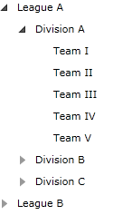
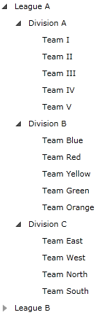

# Binding to Object

To bind the __RadTreeView__ to a collection use its __ItemsSource__ property and define __HierarchicalDataTemplate__ that are needed to display the data from the collection. If you want the changes to the collection to be automatically reflected to the __RadTreeView__ items, the collection should inherit from __ObservableCollection__, or to implement the __INotifyPropertyChanged__ interface.

The following tutorial will guide you how to bind a __RadTreeView__ to a collection of business objects.

The final result should look like the snapshot below: 

* First, you need to include the following assemblies in your XAML declaration:
	* __Telerik.Windows.Controls__
	* __Telerik.Windows.Controls.Navigation__

* Create a new class named __Team__. The class has a single string property.

	<snippet id='radtreeview-populating-with-data-data-binding-to-object-block_1-cs' />
	<snippet id='radtreeview-populating-with-data-data-binding-to-object-block_2-vb' />
		
* Create a new class named __Division__. The class has a single string property - __Name__ and a collection with teams.

	<snippet id='radtreeview-populating-with-data-data-binding-to-object-block_3-cs' />
	<snippet id='radtreeview-populating-with-data-data-binding-to-object-block_4-vb' />

* Create a new class named __League__. The class has a single string property and a collection with divisions objects. Practically, a collection of __League__ objects will be the data source for the treeview.

	<snippet id='radtreeview-populating-with-data-data-binding-to-object-block_5-cs' />
	<snippet id='radtreeview-populating-with-data-data-binding-to-object-block_6-vb' />

* Create a new class named __RadTreeViewSampleData__. This will be the data source (the model) for the __RadTreeView__. The class has a reference to an __ObservableCollection__ of __League__ objects and a single method which initializes the data.

	<snippet id='radtreeview-populating-with-data-data-binding-to-object-block_7-cs' />
	<snippet id='radtreeview-populating-with-data-data-binding-to-object-block_8-vb' />

* The next step is to declare the __RadTreeViewSampleData__ as a resource in your application.
		
	<snippet id='radtreeview-populating-with-data-data-binding-to-object-block_9-xaml' />

	>The __sampleData__ alias points to the assembly where your data source is located.
		  

* Since the data is hierarchical, you need to declare a __HierarchicalDataTemplate__. If you want to learn about the hierarchical data template, read the topic about [Hierarchical Data Templates]().
			
	<snippet id='radtreeview-populating-with-data-data-binding-to-object-block_10-xaml' />

* Finally, here is the treeview declaration. For __ItemsSource__ is used the __DataSource__ resource. For __ItemTemplate__ is set the created in the previous step hierarchical data template.

	<snippet id='radtreeview-populating-with-data-data-binding-to-object-block_11-xaml' />

* If you run the demo, the final result should look like the snapshot below. 

## See Also
 * [DataBinding - Overview]()
 * [Populating with Data - Declaratively]()
 * [Populating with Data - In Code-Behind]()
 * [Binding to XML]()
 * [Binding to WCF Service]()
 * [Binding to ADO.NET Data Service]()