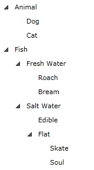

# Binding to XML

To bind the __RadTreeView__ to a XML you will need to convert the XML to a collection and then to bind that collection using the __ItemsSource__ property of the __RadTreeView__. This tutorial will show you how to do this.

The final result should look like the snapshot below:


* The first step is to add references to the following assemblies:
	* __Telerik.Windows.Controls.Navigation__
	* __Telerik.Windows.Controls__
* Then add the xml file describing the data that will be displayed in the __RadTreeView__ control. Below you can find a simple XML declaration, that we will use in this tutorial:

	#### __XAML__

	```XAML
		<?xml version="1.0" encoding="UTF-8"?>
		<Items>
			<XmlNodeItem Header="Animal">
				<Items>
					<XmlNodeItem Header="Dog" />
					<XmlNodeItem Header="Cat" />
				</Items>
			</XmlNodeItem>
			<XmlNodeItem Header="Fish">
				<Items>
					<XmlNodeItem Header="Fresh Water">
						<Items>
							<XmlNodeItem Header="Roach"/>
							<XmlNodeItem Header="Bream"/>
						</Items>
					</XmlNodeItem>
					<XmlNodeItem Header="Salt Water">
						<Items>
							<XmlNodeItem Header="Edible"/>
							<XmlNodeItem Header="Flat">
								<Items>
									<XmlNodeItem Header="Skate"/>
									<XmlNodeItem Header="Soul"/>
								</Items>
							</XmlNodeItem>
						</Items>
					</XmlNodeItem>
				</Items>
			</XmlNodeItem>
		</Items>
		```
		
* Create a new class named __XmlNodeItem__. The class is pretty simple and it represents a separate node from the XML document. It has a __Header__ property and a collection of __XmlNodeItem__. Here is the source code:

	#### __C#__

	```C#
		public class XmlNodeItem
		{
			public XmlNodeItem()
			{
				this.Items = new ObservableCollection<XmlNodeItem>();
			}
			[XmlAttribute( AttributeName = "Header" )]
			public string Header
			{
				get;
				set;
			}
			public ObservableCollection<XmlNodeItem> Items
			{
				get;
				set;
			}
		}
		```

	#### __VB.NET__

	```VB.NET
		Public Class XmlNodeItem
			Public Sub New()
				Me.Items = New ObservableCollection(Of XmlNodeItem)()
			End Sub
		
		Private _Header As String
			<XmlAttribute(AttributeName = "Header")> _
			Public Property Header() As String
				Get
					Return _Header
				End Get
				Set(ByVal value As String)
					_Header = value
				End Set
			End Property
		
		Private _Items As ObservableCollection(Of XmlNodeItem)
			Public Property Items() As ObservableCollection(Of XmlNodeItem)
				Get
					Return _Items
				End Get
				Set(ByVal value As ObservableCollection(Of XmlNodeItem))
					_Items = value
				End Set
			End Property
		End Class
		```

* Create a new class named __XmlNodeItemList__, which derives from __ObservableCollection__ of __XmlNodeItem__. This is a collection that will be created from the XML file. The __RadTreeView__ will be bound to this collection.

	#### __C#__

	```C#
		[XmlRoot( ElementName = "Items" )]
		public class XmlNodeItemList : ObservableCollection<XmlNodeItem>
		{
			public void AddRange( IEnumerable<XmlNodeItem> range )
			{
				foreach ( XmlNodeItem node in range )
				{
					this.Add( node );
				}
			}
		}
		```

	#### __VB.NET__

	```VB.NET
		<XmlRoot(ElementName = "Items")> _
		Public Class XmlNodeItemList
			Inherits ObservableCollection(Of XmlNodeItem)
			Public Sub AddRange(ByVal range As IEnumerable(Of XmlNodeItem))
				For Each node As XmlNodeItem In range
					Me.Add(node)
				Next
			End Sub
		End Class
		```

* Create a new class named __RadTreeViewXmlDataSource__, which derives from __XmlNodeItemList__. Practically, this will be the data source (the model) for the treeview. The class takes a path to the XML file and deserialize the data in the private method __RetrieveData__.

	#### __C#__

	```C#
		public class RadTreeViewXmlDataSource : XmlNodeItemList
		{
			private string source;
			public string Source
			{
				get
				{
					return this.source;
				}
				set
				{
					this.source = value;
					AddRange( RetrieveData( Application.GetResourceStream( new Uri( value, UriKind.Relative ) ).Stream ) );
				}
			}
			private XmlNodeItemList RetrieveData( Stream xmlStream )
			{
				XmlSerializer serializer = new XmlSerializer( typeof( XmlNodeItemList ) );
				StreamReader reader = new StreamReader( xmlStream );
				XmlNodeItemList list = ( XmlNodeItemList )serializer.Deserialize( reader );
				return list;
			}
		}
		```

	#### __VB.NET__

	```VB.NET
		Public Class RadTreeViewXmlDataSource
			Inherits XmlNodeItemList
			Private m_source As String
		
			Public Property Source() As String
				Get
					Return Me.m_source
				End Get
				Set(ByVal value As String)
					Me.m_source = value
					AddRange(RetrieveData(Application.GetResourceStream(New Uri(value, UriKind.Relative)).Stream))
				End Set
			End Property
		
			Private Function RetrieveData(ByVal xmlStream As Stream) As XmlNodeItemList
				Dim serializer As New XmlSerializer(GetType(XmlNodeItemList))
				Dim reader As New StreamReader(xmlStream)
				Dim list As XmlNodeItemList = DirectCast(serializer.Deserialize(reader), XmlNodeItemList)
				Return list
			End Function
		End Class
		```

* The next step is to declare the __RadTreeViewXmlDataSource__ as a resource in your application.

	#### __XAML__
	```XAML
		<UserControl.Resources>
		
			<example:RadTreeViewXmlDataSource x:Key="treeViewData"
				Source="RadTreeViewBindingToXml.xml"/>
		
			<!--Create HierarchicalDataTemplate-->
		
		</UserControl.Resources>
		```


	> The __example__ alias points to the __local__ namespace used in your project.

* Since the data is hierarchical, you need to declare a __HierarchicalDataTemplate__. If you want to learn about the hierarchical data template, read the topic about [Hierarchical Data Templates]().

	#### __XAML__

	```XAML
		<UserControl.Resources>
			<example:RadTreeViewXmlDataSource x:Key="treeViewData"
				Source="RadTreeViewBindingToXml.xml"/>
			<HierarchicalDataTemplate x:Key="Item" ItemsSource="{Binding Items}">
				<TextBlock Text="{Binding Header}" />
			</HierarchicalDataTemplate>
		</UserControl.Resources>
		```

* Finally, here is the treeview declaration. For __ItemsSource__ is used the __treeViewData__ resource. For __ItemTemplate__ is set the created in the previous step hierarchical data template.

	#### __XAML__

	```XAML
		<telerik:RadTreeView
			ItemTemplate="{StaticResource Item}"
			ItemsSource="{Binding Source={StaticResource treeViewData}}"/>
		```

* Here is the final result.


## See Also
 * [DataBinding - Overview]()
 * [Populating with Data - Declaratively]()
 * [Populating with Data - In Code-Behind]()
 * [Binding to Object]()
 * [Binding to WCF Service]()
 * [Binding to ADO.NET Data Service]()
