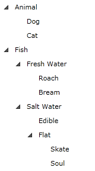

# Binding to XML

To bind the __RadTreeView__ to a XML you will need to convert the XML to a collection and then to bind that collection using the __ItemsSource__ property of the __RadTreeView__. This tutorial will show you how to do this.

The final result should look like the snapshot below:

* The first step is to add references to the following assemblies:
	* __Telerik.Windows.Controls.Navigation__
	* __Telerik.Windows.Controls__
* Then add the xml file describing the data that will be displayed in the __RadTreeView__ control. Below you can find a simple XML declaration, that we will use in this tutorial:

	<snippet id='radtreeview-populating-with-data-data-binding-to-xml-block_1-xaml' />
		
* Create a new class named __XmlNodeItem__. The class is pretty simple and it represents a separate node from the XML document. It has a __Header__ property and a collection of __XmlNodeItem__. Here is the source code:

	<snippet id='radtreeview-populating-with-data-data-binding-to-xml-block_2-cs' />
	<snippet id='radtreeview-populating-with-data-data-binding-to-xml-block_3-vb' />

* Create a new class named __XmlNodeItemList__, which derives from __ObservableCollection__ of __XmlNodeItem__. This is a collection that will be created from the XML file. The __RadTreeView__ will be bound to this collection.

	<snippet id='radtreeview-populating-with-data-data-binding-to-xml-block_4-cs' />
	<snippet id='radtreeview-populating-with-data-data-binding-to-xml-block_5-vb' />

* Create a new class named __RadTreeViewXmlDataSource__, which derives from __XmlNodeItemList__. Practically, this will be the data source (the model) for the treeview. The class takes a path to the XML file and deserialize the data in the private method __RetrieveData__.

	<snippet id='radtreeview-populating-with-data-data-binding-to-xml-block_6-cs' />
	<snippet id='radtreeview-populating-with-data-data-binding-to-xml-block_7-vb' />

* The next step is to declare the __RadTreeViewXmlDataSource__ as a resource in your application.

	<snippet id='radtreeview-populating-with-data-data-binding-to-xml-block_8-xaml' />

	> The __example__ alias points to the __local__ namespace used in your project.

* Since the data is hierarchical, you need to declare a __HierarchicalDataTemplate__. If you want to learn about the hierarchical data template, read the topic about [Hierarchical Data Templates]().

	<snippet id='radtreeview-populating-with-data-data-binding-to-xml-block_9-xaml' />

* Finally, here is the treeview declaration. For __ItemsSource__ is used the __treeViewData__ resource. For __ItemTemplate__ is set the created in the previous step hierarchical data template.

	<snippet id='radtreeview-populating-with-data-data-binding-to-xml-block_10-xaml' />

* Here is the final result.
	
	

## See Also
 * [DataBinding - Overview]()
 * [Populating with Data - Declaratively]()
 * [Populating with Data - In Code-Behind]()
 * [Binding to Object]()
 * [Binding to WCF Service]()
 * [Binding to ADO.NET Data Service]()